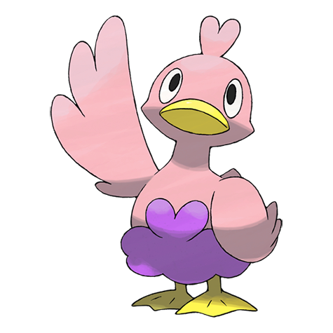
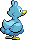
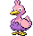
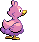

# #580 Ducklett (Water Bird Pokémon)

| Official Artwork | Shiny Artwork |
| --- | --- |
|  |  |

**Blaze Black:** These bird Pokémon are excellent divers. They swim around in the water eating their favorite food--peat moss.

**Volt White:** When attacked, it uses its feathers to splash water, escaping under cover of the spray.

---

## Media

### Default Sprites

| Front | Back | Front Shiny | Back Shiny |
| --- | --- | --- | --- |
|  |  |  |  |

### Cries

Latest (Gen VI+):

<audio controls>
<source src='../../assets/cries/ducklett/latest.ogg' type='audio/ogg'>
  Your browser does not support the audio element.
</audio>

Legacy:

<audio controls>
<source src='../../assets/cries/ducklett/legacy.ogg' type='audio/ogg'>
  Your browser does not support the audio element.
</audio>

---

## Pokédex Data

| National № | Type(s) | Height | Weight | Abilities | Local № |
|------------|---------|--------|--------|-----------|---------|
| #580 | {: width="48"} {: width="48"} | 0.5 m / 1.6 ft | 5.5 kg / 12.1 lbs |  | 1. Hydration 2. Big Pecks | #86 |

---

## Base Stats
|   | HP | Attack | Defense | Sp. Atk | Sp. Def | Speed |
|---|----|--------|---------|---------|---------|-------|
| **Base** | 62 | 44 | 50 | 44 | 50 | 55 |
| **Min** | 234 | 83 | 94 | 83 | 94 | 103 |
| **Max** | 328 | 205 | 218 | 205 | 218 | 229 |

The ranges shown above are for a level 100 Pokémon. Maximum values are based on a beneficial nature, 252 EVs, 31 IVs; minimum values are based on a hindering nature, 0 EVs, 0 IVs.

---

## Forms & Evolutions

!!! warning "WARNING"

    Information on evolutions may not be 100% accurate; differences between evolution methods across generations are not accounted for.

### Forms

Ducklett has no alternate forms.

### Evolution Line

1. [Ducklett](ducklett.md/)
    1. Level Up: [Swanna](swanna.md/)

---

## Training

| EV Yield | Catch Rate | Base Friendship | Base Exp. | Growth Rate | Held Items |
|----------|------------|-----------------|-----------|-------------|------------|
| 1 HP | 190 | 70 | 61 | Medium | N/A |

---

## Breeding

| Egg Groups | Egg Cycles | Gender | Dimorphic | Color | Shape |
|------------|------------|--------|-----------|-------|-------|
| 1. Water1 2. Flying | 20 | 50.0% Male 50.0% Female | False | Blue | Wings |

---

## Moves

!!! warning "WARNING"

    Specific move information may be incorrect. However, the general movepool should be accurate; this includes changes made in Blaze Black and Volt White.

### Level Up Moves

| Lv. | Move | Type | Cat. | Power | Acc. | PP |
| --- | --- | --- | --- | --- | --- | --- |
| 1 | Water Gun | {: width="48"} | {: width="36"} | 40 | 100 | 25 |
| 3 | Water Sport | {: width="48"} | {: width="36"} | — | — | 15 |
| 6 | Defog | {: width="48"} | {: width="36"} | — | — | 15 |
| 9 | Wing Attack | {: width="48"} | {: width="36"} | 75 | 100 | 35 |
| 13 | Water Pulse | {: width="48"} | {: width="36"} | 60 | 100 | 20 |
| 15 | Aerial Ace | {: width="48"} | {: width="36"} | 60 | — | 20 |
| 19 | Bubble Beam | {: width="48"} | {: width="36"} | 75 | 100 | 15 |
| 21 | Feather Dance | {: width="48"} | {: width="36"} | — | 100 | 15 |
| 24 | Aqua Ring | {: width="48"} | {: width="36"} | — | — | 20 |
| 27 | Air Slash | {: width="48"} | {: width="36"} | 75 | 95 | 15 |
| 30 | Roost | {: width="48"} | {: width="36"} | — | — | 5 |
| 34 | Rain Dance | {: width="48"} | {: width="36"} | — | — | 5 |
| 37 | Tailwind | {: width="48"} | {: width="36"} | — | — | 15 |
| 41 | Brave Bird | {: width="48"} | {: width="36"} | 120 | 100 | 15 |
| 46 | Hurricane | {: width="48"} | {: width="36"} | 110 | 70 | 10 |

### TM Moves

| TM | Move | Type | Cat. | Power | Acc. | PP |
| --- | --- | --- | --- | --- | --- | --- |
| HM02 | Fly | {: width="48"} | {: width="36"} | 100 | 100% | 15 |
| HM03 | Surf | {: width="48"} | {: width="36"} | 90 | 100 | 15 |
| HM06 | Dive | {: width="48"} | {: width="36"} | 80 | 100 | 10 |
| TM06 | Toxic | {: width="48"} | {: width="36"} | — | 90 | 10 |
| TM07 | Hail | {: width="48"} | {: width="36"} | — | — | 10 |
| TM10 | Hidden Power | {: width="48"} | {: width="36"} | 60 | 100 | 15 |
| TM13 | Ice Beam | {: width="48"} | {: width="36"} | 90 | 100 | 10 |
| TM17 | Protect | {: width="48"} | {: width="36"} | — | — | 10 |
| TM18 | Rain Dance | {: width="48"} | {: width="36"} | — | — | 5 |
| TM21 | Frustration | {: width="48"} | {: width="36"} | — | 100 | 20 |
| TM27 | Return | {: width="48"} | {: width="36"} | — | 100 | 20 |
| TM32 | Double Team | {: width="48"} | {: width="36"} | — | — | 15 |
| TM40 | Aerial Ace | {: width="48"} | {: width="36"} | 60 | — | 20 |
| TM42 | Facade | {: width="48"} | {: width="36"} | 70 | 100 | 20 |
| TM44 | Rest | {: width="48"} | {: width="36"} | — | — | 5 |
| TM45 | Attract | {: width="48"} | {: width="36"} | — | 100 | 15 |
| TM48 | Round | {: width="48"} | {: width="36"} | 60 | 100 | 15 |
| TM55 | Scald | {: width="48"} | {: width="36"} | 80 | 100 | 15 |
| TM87 | Swagger | {: width="48"} | {: width="36"} | — | 85 | 15 |
| TM88 | Pluck | {: width="48"} | {: width="36"} | 60 | 100 | 20 |
| TM90 | Substitute | {: width="48"} | {: width="36"} | — | — | 10 |

### Egg Moves

| Move | Type | Cat. | Power | Acc. | PP |
| --- | --- | --- | --- | --- | --- |
| Gust | {: width="48"} | {: width="36"} | 40 | 100 | 35 |
| Mirror Move | {: width="48"} | {: width="36"} | — | — | 20 |
| Steel Wing | {: width="48"} | {: width="36"} | 70 | 90 | 25 |
| Air Cutter | {: width="48"} | {: width="36"} | 60 | 95 | 25 |
| Scald | {: width="48"} | {: width="36"} | 80 | 100 | 15 |
| Lucky Chant | {: width="48"} | {: width="36"} | — | — | 30 |
| Me First | {: width="48"} | {: width="36"} | — | — | 20 |

### Tutor Moves

Ducklett cannot learn any moves from tutors.
