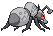
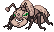
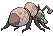

# #632 Durant (Iron Ant Pokémon)

| Official Artwork | Shiny Artwork |
| --- | --- |
|  |  |

**Blaze Black:** They attack in groups, covering themselves in steel armor to protect themselves from Heatmor.

**Volt White:** Durant dig nests in mountains. They build their complicated, interconnected tunnels into mazes.

---

## Media

### Default Sprites

| Front | Back | Front Shiny | Back Shiny |
| --- | --- | --- | --- |
|  |  |  |  |

### Cries

Latest (Gen VI+):

<audio controls>
<source src='../../assets/cries/durant/latest.ogg' type='audio/ogg'>
  Your browser does not support the audio element.
</audio>

Legacy:

<audio controls>
<source src='../../assets/cries/durant/legacy.ogg' type='audio/ogg'>
  Your browser does not support the audio element.
</audio>

---

## Pokédex Data

| National № | Type(s) | Height | Weight | Abilities | Local № |
|------------|---------|--------|--------|-----------|---------|
| #632 | {: width='48'} {: width='48'} | 0.3 m / 1.0 ft | 33.0 kg / 72.8 lbs | Swarm Hustle | #138 |

---

## Base Stats
|   | HP | Attack | Defense | Sp. Atk | Sp. Def | Speed |
|---|----|--------|---------|---------|---------|-------|
| **Base** | 75 | 111 | 112 | 48 | 55 | 109 |
| **Min** | 260 | 204 | 206 | 90 | 103 | 200 |
| **Max** | 354 | 353 | 355 | 214 | 229 | 348 |

The ranges shown above are for a level 100 Pokémon. Maximum values are based on a beneficial nature, 252 EVs, 31 IVs; minimum values are based on a hindering nature, 0 EVs, 0 IVs.

---

## Forms & Evolutions

!!! warning "WARNING"

    Information on evolutions may not be 100% accurate; differences between evolution methods across generations are not accounted for.

### Forms

Durant has no alternate forms.

### Evolution Line

1. [Durant](durant.md/)

---

## Training

| EV Yield | Catch Rate | Base Friendship | Base Exp. | Growth Rate | Held Items |
|----------|------------|-----------------|-----------|-------------|------------|
| 2 Defense | 90 | 50 | 169 | Medium | N/A |

---

## Breeding

| Egg Groups | Egg Cycles | Gender | Dimorphic | Color | Shape |
|------------|------------|--------|-----------|-------|-------|
| 1. Bug | 20 | 50.0% Male 50.0% Female | False | Gray | Armor |

---

## Moves

!!! warning "WARNING"

    Specific move information may be incorrect. However, the general movepool should be accurate; this includes changes made in Blaze Black and Volt White.

### Level Up Moves

| Lv. | Move | Type | Cat. | Power | Acc. | PP |
| --- | --- | --- | --- | --- | --- | --- |
| 1 | Sand Attack | {: width='48'} | {: width='36'} | — | 100 | 15 |
| 1 | Thunder Fang | {: width='48'} | {: width='36'} | 75 | 95 | 15 |
| 1 | Vice Grip | {: width='48'} | {: width='36'} | 55 | 100 | 30 |
| 6 | Fury Cutter | {: width='48'} | {: width='36'} | 40 | 95 | 20 |
| 11 | Bite | {: width='48'} | {: width='36'} | 60 | 100 | 25 |
| 16 | Agility | {: width='48'} | {: width='36'} | — | — | 30 |
| 21 | Metal Claw | {: width='48'} | {: width='36'} | 50 | 95 | 35 |
| 26 | Bug Bite | {: width='48'} | {: width='36'} | 60 | 100 | 20 |
| 31 | Crunch | {: width='48'} | {: width='36'} | 80 | 100 | 15 |
| 36 | Iron Head | {: width='48'} | {: width='36'} | 80 | 100 | 15 |
| 41 | Dig | {: width='48'} | {: width='36'} | 100 | 100 | 10 |
| 46 | Entrainment | {: width='48'} | {: width='36'} | — | 100 | 15 |
| 51 | X Scissor | {: width='48'} | {: width='36'} | 80 | 100 | 15 |
| 56 | Iron Defense | {: width='48'} | {: width='36'} | — | — | 15 |
| 61 | Guillotine | {: width='48'} | {: width='36'} | — | 30 | 5 |
| 66 | Metal Sound | {: width='48'} | {: width='36'} | — | 85 | 40 |

### TM Moves

| TM | Move | Type | Cat. | Power | Acc. | PP |
| --- | --- | --- | --- | --- | --- | --- |
| HM01 | Cut | {: width='48'} | {: width='36'} | 60 | 100% | 25 |
| HM04 | Strength | {: width='48'} | {: width='36'} | 100 | 100 | 15 |
| TM01 | Hone Claws | {: width='48'} | {: width='36'} | — | — | 15 |
| TM06 | Toxic | {: width='48'} | {: width='36'} | — | 90 | 10 |
| TM10 | Hidden Power | {: width='48'} | {: width='36'} | 60 | 100 | 15 |
| TM17 | Protect | {: width='48'} | {: width='36'} | — | — | 10 |
| TM21 | Frustration | {: width='48'} | {: width='36'} | — | 100 | 20 |
| TM27 | Return | {: width='48'} | {: width='36'} | — | 100 | 20 |
| TM28 | Dig | {: width='48'} | {: width='36'} | 100 | 100 | 10 |
| TM32 | Double Team | {: width='48'} | {: width='36'} | — | — | 15 |
| TM37 | Sandstorm | {: width='48'} | {: width='36'} | — | — | 10 |
| TM39 | Rock Tomb | {: width='48'} | {: width='36'} | 60 | 95 | 15 |
| TM40 | Aerial Ace | {: width='48'} | {: width='36'} | 60 | — | 20 |
| TM42 | Facade | {: width='48'} | {: width='36'} | 70 | 100 | 20 |
| TM44 | Rest | {: width='48'} | {: width='36'} | — | — | 5 |
| TM45 | Attract | {: width='48'} | {: width='36'} | — | 100 | 15 |
| TM48 | Round | {: width='48'} | {: width='36'} | 60 | 100 | 15 |
| TM53 | Energy Ball | {: width='48'} | {: width='36'} | 90 | 100 | 10 |
| TM65 | Shadow Claw | {: width='48'} | {: width='36'} | 80 | 100 | 15 |
| TM67 | Retaliate | {: width='48'} | {: width='36'} | 70 | 100 | 5 |
| TM68 | Giga Impact | {: width='48'} | {: width='36'} | 150 | 90 | 5 |
| TM69 | Rock Polish | {: width='48'} | {: width='36'} | — | — | 20 |
| TM71 | Stone Edge | {: width='48'} | {: width='36'} | 100 | 80 | 5 |
| TM73 | Thunder Wave | {: width='48'} | {: width='36'} | — | 90 | 20 |
| TM76 | Struggle Bug | {: width='48'} | {: width='36'} | 50 | 100 | 20 |
| TM80 | Rock Slide | {: width='48'} | {: width='36'} | 75 | 90 | 10 |
| TM81 | X Scissor | {: width='48'} | {: width='36'} | 80 | 100 | 15 |
| TM87 | Swagger | {: width='48'} | {: width='36'} | — | 85 | 15 |
| TM90 | Substitute | {: width='48'} | {: width='36'} | — | — | 10 |
| TM91 | Flash Cannon | {: width='48'} | {: width='36'} | 80 | 100 | 10 |
| TM94 | Rock Smash | {: width='48'} | {: width='36'} | 60 | 100 | 15 |

### Egg Moves

| Move | Type | Cat. | Power | Acc. | PP |
| --- | --- | --- | --- | --- | --- |
| Screech | {: width='48'} | {: width='36'} | — | 85 | 40 |
| Feint Attack | {: width='48'} | {: width='36'} | 60 | — | 20 |
| Endure | {: width='48'} | {: width='36'} | — | — | 10 |
| Baton Pass | {: width='48'} | {: width='36'} | — | — | 40 |
| Thunder Fang | {: width='48'} | {: width='36'} | 75 | 95 | 15 |
| Rock Climb | {: width='48'} | {: width='36'} | 80 | 95% | 10 |

### Tutor Moves

Durant cannot learn any moves from tutors.
