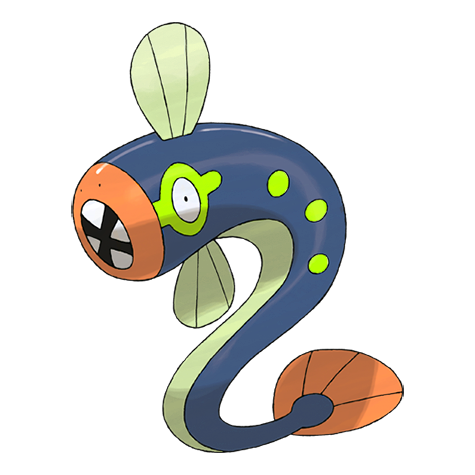
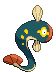

# #603 Eelektrik (EleFish Pokémon)

| Official Artwork | Shiny Artwork |
|------------------|---------------|
|  |  |

**Blaze Black:** They coil around foes and shock them with electricity-generating organs that seem simply to be circular patterns.

**Volt White:** These Pokémon have a big appetite. When they spot their prey, they attack it and paralyze it with electricity.

---

## Media

### Default Sprites

| Front | Shiny | Back | Shiny |
|-------|-------|------|-------|
|  |  |  |  |

### Cries

Latest (Gen VI+):

<audio controls>
<source src='../../assets/cries/eelektrik/latest.ogg' type='audio/ogg'>
  Your browser does not support the audio element.
</audio>

Legacy:

<audio controls>
<source src='../../assets/cries/eelektrik/legacy.ogg' type='audio/ogg'>
  Your browser does not support the audio element.
</audio>

---

## Pokédex Data

| National № | Type(s) | Height | Weight | Abilities | Local № |
|------------|---------|--------|--------|-----------|---------|
| #603 | {: width="48"} | 1.2 m / 3.9 ft | 22.0 kg / 48.5 lbs | 1. Levitate | N/A |

---

## Base Stats
|   | HP | Attack | Defense | Sp. Atk | Sp. Def | Speed |
|---|----|--------|---------|---------|---------|-------|
| **Base** | 65 | 85 | 70 | 75 | 70 | 40 |
| **Min** | 240 | 157 | 130 | 139 | 130 | 76 |
| **Max** | 334 | 295 | 262 | 273 | 262 | 196 |

The ranges shown above are for a level 100 Pokémon. Maximum values are based on a beneficial nature, 252 EVs, 31 IVs; minimum values are based on a hindering nature, 0 EVs, 0 IVs.

---

## Forms & Evolutions

!!! warning "WARNING"

    Information on evolutions may not be 100% accurate; differences between evolution methods across generations are not accounted for.

### Forms

Eelektrik has no alternate forms.

### Evolution Line

1. [Tynamo](tynamo.md/)
    1. Level Up: [Eelektrik](eelektrik.md/)
        1. Use Item: [Eelektross](eelektross.md/)

---

## Training

| EV Yield | Catch Rate | Base Friendship | Base Exp. | Growth Rate | Held Items |
|----------|------------|-----------------|-----------|-------------|------------|
| 2 Atk | 60 | 70 | 142 | Slow | N/A |

---

## Breeding

| Egg Groups | Egg Cycles | Gender | Dimorphic | Color | Shape |
|------------|------------|--------|-----------|-------|-------|
| 1. Indeterminate | 20 | 50.0% Male 50.0% Female | False | Blue | Fish |

---

## Moves

!!! warning "WARNING"

    Specific move information may be incorrect. However, the general movepool should be accurate; this includes changes made in Blaze Black and Volt White.

### Level Up Moves

| Lv. | Move | Type | Cat. | Power | Acc. | PP |
| --- | --- | --- | --- | --- | --- | --- |
| 1 | Charge Beam | {: width="48"} | {: width="36"} | 50 | 90 | 10 |
| 1 | Headbutt | {: width="48"} | {: width="36"} | 70 | 100 | 15 |
| 1 | Spark | {: width="48"} | {: width="36"} | 65 | 100 | 20 |
| 1 | Thunder Wave | {: width="48"} | {: width="36"} | — | 90 | 20 |
| 9 | Bind | {: width="48"} | {: width="36"} | 15 | 85 | 20 |
| 19 | Acid | {: width="48"} | {: width="36"} | 40 | 100 | 30 |
| 29 | Discharge | {: width="48"} | {: width="36"} | 80 | 100 | 15 |
| 39 | Crunch | {: width="48"} | {: width="36"} | 80 | 100 | 15 |
| 44 | Thunderbolt | {: width="48"} | {: width="36"} | 90 | 100 | 15 |
| 49 | Acid Spray | {: width="48"} | {: width="36"} | 40 | 100 | 20 |
| 54 | Coil | {: width="48"} | {: width="36"} | — | — | 20 |
| 59 | Wild Charge | {: width="48"} | {: width="36"} | 90 | 100 | 15 |
| 64 | Gastro Acid | {: width="48"} | {: width="36"} | — | 100 | 10 |
| 69 | Zap Cannon | {: width="48"} | {: width="36"} | 120 | 50 | 5 |
| 74 | Thrash | {: width="48"} | {: width="36"} | 120 | 100 | 10 |

### TM Moves

| TM | Move | Type | Cat. | Power | Acc. | PP |
| --- | --- | --- | --- | --- | --- | --- |
| TM06 | Toxic | {: width="48"} | {: width="36"} | — | 90 | 10 |
| TM10 | Hidden Power | {: width="48"} | {: width="36"} | 60 | 100 | 15 |
| TM16 | Light Screen | {: width="48"} | {: width="36"} | — | — | 30 |
| TM17 | Protect | {: width="48"} | {: width="36"} | — | — | 10 |
| TM18 | Rain Dance | {: width="48"} | {: width="36"} | — | — | 5 |
| TM21 | Frustration | {: width="48"} | {: width="36"} | — | 100 | 20 |
| TM24 | Thunderbolt | {: width="48"} | {: width="36"} | 90 | 100 | 15 |
| TM25 | Thunder | {: width="48"} | {: width="36"} | 110 | 70 | 10 |
| TM27 | Return | {: width="48"} | {: width="36"} | — | 100 | 20 |
| TM32 | Double Team | {: width="48"} | {: width="36"} | — | — | 15 |
| TM42 | Facade | {: width="48"} | {: width="36"} | 70 | 100 | 20 |
| TM44 | Rest | {: width="48"} | {: width="36"} | — | — | 5 |
| TM45 | Attract | {: width="48"} | {: width="36"} | — | 100 | 15 |
| TM48 | Round | {: width="48"} | {: width="36"} | 60 | 100 | 15 |
| TM57 | Charge Beam | {: width="48"} | {: width="36"} | 50 | 90 | 10 |
| TM62 | Acrobatics | {: width="48"} | {: width="36"} | 55 | 100 | 15 |
| TM70 | Flash | {: width="48"} | {: width="36"} | — | 100 | 20 |
| TM72 | Volt Switch | {: width="48"} | {: width="36"} | 70 | 100 | 20 |
| TM73 | Thunder Wave | {: width="48"} | {: width="36"} | — | 90 | 20 |
| TM87 | Swagger | {: width="48"} | {: width="36"} | — | 85 | 15 |
| TM89 | U Turn | {: width="48"} | {: width="36"} | 70 | 100 | 20 |
| TM90 | Substitute | {: width="48"} | {: width="36"} | — | — | 10 |
| TM91 | Flash Cannon | {: width="48"} | {: width="36"} | 80 | 100 | 10 |
| TM93 | Wild Charge | {: width="48"} | {: width="36"} | 90 | 100 | 15 |

### Egg Moves

Eelektrik cannot learn any moves by breeding.
### Tutor Moves

Eelektrik cannot learn any moves from tutors.
