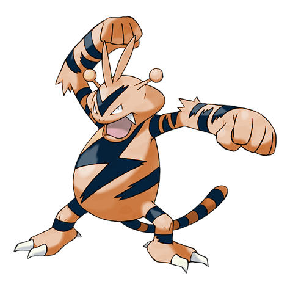
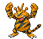
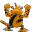

# #125 Electabuzz (Electric Pokémon)

| Official Artwork | Shiny Artwork |
| --- | --- |
|  |  |

It windmills its arms to slightly boost its punches. Foes have been known to escape in the meantime.

---

## Media

### Default Sprites

| Front | Back | Front Shiny | Back Shiny |
| --- | --- | --- | --- |
|  |  |  |  |

### Cries

Latest (Gen VI+):

<audio controls>
<source src='../../assets/cries/electabuzz/latest.ogg' type='audio/ogg'>
  Your browser does not support the audio element.
</audio>

Legacy:

<audio controls>
<source src='../../assets/cries/electabuzz/legacy.ogg' type='audio/ogg'>
  Your browser does not support the audio element.
</audio>

---

## Pokédex Data

| National № | Type(s) | Height | Weight | Abilities | Local № |
|------------|---------|--------|--------|-----------|---------|
| #125 | {: width='48'} | 1.1 m | 30.0 kg | 1. Static 2. Vital-Spirit | N/A |

---

## Base Stats
|   | HP | Attack | Defense | Sp. Atk | Sp. Def | Speed |
|---|----|--------|---------|---------|---------|-------|
| **Base** | 65 | 83 | 57 | 95 | 85 | 105 |
| **Min** | 240 | 153 | 107 | 175 | 157 | 193 |
| **Max** | 334 | 291 | 234 | 317 | 295 | 339 |

The ranges shown above are for a level 100 Pokémon. Maximum values are based on a beneficial nature, 252 EVs, 31 IVs; minimum values are based on a hindering nature, 0 EVs, 0 IVs.

---

## Forms & Evolutions

!!! warning "WARNING"

    Information on evolutions may not be 100% accurate; differences between evolution methods across generations are not accounted for.

### Forms

Electabuzz has no alternate forms.

### Evolution Line

1. [Elekid](elekid.md/)
    1. Level Up: [Electabuzz](electabuzz.md/)
        1. Trade: [Electivire](electivire.md/)

### Evolution Changes

1. Use the Electirizer.

---

## Training

| EV Yield | Catch Rate | Base Friendship | Base Exp. | Growth Rate | Held Items |
|----------|------------|-----------------|-----------|-------------|------------|
| 2 Speed | 45 | 50 | 172 | Medium |  |

---

## Breeding

| Egg Groups | Egg Cycles | Gender | Dimorphic | Color | Shape |
|------------|------------|--------|-----------|-------|-------|
| 1. Humanshape | 25 | 75.0% Male 25.0% Female | False | Yellow | Upright |

---

## Moves

!!! warning "WARNING"

    Specific move information may be incorrect. However, the general movepool should be accurate; this includes changes made in Blaze Black and Volt White.

### Level Up Moves

| Lv. | Move | Type | Cat. | Power | Acc. | PP |
| --- | --- | --- | --- | --- | --- | --- |
| 1 | Leer | {: width='48'} | {: width='36'} | — | 100 | 30 |
| 1 | Quick Attack | {: width='48'} | {: width='36'} | 40 | 100 | 30 |
| 1 | Thunder Shock | {: width='48'} | {: width='36'} | 40 | 100 | 30 |
| 6 | Thunder Shock | {: width='48'} | {: width='36'} | 40 | 100 | 30 |
| 11 | Low Kick | {: width='48'} | {: width='36'} | — | 100 | 20 |
| 16 | Swift | {: width='48'} | {: width='36'} | 60 | — | 20 |
| 21 | Shock Wave | {: width='48'} | {: width='36'} | 70 | — | 20 |
| 26 | Light Screen | {: width='48'} | {: width='36'} | — | — | 30 |
| 30 | Zap Cannon | {: width='48'} | {: width='36'} | 120 | 50 | 5 |
| 32 | Electro Ball | {: width='48'} | {: width='36'} | — | 100 | 10 |
| 38 | Thunder Punch | {: width='48'} | {: width='36'} | 80 | 100 | 15 |
| 41 | Cross Chop | {: width='48'} | {: width='36'} | 100 | 80 | 5 |
| 44 | Discharge | {: width='48'} | {: width='36'} | 80 | 100 | 15 |
| 50 | Thunderbolt | {: width='48'} | {: width='36'} | 90 | 100 | 15 |
| 56 | Screech | {: width='48'} | {: width='36'} | — | 85 | 40 |
| 62 | Thunder | {: width='48'} | {: width='36'} | 110 | 70 | 10 |

### TM Moves

| TM | Move | Type | Cat. | Power | Acc. | PP |
| --- | --- | --- | --- | --- | --- | --- |
| HM04 | Strength | {: width='48'} | {: width='36'} | 100 | 100 | 15 |
| TM06 | Toxic | {: width='48'} | {: width='36'} | — | 90 | 10 |
| TM10 | Hidden Power | {: width='48'} | {: width='36'} | 60 | 100 | 15 |
| TM15 | Hyper Beam | {: width='48'} | {: width='36'} | 150 | 90 | 5 |
| TM16 | Light Screen | {: width='48'} | {: width='36'} | — | — | 30 |
| TM17 | Protect | {: width='48'} | {: width='36'} | — | — | 10 |
| TM18 | Rain Dance | {: width='48'} | {: width='36'} | — | — | 5 |
| TM21 | Frustration | {: width='48'} | {: width='36'} | — | 100 | 20 |
| TM24 | Thunderbolt | {: width='48'} | {: width='36'} | 90 | 100 | 15 |
| TM25 | Thunder | {: width='48'} | {: width='36'} | 110 | 70 | 10 |
| TM27 | Return | {: width='48'} | {: width='36'} | — | 100 | 20 |
| TM29 | Psychic | {: width='48'} | {: width='36'} | 90 | 100 | 10 |
| TM31 | Brick Break | {: width='48'} | {: width='36'} | 75 | 100 | 15 |
| TM32 | Double Team | {: width='48'} | {: width='36'} | — | — | 15 |
| TM42 | Facade | {: width='48'} | {: width='36'} | 70 | 100 | 20 |
| TM44 | Rest | {: width='48'} | {: width='36'} | — | — | 5 |
| TM45 | Attract | {: width='48'} | {: width='36'} | — | 100 | 15 |
| TM46 | Thief | {: width='48'} | {: width='36'} | 60 | 100 | 25 |
| TM47 | Low Sweep | {: width='48'} | {: width='36'} | 65 | 100 | 20 |
| TM48 | Round | {: width='48'} | {: width='36'} | 60 | 100 | 15 |
| TM52 | Focus Blast | {: width='48'} | {: width='36'} | 120 | 70 | 5 |
| TM56 | Fling | {: width='48'} | {: width='36'} | — | 100 | 10 |
| TM57 | Charge Beam | {: width='48'} | {: width='36'} | 50 | 90 | 10 |
| TM68 | Giga Impact | {: width='48'} | {: width='36'} | 150 | 90 | 5 |
| TM70 | Flash | {: width='48'} | {: width='36'} | — | 100 | 20 |
| TM72 | Volt Switch | {: width='48'} | {: width='36'} | 70 | 100 | 20 |
| TM73 | Thunder Wave | {: width='48'} | {: width='36'} | — | 90 | 20 |
| TM87 | Swagger | {: width='48'} | {: width='36'} | — | 85 | 15 |
| TM90 | Substitute | {: width='48'} | {: width='36'} | — | — | 10 |
| TM93 | Wild Charge | {: width='48'} | {: width='36'} | 90 | 100 | 15 |
| TM94 | Rock Smash | {: width='48'} | {: width='36'} | 60 | 100 | 15 |

### Egg Moves

Electabuzz cannot learn any moves by breeding.
### Tutor Moves

Electabuzz cannot learn any moves from tutors.
