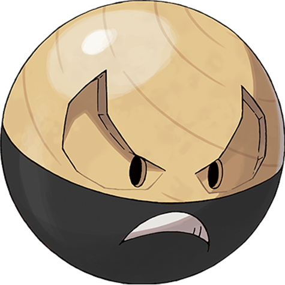

# #10232 Electrode Hisui (Ball Pokémon)

| Official Artwork | Shiny Artwork |
| --- | --- |
|  |  |

It is known to drift on winds if it is bloated to bursting with stored electricity.

---

## Media

### Sprites

### Cries

Latest (Gen VI+):

<audio controls>
  <source src='../assets/cries/10232/latest.ogg' type='audio/ogg'>
  Your browser does not support the audio element.
</audio>

Legacy:

<audio controls>
  <source src='../assets/cries/10232/legacy.ogg' type='audio/ogg'>
  Your browser does not support the audio element.
</audio>

---

## Pokédex Data

| National № | Type(s) | Height | Weight | Abilities | Local № |
|------------|---------|--------|--------|-----------|---------|
| #10232 | {: width='48'} {: width='48'} | 1.2 m | 71.0 kg | 1. Soundproof 2. Static 3. Aftermath | #N/A |

---

## Base Stats
---

## Base Stats
|   | HP | Attack | Defense | Sp. Atk | Sp. Def | Speed |
|---|----|--------|---------|---------|---------|-------|
| **Base** | 60 | 50 | 70 | 80 | 80 | 150 |
| **Min** | 230 | 94 | 130 | 148 | 148 | 274 |
| **Max** | 324 | 218 | 262 | 284 | 284 | 438 |

The ranges shown above are for a level 100 Pokémon. Maximum values are based on a beneficial nature, 252 EVs, 31 IVs; minimum values are based on a hindering nature, 0 EVs, 0 IVs.

---

## Forms & Evolutions

!!! warning "WARNING"

    Some forms may not be available in Blaze Black/Volt White. Also information on evolutions may not be 100% accurate; it is currently quite complex to track generational evolution data.

### Forms

1. [Electrode](electrode.md/)
2. [Electrode-Hisui](electrode-hisui.md/)

### Evolution Line

1. [Voltorb](voltorb.md/)
1. Level Up: [Electrode](electrode.md/)

---

## Training

| EV Yield | Catch Rate | Base Friendship | Base Exp. | Growth Rate | Held Items |
|----------|------------|-----------------|-----------|-------------|------------|
| 2 Speed | 60 | 70 | 172 | Medium | N/A |

---

## Breeding

| Egg Groups | Egg Cycles | Gender | Dimorphic | Color | Shape |
|------------|------------|--------|-----------|-------|-------|
| 1. Mineral | 20 | Genderless | False | Red | Ball |

---

## Moves

!!! warning "WARNING"

    Specific move information may be incorrect. However, the general movepool should be accurate (including changes to learnset).

### Level Up Moves

Lv. | Move | Type | Cat. | Power | Acc. | PP
--- | --- | --- | --- | --- | --- | ---
| 1 | Thunder Shock | {: width='48'} | {: width='36'} | 40 | 100 | 30 |
| 5 | Tackle | {: width='48'} | {: width='36'} | 40 | 100 | 35 |
| 9 | Thunder Wave | {: width='48'} | {: width='36'} | — | 90 | 20 |
| 15 | Spark | {: width='48'} | {: width='36'} | 65 | 100 | 20 |
| 21 | Energy Ball | {: width='48'} | {: width='36'} | 90 | 100 | 10 |
| 29 | Thunderbolt | {: width='48'} | {: width='36'} | 90 | 100 | 15 |
| 37 | Thunder | {: width='48'} | {: width='36'} | 110 | 70 | 10 |
| 47 | Chloroblast | {: width='48'} | {: width='36'} | 150 | 95 | 5 |
| 47 | Self Destruct | {: width='48'} | {: width='36'} | 200 | 100 | 5 |

### TM Moves

Electrode Hisui cannot learn any TM moves.
### Egg Moves

Electrode Hisui cannot learn any moves by breeding.
### Tutor Moves

Move | Type | Cat. | Power | Acc. | PP
--- | --- | --- | --- | --- | ---
| Hyper Beam | {: width='48'} | {: width='36'} | 150 | 90 | 5 |
| Thunderbolt | {: width='48'} | {: width='36'} | 90 | 100 | 15 |
| Swift | {: width='48'} | {: width='36'} | 60 | — | 20 |
| Rest | {: width='48'} | {: width='36'} | — | — | 5 |
| Ice Ball | {: width='48'} | {: width='36'} | 30 | 90 | 20 |
| Magical Leaf | {: width='48'} | {: width='36'} | 60 | — | 20 |
| Energy Ball | {: width='48'} | {: width='36'} | 90 | 100 | 10 |
| Giga Impact | {: width='48'} | {: width='36'} | 150 | 90 | 5 |
| Charge Beam | {: width='48'} | {: width='36'} | 50 | 90 | 10 |
| Wild Charge | {: width='48'} | {: width='36'} | 90 | 100 | 15 |

