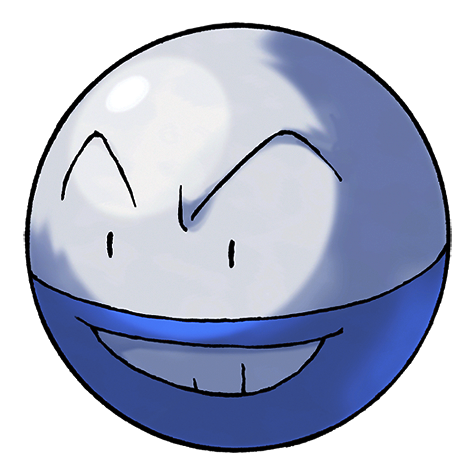

# #101 Electrode (Ball Pokémon)

| Official Artwork | Shiny Artwork |
|------------------|---------------|
|  |  |

It is known to drift on winds if it is bloated to bursting with stored electricity.

---

## Media

### Default Sprites

| Front | Shiny | Back | Shiny |
|-------|-------|------|-------|
|  |  |  |  |

### Cries

Latest (Gen VI+):

<audio controls>
<source src='../../assets/cries/electrode/latest.ogg' type='audio/ogg'>
  Your browser does not support the audio element.
</audio>

Legacy:

<audio controls>
<source src='../../assets/cries/electrode/legacy.ogg' type='audio/ogg'>
  Your browser does not support the audio element.
</audio>

---

## Pokédex Data

| National № | Type(s) | Height | Weight | Abilities | Local № |
|------------|---------|--------|--------|-----------|---------|
| #101 | {: width="48"} | 1.2 m / 3.9 ft | 66.6 kg / 146.8 lbs | 1. Aftermath 2. Static | N/A |

---

## Base Stats
|   | HP | Attack | Defense | Sp. Atk | Sp. Def | Speed |
|---|----|--------|---------|---------|---------|-------|
| **Base** | 60 | 50 | 70 | 80 | 80 | 150 |
| **Min** | 230 | 94 | 130 | 148 | 148 | 274 |
| **Max** | 324 | 218 | 262 | 284 | 284 | 438 |

The ranges shown above are for a level 100 Pokémon. Maximum values are based on a beneficial nature, 252 EVs, 31 IVs; minimum values are based on a hindering nature, 0 EVs, 0 IVs.

---

## Forms & Evolutions

!!! warning "WARNING"

    Information on evolutions may not be 100% accurate; differences between evolution methods across generations are not accounted for.

### Forms

Electrode has no alternate forms.

### Evolution Line

1. [Voltorb](voltorb.md/)
    1. Level Up: [Electrode](electrode.md/)

---

## Training

| EV Yield | Catch Rate | Base Friendship | Base Exp. | Growth Rate | Held Items |
|----------|------------|-----------------|-----------|-------------|------------|
| 2 Spd | 60 | 70 | 172 | Medium | N/A |

---

## Breeding

| Egg Groups | Egg Cycles | Gender | Dimorphic | Color | Shape |
|------------|------------|--------|-----------|-------|-------|
| 1. Mineral | 20 | Genderless | False | Red | Ball |

---

## Moves

!!! warning "WARNING"

    Specific move information may be incorrect. However, the general movepool should be accurate; this includes changes made in Blaze Black and Volt White.

### Level Up Moves

| Lv. | Move | Type | Cat. | Power | Acc. | PP |
| --- | --- | --- | --- | --- | --- | --- |
| 1 | Charge | {: width="48"} | {: width="36"} | — | — | 20 |
| 1 | Sonic Boom | {: width="48"} | {: width="36"} | — | 90 | 20 |
| 1 | Spark | {: width="48"} | {: width="36"} | 65 | 100 | 20 |
| 1 | Tackle | {: width="48"} | {: width="36"} | 40 | 100 | 35 |
| 5 | Tackle | {: width="48"} | {: width="36"} | 40 | 100 | 35 |
| 8 | Sonic Boom | {: width="48"} | {: width="36"} | — | 90 | 20 |
| 12 | Spark | {: width="48"} | {: width="36"} | 65 | 100 | 20 |
| 15 | Rollout | {: width="48"} | {: width="36"} | 30 | 90 | 20 |
| 19 | Screech | {: width="48"} | {: width="36"} | — | 85 | 40 |
| 22 | Charge Beam | {: width="48"} | {: width="36"} | 50 | 90 | 10 |
| 24 | Signal Beam | {: width="48"} | {: width="36"} | 75 | 100 | 15 |
| 26 | Light Screen | {: width="48"} | {: width="36"} | — | — | 30 |
| 29 | Electro Ball | {: width="48"} | {: width="36"} | — | 100 | 10 |
| 35 | Self Destruct | {: width="48"} | {: width="36"} | 200 | 100 | 5 |
| 40 | Swift | {: width="48"} | {: width="36"} | 60 | — | 20 |
| 46 | Magnet Rise | {: width="48"} | {: width="36"} | — | — | 10 |
| 51 | Gyro Ball | {: width="48"} | {: width="36"} | — | 100 | 5 |
| 57 | Explosion | {: width="48"} | {: width="36"} | 250 | 100 | 5 |
| 62 | Mirror Coat | {: width="48"} | {: width="36"} | — | 100 | 20 |

### TM Moves

| TM | Move | Type | Cat. | Power | Acc. | PP |
| --- | --- | --- | --- | --- | --- | --- |
| TM06 | Toxic | {: width="48"} | {: width="36"} | — | 90 | 10 |
| TM10 | Hidden Power | {: width="48"} | {: width="36"} | 60 | 100 | 15 |
| TM12 | Taunt | {: width="48"} | {: width="36"} | — | 100 | 20 |
| TM15 | Hyper Beam | {: width="48"} | {: width="36"} | 150 | 90 | 5 |
| TM16 | Light Screen | {: width="48"} | {: width="36"} | — | — | 30 |
| TM17 | Protect | {: width="48"} | {: width="36"} | — | — | 10 |
| TM18 | Rain Dance | {: width="48"} | {: width="36"} | — | — | 5 |
| TM21 | Frustration | {: width="48"} | {: width="36"} | — | 100 | 20 |
| TM24 | Thunderbolt | {: width="48"} | {: width="36"} | 90 | 100 | 15 |
| TM25 | Thunder | {: width="48"} | {: width="36"} | 110 | 70 | 10 |
| TM27 | Return | {: width="48"} | {: width="36"} | — | 100 | 20 |
| TM32 | Double Team | {: width="48"} | {: width="36"} | — | — | 15 |
| TM41 | Torment | {: width="48"} | {: width="36"} | — | 100 | 15 |
| TM42 | Facade | {: width="48"} | {: width="36"} | 70 | 100 | 20 |
| TM44 | Rest | {: width="48"} | {: width="36"} | — | — | 5 |
| TM46 | Thief | {: width="48"} | {: width="36"} | 60 | 100 | 25 |
| TM48 | Round | {: width="48"} | {: width="36"} | 60 | 100 | 15 |
| TM57 | Charge Beam | {: width="48"} | {: width="36"} | 50 | 90 | 10 |
| TM64 | Explosion | {: width="48"} | {: width="36"} | 250 | 100 | 5 |
| TM68 | Giga Impact | {: width="48"} | {: width="36"} | 150 | 90 | 5 |
| TM70 | Flash | {: width="48"} | {: width="36"} | — | 100 | 20 |
| TM72 | Volt Switch | {: width="48"} | {: width="36"} | 70 | 100 | 20 |
| TM73 | Thunder Wave | {: width="48"} | {: width="36"} | — | 90 | 20 |
| TM74 | Gyro Ball | {: width="48"} | {: width="36"} | — | 100 | 5 |
| TM87 | Swagger | {: width="48"} | {: width="36"} | — | 85 | 15 |
| TM90 | Substitute | {: width="48"} | {: width="36"} | — | — | 10 |
| TM93 | Wild Charge | {: width="48"} | {: width="36"} | 90 | 100 | 15 |

### Egg Moves

Electrode cannot learn any moves by breeding.
### Tutor Moves

Electrode cannot learn any moves from tutors.
