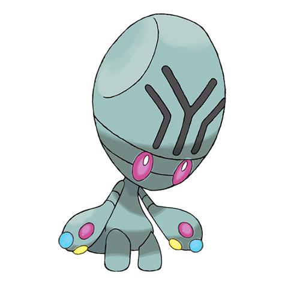
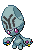
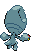

# #605 Elgyem (Cerebral Pokémon)

| Official Artwork | Shiny Artwork |
| --- | --- |
|  |  |

**Blaze Black:** It uses its strong psychic power to squeeze its opponent’s brain, causing unendurable headaches.

**Volt White:** This Pokémon had never been seen until it appeared from far in the desert 50 years ago.

---

## Media

### Sprites

| Front | Back | Front Shiny | Back Shiny |
| --- | --- | --- | --- |
|  |  |  |  |

### Cries

Latest (Gen VI+):

<audio controls>
<source src='../../assets/cries/elgyem/latest.ogg' type='audio/ogg'>
  Your browser does not support the audio element.
</audio>

Legacy:

<audio controls>
<source src='../../assets/cries/elgyem/legacy.ogg' type='audio/ogg'>
  Your browser does not support the audio element.
</audio>

---

## Pokédex Data

| National № | Type(s) | Height | Weight | Abilities | Local № |
|------------|---------|--------|--------|-----------|---------|
| #605 | {: width='48'} | 0.5 m | 9.0 kg | 1. Analytic 2. Synchronize | #111 |

---

## Base Stats
|   | HP | Attack | Defense | Sp. Atk | Sp. Def | Speed |
|---|----|--------|---------|---------|---------|-------|
| **Base** | 55 | 55 | 55 | 85 | 55 | 30 |
| **Min** | 220 | 103 | 103 | 157 | 103 | 58 |
| **Max** | 314 | 229 | 229 | 295 | 229 | 174 |

The ranges shown above are for a level 100 Pokémon. Maximum values are based on a beneficial nature, 252 EVs, 31 IVs; minimum values are based on a hindering nature, 0 EVs, 0 IVs.

---

## Forms & Evolutions

!!! warning "WARNING"

    Information on evolutions may not be 100% accurate; differences between evolution methods across generations are not accounted for.

### Forms

Elgyem has no alternate forms.

### Evolution Line

1. [Elgyem](elgyem.md/)
    1. Level Up: [Beheeyem](beheeyem.md/)

### Evolution Changes

1. Level 35

---

## Training

| EV Yield | Catch Rate | Base Friendship | Base Exp. | Growth Rate | Held Items |
|----------|------------|-----------------|-----------|-------------|------------|
| 1 Special Attack | 255 | 50 | 67 | Medium | N/A |

---

## Breeding

| Egg Groups | Egg Cycles | Gender | Dimorphic | Color | Shape |
|------------|------------|--------|-----------|-------|-------|
| 1. Humanshape | 20 | 50.0% Male 50.0% Female | False | Blue | Upright |

---

## Moves

!!! warning "WARNING"

    Specific move information may be incorrect. However, the general movepool should be accurate; this includes changes made in Blaze Black and Volt White.

### Level Up Moves

| Lv. | Move | Type | Cat. | Power | Acc. | PP |
| --- | --- | --- | --- | --- | --- | --- |
| 1 | Confusion | {: width='48'} | {: width='36'} | 50 | 100 | 25 |
| 4 | Growl | {: width='48'} | {: width='36'} | — | 100 | 40 |
| 8 | Heal Block | {: width='48'} | {: width='36'} | — | 100 | 15 |
| 11 | Miracle Eye | {: width='48'} | {: width='36'} | — | — | 40 |
| 15 | Psybeam | {: width='48'} | {: width='36'} | 65 | 100 | 20 |
| 18 | Headbutt | {: width='48'} | {: width='36'} | 70 | 100 | 15 |
| 22 | Hidden Power | {: width='48'} | {: width='36'} | 60 | 100 | 15 |
| 25 | Imprison | {: width='48'} | {: width='36'} | — | — | 10 |
| 29 | Simple Beam | {: width='48'} | {: width='36'} | — | 100 | 15 |
| 32 | Zen Headbutt | {: width='48'} | {: width='36'} | 80 | 90 | 15 |
| 36 | Psych Up | {: width='48'} | {: width='36'} | — | — | 10 |
| 39 | Psychic | {: width='48'} | {: width='36'} | 90 | 100 | 10 |
| 43 | Calm Mind | {: width='48'} | {: width='36'} | — | — | 20 |
| 46 | Recover | {: width='48'} | {: width='36'} | — | — | 5 |
| 50 | Guard Split | {: width='48'} | {: width='36'} | — | — | 10 |
| 50 | Power Split | {: width='48'} | {: width='36'} | — | — | 10 |
| 53 | Synchronoise | {: width='48'} | {: width='36'} | 120 | 100 | 10 |
| 56 | Wonder Room | {: width='48'} | {: width='36'} | — | — | 10 |
| 59 | Nasty Plot | {: width='48'} | {: width='36'} | — | — | 20 |

### TM Moves

| TM | Move | Type | Cat. | Power | Acc. | PP |
| --- | --- | --- | --- | --- | --- | --- |
| TM03 | Psyshock | {: width='48'} | {: width='36'} | 80 | 100 | 10 |
| TM04 | Calm Mind | {: width='48'} | {: width='36'} | — | — | 20 |
| TM06 | Toxic | {: width='48'} | {: width='36'} | — | 90 | 10 |
| TM10 | Hidden Power | {: width='48'} | {: width='36'} | 60 | 100 | 15 |
| TM16 | Light Screen | {: width='48'} | {: width='36'} | — | — | 30 |
| TM17 | Protect | {: width='48'} | {: width='36'} | — | — | 10 |
| TM18 | Rain Dance | {: width='48'} | {: width='36'} | — | — | 5 |
| TM19 | Telekinesis | {: width='48'} | {: width='36'} | — | — | 15 |
| TM20 | Safeguard | {: width='48'} | {: width='36'} | — | — | 25 |
| TM21 | Frustration | {: width='48'} | {: width='36'} | — | 100 | 20 |
| TM24 | Thunderbolt | {: width='48'} | {: width='36'} | 90 | 100 | 15 |
| TM27 | Return | {: width='48'} | {: width='36'} | — | 100 | 20 |
| TM29 | Psychic | {: width='48'} | {: width='36'} | 90 | 100 | 10 |
| TM30 | Shadow Ball | {: width='48'} | {: width='36'} | 90 | 100 | 15 |
| TM32 | Double Team | {: width='48'} | {: width='36'} | — | — | 15 |
| TM33 | Reflect | {: width='48'} | {: width='36'} | — | — | 20 |
| TM39 | Rock Tomb | {: width='48'} | {: width='36'} | 60 | 95 | 15 |
| TM42 | Facade | {: width='48'} | {: width='36'} | 70 | 100 | 20 |
| TM44 | Rest | {: width='48'} | {: width='36'} | — | — | 5 |
| TM45 | Attract | {: width='48'} | {: width='36'} | — | 100 | 15 |
| TM46 | Thief | {: width='48'} | {: width='36'} | 60 | 100 | 25 |
| TM48 | Round | {: width='48'} | {: width='36'} | 60 | 100 | 15 |
| TM49 | Echoed Voice | {: width='48'} | {: width='36'} | 40 | 100 | 15 |
| TM51 | Ally Switch | {: width='48'} | {: width='36'} | — | — | 15 |
| TM53 | Energy Ball | {: width='48'} | {: width='36'} | 90 | 100 | 10 |
| TM57 | Charge Beam | {: width='48'} | {: width='36'} | 50 | 90 | 10 |
| TM63 | Embargo | {: width='48'} | {: width='36'} | — | 100 | 15 |
| TM70 | Flash | {: width='48'} | {: width='36'} | — | 100 | 20 |
| TM73 | Thunder Wave | {: width='48'} | {: width='36'} | — | 90 | 20 |
| TM77 | Psych Up | {: width='48'} | {: width='36'} | — | — | 10 |
| TM80 | Rock Slide | {: width='48'} | {: width='36'} | 80 | 95 | 10 |
| TM85 | Dream Eater | {: width='48'} | {: width='36'} | 100 | 100 | 15 |
| TM87 | Swagger | {: width='48'} | {: width='36'} | — | 85 | 15 |
| TM90 | Substitute | {: width='48'} | {: width='36'} | — | — | 10 |
| TM92 | Trick Room | {: width='48'} | {: width='36'} | — | — | 5 |

### Egg Moves

| Move | Type | Cat. | Power | Acc. | PP |
| --- | --- | --- | --- | --- | --- |
| Disable | {: width='48'} | {: width='36'} | — | 100 | 20 |
| Teleport | {: width='48'} | {: width='36'} | — | — | 20 |
| Barrier | {: width='48'} | {: width='36'} | — | — | 20 |
| Skill Swap | {: width='48'} | {: width='36'} | — | — | 10 |
| Astonish | {: width='48'} | {: width='36'} | 30 | 100 | 15 |
| Power Swap | {: width='48'} | {: width='36'} | — | — | 10 |
| Guard Swap | {: width='48'} | {: width='36'} | — | — | 10 |
| Nasty Plot | {: width='48'} | {: width='36'} | — | — | 20 |

### Tutor Moves

Elgyem cannot learn any moves from tutors.
