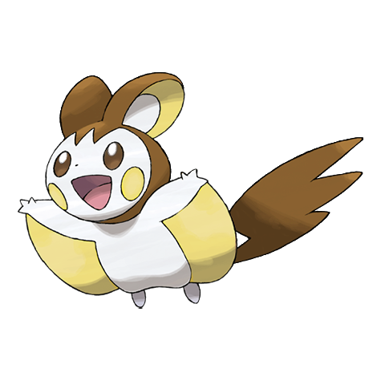

# Emolga (Sky Squirrel Pokémon)

| Official Artwork | Shiny Artwork |
| --- | --- |
|  |  |

**Blaze Black:** The energy made in its cheeks’ electric pouches is stored inside its membrane and released while it is gliding.

**Volt White:** They live on treetops and glide using the inside of a cape-like membrane while discharging electricity.

---

## Media

### Default Sprites

| Front | Back | Front Shiny | Back Shiny |
| --- | --- | --- | --- |
|  |  |  |  |

### Cries

Latest (Gen VI+):

<audio controls>
<source src='../../assets/cries/emolga/latest.ogg' type='audio/ogg'>
  Your browser does not support the audio element.
</audio>

Legacy:

<audio controls>
<source src='../../assets/cries/emolga/legacy.ogg' type='audio/ogg'>
  Your browser does not support the audio element.
</audio>

---

## Pokédex Data

| National № | Type(s) | Height | Weight | Abilities | Local № |
|------------|---------|--------|--------|-----------|---------|
| #587 | {: width='48'} {: width='48'} | 0.4 m | 5.0 kg | 1. Static 2. Motor-Drive | #93 |

---

## Base Stats
|   | HP | Attack | Defense | Sp. Atk | Sp. Def | Speed |
|---|----|--------|---------|---------|---------|-------|
| **Base** | 55 | 95 | 60 | 95 | 60 | 103 |
| **Min** | 220 | 175 | 112 | 175 | 112 | 189 |
| **Max** | 314 | 317 | 240 | 317 | 240 | 335 |

The ranges shown above are for a level 100 Pokémon. Maximum values are based on a beneficial nature, 252 EVs, 31 IVs; minimum values are based on a hindering nature, 0 EVs, 0 IVs.

---

## Forms & Evolutions

!!! warning "WARNING"

    Information on evolutions may not be 100% accurate; differences between evolution methods across generations are not accounted for.

### Forms

Emolga has no alternate forms.

### Evolution Line

1. [Emolga](emolga.md/)

---

## Training

| EV Yield | Catch Rate | Base Friendship | Base Exp. | Growth Rate | Held Items |
|----------|------------|-----------------|-----------|-------------|------------|
| 2 Speed | 200 | 50 | 150 | Medium | cheri-berry (100%) |

---

## Breeding

| Egg Groups | Egg Cycles | Gender | Dimorphic | Color | Shape |
|------------|------------|--------|-----------|-------|-------|
| 1. Ground | 20 | 50.0% Male 50.0% Female | False | White | Quadruped |

---

## Moves

!!! warning "WARNING"

    Specific move information may be incorrect. However, the general movepool should be accurate; this includes changes made in Blaze Black and Volt White.

### Level Up Moves

| Lv. | Move | Type | Cat. | Power | Acc. | PP |
| --- | --- | --- | --- | --- | --- | --- |
| 1 | Covet | {: width='48'} | {: width='36'} | 60 | 100 | 25 |
| 1 | Thunder Shock | {: width='48'} | {: width='36'} | 40 | 100 | 30 |
| 4 | Quick Attack | {: width='48'} | {: width='36'} | 40 | 100 | 30 |
| 7 | Tail Whip | {: width='48'} | {: width='36'} | — | 100 | 30 |
| 10 | Charge | {: width='48'} | {: width='36'} | — | — | 20 |
| 13 | Spark | {: width='48'} | {: width='36'} | 65 | 100 | 20 |
| 16 | Pursuit | {: width='48'} | {: width='36'} | 40 | 100 | 20 |
| 19 | Double Team | {: width='48'} | {: width='36'} | — | — | 15 |
| 22 | Shock Wave | {: width='48'} | {: width='36'} | 70 | — | 20 |
| 24 | Roost | {: width='48'} | {: width='36'} | — | — | 5 |
| 26 | Electro Ball | {: width='48'} | {: width='36'} | — | 100 | 10 |
| 30 | Acrobatics | {: width='48'} | {: width='36'} | 55 | 100 | 15 |
| 32 | Air Slash | {: width='48'} | {: width='36'} | 75 | 95 | 15 |
| 34 | Light Screen | {: width='48'} | {: width='36'} | — | — | 30 |
| 36 | Charm | {: width='48'} | {: width='36'} | — | 100 | 20 |
| 38 | Encore | {: width='48'} | {: width='36'} | — | 100 | 5 |
| 40 | Iron Tail | {: width='48'} | {: width='36'} | 100 | 75 | 15 |
| 42 | Volt Switch | {: width='48'} | {: width='36'} | 70 | 100 | 20 |
| 44 | Baton Pass | {: width='48'} | {: width='36'} | — | — | 40 |
| 46 | Agility | {: width='48'} | {: width='36'} | — | — | 30 |
| 50 | Discharge | {: width='48'} | {: width='36'} | 80 | 100 | 15 |

### TM Moves

| TM | Move | Type | Cat. | Power | Acc. | PP |
| --- | --- | --- | --- | --- | --- | --- |
| HM01 | Cut | {: width='48'} | {: width='36'} | 50 | 95 | 30 |
| TM06 | Toxic | {: width='48'} | {: width='36'} | — | 90 | 10 |
| TM10 | Hidden Power | {: width='48'} | {: width='36'} | 60 | 100 | 15 |
| TM12 | Taunt | {: width='48'} | {: width='36'} | — | 100 | 20 |
| TM16 | Light Screen | {: width='48'} | {: width='36'} | — | — | 30 |
| TM17 | Protect | {: width='48'} | {: width='36'} | — | — | 10 |
| TM18 | Rain Dance | {: width='48'} | {: width='36'} | — | — | 5 |
| TM21 | Frustration | {: width='48'} | {: width='36'} | — | 100 | 20 |
| TM24 | Thunderbolt | {: width='48'} | {: width='36'} | 90 | 100 | 15 |
| TM25 | Thunder | {: width='48'} | {: width='36'} | 110 | 70 | 10 |
| TM27 | Return | {: width='48'} | {: width='36'} | — | 100 | 20 |
| TM32 | Double Team | {: width='48'} | {: width='36'} | — | — | 15 |
| TM40 | Aerial Ace | {: width='48'} | {: width='36'} | 60 | — | 20 |
| TM42 | Facade | {: width='48'} | {: width='36'} | 70 | 100 | 20 |
| TM44 | Rest | {: width='48'} | {: width='36'} | — | — | 5 |
| TM45 | Attract | {: width='48'} | {: width='36'} | — | 100 | 15 |
| TM48 | Round | {: width='48'} | {: width='36'} | 60 | 100 | 15 |
| TM56 | Fling | {: width='48'} | {: width='36'} | — | 100 | 10 |
| TM57 | Charge Beam | {: width='48'} | {: width='36'} | 50 | 90 | 10 |
| TM62 | Acrobatics | {: width='48'} | {: width='36'} | 55 | 100 | 15 |
| TM70 | Flash | {: width='48'} | {: width='36'} | — | 100 | 20 |
| TM72 | Volt Switch | {: width='48'} | {: width='36'} | 70 | 100 | 20 |
| TM73 | Thunder Wave | {: width='48'} | {: width='36'} | — | 90 | 20 |
| TM87 | Swagger | {: width='48'} | {: width='36'} | — | 85 | 15 |
| TM89 | U Turn | {: width='48'} | {: width='36'} | 70 | 100 | 20 |
| TM90 | Substitute | {: width='48'} | {: width='36'} | — | — | 10 |
| TM93 | Wild Charge | {: width='48'} | {: width='36'} | 90 | 100 | 15 |

### Egg Moves

| Move | Type | Cat. | Power | Acc. | PP |
| --- | --- | --- | --- | --- | --- |
| Charm | {: width='48'} | {: width='36'} | — | 100 | 20 |
| Baton Pass | {: width='48'} | {: width='36'} | — | — | 40 |
| Iron Tail | {: width='48'} | {: width='36'} | 100 | 75 | 15 |
| Astonish | {: width='48'} | {: width='36'} | 30 | 100 | 15 |
| Tickle | {: width='48'} | {: width='36'} | — | 100 | 20 |
| Covet | {: width='48'} | {: width='36'} | 60 | 100 | 25 |
| Shock Wave | {: width='48'} | {: width='36'} | 70 | — | 20 |
| Roost | {: width='48'} | {: width='36'} | — | — | 5 |
| Air Slash | {: width='48'} | {: width='36'} | 75 | 95 | 15 |

### Tutor Moves

Emolga cannot learn any moves from tutors.
