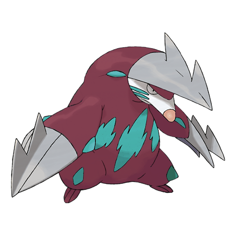
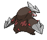
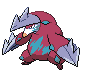
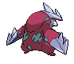

# #530 Excadrill (Subterrene Pokémon)

| Official Artwork | Shiny Artwork |
| --- | --- |
|  |  |

**Blaze Black:** It can help in tunnel construction. Its drill has evolved into steel strong enough to bore through iron plates.

**Volt White:** More than 300 feet below the surface, they build mazelike nests. Their activity can be destructive to subway tunnels.

---

## Media

### Sprites

| Front | Back | Front Shiny | Back Shiny |
| --- | --- | --- | --- |
|  |  |  |  |

### Cries

Latest (Gen VI+):

<audio controls>
  <source src='../assets/cries/530/latest.ogg' type='audio/ogg'>
  Your browser does not support the audio element.
</audio>

Legacy:

<audio controls>
  <source src='../assets/cries/530/legacy.ogg' type='audio/ogg'>
  Your browser does not support the audio element.
</audio>

---

## Pokédex Data

| National № | Type(s) | Height | Weight | Abilities | Local № |
|------------|---------|--------|--------|-----------|---------|
| #530 | {: width='48'} {: width='48'} | 0.7 m | 40.4 kg | 1. Sand-Rush 2. Mold-Breaker | #36 |

---

## Base Stats
---

## Base Stats
|   | HP | Attack | Defense | Sp. Atk | Sp. Def | Speed |
|---|----|--------|---------|---------|---------|-------|
| **Base** | 110 | 135 | 60 | 50 | 65 | 88 |
| **Min** | 330 | 247 | 112 | 94 | 121 | 162 |
| **Max** | 424 | 405 | 240 | 218 | 251 | 302 |

The ranges shown above are for a level 100 Pokémon. Maximum values are based on a beneficial nature, 252 EVs, 31 IVs; minimum values are based on a hindering nature, 0 EVs, 0 IVs.

---

## Forms & Evolutions

!!! warning "WARNING"

    Some forms may not be available in Blaze Black/Volt White. Also information on evolutions may not be 100% accurate; it is currently quite complex to track generational evolution data.

### Forms

Excadrill has no alternate forms.

### Evolution Line

1. [Drilbur](drilbur.md/)
1. Level Up: [Excadrill](excadrill.md/)

---

## Training

| EV Yield | Catch Rate | Base Friendship | Base Exp. | Growth Rate | Held Items |
|----------|------------|-----------------|-----------|-------------|------------|
| 2 Attack | 60 | 50 | 178 | Medium | N/A |

---

## Breeding

| Egg Groups | Egg Cycles | Gender | Dimorphic | Color | Shape |
|------------|------------|--------|-----------|-------|-------|
| 1. Ground | 20 | 50.0% Male 50.0% Female | False | Gray | Humanoid |

---

## Moves

!!! warning "WARNING"

    Specific move information may be incorrect. However, the general movepool should be accurate (including changes to learnset).

### Level Up Moves

Lv. | Move | Type | Cat. | Power | Acc. | PP
--- | --- | --- | --- | --- | --- | ---
| 1 | Iron Head | {: width='48'} | {: width='36'} | 80 | 100 | 15 |
| 1 | Mud Slap | {: width='48'} | {: width='36'} | 20 | 100 | 10 |
| 1 | Mud Sport | {: width='48'} | {: width='36'} | — | — | 15 |
| 1 | Rapid Spin | {: width='48'} | {: width='36'} | 50 | 100 | 40 |
| 1 | Scratch | {: width='48'} | {: width='36'} | 40 | 100 | 35 |
| 5 | Rapid Spin | {: width='48'} | {: width='36'} | 50 | 100 | 40 |
| 8 | Mud Slap | {: width='48'} | {: width='36'} | 20 | 100 | 10 |
| 12 | Fury Swipes | {: width='48'} | {: width='36'} | 18 | 80 | 15 |
| 15 | Metal Claw | {: width='48'} | {: width='36'} | 50 | 95 | 35 |
| 19 | Dig | {: width='48'} | {: width='36'} | 100 | 100 | 10 |
| 22 | Hone Claws | {: width='48'} | {: width='36'} | — | — | 15 |
| 26 | Slash | {: width='48'} | {: width='36'} | 70 | 100 | 20 |
| 29 | Rock Slide | {: width='48'} | {: width='36'} | 80 | 95 | 10 |
| 31 | Horn Drill | {: width='48'} | {: width='36'} | — | 30 | 5 |
| 36 | Earthquake | {: width='48'} | {: width='36'} | 100 | 100 | 10 |
| 42 | Swords Dance | {: width='48'} | {: width='36'} | — | — | 20 |
| 49 | Sandstorm | {: width='48'} | {: width='36'} | — | — | 10 |
| 55 | Drill Run | {: width='48'} | {: width='36'} | 80 | 95 | 10 |
| 62 | Fissure | {: width='48'} | {: width='36'} | — | 30 | 5 |

### TM Moves

TM | Move | Type | Cat. | Power | Acc. | PP
--- | --- | --- | --- | --- | --- | ---
| HM01 | Cut | {: width='48'} | {: width='36'} | 60 | 100 | 20 |
| HM04 | Strength | {: width='48'} | {: width='36'} | 85 | 100 | 15 |
| TM01 | Hone Claws | {: width='48'} | {: width='36'} | — | — | 15 |
| TM06 | Toxic | {: width='48'} | {: width='36'} | — | 90 | 10 |
| TM10 | Hidden Power | {: width='48'} | {: width='36'} | 60 | 100 | 15 |
| TM15 | Hyper Beam | {: width='48'} | {: width='36'} | 150 | 90 | 5 |
| TM17 | Protect | {: width='48'} | {: width='36'} | — | — | 10 |
| TM21 | Frustration | {: width='48'} | {: width='36'} | — | 100 | 20 |
| TM26 | Earthquake | {: width='48'} | {: width='36'} | 100 | 100 | 10 |
| TM27 | Return | {: width='48'} | {: width='36'} | — | 100 | 20 |
| TM28 | Dig | {: width='48'} | {: width='36'} | 100 | 100 | 10 |
| TM31 | Brick Break | {: width='48'} | {: width='36'} | 75 | 100 | 15 |
| TM32 | Double Team | {: width='48'} | {: width='36'} | — | — | 15 |
| TM36 | Sludge Bomb | {: width='48'} | {: width='36'} | 90 | 100 | 10 |
| TM37 | Sandstorm | {: width='48'} | {: width='36'} | — | — | 10 |
| TM39 | Rock Tomb | {: width='48'} | {: width='36'} | 60 | 95 | 15 |
| TM40 | Aerial Ace | {: width='48'} | {: width='36'} | 60 | — | 20 |
| TM42 | Facade | {: width='48'} | {: width='36'} | 70 | 100 | 20 |
| TM44 | Rest | {: width='48'} | {: width='36'} | — | — | 5 |
| TM45 | Attract | {: width='48'} | {: width='36'} | — | 100 | 15 |
| TM48 | Round | {: width='48'} | {: width='36'} | 60 | 100 | 15 |
| TM52 | Focus Blast | {: width='48'} | {: width='36'} | 120 | 70 | 5 |
| TM56 | Fling | {: width='48'} | {: width='36'} | — | 100 | 10 |
| TM65 | Shadow Claw | {: width='48'} | {: width='36'} | 80 | 100 | 15 |
| TM68 | Giga Impact | {: width='48'} | {: width='36'} | 150 | 90 | 5 |
| TM75 | Swords Dance | {: width='48'} | {: width='36'} | — | — | 20 |
| TM78 | Bulldoze | {: width='48'} | {: width='36'} | 80 | 100 | 20 |
| TM80 | Rock Slide | {: width='48'} | {: width='36'} | 80 | 95 | 10 |
| TM81 | X Scissor | {: width='48'} | {: width='36'} | 80 | 100 | 15 |
| TM84 | Poison Jab | {: width='48'} | {: width='36'} | 80 | 100 | 20 |
| TM87 | Swagger | {: width='48'} | {: width='36'} | — | 85 | 15 |
| TM90 | Substitute | {: width='48'} | {: width='36'} | — | — | 10 |
| TM94 | Rock Smash | {: width='48'} | {: width='36'} | 40 | 100 | 15 |

### Egg Moves

Excadrill cannot learn any moves by breeding.
### Tutor Moves

Excadrill cannot learn any moves from tutors.
