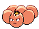

# Exeggcute (Egg Pokémon)

| Official Artwork | Shiny Artwork |
| --- | --- |
|  |  |

Its six eggs converse using telepathy. They can quickly gather if they become separated.

---

## Media

### Default Sprites

| Front | Back | Front Shiny | Back Shiny |
| --- | --- | --- | --- |
|  |  |  |  |

### Cries

Latest (Gen VI+):

<audio controls>
<source src='../../assets/cries/exeggcute/latest.ogg' type='audio/ogg'>
  Your browser does not support the audio element.
</audio>

Legacy:

<audio controls>
<source src='../../assets/cries/exeggcute/legacy.ogg' type='audio/ogg'>
  Your browser does not support the audio element.
</audio>

---

## Pokédex Data

| National № | Type(s) | Height | Weight | Abilities | Local № |
|------------|---------|--------|--------|-----------|---------|
| #102 | {: width='48'} {: width='48'} | 0.4 m | 2.5 kg | 1. Chlorophyll 2. Harvest | N/A |

---

## Base Stats
|   | HP | Attack | Defense | Sp. Atk | Sp. Def | Speed |
|---|----|--------|---------|---------|---------|-------|
| **Base** | 60 | 40 | 80 | 60 | 45 | 40 |
| **Min** | 230 | 76 | 148 | 112 | 85 | 76 |
| **Max** | 324 | 196 | 284 | 240 | 207 | 196 |

The ranges shown above are for a level 100 Pokémon. Maximum values are based on a beneficial nature, 252 EVs, 31 IVs; minimum values are based on a hindering nature, 0 EVs, 0 IVs.

---

## Forms & Evolutions

!!! warning "WARNING"

    Information on evolutions may not be 100% accurate; differences between evolution methods across generations are not accounted for.

### Forms

Exeggcute has no alternate forms.

### Evolution Line

1. [Exeggcute](exeggcute.md/)
    1. Use Item: [Exeggutor](exeggutor.md/)

---

## Training

| EV Yield | Catch Rate | Base Friendship | Base Exp. | Growth Rate | Held Items |
|----------|------------|-----------------|-----------|-------------|------------|
| 1 Defense | 90 | 50 | 65 | Slow |  |

---

## Breeding

| Egg Groups | Egg Cycles | Gender | Dimorphic | Color | Shape |
|------------|------------|--------|-----------|-------|-------|
| 1. Plant | 20 | 50.0% Male 50.0% Female | False | Pink | Heads |

---

## Moves

!!! warning "WARNING"

    Specific move information may be incorrect. However, the general movepool should be accurate; this includes changes made in Blaze Black and Volt White.

### Level Up Moves

| Lv. | Move | Type | Cat. | Power | Acc. | PP |
| --- | --- | --- | --- | --- | --- | --- |
| 1 | Draining Kiss | {: width='48'} | {: width='36'} | 75 | 100 | 10 |
| 1 | Hypnosis | {: width='48'} | {: width='36'} | — | 60 | 20 |
| 1 | Sweet Scent | {: width='48'} | {: width='36'} | — | 100 | 20 |
| 1 | Uproar | {: width='48'} | {: width='36'} | 90 | 100 | 10 |
| 7 | Reflect | {: width='48'} | {: width='36'} | — | — | 20 |
| 11 | Leech Seed | {: width='48'} | {: width='36'} | — | 90 | 10 |
| 14 | Confusion | {: width='48'} | {: width='36'} | 50 | 100 | 25 |
| 17 | Bullet Seed | {: width='48'} | {: width='36'} | 25 | 100 | 30 |
| 19 | Stun Spore | {: width='48'} | {: width='36'} | — | 75 | 30 |
| 21 | Poison Powder | {: width='48'} | {: width='36'} | — | 75 | 35 |
| 23 | Sleep Powder | {: width='48'} | {: width='36'} | — | 75 | 15 |
| 25 | Synthesis | {: width='48'} | {: width='36'} | — | — | 5 |
| 27 | Giga Drain | {: width='48'} | {: width='36'} | 75 | 100 | 10 |
| 33 | Worry Seed | {: width='48'} | {: width='36'} | — | 100 | 10 |
| 37 | Natural Gift | {: width='48'} | {: width='36'} | — | 100 | 15 |
| 43 | Solar Beam | {: width='48'} | {: width='36'} | 120 | 100 | 10 |
| 47 | Psychic | {: width='48'} | {: width='36'} | 90 | 100 | 10 |
| 53 | Bestow | {: width='48'} | {: width='36'} | — | — | 15 |

### TM Moves

| TM | Move | Type | Cat. | Power | Acc. | PP |
| --- | --- | --- | --- | --- | --- | --- |
| HM04 | Strength | {: width='48'} | {: width='36'} | 100 | 100 | 15 |
| TM06 | Toxic | {: width='48'} | {: width='36'} | — | 90 | 10 |
| TM10 | Hidden Power | {: width='48'} | {: width='36'} | 60 | 100 | 15 |
| TM11 | Sunny Day | {: width='48'} | {: width='36'} | — | — | 5 |
| TM16 | Light Screen | {: width='48'} | {: width='36'} | — | — | 30 |
| TM17 | Protect | {: width='48'} | {: width='36'} | — | — | 10 |
| TM19 | Telekinesis | {: width='48'} | {: width='36'} | — | — | 15 |
| TM21 | Frustration | {: width='48'} | {: width='36'} | — | 100 | 20 |
| TM22 | Solar Beam | {: width='48'} | {: width='36'} | 120 | 100 | 10 |
| TM27 | Return | {: width='48'} | {: width='36'} | — | 100 | 20 |
| TM29 | Psychic | {: width='48'} | {: width='36'} | 90 | 100 | 10 |
| TM32 | Double Team | {: width='48'} | {: width='36'} | — | — | 15 |
| TM33 | Reflect | {: width='48'} | {: width='36'} | — | — | 20 |
| TM36 | Sludge Bomb | {: width='48'} | {: width='36'} | 90 | 100 | 10 |
| TM42 | Facade | {: width='48'} | {: width='36'} | 70 | 100 | 20 |
| TM44 | Rest | {: width='48'} | {: width='36'} | — | — | 5 |
| TM45 | Attract | {: width='48'} | {: width='36'} | — | 100 | 15 |
| TM46 | Thief | {: width='48'} | {: width='36'} | 60 | 100 | 25 |
| TM48 | Round | {: width='48'} | {: width='36'} | 60 | 100 | 15 |
| TM53 | Energy Ball | {: width='48'} | {: width='36'} | 90 | 100 | 10 |
| TM64 | Explosion | {: width='48'} | {: width='36'} | 250 | 100 | 5 |
| TM70 | Flash | {: width='48'} | {: width='36'} | — | 100 | 20 |
| TM75 | Swords Dance | {: width='48'} | {: width='36'} | — | — | 20 |
| TM77 | Psych Up | {: width='48'} | {: width='36'} | — | — | 10 |
| TM85 | Dream Eater | {: width='48'} | {: width='36'} | 100 | 100 | 15 |
| TM86 | Grass Knot | {: width='48'} | {: width='36'} | — | 100 | 20 |
| TM87 | Swagger | {: width='48'} | {: width='36'} | — | 85 | 15 |
| TM90 | Substitute | {: width='48'} | {: width='36'} | — | — | 10 |
| TM92 | Trick Room | {: width='48'} | {: width='36'} | — | — | 5 |

### Egg Moves

| Move | Type | Cat. | Power | Acc. | PP |
| --- | --- | --- | --- | --- | --- |
| Curse | {: width='48'} | {: width='36'} | — | — | 10 |
| Giga Drain | {: width='48'} | {: width='36'} | 75 | 100 | 10 |
| Synthesis | {: width='48'} | {: width='36'} | — | — | 5 |
| Moonlight | {: width='48'} | {: width='36'} | — | — | 5 |
| Ancient Power | {: width='48'} | {: width='36'} | 60 | 100 | 5 |
| Nature Power | {: width='48'} | {: width='36'} | — | — | 20 |
| Ingrain | {: width='48'} | {: width='36'} | — | — | 20 |
| Skill Swap | {: width='48'} | {: width='36'} | — | — | 10 |
| Block | {: width='48'} | {: width='36'} | — | — | 5 |
| Natural Gift | {: width='48'} | {: width='36'} | — | 100 | 15 |
| Lucky Chant | {: width='48'} | {: width='36'} | — | — | 30 |
| Power Swap | {: width='48'} | {: width='36'} | — | — | 10 |
| Leaf Storm | {: width='48'} | {: width='36'} | 130 | 90 | 5 |

### Tutor Moves

Exeggcute cannot learn any moves from tutors.
