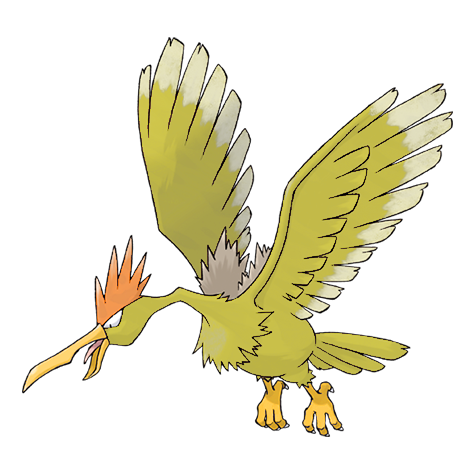
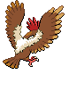
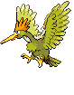
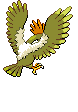

# Fearow (Beak Pokémon)

| Official Artwork | Shiny Artwork |
| --- | --- |
|  |  |

It has the stamina to fly all day on its broad wings. It fights by using its sharp beak.

---

## Media

### Default Sprites

| Front | Back | Front Shiny | Back Shiny |
| --- | --- | --- | --- |
|  |  |  |  |

### Cries

Latest (Gen VI+):

<audio controls>
<source src='../../assets/cries/fearow/latest.ogg' type='audio/ogg'>
  Your browser does not support the audio element.
</audio>

Legacy:

<audio controls>
<source src='../../assets/cries/fearow/legacy.ogg' type='audio/ogg'>
  Your browser does not support the audio element.
</audio>

---

## Pokédex Data

| National № | Type(s) | Height | Weight | Abilities | Local № |
|------------|---------|--------|--------|-----------|---------|
| #22 | {: width='48'} {: width='48'} | 1.2 m | 38.0 kg | 1. Keen-Eye 2. Sniper | N/A |

---

## Base Stats
|   | HP | Attack | Defense | Sp. Atk | Sp. Def | Speed |
|---|----|--------|---------|---------|---------|-------|
| **Base** | 65 | 100 | 65 | 61 | 61 | 100 |
| **Min** | 240 | 184 | 121 | 114 | 114 | 184 |
| **Max** | 334 | 328 | 251 | 243 | 243 | 328 |

The ranges shown above are for a level 100 Pokémon. Maximum values are based on a beneficial nature, 252 EVs, 31 IVs; minimum values are based on a hindering nature, 0 EVs, 0 IVs.

---

## Forms & Evolutions

!!! warning "WARNING"

    Information on evolutions may not be 100% accurate; differences between evolution methods across generations are not accounted for.

### Forms

Fearow has no alternate forms.

### Evolution Line

1. [Spearow](spearow.md/)
    1. Level Up: [Fearow](fearow.md/)

---

## Training

| EV Yield | Catch Rate | Base Friendship | Base Exp. | Growth Rate | Held Items |
|----------|------------|-----------------|-----------|-------------|------------|
| 2 Speed | 90 | 70 | 155 | Medium | sharp-beak (5%) |

---

## Breeding

| Egg Groups | Egg Cycles | Gender | Dimorphic | Color | Shape |
|------------|------------|--------|-----------|-------|-------|
| 1. Flying | 15 | 50.0% Male 50.0% Female | False | Brown | Wings |

---

## Moves

!!! warning "WARNING"

    Specific move information may be incorrect. However, the general movepool should be accurate; this includes changes made in Blaze Black and Volt White.

### Level Up Moves

| Lv. | Move | Type | Cat. | Power | Acc. | PP |
| --- | --- | --- | --- | --- | --- | --- |
| 1 | Fury Attack | {: width='48'} | {: width='36'} | 15 | 85 | 20 |
| 1 | Growl | {: width='48'} | {: width='36'} | — | 100 | 40 |
| 1 | Leer | {: width='48'} | {: width='36'} | — | 100 | 30 |
| 1 | Peck | {: width='48'} | {: width='36'} | 35 | 100 | 35 |
| 1 | Pluck | {: width='48'} | {: width='36'} | 60 | 100 | 20 |
| 1 | Pursuit | {: width='48'} | {: width='36'} | 40 | 100 | 20 |
| 5 | Leer | {: width='48'} | {: width='36'} | — | 100 | 30 |
| 9 | Fury Attack | {: width='48'} | {: width='36'} | 15 | 85 | 20 |
| 13 | Steel Wing | {: width='48'} | {: width='36'} | 70 | 90 | 25 |
| 17 | Aerial Ace | {: width='48'} | {: width='36'} | 60 | — | 20 |
| 23 | Mirror Move | {: width='48'} | {: width='36'} | — | — | 20 |
| 29 | Agility | {: width='48'} | {: width='36'} | — | — | 30 |
| 35 | Assurance | {: width='48'} | {: width='36'} | 60 | 100 | 10 |
| 41 | Roost | {: width='48'} | {: width='36'} | — | — | 5 |
| 47 | Drill Peck | {: width='48'} | {: width='36'} | 80 | 100 | 20 |
| 53 | Drill Run | {: width='48'} | {: width='36'} | 80 | 95 | 10 |

### TM Moves

| TM | Move | Type | Cat. | Power | Acc. | PP |
| --- | --- | --- | --- | --- | --- | --- |
| HM02 | Fly | {: width='48'} | {: width='36'} | 100 | 100% | 15 |
| TM06 | Toxic | {: width='48'} | {: width='36'} | — | 90 | 10 |
| TM10 | Hidden Power | {: width='48'} | {: width='36'} | 60 | 100 | 15 |
| TM11 | Sunny Day | {: width='48'} | {: width='36'} | — | — | 5 |
| TM15 | Hyper Beam | {: width='48'} | {: width='36'} | 150 | 90 | 5 |
| TM17 | Protect | {: width='48'} | {: width='36'} | — | — | 10 |
| TM18 | Rain Dance | {: width='48'} | {: width='36'} | — | — | 5 |
| TM21 | Frustration | {: width='48'} | {: width='36'} | — | 100 | 20 |
| TM27 | Return | {: width='48'} | {: width='36'} | — | 100 | 20 |
| TM32 | Double Team | {: width='48'} | {: width='36'} | — | — | 15 |
| TM40 | Aerial Ace | {: width='48'} | {: width='36'} | 60 | — | 20 |
| TM42 | Facade | {: width='48'} | {: width='36'} | 70 | 100 | 20 |
| TM44 | Rest | {: width='48'} | {: width='36'} | — | — | 5 |
| TM45 | Attract | {: width='48'} | {: width='36'} | — | 100 | 15 |
| TM46 | Thief | {: width='48'} | {: width='36'} | 60 | 100 | 25 |
| TM48 | Round | {: width='48'} | {: width='36'} | 60 | 100 | 15 |
| TM49 | Echoed Voice | {: width='48'} | {: width='36'} | 40 | 100 | 15 |
| TM54 | False Swipe | {: width='48'} | {: width='36'} | 40 | 100 | 40 |
| TM68 | Giga Impact | {: width='48'} | {: width='36'} | 150 | 90 | 5 |
| TM83 | Work Up | {: width='48'} | {: width='36'} | — | — | 30 |
| TM87 | Swagger | {: width='48'} | {: width='36'} | — | 85 | 15 |
| TM88 | Pluck | {: width='48'} | {: width='36'} | 60 | 100 | 20 |
| TM89 | U Turn | {: width='48'} | {: width='36'} | 70 | 100 | 20 |
| TM90 | Substitute | {: width='48'} | {: width='36'} | — | — | 10 |

### Egg Moves

Fearow cannot learn any moves by breeding.
### Tutor Moves

Fearow cannot learn any moves from tutors.
