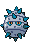

# #597 Ferroseed (Thorn Seed Pokémon)

| Official Artwork | Shiny Artwork |
| --- | --- |
|  |  |

**Blaze Black:** When threatened, it attacks by shooting a barrage of spikes, which gives it a chance to escape by rolling away.

**Volt White:** They stick their spikes into cave walls and absorb the minerals they find in the rock.

---

## Media

### Default Sprites

| Front | Back | Front Shiny | Back Shiny |
| --- | --- | --- | --- |
|  |  |  |  |

### Cries

Latest (Gen VI+):

<audio controls>
<source src='../../assets/cries/ferroseed/latest.ogg' type='audio/ogg'>
  Your browser does not support the audio element.
</audio>

Legacy:

<audio controls>
<source src='../../assets/cries/ferroseed/legacy.ogg' type='audio/ogg'>
  Your browser does not support the audio element.
</audio>

---

## Pokédex Data

| National № | Type(s) | Height | Weight | Abilities | Local № |
|------------|---------|--------|--------|-----------|---------|
| #597 | {: width="48"} {: width="48"} | 0.6 m / 2.0 ft | 18.8 kg / 41.4 lbs |  | 1. Iron Barbs | #103 |

---

## Base Stats
|   | HP | Attack | Defense | Sp. Atk | Sp. Def | Speed |
|---|----|--------|---------|---------|---------|-------|
| **Base** | 44 | 50 | 91 | 24 | 86 | 10 |
| **Min** | 198 | 94 | 168 | 47 | 159 | 22 |
| **Max** | 292 | 218 | 309 | 161 | 298 | 130 |

The ranges shown above are for a level 100 Pokémon. Maximum values are based on a beneficial nature, 252 EVs, 31 IVs; minimum values are based on a hindering nature, 0 EVs, 0 IVs.

---

## Forms & Evolutions

!!! warning "WARNING"

    Information on evolutions may not be 100% accurate; differences between evolution methods across generations are not accounted for.

### Forms

Ferroseed has no alternate forms.

### Evolution Line

1. [Ferroseed](ferroseed.md/)
    1. Level Up: [Ferrothorn](ferrothorn.md/)

---

## Training

| EV Yield | Catch Rate | Base Friendship | Base Exp. | Growth Rate | Held Items |
|----------|------------|-----------------|-----------|-------------|------------|
| 1 Def | 255 | 50 | 61 | Medium | Sticky Barb (5%) |

---

## Breeding

| Egg Groups | Egg Cycles | Gender | Dimorphic | Color | Shape |
|------------|------------|--------|-----------|-------|-------|
| 1. Plant 2. Mineral | 20 | 50.0% Male 50.0% Female | False | Gray | Ball |

---

## Moves

!!! warning "WARNING"

    Specific move information may be incorrect. However, the general movepool should be accurate; this includes changes made in Blaze Black and Volt White.

### Level Up Moves

| Lv. | Move | Type | Cat. | Power | Acc. | PP |
| --- | --- | --- | --- | --- | --- | --- |
| 1 | Harden | {: width="48"} | {: width="36"} | — | — | 30 |
| 1 | Rapid Spin | {: width="48"} | {: width="36"} | 50 | 100 | 40 |
| 1 | Tackle | {: width="48"} | {: width="36"} | 40 | 100 | 35 |
| 6 | Rollout | {: width="48"} | {: width="36"} | 30 | 90 | 20 |
| 9 | Curse | {: width="48"} | {: width="36"} | — | — | 10 |
| 14 | Metal Claw | {: width="48"} | {: width="36"} | 50 | 95 | 35 |
| 18 | Pin Missile | {: width="48"} | {: width="36"} | 25 | 95 | 20 |
| 21 | Gyro Ball | {: width="48"} | {: width="36"} | — | 100 | 5 |
| 23 | Bullet Seed | {: width="48"} | {: width="36"} | 25 | 100 | 30 |
| 26 | Iron Defense | {: width="48"} | {: width="36"} | — | — | 15 |
| 28 | Leech Seed | {: width="48"} | {: width="36"} | — | 90 | 10 |
| 30 | Mirror Shot | {: width="48"} | {: width="36"} | 65 | 85 | 10 |
| 32 | Seed Bomb | {: width="48"} | {: width="36"} | 80 | 100 | 15 |
| 35 | Ingrain | {: width="48"} | {: width="36"} | — | — | 20 |
| 38 | Self Destruct | {: width="48"} | {: width="36"} | 200 | 100 | 5 |
| 43 | Iron Head | {: width="48"} | {: width="36"} | 80 | 100 | 15 |
| 47 | Payback | {: width="48"} | {: width="36"} | 50 | 100 | 10 |
| 52 | Flash Cannon | {: width="48"} | {: width="36"} | 80 | 100 | 10 |
| 55 | Explosion | {: width="48"} | {: width="36"} | 250 | 100 | 5 |

### TM Moves

| TM | Move | Type | Cat. | Power | Acc. | PP |
| --- | --- | --- | --- | --- | --- | --- |
| TM01 | Hone Claws | {: width="48"} | {: width="36"} | — | — | 15 |
| TM06 | Toxic | {: width="48"} | {: width="36"} | — | 90 | 10 |
| TM10 | Hidden Power | {: width="48"} | {: width="36"} | 60 | 100 | 15 |
| TM11 | Sunny Day | {: width="48"} | {: width="36"} | — | — | 5 |
| TM17 | Protect | {: width="48"} | {: width="36"} | — | — | 10 |
| TM21 | Frustration | {: width="48"} | {: width="36"} | — | 100 | 20 |
| TM22 | Solar Beam | {: width="48"} | {: width="36"} | 120 | 100 | 10 |
| TM24 | Thunderbolt | {: width="48"} | {: width="36"} | 90 | 100 | 15 |
| TM27 | Return | {: width="48"} | {: width="36"} | — | 100 | 20 |
| TM32 | Double Team | {: width="48"} | {: width="36"} | — | — | 15 |
| TM42 | Facade | {: width="48"} | {: width="36"} | 70 | 100 | 20 |
| TM44 | Rest | {: width="48"} | {: width="36"} | — | — | 5 |
| TM48 | Round | {: width="48"} | {: width="36"} | 60 | 100 | 15 |
| TM53 | Energy Ball | {: width="48"} | {: width="36"} | 90 | 100 | 10 |
| TM64 | Explosion | {: width="48"} | {: width="36"} | 250 | 100 | 5 |
| TM66 | Payback | {: width="48"} | {: width="36"} | 50 | 100 | 10 |
| TM69 | Rock Polish | {: width="48"} | {: width="36"} | — | — | 20 |
| TM70 | Flash | {: width="48"} | {: width="36"} | — | 100 | 20 |
| TM73 | Thunder Wave | {: width="48"} | {: width="36"} | — | 90 | 20 |
| TM74 | Gyro Ball | {: width="48"} | {: width="36"} | — | 100 | 5 |
| TM84 | Poison Jab | {: width="48"} | {: width="36"} | 80 | 100 | 20 |
| TM87 | Swagger | {: width="48"} | {: width="36"} | — | 85 | 15 |
| TM90 | Substitute | {: width="48"} | {: width="36"} | — | — | 10 |
| TM91 | Flash Cannon | {: width="48"} | {: width="36"} | 80 | 100 | 10 |
| TM94 | Rock Smash | {: width="48"} | {: width="36"} | 60 | 100 | 15 |

### Egg Moves

| Move | Type | Cat. | Power | Acc. | PP |
| --- | --- | --- | --- | --- | --- |
| Leech Seed | {: width="48"} | {: width="36"} | — | 90 | 10 |
| Spikes | {: width="48"} | {: width="36"} | — | — | 20 |
| Bullet Seed | {: width="48"} | {: width="36"} | 25 | 100 | 30 |
| Gravity | {: width="48"} | {: width="36"} | — | — | 5 |
| Worry Seed | {: width="48"} | {: width="36"} | — | 100 | 10 |
| Seed Bomb | {: width="48"} | {: width="36"} | 80 | 100 | 15 |
| Rock Climb | {: width="48"} | {: width="36"} | 80 | 95% | 10 |
| Stealth Rock | {: width="48"} | {: width="36"} | — | — | 20 |

### Tutor Moves

Ferroseed cannot learn any moves from tutors.
