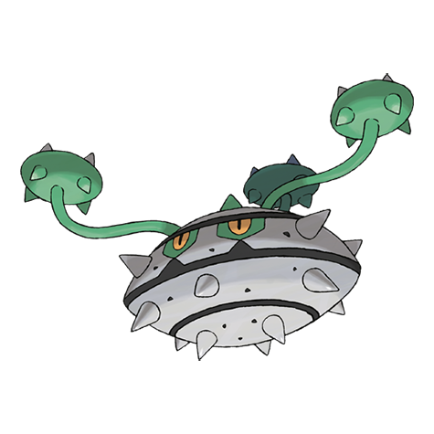

# Ferrothorn (Thorn Pod Pokémon)

| Official Artwork | Shiny Artwork |
| --- | --- |
|  |  |

**Blaze Black:** It fights by swinging around its three spiky feelers. A hit from these steel spikes can reduce a boulder to rubble.

**Volt White:** They attach themselves to cave ceilings, firing steel spikes at targets passing beneath them.

---

## Media

### Default Sprites

| Front | Back | Front Shiny | Back Shiny |
| --- | --- | --- | --- |
|  |  |  |  |

### Cries

Latest (Gen VI+):

<audio controls>
<source src='../../assets/cries/ferrothorn/latest.ogg' type='audio/ogg'>
  Your browser does not support the audio element.
</audio>

Legacy:

<audio controls>
<source src='../../assets/cries/ferrothorn/legacy.ogg' type='audio/ogg'>
  Your browser does not support the audio element.
</audio>

---

## Pokédex Data

| National № | Type(s) | Height | Weight | Abilities | Local № |
|------------|---------|--------|--------|-----------|---------|
| #598 | {: width='48'} {: width='48'} | 1.0 m | 110.0 kg | 1. Iron-Barbs | #104 |

---

## Base Stats
|   | HP | Attack | Defense | Sp. Atk | Sp. Def | Speed |
|---|----|--------|---------|---------|---------|-------|
| **Base** | 74 | 94 | 131 | 54 | 116 | 20 |
| **Min** | 258 | 173 | 240 | 101 | 213 | 40 |
| **Max** | 352 | 315 | 397 | 227 | 364 | 152 |

The ranges shown above are for a level 100 Pokémon. Maximum values are based on a beneficial nature, 252 EVs, 31 IVs; minimum values are based on a hindering nature, 0 EVs, 0 IVs.

---

## Forms & Evolutions

!!! warning "WARNING"

    Information on evolutions may not be 100% accurate; differences between evolution methods across generations are not accounted for.

### Forms

Ferrothorn has no alternate forms.

### Evolution Line

1. [Ferroseed](ferroseed.md/)
    1. Level Up: [Ferrothorn](ferrothorn.md/)

---

## Training

| EV Yield | Catch Rate | Base Friendship | Base Exp. | Growth Rate | Held Items |
|----------|------------|-----------------|-----------|-------------|------------|
| 2 Defense | 90 | 50 | 171 | Medium | sticky-barb (5%) |

---

## Breeding

| Egg Groups | Egg Cycles | Gender | Dimorphic | Color | Shape |
|------------|------------|--------|-----------|-------|-------|
| 1. Plant 2. Mineral | 20 | 50.0% Male 50.0% Female | False | Gray | Tentacles |

---

## Moves

!!! warning "WARNING"

    Specific move information may be incorrect. However, the general movepool should be accurate; this includes changes made in Blaze Black and Volt White.

### Level Up Moves

| Lv. | Move | Type | Cat. | Power | Acc. | PP |
| --- | --- | --- | --- | --- | --- | --- |
| 1 | Curse | {: width='48'} | {: width='36'} | — | — | 10 |
| 1 | Harden | {: width='48'} | {: width='36'} | — | — | 30 |
| 1 | Rapid Spin | {: width='48'} | {: width='36'} | 50 | 100 | 40 |
| 1 | Rock Climb | {: width='48'} | {: width='36'} | 80 | 95% | 10 |
| 1 | Rollout | {: width='48'} | {: width='36'} | 30 | 90 | 20 |
| 1 | Stealth Rock | {: width='48'} | {: width='36'} | — | — | 20 |
| 1 | Tackle | {: width='48'} | {: width='36'} | 40 | 100 | 35 |
| 6 | Rollout | {: width='48'} | {: width='36'} | 30 | 90 | 20 |
| 9 | Curse | {: width='48'} | {: width='36'} | — | — | 10 |
| 14 | Metal Claw | {: width='48'} | {: width='36'} | 50 | 95 | 35 |
| 18 | Pin Missile | {: width='48'} | {: width='36'} | 25 | 95 | 20 |
| 21 | Gyro Ball | {: width='48'} | {: width='36'} | — | 100 | 5 |
| 23 | Bullet Seed | {: width='48'} | {: width='36'} | 25 | 100 | 30 |
| 26 | Iron Defense | {: width='48'} | {: width='36'} | — | — | 15 |
| 28 | Spikes | {: width='48'} | {: width='36'} | — | — | 20 |
| 30 | Mirror Shot | {: width='48'} | {: width='36'} | 65 | 85 | 10 |
| 32 | Seed Bomb | {: width='48'} | {: width='36'} | 80 | 100 | 15 |
| 35 | Ingrain | {: width='48'} | {: width='36'} | — | — | 20 |
| 38 | Self Destruct | {: width='48'} | {: width='36'} | 200 | 100 | 5 |
| 40 | Power Whip | {: width='48'} | {: width='36'} | 120 | 85 | 10 |
| 46 | Iron Head | {: width='48'} | {: width='36'} | 80 | 100 | 15 |
| 53 | Payback | {: width='48'} | {: width='36'} | 50 | 100 | 10 |
| 61 | Flash Cannon | {: width='48'} | {: width='36'} | 80 | 100 | 10 |
| 67 | Explosion | {: width='48'} | {: width='36'} | 250 | 100 | 5 |

### TM Moves

| TM | Move | Type | Cat. | Power | Acc. | PP |
| --- | --- | --- | --- | --- | --- | --- |
| HM01 | Cut | {: width='48'} | {: width='36'} | 60 | 100% | 25 |
| HM04 | Strength | {: width='48'} | {: width='36'} | 100 | 100 | 15 |
| TM01 | Hone Claws | {: width='48'} | {: width='36'} | — | — | 15 |
| TM06 | Toxic | {: width='48'} | {: width='36'} | — | 90 | 10 |
| TM10 | Hidden Power | {: width='48'} | {: width='36'} | 60 | 100 | 15 |
| TM11 | Sunny Day | {: width='48'} | {: width='36'} | — | — | 5 |
| TM15 | Hyper Beam | {: width='48'} | {: width='36'} | 150 | 90 | 5 |
| TM17 | Protect | {: width='48'} | {: width='36'} | — | — | 10 |
| TM21 | Frustration | {: width='48'} | {: width='36'} | — | 100 | 20 |
| TM22 | Solar Beam | {: width='48'} | {: width='36'} | 120 | 100 | 10 |
| TM24 | Thunderbolt | {: width='48'} | {: width='36'} | 90 | 100 | 15 |
| TM25 | Thunder | {: width='48'} | {: width='36'} | 110 | 70 | 10 |
| TM27 | Return | {: width='48'} | {: width='36'} | — | 100 | 20 |
| TM32 | Double Team | {: width='48'} | {: width='36'} | — | — | 15 |
| TM37 | Sandstorm | {: width='48'} | {: width='36'} | — | — | 10 |
| TM40 | Aerial Ace | {: width='48'} | {: width='36'} | 60 | — | 20 |
| TM42 | Facade | {: width='48'} | {: width='36'} | 70 | 100 | 20 |
| TM44 | Rest | {: width='48'} | {: width='36'} | — | — | 5 |
| TM48 | Round | {: width='48'} | {: width='36'} | 60 | 100 | 15 |
| TM53 | Energy Ball | {: width='48'} | {: width='36'} | 90 | 100 | 10 |
| TM64 | Explosion | {: width='48'} | {: width='36'} | 250 | 100 | 5 |
| TM65 | Shadow Claw | {: width='48'} | {: width='36'} | 80 | 100 | 15 |
| TM66 | Payback | {: width='48'} | {: width='36'} | 50 | 100 | 10 |
| TM68 | Giga Impact | {: width='48'} | {: width='36'} | 150 | 90 | 5 |
| TM69 | Rock Polish | {: width='48'} | {: width='36'} | — | — | 20 |
| TM70 | Flash | {: width='48'} | {: width='36'} | — | 100 | 20 |
| TM73 | Thunder Wave | {: width='48'} | {: width='36'} | — | 90 | 20 |
| TM74 | Gyro Ball | {: width='48'} | {: width='36'} | — | 100 | 5 |
| TM75 | Swords Dance | {: width='48'} | {: width='36'} | — | — | 20 |
| TM78 | Bulldoze | {: width='48'} | {: width='36'} | 80 | 100 | 20 |
| TM84 | Poison Jab | {: width='48'} | {: width='36'} | 80 | 100 | 20 |
| TM86 | Grass Knot | {: width='48'} | {: width='36'} | — | 100 | 20 |
| TM87 | Swagger | {: width='48'} | {: width='36'} | — | 85 | 15 |
| TM90 | Substitute | {: width='48'} | {: width='36'} | — | — | 10 |
| TM91 | Flash Cannon | {: width='48'} | {: width='36'} | 80 | 100 | 10 |
| TM94 | Rock Smash | {: width='48'} | {: width='36'} | 60 | 100 | 15 |

### Egg Moves

Ferrothorn cannot learn any moves by breeding.
### Tutor Moves

Ferrothorn cannot learn any moves from tutors.
