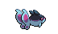
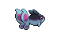
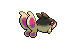

# #456 Finneon (Wing Fish Pokémon)

| Official Artwork | Shiny Artwork |
| --- | --- |
|  |  |

The line running down its side can store sunlight. It shines vividly at night.

---

## Media

### Sprites

| Front | Back | Front Shiny | Back Shiny |
| --- | --- | --- | --- |
|  |  |  |  |

### Female Sprites

| Front | Back | Front Shiny | Back Shiny |
| --- | --- | --- | --- |
|  |  |  |  |

### Cries

Latest (Gen VI+):

<audio controls>
  <source src='../assets/cries/finneon/latest.ogg' type='audio/ogg'>
  Your browser does not support the audio element.
</audio>

Legacy:

<audio controls>
  <source src='../assets/cries/finneon/legacy.ogg' type='audio/ogg'>
  Your browser does not support the audio element.
</audio>

---

## Pokédex Data

| National № | Type(s) | Height | Weight | Abilities | Local № |
|------------|---------|--------|--------|-----------|---------|
| #456 | {: width='48'} | 0.4 m | 7.0 kg | 1. Swift-Swim 2. Storm-Drain | #N/A |

---

## Base Stats
---

## Base Stats
|   | HP | Attack | Defense | Sp. Atk | Sp. Def | Speed |
|---|----|--------|---------|---------|---------|-------|
| **Base** | 49 | 49 | 56 | 49 | 61 | 66 |
| **Min** | 208 | 92 | 105 | 92 | 114 | 123 |
| **Max** | 302 | 216 | 232 | 216 | 243 | 254 |

The ranges shown above are for a level 100 Pokémon. Maximum values are based on a beneficial nature, 252 EVs, 31 IVs; minimum values are based on a hindering nature, 0 EVs, 0 IVs.

---

## Forms & Evolutions

!!! warning "WARNING"

    Some forms may not be available in Blaze Black/Volt White. Also information on evolutions may not be 100% accurate; it is currently quite complex to track generational evolution data.

### Forms

Finneon has no alternate forms.

### Evolution Line

1. [Finneon](finneon.md/)
1. Level Up: [Lumineon](lumineon.md/)

---

## Training

| EV Yield | Catch Rate | Base Friendship | Base Exp. | Growth Rate | Held Items |
|----------|------------|-----------------|-----------|-------------|------------|
| 1 Speed | 190 | 70 | 66 | Slow-Then-Very-Fast | Rindo Berry (5%) |

---

## Breeding

| Egg Groups | Egg Cycles | Gender | Dimorphic | Color | Shape |
|------------|------------|--------|-----------|-------|-------|
| 1. Water2 | 20 | 50.0% Male 50.0% Female | True | Blue | Fish |

---

## Moves

!!! warning "WARNING"

    Specific move information may be incorrect. However, the general movepool should be accurate (including changes to learnset).

### Level Up Moves

Lv. | Move | Type | Cat. | Power | Acc. | PP
--- | --- | --- | --- | --- | --- | ---
| 1 | Pound | {: width='48'} | {: width='36'} | 40 | 100 | 35 |
| 6 | Water Gun | {: width='48'} | {: width='36'} | 40 | 100 | 25 |
| 10 | Attract | {: width='48'} | {: width='36'} | — | 100 | 15 |
| 13 | Rain Dance | {: width='48'} | {: width='36'} | — | — | 5 |
| 17 | Gust | {: width='48'} | {: width='36'} | 40 | 100 | 35 |
| 22 | Water Pulse | {: width='48'} | {: width='36'} | 60 | 100 | 20 |
| 26 | Captivate | {: width='48'} | {: width='36'} | — | 100 | 20 |
| 29 | Safeguard | {: width='48'} | {: width='36'} | — | — | 25 |
| 33 | Aqua Ring | {: width='48'} | {: width='36'} | — | — | 20 |
| 38 | Whirlpool | {: width='48'} | {: width='36'} | 35 | 85 | 15 |
| 42 | U Turn | {: width='48'} | {: width='36'} | 70 | 100 | 20 |
| 45 | Bounce | {: width='48'} | {: width='36'} | 85 | 85 | 5 |
| 49 | Silver Wind | {: width='48'} | {: width='36'} | 60 | 100 | 5 |
| 54 | Soak | {: width='48'} | {: width='36'} | — | 100 | 20 |

### TM Moves

TM | Move | Type | Cat. | Power | Acc. | PP
--- | --- | --- | --- | --- | --- | ---
| HM03 | Surf | {: width='48'} | {: width='36'} | 90 | 100 | 15 |
| HM05 | Waterfall | {: width='48'} | {: width='36'} | 85 | 100 | 15 |
| HM06 | Dive | {: width='48'} | {: width='36'} | 100 | 100 | 10 |
| TM06 | Toxic | {: width='48'} | {: width='36'} | — | 90 | 10 |
| TM07 | Hail | {: width='48'} | {: width='36'} | — | — | 10 |
| TM10 | Hidden Power | {: width='48'} | {: width='36'} | 60 | 100 | 15 |
| TM13 | Ice Beam | {: width='48'} | {: width='36'} | 90 | 100 | 10 |
| TM14 | Blizzard | {: width='48'} | {: width='36'} | 110 | 70 | 5 |
| TM17 | Protect | {: width='48'} | {: width='36'} | — | — | 10 |
| TM18 | Rain Dance | {: width='48'} | {: width='36'} | — | — | 5 |
| TM20 | Safeguard | {: width='48'} | {: width='36'} | — | — | 25 |
| TM21 | Frustration | {: width='48'} | {: width='36'} | — | 100 | 20 |
| TM27 | Return | {: width='48'} | {: width='36'} | — | 100 | 20 |
| TM32 | Double Team | {: width='48'} | {: width='36'} | — | — | 15 |
| TM42 | Facade | {: width='48'} | {: width='36'} | 70 | 100 | 20 |
| TM44 | Rest | {: width='48'} | {: width='36'} | — | — | 5 |
| TM45 | Attract | {: width='48'} | {: width='36'} | — | 100 | 15 |
| TM48 | Round | {: width='48'} | {: width='36'} | 60 | 100 | 15 |
| TM55 | Scald | {: width='48'} | {: width='36'} | 80 | 100 | 15 |
| TM66 | Payback | {: width='48'} | {: width='36'} | 50 | 100 | 10 |
| TM70 | Flash | {: width='48'} | {: width='36'} | — | 100 | 20 |
| TM77 | Psych Up | {: width='48'} | {: width='36'} | — | — | 10 |
| TM87 | Swagger | {: width='48'} | {: width='36'} | — | 85 | 15 |
| TM89 | U Turn | {: width='48'} | {: width='36'} | 70 | 100 | 20 |
| TM90 | Substitute | {: width='48'} | {: width='36'} | — | — | 10 |

### Egg Moves

Move | Type | Cat. | Power | Acc. | PP
--- | --- | --- | --- | --- | ---
| Psybeam | {: width='48'} | {: width='36'} | 65 | 100 | 20 |
| Aurora Beam | {: width='48'} | {: width='36'} | 65 | 100 | 20 |
| Agility | {: width='48'} | {: width='36'} | — | — | 30 |
| Splash | {: width='48'} | {: width='36'} | — | — | 40 |
| Flail | {: width='48'} | {: width='36'} | — | 100 | 15 |
| Sweet Kiss | {: width='48'} | {: width='36'} | — | 75 | 10 |
| Charm | {: width='48'} | {: width='36'} | — | 100 | 20 |
| Tickle | {: width='48'} | {: width='36'} | — | 100 | 20 |
| Signal Beam | {: width='48'} | {: width='36'} | 75 | 100 | 15 |
| Brine | {: width='48'} | {: width='36'} | 65 | 100 | 10 |
| Aqua Tail | {: width='48'} | {: width='36'} | 90 | 90 | 10 |

### Tutor Moves

Finneon cannot learn any moves from tutors.
