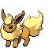
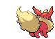
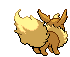

# #136 Flareon (Flame Pokémon)

| Official Artwork | Shiny Artwork |
|------------------|---------------|
|  |  |

Inhaled air is heated in the flame sac in its body to an intense fire over 3,000 degrees Fahrenheit.

---

## Media

### Default Sprites

| Front | Shiny | Back | Shiny |
|-------|-------|------|-------|
|  |  |  |  |

### Cries

Latest (Gen VI+):

<audio controls>
<source src='../../assets/cries/flareon/latest.ogg' type='audio/ogg'>
  Your browser does not support the audio element.
</audio>

Legacy:

<audio controls>
<source src='../../assets/cries/flareon/legacy.ogg' type='audio/ogg'>
  Your browser does not support the audio element.
</audio>

---

## Pokédex Data

| National № | Type(s) | Height | Weight | Abilities | Local № |
|------------|---------|--------|--------|-----------|---------|
| #136 | {: width="48"} | 0.9 m / 3.0 ft | 25.0 kg / 55.1 lbs | 1. Flash Fire 2. Sheer Force | N/A |

---

## Base Stats
|   | HP | Attack | Defense | Sp. Atk | Sp. Def | Speed |
|---|----|--------|---------|---------|---------|-------|
| **Base** | 110 | 130 | 65 | 60 | 65 | 95 |
| **Min** | 330 | 238 | 121 | 112 | 121 | 175 |
| **Max** | 424 | 394 | 251 | 240 | 251 | 317 |

The ranges shown above are for a level 100 Pokémon. Maximum values are based on a beneficial nature, 252 EVs, 31 IVs; minimum values are based on a hindering nature, 0 EVs, 0 IVs.

---

## Forms & Evolutions

!!! warning "WARNING"

    Information on evolutions may not be 100% accurate; differences between evolution methods across generations are not accounted for.

### Forms

Flareon has no alternate forms.

### Evolution Line

1. [Eevee](eevee.md/)
    1. Use Item: [Vaporeon](vaporeon.md/)

    2. Use Item: [Jolteon](jolteon.md/)

    3. Use Item: [Flareon](flareon.md/)

    4. Level Up: [Espeon](espeon.md/)

    5. Level Up: [Umbreon](umbreon.md/)

    6. Use Item: [Leafeon](leafeon.md/)

    7. Use Item: [Glaceon](glaceon.md/)

---

## Training

| EV Yield | Catch Rate | Base Friendship | Base Exp. | Growth Rate | Held Items |
|----------|------------|-----------------|-----------|-------------|------------|
| 2 Atk | 45 | 200 | 184 | Medium | N/A |

---

## Breeding

| Egg Groups | Egg Cycles | Gender | Dimorphic | Color | Shape |
|------------|------------|--------|-----------|-------|-------|
| 1. Ground | 35 | 87.5% Male 12.5% Female | False | Red | Quadruped |

---

## Moves

!!! warning "WARNING"

    Specific move information may be incorrect. However, the general movepool should be accurate; this includes changes made in Blaze Black and Volt White.

### Level Up Moves

| Lv. | Move | Type | Cat. | Power | Acc. | PP |
| --- | --- | --- | --- | --- | --- | --- |
| 1 | Growth | {: width="48"} | {: width="36"} | — | — | 20 |
| 1 | Helping Hand | {: width="48"} | {: width="36"} | — | — | 20 |
| 1 | Tackle | {: width="48"} | {: width="36"} | 40 | 100 | 35 |
| 1 | Tail Whip | {: width="48"} | {: width="36"} | — | 100 | 30 |
| 8 | Sand Attack | {: width="48"} | {: width="36"} | — | 100 | 15 |
| 13 | Ember | {: width="48"} | {: width="36"} | 40 | 100 | 25 |
| 18 | Quick Attack | {: width="48"} | {: width="36"} | 40 | 100 | 30 |
| 23 | Double Kick | {: width="48"} | {: width="36"} | 30 | 100 | 30 |
| 28 | Flame Wheel | {: width="48"} | {: width="36"} | 75 | 100 | 15 |
| 29 | Bite | {: width="48"} | {: width="36"} | 60 | 100 | 25 |
| 33 | Fire Spin | {: width="48"} | {: width="36"} | 35 | 85 | 15 |
| 38 | Fire Fang | {: width="48"} | {: width="36"} | 75 | 95 | 15 |
| 43 | Superpower | {: width="48"} | {: width="36"} | 120 | 100 | 5 |
| 48 | Last Resort | {: width="48"} | {: width="36"} | 140 | 100 | 5 |
| 53 | Smog | {: width="48"} | {: width="36"} | 30 | 70 | 20 |
| 58 | Scary Face | {: width="48"} | {: width="36"} | — | 100 | 10 |
| 63 | Fire Blast | {: width="48"} | {: width="36"} | 110 | 85 | 5 |
| 68 | Lava Plume | {: width="48"} | {: width="36"} | 80 | 100 | 15 |
| 73 | Flare Blitz | {: width="48"} | {: width="36"} | 120 | 100 | 15 |

### TM Moves

| TM | Move | Type | Cat. | Power | Acc. | PP |
| --- | --- | --- | --- | --- | --- | --- |
| HM04 | Strength | {: width="48"} | {: width="36"} | 100 | 100 | 15 |
| TM05 | Roar | {: width="48"} | {: width="36"} | — | — | 20 |
| TM06 | Toxic | {: width="48"} | {: width="36"} | — | 90 | 10 |
| TM10 | Hidden Power | {: width="48"} | {: width="36"} | 60 | 100 | 15 |
| TM11 | Sunny Day | {: width="48"} | {: width="36"} | — | — | 5 |
| TM15 | Hyper Beam | {: width="48"} | {: width="36"} | 150 | 90 | 5 |
| TM17 | Protect | {: width="48"} | {: width="36"} | — | — | 10 |
| TM18 | Rain Dance | {: width="48"} | {: width="36"} | — | — | 5 |
| TM21 | Frustration | {: width="48"} | {: width="36"} | — | 100 | 20 |
| TM27 | Return | {: width="48"} | {: width="36"} | — | 100 | 20 |
| TM28 | Dig | {: width="48"} | {: width="36"} | 100 | 100 | 10 |
| TM30 | Shadow Ball | {: width="48"} | {: width="36"} | 90 | 100 | 15 |
| TM32 | Double Team | {: width="48"} | {: width="36"} | — | — | 15 |
| TM35 | Flamethrower | {: width="48"} | {: width="36"} | 90 | 100 | 15 |
| TM38 | Fire Blast | {: width="48"} | {: width="36"} | 110 | 85 | 5 |
| TM42 | Facade | {: width="48"} | {: width="36"} | 70 | 100 | 20 |
| TM43 | Flame Charge | {: width="48"} | {: width="36"} | 50 | 100 | 20 |
| TM44 | Rest | {: width="48"} | {: width="36"} | — | — | 5 |
| TM45 | Attract | {: width="48"} | {: width="36"} | — | 100 | 15 |
| TM48 | Round | {: width="48"} | {: width="36"} | 60 | 100 | 15 |
| TM49 | Echoed Voice | {: width="48"} | {: width="36"} | 40 | 100 | 15 |
| TM50 | Overheat | {: width="48"} | {: width="36"} | 130 | 90 | 5 |
| TM59 | Incinerate | {: width="48"} | {: width="36"} | 50 | 100 | 15 |
| TM61 | Will O Wisp | {: width="48"} | {: width="36"} | — | 85 | 15 |
| TM67 | Retaliate | {: width="48"} | {: width="36"} | 70 | 100 | 5 |
| TM68 | Giga Impact | {: width="48"} | {: width="36"} | 150 | 90 | 5 |
| TM71 | Stone Edge | {: width="48"} | {: width="36"} | 100 | 80 | 5 |
| TM80 | Rock Slide | {: width="48"} | {: width="36"} | 75 | 90 | 10 |
| TM83 | Work Up | {: width="48"} | {: width="36"} | — | — | 30 |
| TM86 | Grass Knot | {: width="48"} | {: width="36"} | — | 100 | 20 |
| TM87 | Swagger | {: width="48"} | {: width="36"} | — | 85 | 15 |
| TM90 | Substitute | {: width="48"} | {: width="36"} | — | — | 10 |
| TM93 | Wild Charge | {: width="48"} | {: width="36"} | 90 | 100 | 15 |
| TM94 | Rock Smash | {: width="48"} | {: width="36"} | 60 | 100 | 15 |

### Egg Moves

Flareon cannot learn any moves by breeding.
### Tutor Moves

Flareon cannot learn any moves from tutors.
