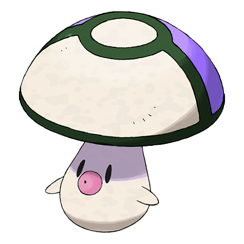
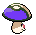

# #590 Foongus (Mushroom Pokémon)

| Official Artwork | Shiny Artwork |
| --- | --- |
|  |  |

**Blaze Black:** It lures people in with its Poké Ball pattern, then releases poison spores. Why it resembles a Poké Ball is unknown.

**Volt White:** For some reason, this Pokémon resembles a Poké Ball. They release poison spores to repel those who try to catch them.

---

## Media

### Default Sprites

| Front | Back | Front Shiny | Back Shiny |
| --- | --- | --- | --- |
|  |  |  |  |

### Cries

Latest (Gen VI+):

<audio controls>
<source src='../../assets/cries/foongus/latest.ogg' type='audio/ogg'>
  Your browser does not support the audio element.
</audio>

Legacy:

<audio controls>
<source src='../../assets/cries/foongus/legacy.ogg' type='audio/ogg'>
  Your browser does not support the audio element.
</audio>

---

## Pokédex Data

| National № | Type(s) | Height | Weight | Abilities | Local № |
|------------|---------|--------|--------|-----------|---------|
| #590 | {: width="48"} {: width="48"} | 0.2 m / 0.7 ft | 1.0 kg / 2.2 lbs |  | 1. Effect Spore 2. Regenerator | #96 |

---

## Base Stats
|   | HP | Attack | Defense | Sp. Atk | Sp. Def | Speed |
|---|----|--------|---------|---------|---------|-------|
| **Base** | 69 | 55 | 45 | 55 | 55 | 15 |
| **Min** | 248 | 103 | 85 | 103 | 103 | 31 |
| **Max** | 342 | 229 | 207 | 229 | 229 | 141 |

The ranges shown above are for a level 100 Pokémon. Maximum values are based on a beneficial nature, 252 EVs, 31 IVs; minimum values are based on a hindering nature, 0 EVs, 0 IVs.

---

## Forms & Evolutions

!!! warning "WARNING"

    Information on evolutions may not be 100% accurate; differences between evolution methods across generations are not accounted for.

### Forms

Foongus has no alternate forms.

### Evolution Line

1. [Foongus](foongus.md/)
    1. Level Up: [Amoonguss](amoonguss.md/)

---

## Training

| EV Yield | Catch Rate | Base Friendship | Base Exp. | Growth Rate | Held Items |
|----------|------------|-----------------|-----------|-------------|------------|
| 1 HP | 190 | 50 | 59 | Medium | Tiny Mushroom (50%) Big Mushroom (5%) Balm Mushroom (1%) |

---

## Breeding

| Egg Groups | Egg Cycles | Gender | Dimorphic | Color | Shape |
|------------|------------|--------|-----------|-------|-------|
| 1. Plant | 20 | 50.0% Male 50.0% Female | False | White | Arms |

---

## Moves

!!! warning "WARNING"

    Specific move information may be incorrect. However, the general movepool should be accurate; this includes changes made in Blaze Black and Volt White.

### Level Up Moves

| Lv. | Move | Type | Cat. | Power | Acc. | PP |
| --- | --- | --- | --- | --- | --- | --- |
| 1 | Absorb | {: width="48"} | {: width="36"} | 50 | 100 | 25 |
| 6 | Growth | {: width="48"} | {: width="36"} | — | — | 20 |
| 8 | Astonish | {: width="48"} | {: width="36"} | 30 | 100 | 15 |
| 12 | Bide | {: width="48"} | {: width="36"} | — | — | 10 |
| 15 | Mega Drain | {: width="48"} | {: width="36"} | 50 | 100 | 15 |
| 18 | Ingrain | {: width="48"} | {: width="36"} | — | — | 20 |
| 20 | Feint Attack | {: width="48"} | {: width="36"} | 60 | — | 20 |
| 22 | Poison Powder | {: width="48"} | {: width="36"} | — | 75 | 35 |
| 22 | Stun Spore | {: width="48"} | {: width="36"} | — | 75 | 30 |
| 24 | Sweet Scent | {: width="48"} | {: width="36"} | — | 100 | 20 |
| 26 | Defense Curl | {: width="48"} | {: width="36"} | — | — | 40 |
| 26 | Rollout | {: width="48"} | {: width="36"} | 30 | 90 | 20 |
| 28 | Giga Drain | {: width="48"} | {: width="36"} | 75 | 100 | 10 |
| 30 | Body Slam | {: width="48"} | {: width="36"} | 85 | 100 | 15 |
| 32 | Toxic | {: width="48"} | {: width="36"} | — | 90 | 10 |
| 35 | Synthesis | {: width="48"} | {: width="36"} | — | — | 5 |
| 39 | Clear Smog | {: width="48"} | {: width="36"} | 50 | — | 15 |
| 43 | Solar Beam | {: width="48"} | {: width="36"} | 120 | 100 | 10 |
| 45 | Rage Powder | {: width="48"} | {: width="36"} | — | — | 20 |
| 50 | Spore | {: width="48"} | {: width="36"} | — | 100 | 15 |

### TM Moves

| TM | Move | Type | Cat. | Power | Acc. | PP |
| --- | --- | --- | --- | --- | --- | --- |
| TM06 | Toxic | {: width="48"} | {: width="36"} | — | 90 | 10 |
| TM09 | Venoshock | {: width="48"} | {: width="36"} | 65 | 100 | 10 |
| TM10 | Hidden Power | {: width="48"} | {: width="36"} | 60 | 100 | 15 |
| TM11 | Sunny Day | {: width="48"} | {: width="36"} | — | — | 5 |
| TM17 | Protect | {: width="48"} | {: width="36"} | — | — | 10 |
| TM18 | Rain Dance | {: width="48"} | {: width="36"} | — | — | 5 |
| TM21 | Frustration | {: width="48"} | {: width="36"} | — | 100 | 20 |
| TM22 | Solar Beam | {: width="48"} | {: width="36"} | 120 | 100 | 10 |
| TM27 | Return | {: width="48"} | {: width="36"} | — | 100 | 20 |
| TM32 | Double Team | {: width="48"} | {: width="36"} | — | — | 15 |
| TM36 | Sludge Bomb | {: width="48"} | {: width="36"} | 90 | 100 | 10 |
| TM42 | Facade | {: width="48"} | {: width="36"} | 70 | 100 | 20 |
| TM44 | Rest | {: width="48"} | {: width="36"} | — | — | 5 |
| TM45 | Attract | {: width="48"} | {: width="36"} | — | 100 | 15 |
| TM48 | Round | {: width="48"} | {: width="36"} | 60 | 100 | 15 |
| TM53 | Energy Ball | {: width="48"} | {: width="36"} | 90 | 100 | 10 |
| TM66 | Payback | {: width="48"} | {: width="36"} | 50 | 100 | 10 |
| TM70 | Flash | {: width="48"} | {: width="36"} | — | 100 | 20 |
| TM86 | Grass Knot | {: width="48"} | {: width="36"} | — | 100 | 20 |
| TM87 | Swagger | {: width="48"} | {: width="36"} | — | 85 | 15 |
| TM90 | Substitute | {: width="48"} | {: width="36"} | — | — | 10 |

### Egg Moves

| Move | Type | Cat. | Power | Acc. | PP |
| --- | --- | --- | --- | --- | --- |
| Body Slam | {: width="48"} | {: width="36"} | 85 | 100 | 15 |
| Growth | {: width="48"} | {: width="36"} | — | — | 20 |
| Poison Powder | {: width="48"} | {: width="36"} | — | 75 | 35 |
| Stun Spore | {: width="48"} | {: width="36"} | — | 75 | 30 |
| Defense Curl | {: width="48"} | {: width="36"} | — | — | 40 |
| Endure | {: width="48"} | {: width="36"} | — | — | 10 |
| Rollout | {: width="48"} | {: width="36"} | 30 | 90 | 20 |
| Gastro Acid | {: width="48"} | {: width="36"} | — | 100 | 10 |

### Tutor Moves

Foongus cannot learn any moves from tutors.
