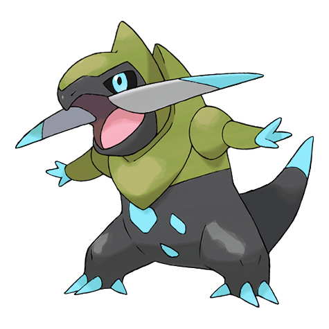
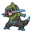
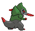
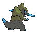

# #611 Fraxure (Axe Jaw Pokémon)

| Official Artwork | Shiny Artwork |
|------------------|---------------|
|  |  |

**Blaze Black:** Since a broken tusk will not grow back, they diligently sharpen their tusks on river rocks after they’ve been fighting.

**Volt White:** Their tusks can shatter rocks. Territory battles between Fraxure can be intensely violent.

---

## Media

### Default Sprites

| Front | Shiny | Back | Shiny |
|-------|-------|------|-------|
|  |  |  |  |

### Cries

Latest (Gen VI+):

<audio controls>
<source src='../../assets/cries/fraxure/latest.ogg' type='audio/ogg'>
  Your browser does not support the audio element.
</audio>

Legacy:

<audio controls>
<source src='../../assets/cries/fraxure/legacy.ogg' type='audio/ogg'>
  Your browser does not support the audio element.
</audio>

---

## Pokédex Data

| National № | Type(s) | Height | Weight | Abilities | Local № |
|------------|---------|--------|--------|-----------|---------|
| #611 | {: width="48"} | 1.0 m / 3.3 ft | 36.0 kg / 79.4 lbs | 1. Rivalry 2. Mold Breaker | N/A |

---

## Base Stats
|   | HP | Attack | Defense | Sp. Atk | Sp. Def | Speed |
|---|----|--------|---------|---------|---------|-------|
| **Base** | 66 | 117 | 70 | 40 | 50 | 67 |
| **Min** | 242 | 215 | 130 | 76 | 94 | 125 |
| **Max** | 336 | 366 | 262 | 196 | 218 | 256 |

The ranges shown above are for a level 100 Pokémon. Maximum values are based on a beneficial nature, 252 EVs, 31 IVs; minimum values are based on a hindering nature, 0 EVs, 0 IVs.

---

## Forms & Evolutions

!!! warning "WARNING"

    Information on evolutions may not be 100% accurate; differences between evolution methods across generations are not accounted for.

### Forms

Fraxure has no alternate forms.

### Evolution Line

1. [Axew](axew.md/)
    1. Level Up: [Fraxure](fraxure.md/)
        1. Level Up: [Haxorus](haxorus.md/)

---

## Training

| EV Yield | Catch Rate | Base Friendship | Base Exp. | Growth Rate | Held Items |
|----------|------------|-----------------|-----------|-------------|------------|
| 2 Atk | 60 | 35 | 144 | Slow | N/A |

---

## Breeding

| Egg Groups | Egg Cycles | Gender | Dimorphic | Color | Shape |
|------------|------------|--------|-----------|-------|-------|
| 1. Monster 2. Dragon | 40 | 50.0% Male 50.0% Female | False | Green | Upright |

---

## Moves

!!! warning "WARNING"

    Specific move information may be incorrect. However, the general movepool should be accurate; this includes changes made in Blaze Black and Volt White.

### Level Up Moves

| Lv. | Move | Type | Cat. | Power | Acc. | PP |
| --- | --- | --- | --- | --- | --- | --- |
| 1 | Assurance | {: width="48"} | {: width="36"} | 60 | 100 | 10 |
| 1 | Dragon Rage | {: width="48"} | {: width="36"} | — | 100 | 10 |
| 1 | Leer | {: width="48"} | {: width="36"} | — | 100 | 30 |
| 1 | Scratch | {: width="48"} | {: width="36"} | 40 | 100 | 35 |
| 4 | Leer | {: width="48"} | {: width="36"} | — | 100 | 30 |
| 7 | Assurance | {: width="48"} | {: width="36"} | 60 | 100 | 10 |
| 10 | Dragon Rage | {: width="48"} | {: width="36"} | — | 100 | 10 |
| 13 | Dual Chop | {: width="48"} | {: width="36"} | 40 | 90 | 15 |
| 16 | Scary Face | {: width="48"} | {: width="36"} | — | 100 | 10 |
| 20 | Slash | {: width="48"} | {: width="36"} | 70 | 100 | 20 |
| 24 | False Swipe | {: width="48"} | {: width="36"} | 40 | 100 | 40 |
| 28 | Dragon Claw | {: width="48"} | {: width="36"} | 80 | 100 | 15 |
| 32 | Dragon Dance | {: width="48"} | {: width="36"} | — | — | 20 |
| 36 | Taunt | {: width="48"} | {: width="36"} | — | 100 | 20 |
| 42 | Dragon Pulse | {: width="48"} | {: width="36"} | 85 | 100 | 10 |
| 48 | Swords Dance | {: width="48"} | {: width="36"} | — | — | 20 |
| 54 | Guillotine | {: width="48"} | {: width="36"} | — | 30 | 5 |
| 60 | Outrage | {: width="48"} | {: width="36"} | 120 | 100 | 10 |
| 66 | Giga Impact | {: width="48"} | {: width="36"} | 150 | 90 | 5 |

### TM Moves

| TM | Move | Type | Cat. | Power | Acc. | PP |
| --- | --- | --- | --- | --- | --- | --- |
| HM01 | Cut | {: width="48"} | {: width="36"} | 60 | 100% | 25 |
| HM04 | Strength | {: width="48"} | {: width="36"} | 100 | 100 | 15 |
| TM01 | Hone Claws | {: width="48"} | {: width="36"} | — | — | 15 |
| TM02 | Dragon Claw | {: width="48"} | {: width="36"} | 80 | 100 | 15 |
| TM05 | Roar | {: width="48"} | {: width="36"} | — | — | 20 |
| TM06 | Toxic | {: width="48"} | {: width="36"} | — | 90 | 10 |
| TM10 | Hidden Power | {: width="48"} | {: width="36"} | 60 | 100 | 15 |
| TM11 | Sunny Day | {: width="48"} | {: width="36"} | — | — | 5 |
| TM12 | Taunt | {: width="48"} | {: width="36"} | — | 100 | 20 |
| TM17 | Protect | {: width="48"} | {: width="36"} | — | — | 10 |
| TM18 | Rain Dance | {: width="48"} | {: width="36"} | — | — | 5 |
| TM21 | Frustration | {: width="48"} | {: width="36"} | — | 100 | 20 |
| TM27 | Return | {: width="48"} | {: width="36"} | — | 100 | 20 |
| TM28 | Dig | {: width="48"} | {: width="36"} | 100 | 100 | 10 |
| TM32 | Double Team | {: width="48"} | {: width="36"} | — | — | 15 |
| TM39 | Rock Tomb | {: width="48"} | {: width="36"} | 60 | 95 | 15 |
| TM40 | Aerial Ace | {: width="48"} | {: width="36"} | 60 | — | 20 |
| TM42 | Facade | {: width="48"} | {: width="36"} | 70 | 100 | 20 |
| TM44 | Rest | {: width="48"} | {: width="36"} | — | — | 5 |
| TM45 | Attract | {: width="48"} | {: width="36"} | — | 100 | 15 |
| TM48 | Round | {: width="48"} | {: width="36"} | 60 | 100 | 15 |
| TM54 | False Swipe | {: width="48"} | {: width="36"} | 40 | 100 | 40 |
| TM56 | Fling | {: width="48"} | {: width="36"} | — | 100 | 10 |
| TM59 | Incinerate | {: width="48"} | {: width="36"} | 50 | 100 | 15 |
| TM65 | Shadow Claw | {: width="48"} | {: width="36"} | 80 | 100 | 15 |
| TM66 | Payback | {: width="48"} | {: width="36"} | 50 | 100 | 10 |
| TM68 | Giga Impact | {: width="48"} | {: width="36"} | 150 | 90 | 5 |
| TM75 | Swords Dance | {: width="48"} | {: width="36"} | — | — | 20 |
| TM81 | X Scissor | {: width="48"} | {: width="36"} | 80 | 100 | 15 |
| TM82 | Dragon Tail | {: width="48"} | {: width="36"} | 60 | 90 | 10 |
| TM84 | Poison Jab | {: width="48"} | {: width="36"} | 80 | 100 | 20 |
| TM87 | Swagger | {: width="48"} | {: width="36"} | — | 85 | 15 |
| TM90 | Substitute | {: width="48"} | {: width="36"} | — | — | 10 |
| TM94 | Rock Smash | {: width="48"} | {: width="36"} | 60 | 100 | 15 |

### Egg Moves

Fraxure cannot learn any moves by breeding.
### Tutor Moves

| Move | Type | Cat. | Power | Acc. | PP |
| --- | --- | --- | --- | --- | --- |
| Draco Meteor | {: width="48"} | {: width="36"} | 130 | 90 | 5 |

