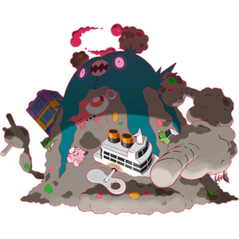

# #10207 Garbodor Gmax (Trash Heap Pokémon)

| Official Artwork | Shiny Artwork |
| --- | --- |
|  |  |

**Blaze Black:** It clenches opponents with its left arm and finishes them off with foul-smelling poison gas belched from its mouth.

**Volt White:** They absorb garbage and make it part of their bodies. They shoot a poisonous liquid from their right-hand fingertips.

---

## Media

### Sprites

| Front | Back | Front Shiny | Back Shiny |
| --- | --- | --- | --- |
|  |  |  |  |

### Cries

Latest (Gen VI+):

<audio controls>
  <source src='../assets/cries/garbodor-gmax/latest.ogg' type='audio/ogg'>
  Your browser does not support the audio element.
</audio>

---

## Pokédex Data

| National № | Type(s) | Height | Weight | Abilities | Local № |
|------------|---------|--------|--------|-----------|---------|
| #10207 | {: width='48'} | 21.0 m | 1000.0 kg | 1. Stench 2. Weak-Armor 3. Aftermath | #75 |

---

## Base Stats
---

## Base Stats
|   | HP | Attack | Defense | Sp. Atk | Sp. Def | Speed |
|---|----|--------|---------|---------|---------|-------|
| **Base** | 80 | 95 | 82 | 60 | 82 | 75 |
| **Min** | 270 | 175 | 152 | 112 | 152 | 139 |
| **Max** | 364 | 317 | 289 | 240 | 289 | 273 |

The ranges shown above are for a level 100 Pokémon. Maximum values are based on a beneficial nature, 252 EVs, 31 IVs; minimum values are based on a hindering nature, 0 EVs, 0 IVs.

---

## Forms & Evolutions

!!! warning "WARNING"

    Some forms may not be available in Blaze Black/Volt White. Also information on evolutions may not be 100% accurate; it is currently quite complex to track generational evolution data.

### Forms

1. [Garbodor](garbodor.md/)
2. [Garbodor-Gmax](garbodor-gmax.md/)

### Evolution Line

1. [Trubbish](trubbish.md/)
1. Level Up: [Garbodor](garbodor.md/)

---

## Training

| EV Yield | Catch Rate | Base Friendship | Base Exp. | Growth Rate | Held Items |
|----------|------------|-----------------|-----------|-------------|------------|
| 2 Attack | 60 | 50 | 166 | Medium | N/A |

---

## Breeding

| Egg Groups | Egg Cycles | Gender | Dimorphic | Color | Shape |
|------------|------------|--------|-----------|-------|-------|
| 1. Mineral | 20 | 50.0% Male 50.0% Female | False | Green | Humanoid |

---

## Moves

!!! warning "WARNING"

    Specific move information may be incorrect. However, the general movepool should be accurate (including changes to learnset).

### Level Up Moves

Garbodor Gmax cannot learn any moves by leveling up.
### TM Moves

Garbodor Gmax cannot learn any TM moves.
### Egg Moves

Garbodor Gmax cannot learn any moves by breeding.
### Tutor Moves

Garbodor Gmax cannot learn any moves from tutors.
