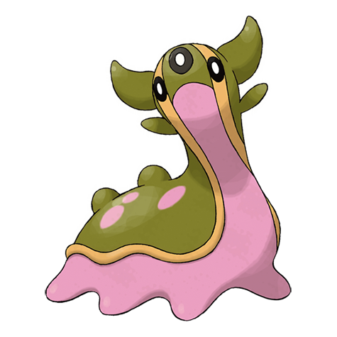
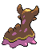
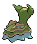

# #423 Gastrodon (Sea Slug Pokémon)

| Official Artwork | Shiny Artwork |
|------------------|---------------|
|  |  |

Long ago, its entire back was shielded with a sturdy shell. There are traces of it left in its cells.

---

## Media

### Default Sprites

| Front | Shiny | Back | Shiny |
|-------|-------|------|-------|
|  |  |  |  |

### Gastrodon East Sprites

| Front | Shiny | Back | Shiny |
|-------|-------|------|-------|
|  |  |  |  |

### Cries

Latest (Gen VI+):

<audio controls>
<source src='../../assets/cries/gastrodon/latest.ogg' type='audio/ogg'>
  Your browser does not support the audio element.
</audio>

Legacy:

<audio controls>
<source src='../../assets/cries/gastrodon/legacy.ogg' type='audio/ogg'>
  Your browser does not support the audio element.
</audio>

---

## Pokédex Data

| National № | Type(s) | Height | Weight | Abilities | Local № |
|------------|---------|--------|--------|-----------|---------|
| #423 | {: width="48"} {: width="48"} | 0.9 m / 3.0 ft | 29.9 kg / 65.9 lbs | 1. Sticky Hold 2. Storm Drain | #61 |

---

## Base Stats
|   | HP | Attack | Defense | Sp. Atk | Sp. Def | Speed |
|---|----|--------|---------|---------|---------|-------|
| **Base** | 111 | 83 | 68 | 92 | 82 | 39 |
| **Min** | 332 | 153 | 126 | 170 | 152 | 74 |
| **Max** | 426 | 291 | 258 | 311 | 289 | 194 |

The ranges shown above are for a level 100 Pokémon. Maximum values are based on a beneficial nature, 252 EVs, 31 IVs; minimum values are based on a hindering nature, 0 EVs, 0 IVs.

---

## Forms & Evolutions

!!! warning "WARNING"

    Information on evolutions may not be 100% accurate; differences between evolution methods across generations are not accounted for.

### Forms

Gastrodon has no alternate forms.

### Evolution Line

1. [Shellos](shellos.md/)
    1. Level Up: [Gastrodon](gastrodon.md/)

---

## Training

| EV Yield | Catch Rate | Base Friendship | Base Exp. | Growth Rate | Held Items |
|----------|------------|-----------------|-----------|-------------|------------|
| 2 HP | 75 | 50 | 166 | Medium | N/A |

---

## Breeding

| Egg Groups | Egg Cycles | Gender | Dimorphic | Color | Shape |
|------------|------------|--------|-----------|-------|-------|
| 1. Water1 2. Indeterminate | 20 | 50.0% Male 50.0% Female | False | Purple | Squiggle |

---

## Moves

!!! warning "WARNING"

    Specific move information may be incorrect. However, the general movepool should be accurate; this includes changes made in Blaze Black and Volt White.

### Level Up Moves

| Lv. | Move | Type | Cat. | Power | Acc. | PP |
| --- | --- | --- | --- | --- | --- | --- |
| 1 | Counter | {: width="48"} | {: width="36"} | — | 100 | 20 |
| 1 | Harden | {: width="48"} | {: width="36"} | — | — | 30 |
| 1 | Mirror Coat | {: width="48"} | {: width="36"} | — | 100 | 20 |
| 1 | Mud Slap | {: width="48"} | {: width="36"} | 20 | 100 | 10 |
| 1 | Mud Sport | {: width="48"} | {: width="36"} | — | — | 15 |
| 1 | Water Pulse | {: width="48"} | {: width="36"} | 60 | 100 | 20 |
| 2 | Mud Sport | {: width="48"} | {: width="36"} | — | — | 15 |
| 4 | Harden | {: width="48"} | {: width="36"} | — | — | 30 |
| 7 | Water Pulse | {: width="48"} | {: width="36"} | 60 | 100 | 20 |
| 11 | Mud Bomb | {: width="48"} | {: width="36"} | 65 | 85 | 10 |
| 16 | Hidden Power | {: width="48"} | {: width="36"} | 60 | 100 | 15 |
| 19 | Scald | {: width="48"} | {: width="36"} | 80 | 100 | 15 |
| 22 | Rain Dance | {: width="48"} | {: width="36"} | — | — | 5 |
| 29 | Body Slam | {: width="48"} | {: width="36"} | 85 | 100 | 15 |
| 41 | Muddy Water | {: width="48"} | {: width="36"} | 90 | 85 | 10 |
| 47 | Earth Power | {: width="48"} | {: width="36"} | 90 | 100 | 10 |
| 54 | Recover | {: width="48"} | {: width="36"} | — | — | 5 |

### TM Moves

| TM | Move | Type | Cat. | Power | Acc. | PP |
| --- | --- | --- | --- | --- | --- | --- |
| HM03 | Surf | {: width="48"} | {: width="36"} | 90 | 100 | 15 |
| HM04 | Strength | {: width="48"} | {: width="36"} | 100 | 100 | 15 |
| HM05 | Waterfall | {: width="48"} | {: width="36"} | 85 | 100 | 15 |
| HM06 | Dive | {: width="48"} | {: width="36"} | 80 | 100 | 10 |
| TM06 | Toxic | {: width="48"} | {: width="36"} | — | 90 | 10 |
| TM07 | Hail | {: width="48"} | {: width="36"} | — | — | 10 |
| TM10 | Hidden Power | {: width="48"} | {: width="36"} | 60 | 100 | 15 |
| TM13 | Ice Beam | {: width="48"} | {: width="36"} | 90 | 100 | 10 |
| TM14 | Blizzard | {: width="48"} | {: width="36"} | 110 | 70 | 5 |
| TM15 | Hyper Beam | {: width="48"} | {: width="36"} | 150 | 90 | 5 |
| TM17 | Protect | {: width="48"} | {: width="36"} | — | — | 10 |
| TM18 | Rain Dance | {: width="48"} | {: width="36"} | — | — | 5 |
| TM21 | Frustration | {: width="48"} | {: width="36"} | — | 100 | 20 |
| TM26 | Earthquake | {: width="48"} | {: width="36"} | 100 | 100 | 10 |
| TM27 | Return | {: width="48"} | {: width="36"} | — | 100 | 20 |
| TM28 | Dig | {: width="48"} | {: width="36"} | 100 | 100 | 10 |
| TM32 | Double Team | {: width="48"} | {: width="36"} | — | — | 15 |
| TM34 | Sludge Wave | {: width="48"} | {: width="36"} | 95 | 100 | 10 |
| TM36 | Sludge Bomb | {: width="48"} | {: width="36"} | 90 | 100 | 10 |
| TM37 | Sandstorm | {: width="48"} | {: width="36"} | — | — | 10 |
| TM39 | Rock Tomb | {: width="48"} | {: width="36"} | 60 | 95 | 15 |
| TM42 | Facade | {: width="48"} | {: width="36"} | 70 | 100 | 20 |
| TM44 | Rest | {: width="48"} | {: width="36"} | — | — | 5 |
| TM45 | Attract | {: width="48"} | {: width="36"} | — | 100 | 15 |
| TM48 | Round | {: width="48"} | {: width="36"} | 60 | 100 | 15 |
| TM55 | Scald | {: width="48"} | {: width="36"} | 80 | 100 | 15 |
| TM68 | Giga Impact | {: width="48"} | {: width="36"} | 150 | 90 | 5 |
| TM70 | Flash | {: width="48"} | {: width="36"} | — | 100 | 20 |
| TM71 | Stone Edge | {: width="48"} | {: width="36"} | 100 | 80 | 5 |
| TM78 | Bulldoze | {: width="48"} | {: width="36"} | 80 | 100 | 20 |
| TM80 | Rock Slide | {: width="48"} | {: width="36"} | 75 | 90 | 10 |
| TM87 | Swagger | {: width="48"} | {: width="36"} | — | 85 | 15 |
| TM90 | Substitute | {: width="48"} | {: width="36"} | — | — | 10 |
| TM94 | Rock Smash | {: width="48"} | {: width="36"} | 60 | 100 | 15 |

### Egg Moves

Gastrodon cannot learn any moves by breeding.
### Tutor Moves

Gastrodon cannot learn any moves from tutors.
