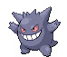
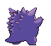
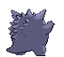

# #094 Gengar (Shadow Pokémon)

| Official Artwork | Shiny Artwork |
|------------------|---------------|
|  |  |

The leer that floats in darkness belongs to a Gengar delighting in casting curses on people.

---

## Media

### Default Sprites

| Front | Shiny | Back | Shiny |
|-------|-------|------|-------|
|  |  |  |  |

### Cries

Latest (Gen VI+):

<audio controls>
<source src='../../assets/cries/gengar/latest.ogg' type='audio/ogg'>
  Your browser does not support the audio element.
</audio>

Legacy:

<audio controls>
<source src='../../assets/cries/gengar/legacy.ogg' type='audio/ogg'>
  Your browser does not support the audio element.
</audio>

---

## Pokédex Data

| National № | Type(s) | Height | Weight | Abilities | Local № |
|------------|---------|--------|--------|-----------|---------|
| #94 | {: width="48"} {: width="48"} | 1.5 m / 4.9 ft | 40.5 kg / 89.3 lbs | 1. Levitate | #71 |

---

## Base Stats
|   | HP | Attack | Defense | Sp. Atk | Sp. Def | Speed |
|---|----|--------|---------|---------|---------|-------|
| **Base** | 60 | 65 | 60 | 130 | 75 | 110 |
| **Min** | 230 | 121 | 112 | 238 | 139 | 202 |
| **Max** | 324 | 251 | 240 | 394 | 273 | 350 |

The ranges shown above are for a level 100 Pokémon. Maximum values are based on a beneficial nature, 252 EVs, 31 IVs; minimum values are based on a hindering nature, 0 EVs, 0 IVs.

---

## Forms & Evolutions

!!! warning "WARNING"

    Information on evolutions may not be 100% accurate; differences between evolution methods across generations are not accounted for.

### Forms

Gengar has no alternate forms.

### Evolution Line

1. [Gastly](gastly.md/)
    1. Level Up: [Haunter](haunter.md/)
        1. Trade: [Gengar](gengar.md/)

---

## Training

| EV Yield | Catch Rate | Base Friendship | Base Exp. | Growth Rate | Held Items |
|----------|------------|-----------------|-----------|-------------|------------|
| 3 Sp. Atk | 45 | 50 | 250 | Medium Slo |

---

## Breeding

| Egg Groups | Egg Cycles | Gender | Dimorphic | Color | Shape |
|------------|------------|--------|-----------|-------|-------|
| 1. Indeterminate | 20 | 50.0% Male 50.0% Female | False | Purple | Upright |

---

## Moves

!!! warning "WARNING"

    Specific move information may be incorrect. However, the general movepool should be accurate; this includes changes made in Blaze Black and Volt White.

### Level Up Moves

| Lv. | Move | Type | Cat. | Power | Acc. | PP |
| --- | --- | --- | --- | --- | --- | --- |
| 1 | Hypnosis | {: width="48"} | {: width="36"} | — | 60 | 20 |
| 1 | Lick | {: width="48"} | {: width="36"} | 30 | 100 | 30 |
| 1 | Metronome | {: width="48"} | {: width="36"} | — | — | 10 |
| 1 | Spite | {: width="48"} | {: width="36"} | — | 100 | 10 |
| 5 | Spite | {: width="48"} | {: width="36"} | — | 100 | 10 |
| 8 | Mean Look | {: width="48"} | {: width="36"} | — | — | 5 |
| 12 | Curse | {: width="48"} | {: width="36"} | — | — | 10 |
| 15 | Night Shade | {: width="48"} | {: width="36"} | — | 100 | 15 |
| 17 | Ominous Wind | {: width="48"} | {: width="36"} | 60 | 100 | 5 |
| 19 | Confuse Ray | {: width="48"} | {: width="36"} | — | 100 | 10 |
| 22 | Sucker Punch | {: width="48"} | {: width="36"} | 70 | 100 | 5 |
| 24 | Clear Smog | {: width="48"} | {: width="36"} | 50 | — | 15 |
| 25 | Shadow Punch | {: width="48"} | {: width="36"} | 70 | — | 15 |
| 28 | Payback | {: width="48"} | {: width="36"} | 50 | 100 | 10 |
| 33 | Shadow Ball | {: width="48"} | {: width="36"} | 90 | 100 | 15 |
| 36 | Icy Wind | {: width="48"} | {: width="36"} | 55 | 95 | 15 |
| 39 | Dream Eater | {: width="48"} | {: width="36"} | 100 | 100 | 15 |
| 44 | Dark Pulse | {: width="48"} | {: width="36"} | 90 | 100 | 15 |
| 50 | Destiny Bond | {: width="48"} | {: width="36"} | — | — | 5 |
| 55 | Hex | {: width="48"} | {: width="36"} | 65 | 100 | 10 |
| 61 | Nightmare | {: width="48"} | {: width="36"} | — | 100 | 15 |
| 68 | Aura Sphere | {: width="48"} | {: width="36"} | 80 | — | 20 |

### TM Moves

| TM | Move | Type | Cat. | Power | Acc. | PP |
| --- | --- | --- | --- | --- | --- | --- |
| HM04 | Strength | {: width="48"} | {: width="36"} | 100 | 100 | 15 |
| TM06 | Toxic | {: width="48"} | {: width="36"} | — | 90 | 10 |
| TM09 | Venoshock | {: width="48"} | {: width="36"} | 65 | 100 | 10 |
| TM10 | Hidden Power | {: width="48"} | {: width="36"} | 60 | 100 | 15 |
| TM11 | Sunny Day | {: width="48"} | {: width="36"} | — | — | 5 |
| TM12 | Taunt | {: width="48"} | {: width="36"} | — | 100 | 20 |
| TM15 | Hyper Beam | {: width="48"} | {: width="36"} | 150 | 90 | 5 |
| TM17 | Protect | {: width="48"} | {: width="36"} | — | — | 10 |
| TM18 | Rain Dance | {: width="48"} | {: width="36"} | — | — | 5 |
| TM19 | Telekinesis | {: width="48"} | {: width="36"} | — | — | 15 |
| TM21 | Frustration | {: width="48"} | {: width="36"} | — | 100 | 20 |
| TM24 | Thunderbolt | {: width="48"} | {: width="36"} | 90 | 100 | 15 |
| TM25 | Thunder | {: width="48"} | {: width="36"} | 110 | 70 | 10 |
| TM27 | Return | {: width="48"} | {: width="36"} | — | 100 | 20 |
| TM29 | Psychic | {: width="48"} | {: width="36"} | 90 | 100 | 10 |
| TM30 | Shadow Ball | {: width="48"} | {: width="36"} | 90 | 100 | 15 |
| TM31 | Brick Break | {: width="48"} | {: width="36"} | 75 | 100 | 15 |
| TM32 | Double Team | {: width="48"} | {: width="36"} | — | — | 15 |
| TM34 | Sludge Wave | {: width="48"} | {: width="36"} | 95 | 100 | 10 |
| TM36 | Sludge Bomb | {: width="48"} | {: width="36"} | 90 | 100 | 10 |
| TM41 | Torment | {: width="48"} | {: width="36"} | — | 100 | 15 |
| TM42 | Facade | {: width="48"} | {: width="36"} | 70 | 100 | 20 |
| TM44 | Rest | {: width="48"} | {: width="36"} | — | — | 5 |
| TM45 | Attract | {: width="48"} | {: width="36"} | — | 100 | 15 |
| TM46 | Thief | {: width="48"} | {: width="36"} | 60 | 100 | 25 |
| TM48 | Round | {: width="48"} | {: width="36"} | 60 | 100 | 15 |
| TM52 | Focus Blast | {: width="48"} | {: width="36"} | 120 | 70 | 5 |
| TM53 | Energy Ball | {: width="48"} | {: width="36"} | 90 | 100 | 10 |
| TM56 | Fling | {: width="48"} | {: width="36"} | — | 100 | 10 |
| TM61 | Will O Wisp | {: width="48"} | {: width="36"} | — | 85 | 15 |
| TM63 | Embargo | {: width="48"} | {: width="36"} | — | 100 | 15 |
| TM64 | Explosion | {: width="48"} | {: width="36"} | 250 | 100 | 5 |
| TM65 | Shadow Claw | {: width="48"} | {: width="36"} | 80 | 100 | 15 |
| TM66 | Payback | {: width="48"} | {: width="36"} | 50 | 100 | 10 |
| TM68 | Giga Impact | {: width="48"} | {: width="36"} | 150 | 90 | 5 |
| TM77 | Psych Up | {: width="48"} | {: width="36"} | — | — | 10 |
| TM84 | Poison Jab | {: width="48"} | {: width="36"} | 80 | 100 | 20 |
| TM85 | Dream Eater | {: width="48"} | {: width="36"} | 100 | 100 | 15 |
| TM87 | Swagger | {: width="48"} | {: width="36"} | — | 85 | 15 |
| TM90 | Substitute | {: width="48"} | {: width="36"} | — | — | 10 |
| TM92 | Trick Room | {: width="48"} | {: width="36"} | — | — | 5 |
| TM94 | Rock Smash | {: width="48"} | {: width="36"} | 60 | 100 | 15 |

### Egg Moves

Gengar cannot learn any moves by breeding.
### Tutor Moves

Gengar cannot learn any moves from tutors.
