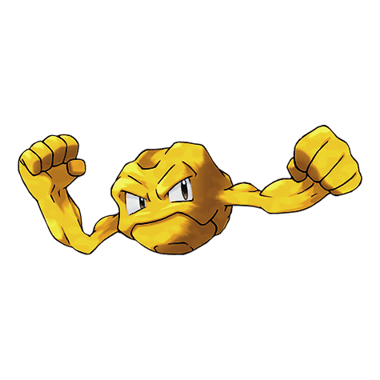
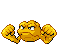
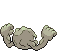
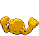

# #074 Geodude (Rock Pokémon)

| Official Artwork | Shiny Artwork |
|------------------|---------------|
|  |  |

At rest, it looks just like a rock. Carelessly stepping on it will make it swing its fists angrily.

---

## Media

### Default Sprites

| Front | Shiny | Back | Shiny |
|-------|-------|------|-------|
|  |  |  |  |

### Cries

Latest (Gen VI+):

<audio controls>
<source src='../../assets/cries/geodude/latest.ogg' type='audio/ogg'>
  Your browser does not support the audio element.
</audio>

Legacy:

<audio controls>
<source src='../../assets/cries/geodude/legacy.ogg' type='audio/ogg'>
  Your browser does not support the audio element.
</audio>

---

## Pokédex Data

| National № | Type(s) | Height | Weight | Abilities | Local № |
|------------|---------|--------|--------|-----------|---------|
| #74 | {: width="48"} {: width="48"} | 0.4 m / 1.3 ft | 20.0 kg / 44.1 lbs | 1. Rock Head 2. Sturdy | #31 |

---

## Base Stats
|   | HP | Attack | Defense | Sp. Atk | Sp. Def | Speed |
|---|----|--------|---------|---------|---------|-------|
| **Base** | 40 | 80 | 100 | 30 | 30 | 20 |
| **Min** | 190 | 148 | 184 | 58 | 58 | 40 |
| **Max** | 284 | 284 | 328 | 174 | 174 | 152 |

The ranges shown above are for a level 100 Pokémon. Maximum values are based on a beneficial nature, 252 EVs, 31 IVs; minimum values are based on a hindering nature, 0 EVs, 0 IVs.

---

## Forms & Evolutions

!!! warning "WARNING"

    Information on evolutions may not be 100% accurate; differences between evolution methods across generations are not accounted for.

### Forms

Geodude has no alternate forms.

### Evolution Line

1. [Geodude](geodude.md/)
    1. Level Up: [Graveler](graveler.md/)
        1. Trade: [Golem](golem.md/)

---

## Training

| EV Yield | Catch Rate | Base Friendship | Base Exp. | Growth Rate | Held Items |
|----------|------------|-----------------|-----------|-------------|------------|
| 1 Def | 255 | 70 | 60 | Medium Slow | Everstone (5%) |

---

## Breeding

| Egg Groups | Egg Cycles | Gender | Dimorphic | Color | Shape |
|------------|------------|--------|-----------|-------|-------|
| 1. Mineral | 15 | 50.0% Male 50.0% Female | False | Brown | Arms |

---

## Moves

!!! warning "WARNING"

    Specific move information may be incorrect. However, the general movepool should be accurate; this includes changes made in Blaze Black and Volt White.

### Level Up Moves

| Lv. | Move | Type | Cat. | Power | Acc. | PP |
| --- | --- | --- | --- | --- | --- | --- |
| 1 | Defense Curl | {: width="48"} | {: width="36"} | — | — | 40 |
| 1 | Rapid Spin | {: width="48"} | {: width="36"} | 50 | 100 | 40 |
| 1 | Tackle | {: width="48"} | {: width="36"} | 40 | 100 | 35 |
| 4 | Mud Sport | {: width="48"} | {: width="36"} | — | — | 15 |
| 8 | Rock Polish | {: width="48"} | {: width="36"} | — | — | 20 |
| 11 | Rock Throw | {: width="48"} | {: width="36"} | 50 | 90 | 15 |
| 15 | Magnitude | {: width="48"} | {: width="36"} | — | 100 | 30 |
| 18 | Rollout | {: width="48"} | {: width="36"} | 30 | 90 | 20 |
| 22 | Rock Blast | {: width="48"} | {: width="36"} | 25 | 90 | 10 |
| 25 | Smack Down | {: width="48"} | {: width="36"} | 50 | 100 | 15 |
| 29 | Self Destruct | {: width="48"} | {: width="36"} | 200 | 100 | 5 |
| 32 | Bulldoze | {: width="48"} | {: width="36"} | 80 | 100 | 20 |
| 36 | Stealth Rock | {: width="48"} | {: width="36"} | — | — | 20 |
| 39 | Earthquake | {: width="48"} | {: width="36"} | 100 | 100 | 10 |
| 43 | Explosion | {: width="48"} | {: width="36"} | 250 | 100 | 5 |
| 46 | Double Edge | {: width="48"} | {: width="36"} | 120 | 100 | 15 |
| 50 | Stone Edge | {: width="48"} | {: width="36"} | 100 | 80 | 5 |

### TM Moves

| TM | Move | Type | Cat. | Power | Acc. | PP |
| --- | --- | --- | --- | --- | --- | --- |
| HM04 | Strength | {: width="48"} | {: width="36"} | 100 | 100 | 15 |
| TM06 | Toxic | {: width="48"} | {: width="36"} | — | 90 | 10 |
| TM10 | Hidden Power | {: width="48"} | {: width="36"} | 60 | 100 | 15 |
| TM11 | Sunny Day | {: width="48"} | {: width="36"} | — | — | 5 |
| TM17 | Protect | {: width="48"} | {: width="36"} | — | — | 10 |
| TM21 | Frustration | {: width="48"} | {: width="36"} | — | 100 | 20 |
| TM23 | Smack Down | {: width="48"} | {: width="36"} | 50 | 100 | 15 |
| TM26 | Earthquake | {: width="48"} | {: width="36"} | 100 | 100 | 10 |
| TM27 | Return | {: width="48"} | {: width="36"} | — | 100 | 20 |
| TM28 | Dig | {: width="48"} | {: width="36"} | 100 | 100 | 10 |
| TM31 | Brick Break | {: width="48"} | {: width="36"} | 75 | 100 | 15 |
| TM32 | Double Team | {: width="48"} | {: width="36"} | — | — | 15 |
| TM35 | Flamethrower | {: width="48"} | {: width="36"} | 90 | 100 | 15 |
| TM37 | Sandstorm | {: width="48"} | {: width="36"} | — | — | 10 |
| TM38 | Fire Blast | {: width="48"} | {: width="36"} | 110 | 85 | 5 |
| TM39 | Rock Tomb | {: width="48"} | {: width="36"} | 60 | 95 | 15 |
| TM42 | Facade | {: width="48"} | {: width="36"} | 70 | 100 | 20 |
| TM44 | Rest | {: width="48"} | {: width="36"} | — | — | 5 |
| TM45 | Attract | {: width="48"} | {: width="36"} | — | 100 | 15 |
| TM48 | Round | {: width="48"} | {: width="36"} | 60 | 100 | 15 |
| TM56 | Fling | {: width="48"} | {: width="36"} | — | 100 | 10 |
| TM59 | Incinerate | {: width="48"} | {: width="36"} | 50 | 100 | 15 |
| TM64 | Explosion | {: width="48"} | {: width="36"} | 250 | 100 | 5 |
| TM69 | Rock Polish | {: width="48"} | {: width="36"} | — | — | 20 |
| TM71 | Stone Edge | {: width="48"} | {: width="36"} | 100 | 80 | 5 |
| TM74 | Gyro Ball | {: width="48"} | {: width="36"} | — | 100 | 5 |
| TM78 | Bulldoze | {: width="48"} | {: width="36"} | 80 | 100 | 20 |
| TM80 | Rock Slide | {: width="48"} | {: width="36"} | 75 | 90 | 10 |
| TM87 | Swagger | {: width="48"} | {: width="36"} | — | 85 | 15 |
| TM90 | Substitute | {: width="48"} | {: width="36"} | — | — | 10 |
| TM94 | Rock Smash | {: width="48"} | {: width="36"} | 60 | 100 | 15 |

### Egg Moves

| Move | Type | Cat. | Power | Acc. | PP |
| --- | --- | --- | --- | --- | --- |
| Mega Punch | {: width="48"} | {: width="36"} | 80 | 85 | 20 |
| Curse | {: width="48"} | {: width="36"} | — | — | 10 |
| Flail | {: width="48"} | {: width="36"} | — | 100 | 15 |
| Endure | {: width="48"} | {: width="36"} | — | — | 10 |
| Focus Punch | {: width="48"} | {: width="36"} | 150 | 100 | 20 |
| Block | {: width="48"} | {: width="36"} | — | — | 5 |
| Hammer Arm | {: width="48"} | {: width="36"} | 100 | 90 | 10 |
| Rock Climb | {: width="48"} | {: width="36"} | 80 | 95% | 10 |
| Autotomize | {: width="48"} | {: width="36"} | — | — | 15 |

### Tutor Moves

Geodude cannot learn any moves from tutors.
