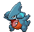

# #443 Gible (Land Shark Pokémon)

| Official Artwork | Shiny Artwork |
|------------------|---------------|
|  |  |

It attacks using its huge mouth. While its attacks are powerful, it hurts itself out of clumsiness, too.

---

## Media

### Default Sprites

| Front | Shiny | Back | Shiny |
|-------|-------|------|-------|
|  |  |  |  |

### Female Sprites

| Front | Shiny | Back | Shiny |
|-------|-------|------|-------|
|  |  |  |  |

### Cries

Latest (Gen VI+):

<audio controls>
<source src='../../assets/cries/gible/latest.ogg' type='audio/ogg'>
  Your browser does not support the audio element.
</audio>

Legacy:

<audio controls>
<source src='../../assets/cries/gible/legacy.ogg' type='audio/ogg'>
  Your browser does not support the audio element.
</audio>

---

## Pokédex Data

| National № | Type(s) | Height | Weight | Abilities | Local № |
|------------|---------|--------|--------|-----------|---------|
| #443 | {: width="48"} {: width="48"} | 0.7 m / 2.3 ft | 20.5 kg / 45.2 lbs | 1. Sand Veil 2. Rough Skin | #109 |

---

## Base Stats
|   | HP | Attack | Defense | Sp. Atk | Sp. Def | Speed |
|---|----|--------|---------|---------|---------|-------|
| **Base** | 58 | 70 | 45 | 40 | 45 | 42 |
| **Min** | 226 | 130 | 85 | 76 | 85 | 80 |
| **Max** | 320 | 262 | 207 | 196 | 207 | 201 |

The ranges shown above are for a level 100 Pokémon. Maximum values are based on a beneficial nature, 252 EVs, 31 IVs; minimum values are based on a hindering nature, 0 EVs, 0 IVs.

---

## Forms & Evolutions

!!! warning "WARNING"

    Information on evolutions may not be 100% accurate; differences between evolution methods across generations are not accounted for.

### Forms

Gible has no alternate forms.

### Evolution Line

1. [Gible](gible.md/)
    1. Level Up: [Gabite](gabite.md/)
        1. Level Up: [Garchomp](garchomp.md/)

---

## Training

| EV Yield | Catch Rate | Base Friendship | Base Exp. | Growth Rate | Held Items |
|----------|------------|-----------------|-----------|-------------|------------|
| 1 Atk | 45 | 50 | 60 | Slow | Haban Berry (5%) |

---

## Breeding

| Egg Groups | Egg Cycles | Gender | Dimorphic | Color | Shape |
|------------|------------|--------|-----------|-------|-------|
| 1. Monster 2. Dragon | 40 | 50.0% Male 50.0% Female | True | Blue | Upright |

---

## Moves

!!! warning "WARNING"

    Specific move information may be incorrect. However, the general movepool should be accurate; this includes changes made in Blaze Black and Volt White.

### Level Up Moves

| Lv. | Move | Type | Cat. | Power | Acc. | PP |
| --- | --- | --- | --- | --- | --- | --- |
| 1 | Tackle | {: width="48"} | {: width="36"} | 40 | 100 | 35 |
| 3 | Sand Attack | {: width="48"} | {: width="36"} | — | 100 | 15 |
| 7 | Dragon Rage | {: width="48"} | {: width="36"} | — | 100 | 10 |
| 13 | Sandstorm | {: width="48"} | {: width="36"} | — | — | 10 |
| 15 | Take Down | {: width="48"} | {: width="36"} | 90 | 85 | 20 |
| 19 | Bulldoze | {: width="48"} | {: width="36"} | 80 | 100 | 20 |
| 25 | Slash | {: width="48"} | {: width="36"} | 70 | 100 | 20 |
| 27 | Dragon Claw | {: width="48"} | {: width="36"} | 80 | 100 | 15 |
| 31 | Dig | {: width="48"} | {: width="36"} | 100 | 100 | 10 |
| 37 | Dragon Rush | {: width="48"} | {: width="36"} | 100 | 75 | 10 |
| 44 | Outrage | {: width="48"} | {: width="36"} | 120 | 100 | 10 |

### TM Moves

| TM | Move | Type | Cat. | Power | Acc. | PP |
| --- | --- | --- | --- | --- | --- | --- |
| HM01 | Cut | {: width="48"} | {: width="36"} | 60 | 100% | 25 |
| HM04 | Strength | {: width="48"} | {: width="36"} | 100 | 100 | 15 |
| TM01 | Hone Claws | {: width="48"} | {: width="36"} | — | — | 15 |
| TM02 | Dragon Claw | {: width="48"} | {: width="36"} | 80 | 100 | 15 |
| TM05 | Roar | {: width="48"} | {: width="36"} | — | — | 20 |
| TM06 | Toxic | {: width="48"} | {: width="36"} | — | 90 | 10 |
| TM10 | Hidden Power | {: width="48"} | {: width="36"} | 60 | 100 | 15 |
| TM11 | Sunny Day | {: width="48"} | {: width="36"} | — | — | 5 |
| TM17 | Protect | {: width="48"} | {: width="36"} | — | — | 10 |
| TM18 | Rain Dance | {: width="48"} | {: width="36"} | — | — | 5 |
| TM21 | Frustration | {: width="48"} | {: width="36"} | — | 100 | 20 |
| TM26 | Earthquake | {: width="48"} | {: width="36"} | 100 | 100 | 10 |
| TM27 | Return | {: width="48"} | {: width="36"} | — | 100 | 20 |
| TM28 | Dig | {: width="48"} | {: width="36"} | 100 | 100 | 10 |
| TM32 | Double Team | {: width="48"} | {: width="36"} | — | — | 15 |
| TM35 | Flamethrower | {: width="48"} | {: width="36"} | 90 | 100 | 15 |
| TM37 | Sandstorm | {: width="48"} | {: width="36"} | — | — | 10 |
| TM38 | Fire Blast | {: width="48"} | {: width="36"} | 110 | 85 | 5 |
| TM39 | Rock Tomb | {: width="48"} | {: width="36"} | 60 | 95 | 15 |
| TM40 | Aerial Ace | {: width="48"} | {: width="36"} | 60 | — | 20 |
| TM42 | Facade | {: width="48"} | {: width="36"} | 70 | 100 | 20 |
| TM44 | Rest | {: width="48"} | {: width="36"} | — | — | 5 |
| TM45 | Attract | {: width="48"} | {: width="36"} | — | 100 | 15 |
| TM48 | Round | {: width="48"} | {: width="36"} | 60 | 100 | 15 |
| TM59 | Incinerate | {: width="48"} | {: width="36"} | 50 | 100 | 15 |
| TM65 | Shadow Claw | {: width="48"} | {: width="36"} | 80 | 100 | 15 |
| TM71 | Stone Edge | {: width="48"} | {: width="36"} | 100 | 80 | 5 |
| TM78 | Bulldoze | {: width="48"} | {: width="36"} | 80 | 100 | 20 |
| TM80 | Rock Slide | {: width="48"} | {: width="36"} | 75 | 90 | 10 |
| TM87 | Swagger | {: width="48"} | {: width="36"} | — | 85 | 15 |
| TM90 | Substitute | {: width="48"} | {: width="36"} | — | — | 10 |
| TM94 | Rock Smash | {: width="48"} | {: width="36"} | 60 | 100 | 15 |

### Egg Moves

| Move | Type | Cat. | Power | Acc. | PP |
| --- | --- | --- | --- | --- | --- |
| Body Slam | {: width="48"} | {: width="36"} | 85 | 100 | 15 |
| Thrash | {: width="48"} | {: width="36"} | 120 | 100 | 10 |
| Double Edge | {: width="48"} | {: width="36"} | 120 | 100 | 15 |
| Scary Face | {: width="48"} | {: width="36"} | — | 100 | 10 |
| Outrage | {: width="48"} | {: width="36"} | 120 | 100 | 10 |
| Dragon Breath | {: width="48"} | {: width="36"} | 60 | 100 | 20 |
| Iron Tail | {: width="48"} | {: width="36"} | 100 | 75 | 15 |
| Metal Claw | {: width="48"} | {: width="36"} | 50 | 95 | 35 |
| Hurricane | {: width="48"} | {: width="36"} | 110 | 70 | 10 |
| Bulldoze | {: width="48"} | {: width="36"} | 80 | 100 | 20 |
| Mud Shot | {: width="48"} | {: width="36"} | 55 | 95 | 15 |
| Rock Climb | {: width="48"} | {: width="36"} | 80 | 95% | 10 |
| Iron Head | {: width="48"} | {: width="36"} | 80 | 100 | 15 |

### Tutor Moves

| Move | Type | Cat. | Power | Acc. | PP |
| --- | --- | --- | --- | --- | --- |
| Draco Meteor | {: width="48"} | {: width="36"} | 130 | 90 | 5 |

