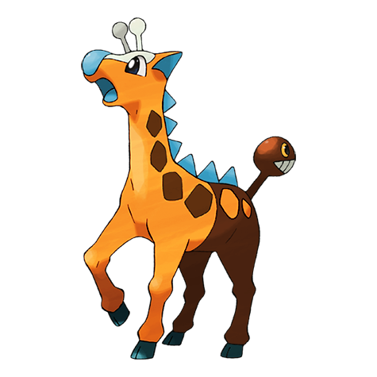
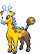
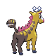
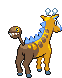
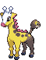
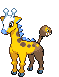
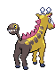
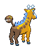

# #203 Girafarig (Long Neck Pokémon)

| Official Artwork | Shiny Artwork |
|------------------|---------------|
|  |  |

The head on its tail contains a small brain. It can instinctively fight even while facing backward.

---

## Media

### Default Sprites

| Front | Shiny | Back | Shiny |
|-------|-------|------|-------|
|  |  |  |  |

### Female Sprites

| Front | Shiny | Back | Shiny |
|-------|-------|------|-------|
|  |  |  |  |

### Cries

Latest (Gen VI+):

<audio controls>
<source src='../../assets/cries/girafarig/latest.ogg' type='audio/ogg'>
  Your browser does not support the audio element.
</audio>

Legacy:

<audio controls>
<source src='../../assets/cries/girafarig/legacy.ogg' type='audio/ogg'>
  Your browser does not support the audio element.
</audio>

---

## Pokédex Data

| National № | Type(s) | Height | Weight | Abilities | Local № |
|------------|---------|--------|--------|-----------|---------|
| #203 | {: width="48"} {: width="48"} | 1.5 m / 4.9 ft | 41.5 kg / 91.5 lbs | 1. Sap Sipper 2. Early Bird | #121 |

---

## Base Stats
|   | HP | Attack | Defense | Sp. Atk | Sp. Def | Speed |
|---|----|--------|---------|---------|---------|-------|
| **Base** | 70 | 80 | 65 | 110 | 65 | 105 |
| **Min** | 250 | 148 | 121 | 202 | 121 | 193 |
| **Max** | 344 | 284 | 251 | 350 | 251 | 339 |

The ranges shown above are for a level 100 Pokémon. Maximum values are based on a beneficial nature, 252 EVs, 31 IVs; minimum values are based on a hindering nature, 0 EVs, 0 IVs.

---

## Forms & Evolutions

!!! warning "WARNING"

    Information on evolutions may not be 100% accurate; differences between evolution methods across generations are not accounted for.

### Forms

Girafarig has no alternate forms.

### Evolution Line

1. [Girafarig](girafarig.md/)

---

## Training

| EV Yield | Catch Rate | Base Friendship | Base Exp. | Growth Rate | Held Items |
|----------|------------|-----------------|-----------|-------------|------------|
| 2 Sp. Atk | 60 | 70 | 159 | Medium | Persim Berry (5%) |

---

## Breeding

| Egg Groups | Egg Cycles | Gender | Dimorphic | Color | Shape |
|------------|------------|--------|-----------|-------|-------|
| 1. Ground | 20 | 50.0% Male 50.0% Female | True | Yellow | Quadruped |

---

## Moves

!!! warning "WARNING"

    Specific move information may be incorrect. However, the general movepool should be accurate; this includes changes made in Blaze Black and Volt White.

### Level Up Moves

| Lv. | Move | Type | Cat. | Power | Acc. | PP |
| --- | --- | --- | --- | --- | --- | --- |
| 1 | Astonish | {: width="48"} | {: width="36"} | 30 | 100 | 15 |
| 1 | Confusion | {: width="48"} | {: width="36"} | 50 | 100 | 25 |
| 1 | Growl | {: width="48"} | {: width="36"} | — | 100 | 40 |
| 1 | Guard Swap | {: width="48"} | {: width="36"} | — | — | 10 |
| 1 | Power Swap | {: width="48"} | {: width="36"} | — | — | 10 |
| 1 | Tackle | {: width="48"} | {: width="36"} | 40 | 100 | 35 |
| 5 | Odor Sleuth | {: width="48"} | {: width="36"} | — | — | 40 |
| 10 | Stomp | {: width="48"} | {: width="36"} | 65 | 100 | 20 |
| 14 | Agility | {: width="48"} | {: width="36"} | — | — | 30 |
| 19 | Psybeam | {: width="48"} | {: width="36"} | 65 | 100 | 20 |
| 23 | Baton Pass | {: width="48"} | {: width="36"} | — | — | 40 |
| 28 | Assurance | {: width="48"} | {: width="36"} | 60 | 100 | 10 |
| 32 | Double Hit | {: width="48"} | {: width="36"} | 35 | 90 | 10 |
| 37 | Psychic | {: width="48"} | {: width="36"} | 90 | 100 | 10 |
| 41 | Zen Headbutt | {: width="48"} | {: width="36"} | 80 | 90 | 15 |
| 46 | Crunch | {: width="48"} | {: width="36"} | 80 | 100 | 15 |
| 51 | Nasty Plot | {: width="48"} | {: width="36"} | — | — | 20 |

### TM Moves

| TM | Move | Type | Cat. | Power | Acc. | PP |
| --- | --- | --- | --- | --- | --- | --- |
| HM04 | Strength | {: width="48"} | {: width="36"} | 100 | 100 | 15 |
| TM03 | Psyshock | {: width="48"} | {: width="36"} | 80 | 100 | 10 |
| TM04 | Calm Mind | {: width="48"} | {: width="36"} | — | — | 20 |
| TM06 | Toxic | {: width="48"} | {: width="36"} | — | 90 | 10 |
| TM10 | Hidden Power | {: width="48"} | {: width="36"} | 60 | 100 | 15 |
| TM11 | Sunny Day | {: width="48"} | {: width="36"} | — | — | 5 |
| TM16 | Light Screen | {: width="48"} | {: width="36"} | — | — | 30 |
| TM17 | Protect | {: width="48"} | {: width="36"} | — | — | 10 |
| TM18 | Rain Dance | {: width="48"} | {: width="36"} | — | — | 5 |
| TM19 | Telekinesis | {: width="48"} | {: width="36"} | — | — | 15 |
| TM21 | Frustration | {: width="48"} | {: width="36"} | — | 100 | 20 |
| TM24 | Thunderbolt | {: width="48"} | {: width="36"} | 90 | 100 | 15 |
| TM25 | Thunder | {: width="48"} | {: width="36"} | 110 | 70 | 10 |
| TM26 | Earthquake | {: width="48"} | {: width="36"} | 100 | 100 | 10 |
| TM27 | Return | {: width="48"} | {: width="36"} | — | 100 | 20 |
| TM29 | Psychic | {: width="48"} | {: width="36"} | 90 | 100 | 10 |
| TM30 | Shadow Ball | {: width="48"} | {: width="36"} | 90 | 100 | 15 |
| TM32 | Double Team | {: width="48"} | {: width="36"} | — | — | 15 |
| TM33 | Reflect | {: width="48"} | {: width="36"} | — | — | 20 |
| TM42 | Facade | {: width="48"} | {: width="36"} | 70 | 100 | 20 |
| TM44 | Rest | {: width="48"} | {: width="36"} | — | — | 5 |
| TM45 | Attract | {: width="48"} | {: width="36"} | — | 100 | 15 |
| TM46 | Thief | {: width="48"} | {: width="36"} | 60 | 100 | 25 |
| TM48 | Round | {: width="48"} | {: width="36"} | 60 | 100 | 15 |
| TM49 | Echoed Voice | {: width="48"} | {: width="36"} | 40 | 100 | 15 |
| TM53 | Energy Ball | {: width="48"} | {: width="36"} | 90 | 100 | 10 |
| TM57 | Charge Beam | {: width="48"} | {: width="36"} | 50 | 90 | 10 |
| TM67 | Retaliate | {: width="48"} | {: width="36"} | 70 | 100 | 5 |
| TM70 | Flash | {: width="48"} | {: width="36"} | — | 100 | 20 |
| TM73 | Thunder Wave | {: width="48"} | {: width="36"} | — | 90 | 20 |
| TM77 | Psych Up | {: width="48"} | {: width="36"} | — | — | 10 |
| TM78 | Bulldoze | {: width="48"} | {: width="36"} | 80 | 100 | 20 |
| TM83 | Work Up | {: width="48"} | {: width="36"} | — | — | 30 |
| TM85 | Dream Eater | {: width="48"} | {: width="36"} | 100 | 100 | 15 |
| TM86 | Grass Knot | {: width="48"} | {: width="36"} | — | 100 | 20 |
| TM87 | Swagger | {: width="48"} | {: width="36"} | — | 85 | 15 |
| TM90 | Substitute | {: width="48"} | {: width="36"} | — | — | 10 |
| TM92 | Trick Room | {: width="48"} | {: width="36"} | — | — | 5 |
| TM94 | Rock Smash | {: width="48"} | {: width="36"} | 60 | 100 | 15 |

### Egg Moves

| Move | Type | Cat. | Power | Acc. | PP |
| --- | --- | --- | --- | --- | --- |
| Razor Wind | {: width="48"} | {: width="36"} | 80 | 100 | 10 |
| Double Kick | {: width="48"} | {: width="36"} | 30 | 100 | 30 |
| Take Down | {: width="48"} | {: width="36"} | 90 | 85 | 20 |
| Amnesia | {: width="48"} | {: width="36"} | — | — | 20 |
| Foresight | {: width="48"} | {: width="36"} | — | — | 40 |
| Mean Look | {: width="48"} | {: width="36"} | — | — | 5 |
| Mirror Coat | {: width="48"} | {: width="36"} | — | 100 | 20 |
| Future Sight | {: width="48"} | {: width="36"} | 120 | 100 | 10 |
| Beat Up | {: width="48"} | {: width="36"} | — | 100 | 10 |
| Wish | {: width="48"} | {: width="36"} | — | — | 10 |
| Magic Coat | {: width="48"} | {: width="36"} | — | — | 15 |
| Skill Swap | {: width="48"} | {: width="36"} | — | — | 10 |
| Secret Power | {: width="48"} | {: width="36"} | 70 | 100 | 20 |

### Tutor Moves

Girafarig cannot learn any moves from tutors.
