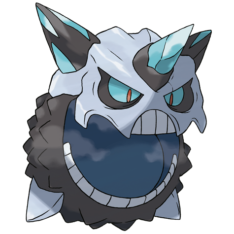
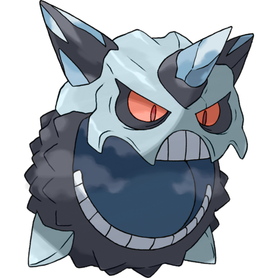
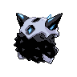
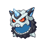
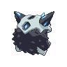

# #10074 Glalie Mega (Face Pokémon)

| Official Artwork | Shiny Artwork |
| --- | --- |
|  |  |

It prevents prey from escaping by instantaneously freezing moisture in the air.

---

## Media

### Sprites

| Front | Back | Front Shiny | Back Shiny |
| --- | --- | --- | --- |
|  |  |  |  |

### Cries

Latest (Gen VI+):

<audio controls>
  <source src='../assets/cries/glalie-mega/latest.ogg' type='audio/ogg'>
  Your browser does not support the audio element.
</audio>

---

## Pokédex Data

| National № | Type(s) | Height | Weight | Abilities | Local № |
|------------|---------|--------|--------|-----------|---------|
| #10074 | {: width='48'} | 2.1 m | 350.2 kg | 1. Refrigerate | #N/A |

---

## Base Stats
---

## Base Stats
|   | HP | Attack | Defense | Sp. Atk | Sp. Def | Speed |
|---|----|--------|---------|---------|---------|-------|
| **Base** | 80 | 120 | 80 | 120 | 80 | 100 |
| **Min** | 270 | 220 | 148 | 220 | 148 | 184 |
| **Max** | 364 | 372 | 284 | 372 | 284 | 328 |

The ranges shown above are for a level 100 Pokémon. Maximum values are based on a beneficial nature, 252 EVs, 31 IVs; minimum values are based on a hindering nature, 0 EVs, 0 IVs.

---

## Forms & Evolutions

!!! warning "WARNING"

    Some forms may not be available in Blaze Black/Volt White. Also information on evolutions may not be 100% accurate; it is currently quite complex to track generational evolution data.

### Forms

1. [Glalie](glalie.md/)
2. [Glalie-Mega](glalie-mega.md/)

### Evolution Line

1. [Snorunt](snorunt.md/)
1. Level Up: [Glalie](glalie.md/)2. Use Item: [Froslass](froslass.md/)

---

## Training

| EV Yield | Catch Rate | Base Friendship | Base Exp. | Growth Rate | Held Items |
|----------|------------|-----------------|-----------|-------------|------------|
| 2 Hp | 75 | 50 | 203 | Medium | N/A |

---

## Breeding

| Egg Groups | Egg Cycles | Gender | Dimorphic | Color | Shape |
|------------|------------|--------|-----------|-------|-------|
| 1. Fairy 2. Mineral | 20 | 50.0% Male 50.0% Female | False | Gray | Ball |

---

## Moves

!!! warning "WARNING"

    Specific move information may be incorrect. However, the general movepool should be accurate (including changes to learnset).

### Level Up Moves

Lv. | Move | Type | Cat. | Power | Acc. | PP
--- | --- | --- | --- | --- | --- | ---
| 0 | Freeze Dry | {: width='48'} | {: width='36'} | 70 | 100 | 20 |
| 1 | Double Team | {: width='48'} | {: width='36'} | — | — | 15 |
| 1 | Freeze Dry | {: width='48'} | {: width='36'} | 70 | 100 | 20 |
| 1 | Ice Shard | {: width='48'} | {: width='36'} | 40 | 100 | 30 |
| 1 | Leer | {: width='48'} | {: width='36'} | — | 100 | 30 |
| 1 | Powder Snow | {: width='48'} | {: width='36'} | 40 | 100 | 25 |
| 1 | Sheer Cold | {: width='48'} | {: width='36'} | — | 30 | 5 |
| 5 | Double Team | {: width='48'} | {: width='36'} | — | — | 15 |
| 10 | Ice Shard | {: width='48'} | {: width='36'} | 40 | 100 | 30 |
| 14 | Icy Wind | {: width='48'} | {: width='36'} | 55 | 95 | 15 |
| 19 | Bite | {: width='48'} | {: width='36'} | 60 | 100 | 25 |
| 23 | Ice Fang | {: width='48'} | {: width='36'} | 75 | 95 | 15 |
| 28 | Headbutt | {: width='48'} | {: width='36'} | 70 | 100 | 15 |
| 32 | Protect | {: width='48'} | {: width='36'} | — | — | 10 |
| 37 | Frost Breath | {: width='48'} | {: width='36'} | 60 | 90 | 10 |
| 41 | Crunch | {: width='48'} | {: width='36'} | 80 | 100 | 15 |
| 48 | Blizzard | {: width='48'} | {: width='36'} | 110 | 70 | 5 |
| 54 | Hail | {: width='48'} | {: width='36'} | — | — | 10 |
| 61 | Sheer Cold | {: width='48'} | {: width='36'} | — | 30 | 5 |

### TM Moves

TM | Move | Type | Cat. | Power | Acc. | PP
--- | --- | --- | --- | --- | --- | ---
| TM06 | Toxic | {: width='48'} | {: width='36'} | — | 90 | 10 |
| TM07 | Hail | {: width='48'} | {: width='36'} | — | — | 10 |
| TM10 | Hidden Power | {: width='48'} | {: width='36'} | 60 | 100 | 15 |
| TM100 | Confide | {: width='48'} | {: width='36'} | — | — | 20 |
| TM12 | Taunt | {: width='48'} | {: width='36'} | — | 100 | 20 |
| TM13 | Ice Beam | {: width='48'} | {: width='36'} | 90 | 100 | 10 |
| TM14 | Blizzard | {: width='48'} | {: width='36'} | 110 | 70 | 5 |
| TM15 | Hyper Beam | {: width='48'} | {: width='36'} | 150 | 90 | 5 |
| TM16 | Light Screen | {: width='48'} | {: width='36'} | — | — | 30 |
| TM17 | Protect | {: width='48'} | {: width='36'} | — | — | 10 |
| TM18 | Rain Dance | {: width='48'} | {: width='36'} | — | — | 5 |
| TM20 | Safeguard | {: width='48'} | {: width='36'} | — | — | 25 |
| TM21 | Frustration | {: width='48'} | {: width='36'} | — | 100 | 20 |
| TM26 | Earthquake | {: width='48'} | {: width='36'} | 100 | 100 | 10 |
| TM27 | Return | {: width='48'} | {: width='36'} | — | 100 | 20 |
| TM30 | Shadow Ball | {: width='48'} | {: width='36'} | 90 | 100 | 15 |
| TM32 | Double Team | {: width='48'} | {: width='36'} | — | — | 15 |
| TM41 | Torment | {: width='48'} | {: width='36'} | — | 100 | 15 |
| TM42 | Facade | {: width='48'} | {: width='36'} | 70 | 100 | 20 |
| TM44 | Rest | {: width='48'} | {: width='36'} | — | — | 5 |
| TM45 | Attract | {: width='48'} | {: width='36'} | — | 100 | 15 |
| TM48 | Round | {: width='48'} | {: width='36'} | 60 | 100 | 15 |
| TM64 | Explosion | {: width='48'} | {: width='36'} | 250 | 100 | 5 |
| TM66 | Payback | {: width='48'} | {: width='36'} | 50 | 100 | 10 |
| TM68 | Giga Impact | {: width='48'} | {: width='36'} | 150 | 90 | 5 |
| TM74 | Gyro Ball | {: width='48'} | {: width='36'} | — | 100 | 5 |
| TM78 | Bulldoze | {: width='48'} | {: width='36'} | 80 | 100 | 20 |
| TM79 | Frost Breath | {: width='48'} | {: width='36'} | 60 | 90 | 10 |
| TM87 | Swagger | {: width='48'} | {: width='36'} | — | 85 | 15 |
| TM88 | Sleep Talk | {: width='48'} | {: width='36'} | — | — | 10 |
| TM90 | Substitute | {: width='48'} | {: width='36'} | — | — | 10 |
| TM97 | Dark Pulse | {: width='48'} | {: width='36'} | 90 | 100 | 15 |

### Egg Moves

Glalie Mega cannot learn any moves by breeding.
### Tutor Moves

Move | Type | Cat. | Power | Acc. | PP
--- | --- | --- | --- | --- | ---
| Super Fang | {: width='48'} | {: width='36'} | — | 90 | 10 |
| Snore | {: width='48'} | {: width='36'} | 50 | 100 | 15 |
| Spite | {: width='48'} | {: width='36'} | — | 100 | 10 |
| Icy Wind | {: width='48'} | {: width='36'} | 55 | 95 | 15 |
| Signal Beam | {: width='48'} | {: width='36'} | 75 | 100 | 15 |
| Block | {: width='48'} | {: width='36'} | — | — | 5 |
| Water Pulse | {: width='48'} | {: width='36'} | 60 | 100 | 20 |
| Iron Head | {: width='48'} | {: width='36'} | 80 | 100 | 15 |
| Laser Focus | {: width='48'} | {: width='36'} | — | — | 30 |

