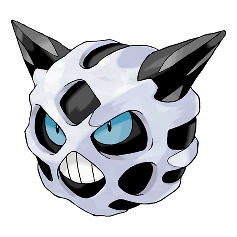
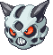

# #362 Glalie (Face Pokémon)

| Official Artwork | Shiny Artwork |
|------------------|---------------|
|  |  |

It prevents prey from escaping by instantaneously freezing moisture in the air.

---

## Media

### Default Sprites

| Front | Shiny | Back | Shiny |
|-------|-------|------|-------|
|  |  |  |  |

### Cries

Latest (Gen VI+):

<audio controls>
<source src='../../assets/cries/glalie/latest.ogg' type='audio/ogg'>
  Your browser does not support the audio element.
</audio>

Legacy:

<audio controls>
<source src='../../assets/cries/glalie/legacy.ogg' type='audio/ogg'>
  Your browser does not support the audio element.
</audio>

---

## Pokédex Data

| National № | Type(s) | Height | Weight | Abilities | Local № |
|------------|---------|--------|--------|-----------|---------|
| #362 | {: width="48"} {: width="48"} | 1.5 m / 4.9 ft | 256.5 kg / 565.5 lbs | 1. Solid Rock 2. Moody | N/A |

---

## Base Stats
|   | HP | Attack | Defense | Sp. Atk | Sp. Def | Speed |
|---|----|--------|---------|---------|---------|-------|
| **Base** | 100 | 100 | 120 | 60 | 60 | 60 |
| **Min** | 310 | 184 | 220 | 112 | 112 | 112 |
| **Max** | 404 | 328 | 372 | 240 | 240 | 240 |

The ranges shown above are for a level 100 Pokémon. Maximum values are based on a beneficial nature, 252 EVs, 31 IVs; minimum values are based on a hindering nature, 0 EVs, 0 IVs.

---

## Forms & Evolutions

!!! warning "WARNING"

    Information on evolutions may not be 100% accurate; differences between evolution methods across generations are not accounted for.

### Forms

Glalie has no alternate forms.

### Evolution Line

1. [Snorunt](snorunt.md/)
    1. Level Up: [Glalie](glalie.md/)

    2. Use Item: [Froslass](froslass.md/)

---

## Training

| EV Yield | Catch Rate | Base Friendship | Base Exp. | Growth Rate | Held Items |
|----------|------------|-----------------|-----------|-------------|------------|
| 2 HP | 75 | 50 | 168 | Medium | Babiri Berry (5%) |

---

## Breeding

| Egg Groups | Egg Cycles | Gender | Dimorphic | Color | Shape |
|------------|------------|--------|-----------|-------|-------|
| 1. Fairy 2. Mineral | 20 | 50.0% Male 50.0% Female | False | Gray | Ball |

---

## Moves

!!! warning "WARNING"

    Specific move information may be incorrect. However, the general movepool should be accurate; this includes changes made in Blaze Black and Volt White.

### Level Up Moves

| Lv. | Move | Type | Cat. | Power | Acc. | PP |
| --- | --- | --- | --- | --- | --- | --- |
| 1 | Bite | {: width="48"} | {: width="36"} | 60 | 100 | 25 |
| 1 | Double Team | {: width="48"} | {: width="36"} | — | — | 15 |
| 1 | Leer | {: width="48"} | {: width="36"} | — | 100 | 30 |
| 1 | Powder Snow | {: width="48"} | {: width="36"} | 40 | 100 | 25 |
| 4 | Double Team | {: width="48"} | {: width="36"} | — | — | 15 |
| 10 | Bite | {: width="48"} | {: width="36"} | 60 | 100 | 25 |
| 13 | Icy Wind | {: width="48"} | {: width="36"} | 55 | 95 | 15 |
| 19 | Headbutt | {: width="48"} | {: width="36"} | 70 | 100 | 15 |
| 22 | Protect | {: width="48"} | {: width="36"} | — | — | 10 |
| 28 | Ice Fang | {: width="48"} | {: width="36"} | 75 | 95 | 15 |
| 31 | Crunch | {: width="48"} | {: width="36"} | 80 | 100 | 15 |
| 37 | Avalanche | {: width="48"} | {: width="36"} | 60 | 100 | 10 |
| 40 | Hail | {: width="48"} | {: width="36"} | — | — | 10 |
| 42 | Rollout | {: width="48"} | {: width="36"} | 30 | 90 | 20 |
| 51 | Blizzard | {: width="48"} | {: width="36"} | 110 | 70 | 5 |
| 59 | Sheer Cold | {: width="48"} | {: width="36"} | — | 30 | 5 |
| 65 | Head Smash | {: width="48"} | {: width="36"} | 150 | 80 | 5 |
| 73 | Rock Wrecker | {: width="48"} | {: width="36"} | 150 | 90 | 5 |

### TM Moves

| TM | Move | Type | Cat. | Power | Acc. | PP |
| --- | --- | --- | --- | --- | --- | --- |
| TM06 | Toxic | {: width="48"} | {: width="36"} | — | 90 | 10 |
| TM07 | Hail | {: width="48"} | {: width="36"} | — | — | 10 |
| TM10 | Hidden Power | {: width="48"} | {: width="36"} | 60 | 100 | 15 |
| TM12 | Taunt | {: width="48"} | {: width="36"} | — | 100 | 20 |
| TM13 | Ice Beam | {: width="48"} | {: width="36"} | 90 | 100 | 10 |
| TM14 | Blizzard | {: width="48"} | {: width="36"} | 110 | 70 | 5 |
| TM15 | Hyper Beam | {: width="48"} | {: width="36"} | 150 | 90 | 5 |
| TM16 | Light Screen | {: width="48"} | {: width="36"} | — | — | 30 |
| TM17 | Protect | {: width="48"} | {: width="36"} | — | — | 10 |
| TM18 | Rain Dance | {: width="48"} | {: width="36"} | — | — | 5 |
| TM20 | Safeguard | {: width="48"} | {: width="36"} | — | — | 25 |
| TM21 | Frustration | {: width="48"} | {: width="36"} | — | 100 | 20 |
| TM23 | Smack Down | {: width="48"} | {: width="36"} | 50 | 100 | 15 |
| TM26 | Earthquake | {: width="48"} | {: width="36"} | 100 | 100 | 10 |
| TM27 | Return | {: width="48"} | {: width="36"} | — | 100 | 20 |
| TM30 | Shadow Ball | {: width="48"} | {: width="36"} | 90 | 100 | 15 |
| TM32 | Double Team | {: width="48"} | {: width="36"} | — | — | 15 |
| TM37 | Sandstorm | {: width="48"} | {: width="36"} | — | — | 10 |
| TM41 | Torment | {: width="48"} | {: width="36"} | — | 100 | 15 |
| TM42 | Facade | {: width="48"} | {: width="36"} | 70 | 100 | 20 |
| TM44 | Rest | {: width="48"} | {: width="36"} | — | — | 5 |
| TM45 | Attract | {: width="48"} | {: width="36"} | — | 100 | 15 |
| TM48 | Round | {: width="48"} | {: width="36"} | 60 | 100 | 15 |
| TM64 | Explosion | {: width="48"} | {: width="36"} | 250 | 100 | 5 |
| TM66 | Payback | {: width="48"} | {: width="36"} | 50 | 100 | 10 |
| TM68 | Giga Impact | {: width="48"} | {: width="36"} | 150 | 90 | 5 |
| TM69 | Rock Polish | {: width="48"} | {: width="36"} | — | — | 20 |
| TM70 | Flash | {: width="48"} | {: width="36"} | — | 100 | 20 |
| TM71 | Stone Edge | {: width="48"} | {: width="36"} | 100 | 80 | 5 |
| TM74 | Gyro Ball | {: width="48"} | {: width="36"} | — | 100 | 5 |
| TM78 | Bulldoze | {: width="48"} | {: width="36"} | 80 | 100 | 20 |
| TM79 | Frost Breath | {: width="48"} | {: width="36"} | 60 | 90 | 10 |
| TM80 | Rock Slide | {: width="48"} | {: width="36"} | 75 | 90 | 10 |
| TM87 | Swagger | {: width="48"} | {: width="36"} | — | 85 | 15 |
| TM90 | Substitute | {: width="48"} | {: width="36"} | — | — | 10 |

### Egg Moves

Glalie cannot learn any moves by breeding.
### Tutor Moves

Glalie cannot learn any moves from tutors.
