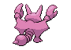
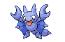
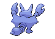
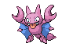
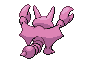
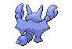

# #207 Gligar (Fly Scorpion Pokémon)

| Official Artwork | Shiny Artwork |
| --- | --- |
|  |  |

It glides as if sliding. It startles foes by clamping on to their faces, then jabs with its poison stinger.

---

## Media

### Default Sprites

| Front | Back | Front Shiny | Back Shiny |
| --- | --- | --- | --- |
|  |  |  |  |

### Female Sprites

| Front | Back | Front Shiny | Back Shiny |
| --- | --- | --- | --- |
|  |  |  |  |

### Cries

Latest (Gen VI+):

<audio controls>
<source src='../../assets/cries/gligar/latest.ogg' type='audio/ogg'>
  Your browser does not support the audio element.
</audio>

Legacy:

<audio controls>
<source src='../../assets/cries/gligar/legacy.ogg' type='audio/ogg'>
  Your browser does not support the audio element.
</audio>

---

## Pokédex Data

| National № | Type(s) | Height | Weight | Abilities | Local № |
|------------|---------|--------|--------|-----------|---------|
| #207 | {: width='48'} {: width='48'} | 1.1 m | 64.8 kg | 1. Hyper-Cutter 2. Immunity | N/A |

---

## Base Stats
|   | HP | Attack | Defense | Sp. Atk | Sp. Def | Speed |
|---|----|--------|---------|---------|---------|-------|
| **Base** | 65 | 75 | 105 | 35 | 65 | 85 |
| **Min** | 240 | 139 | 193 | 67 | 121 | 157 |
| **Max** | 334 | 273 | 339 | 185 | 251 | 295 |

The ranges shown above are for a level 100 Pokémon. Maximum values are based on a beneficial nature, 252 EVs, 31 IVs; minimum values are based on a hindering nature, 0 EVs, 0 IVs.

---

## Forms & Evolutions

!!! warning "WARNING"

    Information on evolutions may not be 100% accurate; differences between evolution methods across generations are not accounted for.

### Forms

Gligar has no alternate forms.

### Evolution Line

1. [Gligar](gligar.md/)
    1. Level Up: [Gliscor](gliscor.md/)

---

## Training

| EV Yield | Catch Rate | Base Friendship | Base Exp. | Growth Rate | Held Items |
|----------|------------|-----------------|-----------|-------------|------------|
| 1 Defense | 60 | 70 | 86 | Medium-Slow | N/A |

---

## Breeding

| Egg Groups | Egg Cycles | Gender | Dimorphic | Color | Shape |
|------------|------------|--------|-----------|-------|-------|
| 1. Bug | 20 | 50.0% Male 50.0% Female | True | Purple | Wings |

---

## Moves

!!! warning "WARNING"

    Specific move information may be incorrect. However, the general movepool should be accurate; this includes changes made in Blaze Black and Volt White.

### Level Up Moves

| Lv. | Move | Type | Cat. | Power | Acc. | PP |
| --- | --- | --- | --- | --- | --- | --- |
| 1 | Poison Sting | {: width='48'} | {: width='36'} | 15 | 100 | 35 |
| 5 | Sand Attack | {: width='48'} | {: width='36'} | — | 100 | 15 |
| 9 | Harden | {: width='48'} | {: width='36'} | — | — | 30 |
| 12 | Knock Off | {: width='48'} | {: width='36'} | 65 | 100 | 20 |
| 16 | Quick Attack | {: width='48'} | {: width='36'} | 40 | 100 | 30 |
| 20 | Fury Cutter | {: width='48'} | {: width='36'} | 40 | 95 | 20 |
| 23 | Feint Attack | {: width='48'} | {: width='36'} | 60 | — | 20 |
| 27 | Acrobatics | {: width='48'} | {: width='36'} | 55 | 100 | 15 |
| 31 | Screech | {: width='48'} | {: width='36'} | — | 85 | 40 |
| 34 | Slash | {: width='48'} | {: width='36'} | 70 | 100 | 20 |
| 38 | Swords Dance | {: width='48'} | {: width='36'} | — | — | 20 |
| 42 | U Turn | {: width='48'} | {: width='36'} | 70 | 100 | 20 |
| 45 | X Scissor | {: width='48'} | {: width='36'} | 80 | 100 | 15 |
| 49 | Guillotine | {: width='48'} | {: width='36'} | — | 30 | 5 |

### TM Moves

| TM | Move | Type | Cat. | Power | Acc. | PP |
| --- | --- | --- | --- | --- | --- | --- |
| HM01 | Cut | {: width='48'} | {: width='36'} | 60 | 100% | 25 |
| HM04 | Strength | {: width='48'} | {: width='36'} | 100 | 100 | 15 |
| TM01 | Hone Claws | {: width='48'} | {: width='36'} | — | — | 15 |
| TM06 | Toxic | {: width='48'} | {: width='36'} | — | 90 | 10 |
| TM09 | Venoshock | {: width='48'} | {: width='36'} | 65 | 100 | 10 |
| TM10 | Hidden Power | {: width='48'} | {: width='36'} | 60 | 100 | 15 |
| TM11 | Sunny Day | {: width='48'} | {: width='36'} | — | — | 5 |
| TM12 | Taunt | {: width='48'} | {: width='36'} | — | 100 | 20 |
| TM17 | Protect | {: width='48'} | {: width='36'} | — | — | 10 |
| TM18 | Rain Dance | {: width='48'} | {: width='36'} | — | — | 5 |
| TM21 | Frustration | {: width='48'} | {: width='36'} | — | 100 | 20 |
| TM26 | Earthquake | {: width='48'} | {: width='36'} | 100 | 100 | 10 |
| TM27 | Return | {: width='48'} | {: width='36'} | — | 100 | 20 |
| TM28 | Dig | {: width='48'} | {: width='36'} | 100 | 100 | 10 |
| TM31 | Brick Break | {: width='48'} | {: width='36'} | 75 | 100 | 15 |
| TM32 | Double Team | {: width='48'} | {: width='36'} | — | — | 15 |
| TM36 | Sludge Bomb | {: width='48'} | {: width='36'} | 90 | 100 | 10 |
| TM37 | Sandstorm | {: width='48'} | {: width='36'} | — | — | 10 |
| TM39 | Rock Tomb | {: width='48'} | {: width='36'} | 60 | 95 | 15 |
| TM40 | Aerial Ace | {: width='48'} | {: width='36'} | 60 | — | 20 |
| TM41 | Torment | {: width='48'} | {: width='36'} | — | 100 | 15 |
| TM42 | Facade | {: width='48'} | {: width='36'} | 70 | 100 | 20 |
| TM44 | Rest | {: width='48'} | {: width='36'} | — | — | 5 |
| TM45 | Attract | {: width='48'} | {: width='36'} | — | 100 | 15 |
| TM46 | Thief | {: width='48'} | {: width='36'} | 60 | 100 | 25 |
| TM48 | Round | {: width='48'} | {: width='36'} | 60 | 100 | 15 |
| TM54 | False Swipe | {: width='48'} | {: width='36'} | 40 | 100 | 40 |
| TM56 | Fling | {: width='48'} | {: width='36'} | — | 100 | 10 |
| TM62 | Acrobatics | {: width='48'} | {: width='36'} | 55 | 100 | 15 |
| TM66 | Payback | {: width='48'} | {: width='36'} | 50 | 100 | 10 |
| TM69 | Rock Polish | {: width='48'} | {: width='36'} | — | — | 20 |
| TM71 | Stone Edge | {: width='48'} | {: width='36'} | 100 | 80 | 5 |
| TM75 | Swords Dance | {: width='48'} | {: width='36'} | — | — | 20 |
| TM76 | Struggle Bug | {: width='48'} | {: width='36'} | 50 | 100 | 20 |
| TM78 | Bulldoze | {: width='48'} | {: width='36'} | 80 | 100 | 20 |
| TM80 | Rock Slide | {: width='48'} | {: width='36'} | 75 | 90 | 10 |
| TM81 | X Scissor | {: width='48'} | {: width='36'} | 80 | 100 | 15 |
| TM84 | Poison Jab | {: width='48'} | {: width='36'} | 80 | 100 | 20 |
| TM87 | Swagger | {: width='48'} | {: width='36'} | — | 85 | 15 |
| TM89 | U Turn | {: width='48'} | {: width='36'} | 70 | 100 | 20 |
| TM90 | Substitute | {: width='48'} | {: width='36'} | — | — | 10 |
| TM94 | Rock Smash | {: width='48'} | {: width='36'} | 60 | 100 | 15 |

### Egg Moves

| Move | Type | Cat. | Power | Acc. | PP |
| --- | --- | --- | --- | --- | --- |
| Razor Wind | {: width='48'} | {: width='36'} | 80 | 100 | 10 |
| Wing Attack | {: width='48'} | {: width='36'} | 75 | 100 | 35 |
| Double Edge | {: width='48'} | {: width='36'} | 120 | 100 | 15 |
| Counter | {: width='48'} | {: width='36'} | — | 100 | 20 |
| Agility | {: width='48'} | {: width='36'} | — | — | 30 |
| Baton Pass | {: width='48'} | {: width='36'} | — | — | 40 |
| Metal Claw | {: width='48'} | {: width='36'} | 50 | 95 | 35 |
| Bulldoze | {: width='48'} | {: width='36'} | 60 | 100 | 20 |
| Poison Tail | {: width='48'} | {: width='36'} | 90 | 100 | 15 |
| Feint | {: width='48'} | {: width='36'} | 30 | 100 | 10 |
| Power Trick | {: width='48'} | {: width='36'} | — | — | 10 |
| Night Slash | {: width='48'} | {: width='36'} | 70 | 100 | 15 |
| Rock Climb | {: width='48'} | {: width='36'} | 80 | 95% | 10 |
| Cross Poison | {: width='48'} | {: width='36'} | 90 | 100 | 15 |

### Tutor Moves

Gligar cannot learn any moves from tutors.
