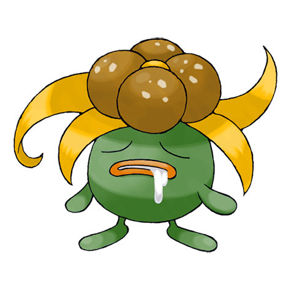
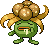
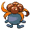
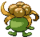
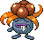
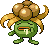
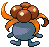
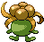

# #044 Gloom (Weed Pokémon)

| Official Artwork | Shiny Artwork |
|------------------|---------------|
|  |  |

The honey it drools from its mouth smells so atrocious, it can curl noses more than a mile away.

---

## Media

### Default Sprites

| Front | Shiny | Back | Shiny |
|-------|-------|------|-------|
|  |  |  |  |

### Female Sprites

| Front | Shiny | Back | Shiny |
|-------|-------|------|-------|
|  |  |  |  |

### Cries

Latest (Gen VI+):

<audio controls>
<source src='../../assets/cries/gloom/latest.ogg' type='audio/ogg'>
  Your browser does not support the audio element.
</audio>

Legacy:

<audio controls>
<source src='../../assets/cries/gloom/legacy.ogg' type='audio/ogg'>
  Your browser does not support the audio element.
</audio>

---

## Pokédex Data

| National № | Type(s) | Height | Weight | Abilities | Local № |
|------------|---------|--------|--------|-----------|---------|
| #44 | {: width="48"} {: width="48"} | 0.8 m / 2.6 ft | 8.6 kg / 19.0 lbs | 1. Chlorophyll 2. Stench | N/A |

---

## Base Stats
|   | HP | Attack | Defense | Sp. Atk | Sp. Def | Speed |
|---|----|--------|---------|---------|---------|-------|
| **Base** | 60 | 65 | 70 | 85 | 75 | 40 |
| **Min** | 230 | 121 | 130 | 157 | 139 | 76 |
| **Max** | 324 | 251 | 262 | 295 | 273 | 196 |

The ranges shown above are for a level 100 Pokémon. Maximum values are based on a beneficial nature, 252 EVs, 31 IVs; minimum values are based on a hindering nature, 0 EVs, 0 IVs.

---

## Forms & Evolutions

!!! warning "WARNING"

    Information on evolutions may not be 100% accurate; differences between evolution methods across generations are not accounted for.

### Forms

Gloom has no alternate forms.

### Evolution Line

1. [Oddish](oddish.md/)
    1. Level Up: [Gloom](gloom.md/)
        1. Use Item: [Vileplume](vileplume.md/)

        2. Use Item: [Bellossom](bellossom.md/)

---

## Training

| EV Yield | Catch Rate | Base Friendship | Base Exp. | Growth Rate | Held Items |
|----------|------------|-----------------|-----------|-------------|------------|
| 2 Sp. Atk | 120 | 50 | 138 | Medium Slo |

---

## Breeding

| Egg Groups | Egg Cycles | Gender | Dimorphic | Color | Shape |
|------------|------------|--------|-----------|-------|-------|
| 1. Plant | 20 | 50.0% Male 50.0% Female | True | Blue | Humanoid |

---

## Moves

!!! warning "WARNING"

    Specific move information may be incorrect. However, the general movepool should be accurate; this includes changes made in Blaze Black and Volt White.

### Level Up Moves

| Lv. | Move | Type | Cat. | Power | Acc. | PP |
| --- | --- | --- | --- | --- | --- | --- |
| 1 | Absorb | {: width="48"} | {: width="36"} | 50 | 100 | 25 |
| 1 | Acid | {: width="48"} | {: width="36"} | 40 | 100 | 30 |
| 1 | Sweet Scent | {: width="48"} | {: width="36"} | — | 100 | 20 |
| 5 | Sweet Scent | {: width="48"} | {: width="36"} | — | 100 | 20 |
| 9 | Acid | {: width="48"} | {: width="36"} | 40 | 100 | 30 |
| 11 | Razor Leaf | {: width="48"} | {: width="36"} | 55 | 95 | 25 |
| 13 | Poison Powder | {: width="48"} | {: width="36"} | — | 75 | 35 |
| 15 | Stun Spore | {: width="48"} | {: width="36"} | — | 75 | 30 |
| 17 | Sleep Powder | {: width="48"} | {: width="36"} | — | 75 | 15 |
| 19 | Nature Power | {: width="48"} | {: width="36"} | — | — | 20 |
| 21 | Drain Punch | {: width="48"} | {: width="36"} | 75 | 100 | 10 |
| 23 | Mega Drain | {: width="48"} | {: width="36"} | 50 | 100 | 15 |
| 26 | Teeter Dance | {: width="48"} | {: width="36"} | — | 100 | 20 |
| 29 | Lucky Chant | {: width="48"} | {: width="36"} | — | — | 30 |
| 35 | Natural Gift | {: width="48"} | {: width="36"} | — | 100 | 15 |
| 41 | Moonlight | {: width="48"} | {: width="36"} | — | — | 5 |
| 47 | Giga Drain | {: width="48"} | {: width="36"} | 75 | 100 | 10 |
| 53 | Petal Dance | {: width="48"} | {: width="36"} | 120 | 100 | 10 |

### TM Moves

| TM | Move | Type | Cat. | Power | Acc. | PP |
| --- | --- | --- | --- | --- | --- | --- |
| HM01 | Cut | {: width="48"} | {: width="36"} | 60 | 100% | 25 |
| TM06 | Toxic | {: width="48"} | {: width="36"} | — | 90 | 10 |
| TM09 | Venoshock | {: width="48"} | {: width="36"} | 65 | 100 | 10 |
| TM10 | Hidden Power | {: width="48"} | {: width="36"} | 60 | 100 | 15 |
| TM11 | Sunny Day | {: width="48"} | {: width="36"} | — | — | 5 |
| TM17 | Protect | {: width="48"} | {: width="36"} | — | — | 10 |
| TM21 | Frustration | {: width="48"} | {: width="36"} | — | 100 | 20 |
| TM22 | Solar Beam | {: width="48"} | {: width="36"} | 120 | 100 | 10 |
| TM27 | Return | {: width="48"} | {: width="36"} | — | 100 | 20 |
| TM32 | Double Team | {: width="48"} | {: width="36"} | — | — | 15 |
| TM36 | Sludge Bomb | {: width="48"} | {: width="36"} | 90 | 100 | 10 |
| TM42 | Facade | {: width="48"} | {: width="36"} | 70 | 100 | 20 |
| TM44 | Rest | {: width="48"} | {: width="36"} | — | — | 5 |
| TM45 | Attract | {: width="48"} | {: width="36"} | — | 100 | 15 |
| TM48 | Round | {: width="48"} | {: width="36"} | 60 | 100 | 15 |
| TM53 | Energy Ball | {: width="48"} | {: width="36"} | 90 | 100 | 10 |
| TM56 | Fling | {: width="48"} | {: width="36"} | — | 100 | 10 |
| TM70 | Flash | {: width="48"} | {: width="36"} | — | 100 | 20 |
| TM75 | Swords Dance | {: width="48"} | {: width="36"} | — | — | 20 |
| TM86 | Grass Knot | {: width="48"} | {: width="36"} | — | 100 | 20 |
| TM87 | Swagger | {: width="48"} | {: width="36"} | — | 85 | 15 |
| TM90 | Substitute | {: width="48"} | {: width="36"} | — | — | 10 |

### Egg Moves

Gloom cannot learn any moves by breeding.
### Tutor Moves

Gloom cannot learn any moves from tutors.
