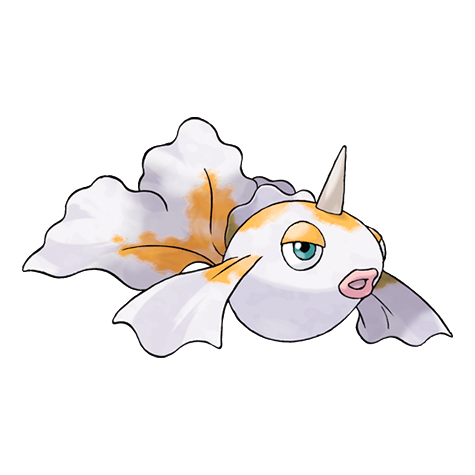
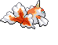
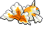
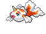
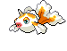
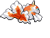
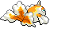

# #118 Goldeen (Goldfish Pokémon)

| Official Artwork | Shiny Artwork |
|------------------|---------------|
|  |  |

Though it appears very elegant when swimming with fins unfurled, it can jab powerfully with its horn.

---

## Media

### Default Sprites

| Front | Shiny | Back | Shiny |
|-------|-------|------|-------|
|  |  |  |  |

### Female Sprites

| Front | Shiny | Back | Shiny |
|-------|-------|------|-------|
|  |  |  |  |

### Cries

Latest (Gen VI+):

<audio controls>
<source src='../../assets/cries/goldeen/latest.ogg' type='audio/ogg'>
  Your browser does not support the audio element.
</audio>

Legacy:

<audio controls>
<source src='../../assets/cries/goldeen/legacy.ogg' type='audio/ogg'>
  Your browser does not support the audio element.
</audio>

---

## Pokédex Data

| National № | Type(s) | Height | Weight | Abilities | Local № |
|------------|---------|--------|--------|-----------|---------|
| #118 | {: width="48"} | 0.6 m / 2.0 ft | 15.0 kg / 33.1 lbs | 1. Swift Swim 2. Lightning Rod | #78 |

---

## Base Stats
|   | HP | Attack | Defense | Sp. Atk | Sp. Def | Speed |
|---|----|--------|---------|---------|---------|-------|
| **Base** | 45 | 67 | 60 | 35 | 50 | 63 |
| **Min** | 200 | 125 | 112 | 67 | 94 | 117 |
| **Max** | 294 | 256 | 240 | 185 | 218 | 247 |

The ranges shown above are for a level 100 Pokémon. Maximum values are based on a beneficial nature, 252 EVs, 31 IVs; minimum values are based on a hindering nature, 0 EVs, 0 IVs.

---

## Forms & Evolutions

!!! warning "WARNING"

    Information on evolutions may not be 100% accurate; differences between evolution methods across generations are not accounted for.

### Forms

Goldeen has no alternate forms.

### Evolution Line

1. [Goldeen](goldeen.md/)
    1. Level Up: [Seaking](seaking.md/)

---

## Training

| EV Yield | Catch Rate | Base Friendship | Base Exp. | Growth Rate | Held Items |
|----------|------------|-----------------|-----------|-------------|------------|
| 1 Atk | 225 | 50 | 64 | Mediu |

---

## Breeding

| Egg Groups | Egg Cycles | Gender | Dimorphic | Color | Shape |
|------------|------------|--------|-----------|-------|-------|
| 1. Water2 | 20 | 50.0% Male 50.0% Female | True | Red | Fish |

---

## Moves

!!! warning "WARNING"

    Specific move information may be incorrect. However, the general movepool should be accurate; this includes changes made in Blaze Black and Volt White.

### Level Up Moves

| Lv. | Move | Type | Cat. | Power | Acc. | PP |
| --- | --- | --- | --- | --- | --- | --- |
| 1 | Peck | {: width="48"} | {: width="36"} | 35 | 100 | 35 |
| 1 | Swords Dance | {: width="48"} | {: width="36"} | — | — | 20 |
| 1 | Tail Whip | {: width="48"} | {: width="36"} | — | 100 | 30 |
| 1 | Water Sport | {: width="48"} | {: width="36"} | — | — | 15 |
| 7 | Supersonic | {: width="48"} | {: width="36"} | — | 55 | 20 |
| 11 | Horn Attack | {: width="48"} | {: width="36"} | 65 | 100 | 25 |
| 17 | Water Pulse | {: width="48"} | {: width="36"} | 60 | 100 | 20 |
| 21 | Flail | {: width="48"} | {: width="36"} | — | 100 | 15 |
| 27 | Aqua Ring | {: width="48"} | {: width="36"} | — | — | 20 |
| 31 | Fury Attack | {: width="48"} | {: width="36"} | 15 | 85 | 20 |
| 37 | Waterfall | {: width="48"} | {: width="36"} | 85 | 100 | 15 |
| 41 | Drill Run | {: width="48"} | {: width="36"} | 80 | 95 | 10 |
| 47 | Agility | {: width="48"} | {: width="36"} | — | — | 30 |
| 51 | Soak | {: width="48"} | {: width="36"} | — | 100 | 20 |
| 57 | Megahorn | {: width="48"} | {: width="36"} | 120 | 85 | 10 |
| 64 | Bounce | {: width="48"} | {: width="36"} | 85 | 85 | 5 |

### TM Moves

| TM | Move | Type | Cat. | Power | Acc. | PP |
| --- | --- | --- | --- | --- | --- | --- |
| HM03 | Surf | {: width="48"} | {: width="36"} | 90 | 100 | 15 |
| HM05 | Waterfall | {: width="48"} | {: width="36"} | 85 | 100 | 15 |
| HM06 | Dive | {: width="48"} | {: width="36"} | 80 | 100 | 10 |
| TM06 | Toxic | {: width="48"} | {: width="36"} | — | 90 | 10 |
| TM07 | Hail | {: width="48"} | {: width="36"} | — | — | 10 |
| TM10 | Hidden Power | {: width="48"} | {: width="36"} | 60 | 100 | 15 |
| TM13 | Ice Beam | {: width="48"} | {: width="36"} | 90 | 100 | 10 |
| TM14 | Blizzard | {: width="48"} | {: width="36"} | 110 | 70 | 5 |
| TM17 | Protect | {: width="48"} | {: width="36"} | — | — | 10 |
| TM18 | Rain Dance | {: width="48"} | {: width="36"} | — | — | 5 |
| TM21 | Frustration | {: width="48"} | {: width="36"} | — | 100 | 20 |
| TM27 | Return | {: width="48"} | {: width="36"} | — | 100 | 20 |
| TM32 | Double Team | {: width="48"} | {: width="36"} | — | — | 15 |
| TM42 | Facade | {: width="48"} | {: width="36"} | 70 | 100 | 20 |
| TM44 | Rest | {: width="48"} | {: width="36"} | — | — | 5 |
| TM45 | Attract | {: width="48"} | {: width="36"} | — | 100 | 15 |
| TM48 | Round | {: width="48"} | {: width="36"} | 60 | 100 | 15 |
| TM55 | Scald | {: width="48"} | {: width="36"} | 80 | 100 | 15 |
| TM84 | Poison Jab | {: width="48"} | {: width="36"} | 80 | 100 | 20 |
| TM87 | Swagger | {: width="48"} | {: width="36"} | — | 85 | 15 |
| TM90 | Substitute | {: width="48"} | {: width="36"} | — | — | 10 |

### Egg Moves

| Move | Type | Cat. | Power | Acc. | PP |
| --- | --- | --- | --- | --- | --- |
| Body Slam | {: width="48"} | {: width="36"} | 85 | 100 | 15 |
| Hydro Pump | {: width="48"} | {: width="36"} | 110 | 80 | 5 |
| Psybeam | {: width="48"} | {: width="36"} | 65 | 100 | 20 |
| Haze | {: width="48"} | {: width="36"} | — | — | 30 |
| Skull Bash | {: width="48"} | {: width="36"} | 130 | 100 | 10 |
| Mud Slap | {: width="48"} | {: width="36"} | 20 | 100 | 10 |
| Sleep Talk | {: width="48"} | {: width="36"} | — | — | 10 |
| Mud Sport | {: width="48"} | {: width="36"} | — | — | 15 |
| Signal Beam | {: width="48"} | {: width="36"} | 75 | 100 | 15 |
| Mud Shot | {: width="48"} | {: width="36"} | 55 | 95 | 15 |
| Aqua Tail | {: width="48"} | {: width="36"} | 90 | 90 | 10 |

### Tutor Moves

Goldeen cannot learn any moves from tutors.
