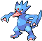
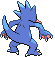

# #055 Golduck (Duck Pokémon)

| Official Artwork | Shiny Artwork |
|------------------|---------------|
|  |  |

It is seen swimming dynamically and elegantly using its well-developed limbs and flippers.

---

## Media

### Default Sprites

| Front | Shiny | Back | Shiny |
|-------|-------|------|-------|
|  |  |  |  |

### Cries

Latest (Gen VI+):

<audio controls>
<source src='../../assets/cries/golduck/latest.ogg' type='audio/ogg'>
  Your browser does not support the audio element.
</audio>

Legacy:

<audio controls>
<source src='../../assets/cries/golduck/legacy.ogg' type='audio/ogg'>
  Your browser does not support the audio element.
</audio>

---

## Pokédex Data

| National № | Type(s) | Height | Weight | Abilities | Local № |
|------------|---------|--------|--------|-----------|---------|
| #55 | {: width="48"} | 1.7 m / 5.6 ft | 76.6 kg / 168.9 lbs | 1. Swift Swim 2. Cloud Nine | #44 |

---

## Base Stats
|   | HP | Attack | Defense | Sp. Atk | Sp. Def | Speed |
|---|----|--------|---------|---------|---------|-------|
| **Base** | 80 | 82 | 78 | 95 | 80 | 85 |
| **Min** | 270 | 152 | 144 | 175 | 148 | 157 |
| **Max** | 364 | 289 | 280 | 317 | 284 | 295 |

The ranges shown above are for a level 100 Pokémon. Maximum values are based on a beneficial nature, 252 EVs, 31 IVs; minimum values are based on a hindering nature, 0 EVs, 0 IVs.

---

## Forms & Evolutions

!!! warning "WARNING"

    Information on evolutions may not be 100% accurate; differences between evolution methods across generations are not accounted for.

### Forms

Golduck has no alternate forms.

### Evolution Line

1. [Psyduck](psyduck.md/)
    1. Level Up: [Golduck](golduck.md/)

---

## Training

| EV Yield | Catch Rate | Base Friendship | Base Exp. | Growth Rate | Held Items |
|----------|------------|-----------------|-----------|-------------|------------|
| 2 Sp. Atk | 75 | 50 | 175 | Medium | N/A |

---

## Breeding

| Egg Groups | Egg Cycles | Gender | Dimorphic | Color | Shape |
|------------|------------|--------|-----------|-------|-------|
| 1. Water1 2. Ground | 20 | 50.0% Male 50.0% Female | False | Blue | Upright |

---

## Moves

!!! warning "WARNING"

    Specific move information may be incorrect. However, the general movepool should be accurate; this includes changes made in Blaze Black and Volt White.

### Level Up Moves

| Lv. | Move | Type | Cat. | Power | Acc. | PP |
| --- | --- | --- | --- | --- | --- | --- |
| 1 | Aqua Jet | {: width="48"} | {: width="36"} | 40 | 100 | 20 |
| 1 | Scratch | {: width="48"} | {: width="36"} | 40 | 100 | 35 |
| 1 | Tail Whip | {: width="48"} | {: width="36"} | — | 100 | 30 |
| 1 | Water Gun | {: width="48"} | {: width="36"} | 40 | 100 | 25 |
| 1 | Water Sport | {: width="48"} | {: width="36"} | — | — | 15 |
| 5 | Tail Whip | {: width="48"} | {: width="36"} | — | 100 | 30 |
| 9 | Water Gun | {: width="48"} | {: width="36"} | 40 | 100 | 25 |
| 12 | Hypnosis | {: width="48"} | {: width="36"} | — | 60 | 20 |
| 14 | Disable | {: width="48"} | {: width="36"} | — | 100 | 20 |
| 18 | Confusion | {: width="48"} | {: width="36"} | 50 | 100 | 25 |
| 22 | Water Pulse | {: width="48"} | {: width="36"} | 60 | 100 | 20 |
| 25 | Psybeam | {: width="48"} | {: width="36"} | 65 | 100 | 20 |
| 27 | Fury Swipes | {: width="48"} | {: width="36"} | 18 | 80 | 15 |
| 31 | Screech | {: width="48"} | {: width="36"} | — | 85 | 40 |
| 33 | Cross Chop | {: width="48"} | {: width="36"} | 100 | 80 | 5 |
| 37 | Soak | {: width="48"} | {: width="36"} | — | 100 | 20 |
| 44 | Psych Up | {: width="48"} | {: width="36"} | — | — | 10 |
| 50 | Zen Headbutt | {: width="48"} | {: width="36"} | 80 | 90 | 15 |
| 56 | Amnesia | {: width="48"} | {: width="36"} | — | — | 20 |
| 63 | Hydro Pump | {: width="48"} | {: width="36"} | 110 | 80 | 5 |
| 69 | Wonder Room | {: width="48"} | {: width="36"} | — | — | 10 |

### TM Moves

| TM | Move | Type | Cat. | Power | Acc. | PP |
| --- | --- | --- | --- | --- | --- | --- |
| HM03 | Surf | {: width="48"} | {: width="36"} | 90 | 100 | 15 |
| HM04 | Strength | {: width="48"} | {: width="36"} | 100 | 100 | 15 |
| HM05 | Waterfall | {: width="48"} | {: width="36"} | 85 | 100 | 15 |
| HM06 | Dive | {: width="48"} | {: width="36"} | 80 | 100 | 10 |
| TM01 | Hone Claws | {: width="48"} | {: width="36"} | — | — | 15 |
| TM03 | Psyshock | {: width="48"} | {: width="36"} | 80 | 100 | 10 |
| TM04 | Calm Mind | {: width="48"} | {: width="36"} | — | — | 20 |
| TM06 | Toxic | {: width="48"} | {: width="36"} | — | 90 | 10 |
| TM07 | Hail | {: width="48"} | {: width="36"} | — | — | 10 |
| TM10 | Hidden Power | {: width="48"} | {: width="36"} | 60 | 100 | 15 |
| TM13 | Ice Beam | {: width="48"} | {: width="36"} | 90 | 100 | 10 |
| TM14 | Blizzard | {: width="48"} | {: width="36"} | 110 | 70 | 5 |
| TM15 | Hyper Beam | {: width="48"} | {: width="36"} | 150 | 90 | 5 |
| TM16 | Light Screen | {: width="48"} | {: width="36"} | — | — | 30 |
| TM17 | Protect | {: width="48"} | {: width="36"} | — | — | 10 |
| TM18 | Rain Dance | {: width="48"} | {: width="36"} | — | — | 5 |
| TM19 | Telekinesis | {: width="48"} | {: width="36"} | — | — | 15 |
| TM21 | Frustration | {: width="48"} | {: width="36"} | — | 100 | 20 |
| TM27 | Return | {: width="48"} | {: width="36"} | — | 100 | 20 |
| TM28 | Dig | {: width="48"} | {: width="36"} | 100 | 100 | 10 |
| TM29 | Psychic | {: width="48"} | {: width="36"} | 90 | 100 | 10 |
| TM31 | Brick Break | {: width="48"} | {: width="36"} | 75 | 100 | 15 |
| TM32 | Double Team | {: width="48"} | {: width="36"} | — | — | 15 |
| TM40 | Aerial Ace | {: width="48"} | {: width="36"} | 60 | — | 20 |
| TM42 | Facade | {: width="48"} | {: width="36"} | 70 | 100 | 20 |
| TM44 | Rest | {: width="48"} | {: width="36"} | — | — | 5 |
| TM45 | Attract | {: width="48"} | {: width="36"} | — | 100 | 15 |
| TM47 | Low Sweep | {: width="48"} | {: width="36"} | 65 | 100 | 20 |
| TM48 | Round | {: width="48"} | {: width="36"} | 60 | 100 | 15 |
| TM52 | Focus Blast | {: width="48"} | {: width="36"} | 120 | 70 | 5 |
| TM55 | Scald | {: width="48"} | {: width="36"} | 80 | 100 | 15 |
| TM56 | Fling | {: width="48"} | {: width="36"} | — | 100 | 10 |
| TM65 | Shadow Claw | {: width="48"} | {: width="36"} | 80 | 100 | 15 |
| TM68 | Giga Impact | {: width="48"} | {: width="36"} | 150 | 90 | 5 |
| TM70 | Flash | {: width="48"} | {: width="36"} | — | 100 | 20 |
| TM77 | Psych Up | {: width="48"} | {: width="36"} | — | — | 10 |
| TM87 | Swagger | {: width="48"} | {: width="36"} | — | 85 | 15 |
| TM90 | Substitute | {: width="48"} | {: width="36"} | — | — | 10 |
| TM94 | Rock Smash | {: width="48"} | {: width="36"} | 60 | 100 | 15 |

### Egg Moves

Golduck cannot learn any moves by breeding.
### Tutor Moves

Golduck cannot learn any moves from tutors.
