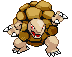
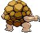

# #076 Golem (Megaton Pokémon)

| Official Artwork | Shiny Artwork |
| --- | --- |
|  |  |

Even dynamite can’t harm its hard, boulderlike body. It sheds its hide just once a year.

---

## Media

### Sprites

| Front | Back | Front Shiny | Back Shiny |
| --- | --- | --- | --- |
|  |  |  |  |

### Cries

Latest (Gen VI+):

<audio controls>
  <source src='../assets/cries/golem/latest.ogg' type='audio/ogg'>
  Your browser does not support the audio element.
</audio>

Legacy:

<audio controls>
  <source src='../assets/cries/golem/legacy.ogg' type='audio/ogg'>
  Your browser does not support the audio element.
</audio>

---

## Pokédex Data

| National № | Type(s) | Height | Weight | Abilities | Local № |
|------------|---------|--------|--------|-----------|---------|
| #76 | {: width='48'} {: width='48'} | 1.4 m | 300.0 kg | 1. Rock-Head 2. Sturdy | #N/A |

---

## Base Stats
---

## Base Stats
|   | HP | Attack | Defense | Sp. Atk | Sp. Def | Speed |
|---|----|--------|---------|---------|---------|-------|
| **Base** | 90 | 120 | 130 | 55 | 65 | 45 |
| **Min** | 290 | 220 | 238 | 103 | 121 | 85 |
| **Max** | 384 | 372 | 394 | 229 | 251 | 207 |

The ranges shown above are for a level 100 Pokémon. Maximum values are based on a beneficial nature, 252 EVs, 31 IVs; minimum values are based on a hindering nature, 0 EVs, 0 IVs.

---

## Forms & Evolutions

!!! warning "WARNING"

    Some forms may not be available in Blaze Black/Volt White. Also information on evolutions may not be 100% accurate; it is currently quite complex to track generational evolution data.

### Forms

1. [Golem](golem.md/)
2. [Golem-Alola](golem-alola.md/)

### Evolution Line

1. [Geodude](geodude.md/)
1. Level Up: [Graveler](graveler.md/)
1. Trade: [Golem](golem.md/)

---

## Training

| EV Yield | Catch Rate | Base Friendship | Base Exp. | Growth Rate | Held Items |
|----------|------------|-----------------|-----------|-------------|------------|
| 3 Defense | 45 | 70 | 223 | Medium-Slow | Everstone (5%) |

---

## Breeding

| Egg Groups | Egg Cycles | Gender | Dimorphic | Color | Shape |
|------------|------------|--------|-----------|-------|-------|
| 1. Mineral | 15 | 50.0% Male 50.0% Female | False | Brown | Humanoid |

---

## Moves

!!! warning "WARNING"

    Specific move information may be incorrect. However, the general movepool should be accurate (including changes to learnset).

### Level Up Moves

Lv. | Move | Type | Cat. | Power | Acc. | PP
--- | --- | --- | --- | --- | --- | ---
| 1 | Defense Curl | {: width='48'} | {: width='36'} | — | — | 40 |
| 1 | Fire Punch | {: width='48'} | {: width='36'} | 80 | 100 | 15 |
| 1 | Mud Sport | {: width='48'} | {: width='36'} | — | — | 15 |
| 1 | Rapid Spin | {: width='48'} | {: width='36'} | 50 | 100 | 40 |
| 1 | Rock Polish | {: width='48'} | {: width='36'} | — | — | 20 |
| 1 | Tackle | {: width='48'} | {: width='36'} | 40 | 100 | 35 |
| 1 | Thunder Punch | {: width='48'} | {: width='36'} | 80 | 100 | 15 |
| 4 | Mud Sport | {: width='48'} | {: width='36'} | — | — | 15 |
| 8 | Rock Polish | {: width='48'} | {: width='36'} | — | — | 20 |
| 11 | Rock Throw | {: width='48'} | {: width='36'} | 50 | 90 | 15 |
| 15 | Magnitude | {: width='48'} | {: width='36'} | — | 100 | 30 |
| 18 | Bulldoze | {: width='48'} | {: width='36'} | 80 | 100 | 20 |
| 22 | Rock Blast | {: width='48'} | {: width='36'} | 25 | 90 | 10 |
| 27 | Smack Down | {: width='48'} | {: width='36'} | 50 | 100 | 15 |
| 31 | Self Destruct | {: width='48'} | {: width='36'} | 200 | 100 | 5 |
| 36 | Steamroller | {: width='48'} | {: width='36'} | 80 | 100 | 20 |
| 42 | Stealth Rock | {: width='48'} | {: width='36'} | — | — | 20 |
| 47 | Earthquake | {: width='48'} | {: width='36'} | 100 | 100 | 10 |
| 53 | Explosion | {: width='48'} | {: width='36'} | 250 | 100 | 5 |
| 58 | Double Edge | {: width='48'} | {: width='36'} | 120 | 100 | 15 |
| 64 | Stone Edge | {: width='48'} | {: width='36'} | 100 | 80 | 5 |
| 69 | Heavy Slam | {: width='48'} | {: width='36'} | — | 100 | 10 |
| 70 | Hammer Arm | {: width='48'} | {: width='36'} | 100 | 90 | 10 |

### TM Moves

TM | Move | Type | Cat. | Power | Acc. | PP
--- | --- | --- | --- | --- | --- | ---
| HM04 | Strength | {: width='48'} | {: width='36'} | 85 | 100 | 15 |
| TM05 | Roar | {: width='48'} | {: width='36'} | — | — | 20 |
| TM06 | Toxic | {: width='48'} | {: width='36'} | — | 90 | 10 |
| TM10 | Hidden Power | {: width='48'} | {: width='36'} | 60 | 100 | 15 |
| TM11 | Sunny Day | {: width='48'} | {: width='36'} | — | — | 5 |
| TM15 | Hyper Beam | {: width='48'} | {: width='36'} | 150 | 90 | 5 |
| TM17 | Protect | {: width='48'} | {: width='36'} | — | — | 10 |
| TM21 | Frustration | {: width='48'} | {: width='36'} | — | 100 | 20 |
| TM23 | Smack Down | {: width='48'} | {: width='36'} | 50 | 100 | 15 |
| TM26 | Earthquake | {: width='48'} | {: width='36'} | 100 | 100 | 10 |
| TM27 | Return | {: width='48'} | {: width='36'} | — | 100 | 20 |
| TM28 | Dig | {: width='48'} | {: width='36'} | 100 | 100 | 10 |
| TM31 | Brick Break | {: width='48'} | {: width='36'} | 75 | 100 | 15 |
| TM32 | Double Team | {: width='48'} | {: width='36'} | — | — | 15 |
| TM35 | Flamethrower | {: width='48'} | {: width='36'} | 90 | 100 | 15 |
| TM37 | Sandstorm | {: width='48'} | {: width='36'} | — | — | 10 |
| TM38 | Fire Blast | {: width='48'} | {: width='36'} | 110 | 85 | 5 |
| TM39 | Rock Tomb | {: width='48'} | {: width='36'} | 60 | 95 | 15 |
| TM42 | Facade | {: width='48'} | {: width='36'} | 70 | 100 | 20 |
| TM44 | Rest | {: width='48'} | {: width='36'} | — | — | 5 |
| TM45 | Attract | {: width='48'} | {: width='36'} | — | 100 | 15 |
| TM48 | Round | {: width='48'} | {: width='36'} | 60 | 100 | 15 |
| TM52 | Focus Blast | {: width='48'} | {: width='36'} | 120 | 70 | 5 |
| TM56 | Fling | {: width='48'} | {: width='36'} | — | 100 | 10 |
| TM59 | Incinerate | {: width='48'} | {: width='36'} | 50 | 100 | 15 |
| TM64 | Explosion | {: width='48'} | {: width='36'} | 250 | 100 | 5 |
| TM68 | Giga Impact | {: width='48'} | {: width='36'} | 150 | 90 | 5 |
| TM69 | Rock Polish | {: width='48'} | {: width='36'} | — | — | 20 |
| TM71 | Stone Edge | {: width='48'} | {: width='36'} | 100 | 80 | 5 |
| TM74 | Gyro Ball | {: width='48'} | {: width='36'} | — | 100 | 5 |
| TM78 | Bulldoze | {: width='48'} | {: width='36'} | 80 | 100 | 20 |
| TM80 | Rock Slide | {: width='48'} | {: width='36'} | 80 | 95 | 10 |
| TM87 | Swagger | {: width='48'} | {: width='36'} | — | 85 | 15 |
| TM90 | Substitute | {: width='48'} | {: width='36'} | — | — | 10 |
| TM94 | Rock Smash | {: width='48'} | {: width='36'} | 40 | 100 | 15 |

### Egg Moves

Golem cannot learn any moves by breeding.
### Tutor Moves

Golem cannot learn any moves from tutors.
