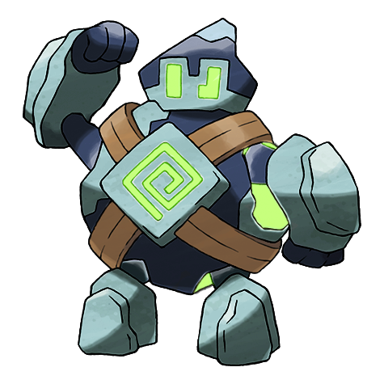
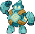
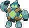
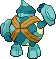
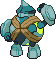

# #622 Golett (Automaton Pokémon)

| Official Artwork | Shiny Artwork |
|------------------|---------------|
|  |  |

**Blaze Black:** The energy that burns inside it enables it to move, but no one has yet been able to identify this energy.

**Volt White:** These Pokémon are thought to have been created by the science of an ancient and mysterious civilization.

---

## Media

### Default Sprites

| Front | Shiny | Back | Shiny |
|-------|-------|------|-------|
|  |  |  |  |

### Cries

Latest (Gen VI+):

<audio controls>
<source src='../../assets/cries/golett/latest.ogg' type='audio/ogg'>
  Your browser does not support the audio element.
</audio>

Legacy:

<audio controls>
<source src='../../assets/cries/golett/legacy.ogg' type='audio/ogg'>
  Your browser does not support the audio element.
</audio>

---

## Pokédex Data

| National № | Type(s) | Height | Weight | Abilities | Local № |
|------------|---------|--------|--------|-----------|---------|
| #622 | {: width="48"} {: width="48"} | 1.0 m / 3.3 ft | 92.0 kg / 202.8 lbs | 1. Iron Fist 2. Klutz | N/A |

---

## Base Stats
|   | HP | Attack | Defense | Sp. Atk | Sp. Def | Speed |
|---|----|--------|---------|---------|---------|-------|
| **Base** | 59 | 74 | 50 | 35 | 50 | 35 |
| **Min** | 228 | 137 | 94 | 67 | 94 | 67 |
| **Max** | 322 | 271 | 218 | 185 | 218 | 185 |

The ranges shown above are for a level 100 Pokémon. Maximum values are based on a beneficial nature, 252 EVs, 31 IVs; minimum values are based on a hindering nature, 0 EVs, 0 IVs.

---

## Forms & Evolutions

!!! warning "WARNING"

    Information on evolutions may not be 100% accurate; differences between evolution methods across generations are not accounted for.

### Forms

Golett has no alternate forms.

### Evolution Line

1. [Golett](golett.md/)
    1. Level Up: [Golurk](golurk.md/)

### Evolution Changes

1. Level 36

---

## Training

| EV Yield | Catch Rate | Base Friendship | Base Exp. | Growth Rate | Held Items |
|----------|------------|-----------------|-----------|-------------|------------|
| 1 Atk | 190 | 50 | 61 | Medium | Light Clay (5%) |

---

## Breeding

| Egg Groups | Egg Cycles | Gender | Dimorphic | Color | Shape |
|------------|------------|--------|-----------|-------|-------|
| 1. Mineral | 25 | Genderless | False | Green | Humanoid |

---

## Moves

!!! warning "WARNING"

    Specific move information may be incorrect. However, the general movepool should be accurate; this includes changes made in Blaze Black and Volt White.

### Level Up Moves

| Lv. | Move | Type | Cat. | Power | Acc. | PP |
| --- | --- | --- | --- | --- | --- | --- |
| 1 | Astonish | {: width="48"} | {: width="36"} | 30 | 100 | 15 |
| 1 | Defense Curl | {: width="48"} | {: width="36"} | — | — | 40 |
| 1 | Pound | {: width="48"} | {: width="36"} | 40 | 100 | 35 |
| 5 | Mud Slap | {: width="48"} | {: width="36"} | 20 | 100 | 10 |
| 9 | Rollout | {: width="48"} | {: width="36"} | 30 | 90 | 20 |
| 13 | Shadow Punch | {: width="48"} | {: width="36"} | 70 | — | 15 |
| 17 | Iron Defense | {: width="48"} | {: width="36"} | — | — | 15 |
| 21 | Mega Punch | {: width="48"} | {: width="36"} | 80 | 85 | 20 |
| 25 | Magnitude | {: width="48"} | {: width="36"} | — | 100 | 30 |
| 30 | Dynamic Punch | {: width="48"} | {: width="36"} | 100 | 50 | 5 |
| 35 | Night Shade | {: width="48"} | {: width="36"} | — | 100 | 15 |
| 40 | Curse | {: width="48"} | {: width="36"} | — | — | 10 |
| 45 | Earthquake | {: width="48"} | {: width="36"} | 100 | 100 | 10 |
| 50 | Hammer Arm | {: width="48"} | {: width="36"} | 100 | 90 | 10 |
| 55 | Focus Punch | {: width="48"} | {: width="36"} | 150 | 100 | 20 |

### TM Moves

| TM | Move | Type | Cat. | Power | Acc. | PP |
| --- | --- | --- | --- | --- | --- | --- |
| HM04 | Strength | {: width="48"} | {: width="36"} | 100 | 100 | 15 |
| TM06 | Toxic | {: width="48"} | {: width="36"} | — | 90 | 10 |
| TM10 | Hidden Power | {: width="48"} | {: width="36"} | 60 | 100 | 15 |
| TM13 | Ice Beam | {: width="48"} | {: width="36"} | 90 | 100 | 10 |
| TM17 | Protect | {: width="48"} | {: width="36"} | — | — | 10 |
| TM18 | Rain Dance | {: width="48"} | {: width="36"} | — | — | 5 |
| TM19 | Telekinesis | {: width="48"} | {: width="36"} | — | — | 15 |
| TM20 | Safeguard | {: width="48"} | {: width="36"} | — | — | 25 |
| TM21 | Frustration | {: width="48"} | {: width="36"} | — | 100 | 20 |
| TM26 | Earthquake | {: width="48"} | {: width="36"} | 100 | 100 | 10 |
| TM27 | Return | {: width="48"} | {: width="36"} | — | 100 | 20 |
| TM29 | Psychic | {: width="48"} | {: width="36"} | 90 | 100 | 10 |
| TM30 | Shadow Ball | {: width="48"} | {: width="36"} | 90 | 100 | 15 |
| TM31 | Brick Break | {: width="48"} | {: width="36"} | 75 | 100 | 15 |
| TM32 | Double Team | {: width="48"} | {: width="36"} | — | — | 15 |
| TM39 | Rock Tomb | {: width="48"} | {: width="36"} | 60 | 95 | 15 |
| TM42 | Facade | {: width="48"} | {: width="36"} | 70 | 100 | 20 |
| TM44 | Rest | {: width="48"} | {: width="36"} | — | — | 5 |
| TM46 | Thief | {: width="48"} | {: width="36"} | 60 | 100 | 25 |
| TM47 | Low Sweep | {: width="48"} | {: width="36"} | 65 | 100 | 20 |
| TM48 | Round | {: width="48"} | {: width="36"} | 60 | 100 | 15 |
| TM52 | Focus Blast | {: width="48"} | {: width="36"} | 120 | 70 | 5 |
| TM56 | Fling | {: width="48"} | {: width="36"} | — | 100 | 10 |
| TM69 | Rock Polish | {: width="48"} | {: width="36"} | — | — | 20 |
| TM70 | Flash | {: width="48"} | {: width="36"} | — | 100 | 20 |
| TM74 | Gyro Ball | {: width="48"} | {: width="36"} | — | 100 | 5 |
| TM78 | Bulldoze | {: width="48"} | {: width="36"} | 80 | 100 | 20 |
| TM80 | Rock Slide | {: width="48"} | {: width="36"} | 75 | 90 | 10 |
| TM86 | Grass Knot | {: width="48"} | {: width="36"} | — | 100 | 20 |
| TM87 | Swagger | {: width="48"} | {: width="36"} | — | 85 | 15 |
| TM90 | Substitute | {: width="48"} | {: width="36"} | — | — | 10 |
| TM94 | Rock Smash | {: width="48"} | {: width="36"} | 60 | 100 | 15 |

### Egg Moves

Golett cannot learn any moves by breeding.
### Tutor Moves

Golett cannot learn any moves from tutors.
