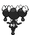

# #575 Gothorita (Manipulate Pokémon)

| Official Artwork | Shiny Artwork |
|------------------|---------------|
|  |  |

**Blaze Black:** They use hypnosis to control people and Pokémon. Tales of Gothorita leading people astray are told in every corner.

**Volt White:** Starlight is the source of their power. At night, they mark star positions by using psychic power to float stones.

---

## Media

### Default Sprites

| Front | Shiny | Back | Shiny |
|-------|-------|------|-------|
|  |  |  |  |

### Cries

Latest (Gen VI+):

<audio controls>
<source src='../../assets/cries/gothorita/latest.ogg' type='audio/ogg'>
  Your browser does not support the audio element.
</audio>

Legacy:

<audio controls>
<source src='../../assets/cries/gothorita/legacy.ogg' type='audio/ogg'>
  Your browser does not support the audio element.
</audio>

---

## Pokédex Data

| National № | Type(s) | Height | Weight | Abilities | Local № |
|------------|---------|--------|--------|-----------|---------|
| #575 | {: width="48"} {: width="48"} | 0.7 m / 2.3 ft | 18.0 kg / 39.7 lbs | 1. Frisk 2. Magic Bounce | N/A |

---

## Base Stats
|   | HP | Attack | Defense | Sp. Atk | Sp. Def | Speed |
|---|----|--------|---------|---------|---------|-------|
| **Base** | 60 | 45 | 70 | 75 | 85 | 55 |
| **Min** | 230 | 85 | 130 | 139 | 157 | 103 |
| **Max** | 324 | 207 | 262 | 273 | 295 | 229 |

The ranges shown above are for a level 100 Pokémon. Maximum values are based on a beneficial nature, 252 EVs, 31 IVs; minimum values are based on a hindering nature, 0 EVs, 0 IVs.

---

## Forms & Evolutions

!!! warning "WARNING"

    Information on evolutions may not be 100% accurate; differences between evolution methods across generations are not accounted for.

### Forms

Gothorita has no alternate forms.

### Evolution Line

1. [Gothita](gothita.md/)
    1. Level Up: [Gothorita](gothorita.md/)
        1. Level Up: [Gothitelle](gothitelle.md/)

---

## Training

| EV Yield | Catch Rate | Base Friendship | Base Exp. | Growth Rate | Held Items |
|----------|------------|-----------------|-----------|-------------|------------|
| 2 Sp. Def | 100 | 50 | 137 | Medium Slo |

---

## Breeding

| Egg Groups | Egg Cycles | Gender | Dimorphic | Color | Shape |
|------------|------------|--------|-----------|-------|-------|
| 1. Humanshape | 20 | 25.0% Male 75.0% Female | False | Purple | Humanoid |

---

## Moves

!!! warning "WARNING"

    Specific move information may be incorrect. However, the general movepool should be accurate; this includes changes made in Blaze Black and Volt White.

### Level Up Moves

| Lv. | Move | Type | Cat. | Power | Acc. | PP |
| --- | --- | --- | --- | --- | --- | --- |
| 1 | Confusion | {: width="48"} | {: width="36"} | 50 | 100 | 25 |
| 1 | Fake Tears | {: width="48"} | {: width="36"} | — | 100 | 20 |
| 1 | Pound | {: width="48"} | {: width="36"} | 40 | 100 | 35 |
| 1 | Tickle | {: width="48"} | {: width="36"} | — | 100 | 20 |
| 3 | Confusion | {: width="48"} | {: width="36"} | 50 | 100 | 25 |
| 7 | Tickle | {: width="48"} | {: width="36"} | — | 100 | 20 |
| 10 | Fake Tears | {: width="48"} | {: width="36"} | — | 100 | 20 |
| 14 | Double Slap | {: width="48"} | {: width="36"} | 15 | 85 | 10 |
| 16 | Psybeam | {: width="48"} | {: width="36"} | 65 | 100 | 20 |
| 19 | Embargo | {: width="48"} | {: width="36"} | — | 100 | 15 |
| 23 | Recover | {: width="48"} | {: width="36"} | — | — | 5 |
| 24 | Feint Attack | {: width="48"} | {: width="36"} | 60 | — | 20 |
| 25 | Psyshock | {: width="48"} | {: width="36"} | 80 | 100 | 10 |
| 28 | Flatter | {: width="48"} | {: width="36"} | — | 100 | 15 |
| 31 | Future Sight | {: width="48"} | {: width="36"} | 120 | 100 | 10 |
| 32 | Dark Pulse | {: width="48"} | {: width="36"} | 90 | 100 | 15 |
| 34 | Heal Block | {: width="48"} | {: width="36"} | — | 100 | 15 |
| 37 | Foul Play | {: width="48"} | {: width="36"} | 95 | 100 | 15 |
| 39 | Psychic | {: width="48"} | {: width="36"} | 90 | 100 | 10 |
| 43 | Telekinesis | {: width="48"} | {: width="36"} | — | — | 15 |
| 47 | Mirror Coat | {: width="48"} | {: width="36"} | — | 100 | 20 |
| 50 | Charm | {: width="48"} | {: width="36"} | — | 100 | 20 |
| 53 | Magic Room | {: width="48"} | {: width="36"} | — | — | 10 |

### TM Moves

| TM | Move | Type | Cat. | Power | Acc. | PP |
| --- | --- | --- | --- | --- | --- | --- |
| TM03 | Psyshock | {: width="48"} | {: width="36"} | 80 | 100 | 10 |
| TM04 | Calm Mind | {: width="48"} | {: width="36"} | — | — | 20 |
| TM06 | Toxic | {: width="48"} | {: width="36"} | — | 90 | 10 |
| TM10 | Hidden Power | {: width="48"} | {: width="36"} | 60 | 100 | 15 |
| TM12 | Taunt | {: width="48"} | {: width="36"} | — | 100 | 20 |
| TM16 | Light Screen | {: width="48"} | {: width="36"} | — | — | 30 |
| TM17 | Protect | {: width="48"} | {: width="36"} | — | — | 10 |
| TM18 | Rain Dance | {: width="48"} | {: width="36"} | — | — | 5 |
| TM19 | Telekinesis | {: width="48"} | {: width="36"} | — | — | 15 |
| TM20 | Safeguard | {: width="48"} | {: width="36"} | — | — | 25 |
| TM21 | Frustration | {: width="48"} | {: width="36"} | — | 100 | 20 |
| TM24 | Thunderbolt | {: width="48"} | {: width="36"} | 90 | 100 | 15 |
| TM27 | Return | {: width="48"} | {: width="36"} | — | 100 | 20 |
| TM29 | Psychic | {: width="48"} | {: width="36"} | 90 | 100 | 10 |
| TM30 | Shadow Ball | {: width="48"} | {: width="36"} | 90 | 100 | 15 |
| TM32 | Double Team | {: width="48"} | {: width="36"} | — | — | 15 |
| TM33 | Reflect | {: width="48"} | {: width="36"} | — | — | 20 |
| TM39 | Rock Tomb | {: width="48"} | {: width="36"} | 60 | 95 | 15 |
| TM41 | Torment | {: width="48"} | {: width="36"} | — | 100 | 15 |
| TM42 | Facade | {: width="48"} | {: width="36"} | 70 | 100 | 20 |
| TM44 | Rest | {: width="48"} | {: width="36"} | — | — | 5 |
| TM45 | Attract | {: width="48"} | {: width="36"} | — | 100 | 15 |
| TM46 | Thief | {: width="48"} | {: width="36"} | 60 | 100 | 25 |
| TM48 | Round | {: width="48"} | {: width="36"} | 60 | 100 | 15 |
| TM53 | Energy Ball | {: width="48"} | {: width="36"} | 90 | 100 | 10 |
| TM56 | Fling | {: width="48"} | {: width="36"} | — | 100 | 10 |
| TM57 | Charge Beam | {: width="48"} | {: width="36"} | 50 | 90 | 10 |
| TM61 | Will O Wisp | {: width="48"} | {: width="36"} | — | 85 | 15 |
| TM63 | Embargo | {: width="48"} | {: width="36"} | — | 100 | 15 |
| TM66 | Payback | {: width="48"} | {: width="36"} | 50 | 100 | 10 |
| TM70 | Flash | {: width="48"} | {: width="36"} | — | 100 | 20 |
| TM73 | Thunder Wave | {: width="48"} | {: width="36"} | — | 90 | 20 |
| TM77 | Psych Up | {: width="48"} | {: width="36"} | — | — | 10 |
| TM80 | Rock Slide | {: width="48"} | {: width="36"} | 75 | 90 | 10 |
| TM85 | Dream Eater | {: width="48"} | {: width="36"} | 100 | 100 | 15 |
| TM86 | Grass Knot | {: width="48"} | {: width="36"} | — | 100 | 20 |
| TM87 | Swagger | {: width="48"} | {: width="36"} | — | 85 | 15 |
| TM90 | Substitute | {: width="48"} | {: width="36"} | — | — | 10 |
| TM92 | Trick Room | {: width="48"} | {: width="36"} | — | — | 5 |

### Egg Moves

Gothorita cannot learn any moves by breeding.
### Tutor Moves

Gothorita cannot learn any moves from tutors.
