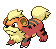
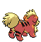

# Growlithe (Puppy Pokémon)

| Official Artwork | Shiny Artwork |
| --- | --- |
|  |  |

A Pokémon with a loyal nature. It will remain motionless until it is given an order by its Trainer.

---

## Media

### Default Sprites

| Front | Back | Front Shiny | Back Shiny |
| --- | --- | --- | --- |
|  |  |  |  |

### Cries

Latest (Gen VI+):

<audio controls>
<source src='../../assets/cries/growlithe/latest.ogg' type='audio/ogg'>
  Your browser does not support the audio element.
</audio>

Legacy:

<audio controls>
<source src='../../assets/cries/growlithe/legacy.ogg' type='audio/ogg'>
  Your browser does not support the audio element.
</audio>

---

## Pokédex Data

| National № | Type(s) | Height | Weight | Abilities | Local № |
|------------|---------|--------|--------|-----------|---------|
| #58 | {: width='48'} | 0.7 m | 19.0 kg | 1. Intimidate 2. Justified | N/A |

---

## Base Stats
|   | HP | Attack | Defense | Sp. Atk | Sp. Def | Speed |
|---|----|--------|---------|---------|---------|-------|
| **Base** | 55 | 70 | 45 | 70 | 50 | 60 |
| **Min** | 220 | 130 | 85 | 130 | 94 | 112 |
| **Max** | 314 | 262 | 207 | 262 | 218 | 240 |

The ranges shown above are for a level 100 Pokémon. Maximum values are based on a beneficial nature, 252 EVs, 31 IVs; minimum values are based on a hindering nature, 0 EVs, 0 IVs.

---

## Forms & Evolutions

!!! warning "WARNING"

    Information on evolutions may not be 100% accurate; differences between evolution methods across generations are not accounted for.

### Forms

Growlithe has no alternate forms.

### Evolution Line

1. [Growlithe](growlithe.md/)
    1. Use Item: [Arcanine](arcanine.md/)

---

## Training

| EV Yield | Catch Rate | Base Friendship | Base Exp. | Growth Rate | Held Items |
|----------|------------|-----------------|-----------|-------------|------------|
| 1 Attack | 190 | 50 | 70 | Slow | rawst-berry (100%) |

---

## Breeding

| Egg Groups | Egg Cycles | Gender | Dimorphic | Color | Shape |
|------------|------------|--------|-----------|-------|-------|
| 1. Ground | 20 | 75.0% Male 25.0% Female | False | Brown | Quadruped |

---

## Moves

!!! warning "WARNING"

    Specific move information may be incorrect. However, the general movepool should be accurate; this includes changes made in Blaze Black and Volt White.

### Level Up Moves

| Lv. | Move | Type | Cat. | Power | Acc. | PP |
| --- | --- | --- | --- | --- | --- | --- |
| 1 | Bite | {: width='48'} | {: width='36'} | 60 | 100 | 25 |
| 1 | Roar | {: width='48'} | {: width='36'} | — | — | 20 |
| 6 | Ember | {: width='48'} | {: width='36'} | 40 | 100 | 25 |
| 9 | Leer | {: width='48'} | {: width='36'} | — | 100 | 30 |
| 11 | Double Kick | {: width='48'} | {: width='36'} | 30 | 100 | 30 |
| 14 | Odor Sleuth | {: width='48'} | {: width='36'} | — | — | 40 |
| 17 | Helping Hand | {: width='48'} | {: width='36'} | — | — | 20 |
| 20 | Flame Wheel | {: width='48'} | {: width='36'} | 75 | 100 | 25 |
| 25 | Reversal | {: width='48'} | {: width='36'} | — | 100 | 15 |
| 28 | Fire Fang | {: width='48'} | {: width='36'} | 75 | 95 | 15 |
| 31 | Flame Burst | {: width='48'} | {: width='36'} | 70 | 100 | 15 |
| 34 | Take Down | {: width='48'} | {: width='36'} | 90 | 85 | 20 |
| 39 | Flamethrower | {: width='48'} | {: width='36'} | 90 | 100 | 15 |
| 42 | Agility | {: width='48'} | {: width='36'} | — | — | 30 |
| 45 | Crunch | {: width='48'} | {: width='36'} | 80 | 100 | 15 |
| 48 | Retaliate | {: width='48'} | {: width='36'} | 70 | 100 | 5 |
| 51 | Heat Wave | {: width='48'} | {: width='36'} | 95 | 90 | 10 |
| 56 | Flare Blitz | {: width='48'} | {: width='36'} | 120 | 100 | 15 |

### TM Moves

| TM | Move | Type | Cat. | Power | Acc. | PP |
| --- | --- | --- | --- | --- | --- | --- |
| HM04 | Strength | {: width='48'} | {: width='36'} | 80 | 100 | 15 |
| TM05 | Roar | {: width='48'} | {: width='36'} | — | — | 20 |
| TM06 | Toxic | {: width='48'} | {: width='36'} | — | 90 | 10 |
| TM10 | Hidden Power | {: width='48'} | {: width='36'} | 60 | 100 | 15 |
| TM11 | Sunny Day | {: width='48'} | {: width='36'} | — | — | 5 |
| TM17 | Protect | {: width='48'} | {: width='36'} | — | — | 10 |
| TM20 | Safeguard | {: width='48'} | {: width='36'} | — | — | 25 |
| TM21 | Frustration | {: width='48'} | {: width='36'} | — | 100 | 20 |
| TM27 | Return | {: width='48'} | {: width='36'} | — | 100 | 20 |
| TM28 | Dig | {: width='48'} | {: width='36'} | 100 | 100 | 10 |
| TM32 | Double Team | {: width='48'} | {: width='36'} | — | — | 15 |
| TM35 | Flamethrower | {: width='48'} | {: width='36'} | 90 | 100 | 15 |
| TM38 | Fire Blast | {: width='48'} | {: width='36'} | 110 | 85 | 5 |
| TM40 | Aerial Ace | {: width='48'} | {: width='36'} | 60 | — | 20 |
| TM42 | Facade | {: width='48'} | {: width='36'} | 70 | 100 | 20 |
| TM43 | Flame Charge | {: width='48'} | {: width='36'} | 50 | 100 | 20 |
| TM44 | Rest | {: width='48'} | {: width='36'} | — | — | 5 |
| TM45 | Attract | {: width='48'} | {: width='36'} | — | 100 | 15 |
| TM46 | Thief | {: width='48'} | {: width='36'} | 60 | 100 | 25 |
| TM48 | Round | {: width='48'} | {: width='36'} | 60 | 100 | 15 |
| TM50 | Overheat | {: width='48'} | {: width='36'} | 130 | 90 | 5 |
| TM59 | Incinerate | {: width='48'} | {: width='36'} | 50 | 100 | 15 |
| TM61 | Will O Wisp | {: width='48'} | {: width='36'} | — | 85 | 15 |
| TM67 | Retaliate | {: width='48'} | {: width='36'} | 70 | 100 | 5 |
| TM87 | Swagger | {: width='48'} | {: width='36'} | — | 85 | 15 |
| TM90 | Substitute | {: width='48'} | {: width='36'} | — | — | 10 |
| TM93 | Wild Charge | {: width='48'} | {: width='36'} | 90 | 100 | 15 |
| TM94 | Rock Smash | {: width='48'} | {: width='36'} | 40 | 100 | 15 |
| TM95 | Snarl | {: width='48'} | {: width='36'} | 60 | 95 | 15 |

### Egg Moves

| Move | Type | Cat. | Power | Acc. | PP |
| --- | --- | --- | --- | --- | --- |
| Double Kick | {: width='48'} | {: width='36'} | 30 | 100 | 30 |
| Body Slam | {: width='48'} | {: width='36'} | 85 | 100 | 15 |
| Thrash | {: width='48'} | {: width='36'} | 120 | 100 | 10 |
| Double Edge | {: width='48'} | {: width='36'} | 120 | 100 | 15 |
| Fire Spin | {: width='48'} | {: width='36'} | 35 | 85 | 15 |
| Iron Tail | {: width='48'} | {: width='36'} | 100 | 75 | 15 |
| Morning Sun | {: width='48'} | {: width='36'} | — | — | 5 |
| Crunch | {: width='48'} | {: width='36'} | 80 | 100 | 15 |
| Heat Wave | {: width='48'} | {: width='36'} | 95 | 90 | 10 |
| Howl | {: width='48'} | {: width='36'} | — | — | 40 |
| Covet | {: width='48'} | {: width='36'} | 60 | 100 | 25 |
| Close Combat | {: width='48'} | {: width='36'} | 120 | 100 | 5 |
| Flare Blitz | {: width='48'} | {: width='36'} | 120 | 100 | 15 |

### Tutor Moves

Growlithe cannot learn any moves from tutors.
