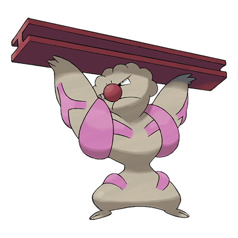
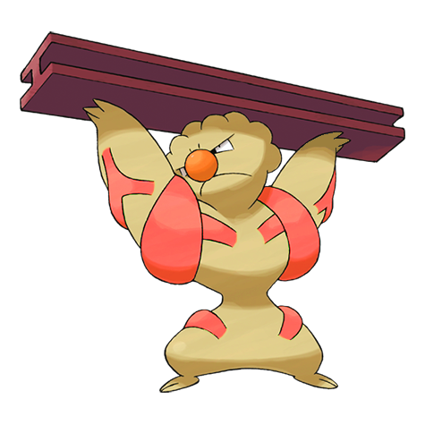
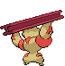

# #533 Gurdurr (Muscular Pokémon)

| Official Artwork | Shiny Artwork |
| --- | --- |
|  |  |

**Blaze Black:** This Pokémon is so muscular and strongly built that even a group of wrestlers could not make it budge an inch.

**Volt White:** They strengthen their bodies by carrying steel beams. They show off their big muscles to their friends.

---

## Media

### Sprites

| Front | Back | Front Shiny | Back Shiny |
| --- | --- | --- | --- |
|  |  |  |  |

### Cries

Latest (Gen VI+):

<audio controls>
<source src='../../assets/cries/gurdurr/latest.ogg' type='audio/ogg'>
  Your browser does not support the audio element.
</audio>

Legacy:

<audio controls>
<source src='../../assets/cries/gurdurr/legacy.ogg' type='audio/ogg'>
  Your browser does not support the audio element.
</audio>

---

## Pokédex Data

| National № | Type(s) | Height | Weight | Abilities | Local № |
|------------|---------|--------|--------|-----------|---------|
| #533 | {: width='48'} | 1.2 m | 40.0 kg | 1. Guts 2. Iron-Fist | #39 |

---

## Base Stats
|   | HP | Attack | Defense | Sp. Atk | Sp. Def | Speed |
|---|----|--------|---------|---------|---------|-------|
| **Base** | 85 | 105 | 85 | 40 | 50 | 40 |
| **Min** | 280 | 193 | 157 | 76 | 94 | 76 |
| **Max** | 374 | 339 | 295 | 196 | 218 | 196 |

The ranges shown above are for a level 100 Pokémon. Maximum values are based on a beneficial nature, 252 EVs, 31 IVs; minimum values are based on a hindering nature, 0 EVs, 0 IVs.

---

## Forms & Evolutions

!!! warning "WARNING"

    Information on evolutions may not be 100% accurate; differences between evolution methods across generations are not accounted for.

### Forms

Gurdurr has no alternate forms.

### Evolution Line

1. [Timburr](timburr.md/)
    1. Level Up: [Gurdurr](gurdurr.md/)
        1. Trade: [Conkeldurr](conkeldurr.md/)

### Evolution Changes

1. Level 36.

---

## Training

| EV Yield | Catch Rate | Base Friendship | Base Exp. | Growth Rate | Held Items |
|----------|------------|-----------------|-----------|-------------|------------|
| 2 Attack | 90 | 50 | 142 | Medium-Slow | N/A |

---

## Breeding

| Egg Groups | Egg Cycles | Gender | Dimorphic | Color | Shape |
|------------|------------|--------|-----------|-------|-------|
| 1. Humanshape | 20 | 75.0% Male 25.0% Female | False | Gray | Humanoid |

---

## Moves

!!! warning "WARNING"

    Specific move information may be incorrect. However, the general movepool should be accurate; this includes changes made in Blaze Black and Volt White.

### Level Up Moves

| Lv. | Move | Type | Cat. | Power | Acc. | PP |
| --- | --- | --- | --- | --- | --- | --- |
| 1 | Bide | {: width='48'} | {: width='36'} | — | — | 10 |
| 1 | Focus Energy | {: width='48'} | {: width='36'} | — | — | 30 |
| 1 | Leer | {: width='48'} | {: width='36'} | — | 100 | 30 |
| 1 | Pound | {: width='48'} | {: width='36'} | 40 | 100 | 35 |
| 4 | Focus Energy | {: width='48'} | {: width='36'} | — | — | 30 |
| 8 | Bide | {: width='48'} | {: width='36'} | — | — | 10 |
| 12 | Low Kick | {: width='48'} | {: width='36'} | — | 100 | 20 |
| 16 | Rock Throw | {: width='48'} | {: width='36'} | 50 | 90 | 15 |
| 20 | Wake Up Slap | {: width='48'} | {: width='36'} | 70 | 100 | 10 |
| 24 | Chip Away | {: width='48'} | {: width='36'} | 70 | 100 | 20 |
| 29 | Bulk Up | {: width='48'} | {: width='36'} | — | — | 20 |
| 33 | Rock Slide | {: width='48'} | {: width='36'} | 80 | 95 | 10 |
| 37 | Dynamic Punch | {: width='48'} | {: width='36'} | 100 | 50 | 5 |
| 41 | Scary Face | {: width='48'} | {: width='36'} | — | 100 | 10 |
| 45 | Hammer Arm | {: width='48'} | {: width='36'} | 100 | 90 | 10 |
| 49 | Stone Edge | {: width='48'} | {: width='36'} | 100 | 80 | 5 |
| 53 | Focus Punch | {: width='48'} | {: width='36'} | 150 | 100 | 20 |
| 57 | Superpower | {: width='48'} | {: width='36'} | 120 | 100 | 5 |
| 61 | Drain Punch | {: width='48'} | {: width='36'} | 75 | 100 | 10 |

### TM Moves

| TM | Move | Type | Cat. | Power | Acc. | PP |
| --- | --- | --- | --- | --- | --- | --- |
| HM04 | Strength | {: width='48'} | {: width='36'} | 85 | 100 | 15 |
| TM06 | Toxic | {: width='48'} | {: width='36'} | — | 90 | 10 |
| TM08 | Bulk Up | {: width='48'} | {: width='36'} | — | — | 20 |
| TM10 | Hidden Power | {: width='48'} | {: width='36'} | 60 | 100 | 15 |
| TM11 | Sunny Day | {: width='48'} | {: width='36'} | — | — | 5 |
| TM12 | Taunt | {: width='48'} | {: width='36'} | — | 100 | 20 |
| TM17 | Protect | {: width='48'} | {: width='36'} | — | — | 10 |
| TM18 | Rain Dance | {: width='48'} | {: width='36'} | — | — | 5 |
| TM21 | Frustration | {: width='48'} | {: width='36'} | — | 100 | 20 |
| TM23 | Smack Down | {: width='48'} | {: width='36'} | 50 | 100 | 15 |
| TM27 | Return | {: width='48'} | {: width='36'} | — | 100 | 20 |
| TM28 | Dig | {: width='48'} | {: width='36'} | 100 | 100 | 10 |
| TM31 | Brick Break | {: width='48'} | {: width='36'} | 75 | 100 | 15 |
| TM32 | Double Team | {: width='48'} | {: width='36'} | — | — | 15 |
| TM39 | Rock Tomb | {: width='48'} | {: width='36'} | 60 | 95 | 15 |
| TM42 | Facade | {: width='48'} | {: width='36'} | 70 | 100 | 20 |
| TM44 | Rest | {: width='48'} | {: width='36'} | — | — | 5 |
| TM45 | Attract | {: width='48'} | {: width='36'} | — | 100 | 15 |
| TM47 | Low Sweep | {: width='48'} | {: width='36'} | 65 | 100 | 20 |
| TM48 | Round | {: width='48'} | {: width='36'} | 60 | 100 | 15 |
| TM52 | Focus Blast | {: width='48'} | {: width='36'} | 120 | 70 | 5 |
| TM56 | Fling | {: width='48'} | {: width='36'} | — | 100 | 10 |
| TM66 | Payback | {: width='48'} | {: width='36'} | 50 | 100 | 10 |
| TM67 | Retaliate | {: width='48'} | {: width='36'} | 70 | 100 | 5 |
| TM71 | Stone Edge | {: width='48'} | {: width='36'} | 100 | 80 | 5 |
| TM80 | Rock Slide | {: width='48'} | {: width='36'} | 80 | 95 | 10 |
| TM83 | Work Up | {: width='48'} | {: width='36'} | — | — | 30 |
| TM84 | Poison Jab | {: width='48'} | {: width='36'} | 80 | 100 | 20 |
| TM86 | Grass Knot | {: width='48'} | {: width='36'} | — | 100 | 20 |
| TM87 | Swagger | {: width='48'} | {: width='36'} | — | 85 | 15 |
| TM90 | Substitute | {: width='48'} | {: width='36'} | — | — | 10 |
| TM94 | Rock Smash | {: width='48'} | {: width='36'} | 40 | 100 | 15 |

### Egg Moves

Gurdurr cannot learn any moves by breeding.
### Tutor Moves

Gurdurr cannot learn any moves from tutors.
