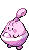
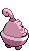
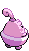

# #440 Happiny (Playhouse Pokémon)

| Official Artwork | Shiny Artwork |
|------------------|---------------|
|  |  |

It likes to carry around a small rock. It may wander around others’ feet and cause them to stumble.

---

## Media

### Default Sprites

| Front | Shiny | Back | Shiny |
|-------|-------|------|-------|
|  |  |  |  |

### Cries

Latest (Gen VI+):

<audio controls>
<source src='../../assets/cries/happiny/latest.ogg' type='audio/ogg'>
  Your browser does not support the audio element.
</audio>

Legacy:

<audio controls>
<source src='../../assets/cries/happiny/legacy.ogg' type='audio/ogg'>
  Your browser does not support the audio element.
</audio>

---

## Pokédex Data

| National № | Type(s) | Height | Weight | Abilities | Local № |
|------------|---------|--------|--------|-----------|---------|
| #440 | {: width="48"} | 0.6 m / 2.0 ft | 24.4 kg / 53.8 lbs | 1. Natural Cure 2. Friend Guard | #96 |

---

## Base Stats
|   | HP | Attack | Defense | Sp. Atk | Sp. Def | Speed |
|---|----|--------|---------|---------|---------|-------|
| **Base** | 100 | 5 | 5 | 15 | 65 | 30 |
| **Min** | 310 | 13 | 13 | 31 | 121 | 58 |
| **Max** | 404 | 119 | 119 | 141 | 251 | 174 |

The ranges shown above are for a level 100 Pokémon. Maximum values are based on a beneficial nature, 252 EVs, 31 IVs; minimum values are based on a hindering nature, 0 EVs, 0 IVs.

---

## Forms & Evolutions

!!! warning "WARNING"

    Information on evolutions may not be 100% accurate; differences between evolution methods across generations are not accounted for.

### Forms

Happiny has no alternate forms.

### Evolution Line

1. [Happiny](happiny.md/)
    1. Level Up: [Chansey](chansey.md/)
        1. Level Up: [Blissey](blissey.md/)

### Evolution Changes

1. Use the Oval Stone.

---

## Training

| EV Yield | Catch Rate | Base Friendship | Base Exp. | Growth Rate | Held Items |
|----------|------------|-----------------|-----------|-------------|------------|
| 1 HP | 130 | 160 | 110 | Fast | Oval Stone (50%) Lucky Egg (5%) |

---

## Breeding

| Egg Groups | Egg Cycles | Gender | Dimorphic | Color | Shape |
|------------|------------|--------|-----------|-------|-------|
| 1. No-Eggs | 40 | 0.0% Male 100.0% Female | False | Pink | Humanoid |

---

## Moves

!!! warning "WARNING"

    Specific move information may be incorrect. However, the general movepool should be accurate; this includes changes made in Blaze Black and Volt White.

### Level Up Moves

| Lv. | Move | Type | Cat. | Power | Acc. | PP |
| --- | --- | --- | --- | --- | --- | --- |
| 1 | Charm | {: width="48"} | {: width="36"} | — | 100 | 20 |
| 1 | Pound | {: width="48"} | {: width="36"} | 40 | 100 | 35 |
| 1 | Seismic Toss | {: width="48"} | {: width="36"} | — | 100 | 20 |
| 1 | Wish | {: width="48"} | {: width="36"} | — | — | 10 |
| 5 | Copycat | {: width="48"} | {: width="36"} | — | — | 20 |
| 9 | Refresh | {: width="48"} | {: width="36"} | — | — | 20 |
| 12 | Sweet Kiss | {: width="48"} | {: width="36"} | — | 75 | 10 |
| 16 | Last Resort | {: width="48"} | {: width="36"} | 140 | 100 | 5 |

### TM Moves

| TM | Move | Type | Cat. | Power | Acc. | PP |
| --- | --- | --- | --- | --- | --- | --- |
| TM06 | Toxic | {: width="48"} | {: width="36"} | — | 90 | 10 |
| TM07 | Hail | {: width="48"} | {: width="36"} | — | — | 10 |
| TM10 | Hidden Power | {: width="48"} | {: width="36"} | 60 | 100 | 15 |
| TM11 | Sunny Day | {: width="48"} | {: width="36"} | — | — | 5 |
| TM16 | Light Screen | {: width="48"} | {: width="36"} | — | — | 30 |
| TM17 | Protect | {: width="48"} | {: width="36"} | — | — | 10 |
| TM18 | Rain Dance | {: width="48"} | {: width="36"} | — | — | 5 |
| TM20 | Safeguard | {: width="48"} | {: width="36"} | — | — | 25 |
| TM21 | Frustration | {: width="48"} | {: width="36"} | — | 100 | 20 |
| TM22 | Solar Beam | {: width="48"} | {: width="36"} | 120 | 100 | 10 |
| TM27 | Return | {: width="48"} | {: width="36"} | — | 100 | 20 |
| TM29 | Psychic | {: width="48"} | {: width="36"} | 90 | 100 | 10 |
| TM30 | Shadow Ball | {: width="48"} | {: width="36"} | 90 | 100 | 15 |
| TM32 | Double Team | {: width="48"} | {: width="36"} | — | — | 15 |
| TM35 | Flamethrower | {: width="48"} | {: width="36"} | 90 | 100 | 15 |
| TM38 | Fire Blast | {: width="48"} | {: width="36"} | 110 | 85 | 5 |
| TM42 | Facade | {: width="48"} | {: width="36"} | 70 | 100 | 20 |
| TM44 | Rest | {: width="48"} | {: width="36"} | — | — | 5 |
| TM45 | Attract | {: width="48"} | {: width="36"} | — | 100 | 15 |
| TM48 | Round | {: width="48"} | {: width="36"} | 60 | 100 | 15 |
| TM49 | Echoed Voice | {: width="48"} | {: width="36"} | 40 | 100 | 15 |
| TM56 | Fling | {: width="48"} | {: width="36"} | — | 100 | 10 |
| TM59 | Incinerate | {: width="48"} | {: width="36"} | 50 | 100 | 15 |
| TM70 | Flash | {: width="48"} | {: width="36"} | — | 100 | 20 |
| TM73 | Thunder Wave | {: width="48"} | {: width="36"} | — | 90 | 20 |
| TM77 | Psych Up | {: width="48"} | {: width="36"} | — | — | 10 |
| TM83 | Work Up | {: width="48"} | {: width="36"} | — | — | 30 |
| TM85 | Dream Eater | {: width="48"} | {: width="36"} | 100 | 100 | 15 |
| TM86 | Grass Knot | {: width="48"} | {: width="36"} | — | 100 | 20 |
| TM87 | Swagger | {: width="48"} | {: width="36"} | — | 85 | 15 |
| TM90 | Substitute | {: width="48"} | {: width="36"} | — | — | 10 |

### Egg Moves

| Move | Type | Cat. | Power | Acc. | PP |
| --- | --- | --- | --- | --- | --- |
| Counter | {: width="48"} | {: width="36"} | — | 100 | 20 |
| Metronome | {: width="48"} | {: width="36"} | — | — | 10 |
| Endure | {: width="48"} | {: width="36"} | — | — | 10 |
| Heal Bell | {: width="48"} | {: width="36"} | — | — | 5 |
| Present | {: width="48"} | {: width="36"} | — | 90 | 15 |
| Helping Hand | {: width="48"} | {: width="36"} | — | — | 20 |
| Aromatherapy | {: width="48"} | {: width="36"} | — | — | 5 |
| Gravity | {: width="48"} | {: width="36"} | — | — | 5 |
| Natural Gift | {: width="48"} | {: width="36"} | — | 100 | 15 |
| Last Resort | {: width="48"} | {: width="36"} | 140 | 100 | 5 |
| Mud Bomb | {: width="48"} | {: width="36"} | 65 | 85 | 10 |

### Tutor Moves

Happiny cannot learn any moves from tutors.
