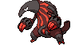
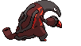

# Heatmor (Anteater Pokémon)

| Official Artwork | Shiny Artwork |
| --- | --- |
|  |  |

**Blaze Black:** It breathes through a hole in its tail while it burns with an internal fire. Durant is its prey.

**Volt White:** Using their very hot, flame-covered tongues, they burn through Durant’s steel bodies and consume their insides.

---

## Media

### Default Sprites

| Front | Back | Front Shiny | Back Shiny |
| --- | --- | --- | --- |
|  |  |  |  |

### Cries

Latest (Gen VI+):

<audio controls>
<source src='../../assets/cries/heatmor/latest.ogg' type='audio/ogg'>
  Your browser does not support the audio element.
</audio>

Legacy:

<audio controls>
<source src='../../assets/cries/heatmor/legacy.ogg' type='audio/ogg'>
  Your browser does not support the audio element.
</audio>

---

## Pokédex Data

| National № | Type(s) | Height | Weight | Abilities | Local № |
|------------|---------|--------|--------|-----------|---------|
| #631 | {: width='48'} | 1.4 m | 58.0 kg | 1. White-Smoke 2. Moody | #137 |

---

## Base Stats
|   | HP | Attack | Defense | Sp. Atk | Sp. Def | Speed |
|---|----|--------|---------|---------|---------|-------|
| **Base** | 85 | 100 | 70 | 115 | 70 | 70 |
| **Min** | 280 | 184 | 130 | 211 | 130 | 130 |
| **Max** | 374 | 328 | 262 | 361 | 262 | 262 |

The ranges shown above are for a level 100 Pokémon. Maximum values are based on a beneficial nature, 252 EVs, 31 IVs; minimum values are based on a hindering nature, 0 EVs, 0 IVs.

---

## Forms & Evolutions

!!! warning "WARNING"

    Information on evolutions may not be 100% accurate; differences between evolution methods across generations are not accounted for.

### Forms

Heatmor has no alternate forms.

### Evolution Line

1. [Heatmor](heatmor.md/)

---

## Training

| EV Yield | Catch Rate | Base Friendship | Base Exp. | Growth Rate | Held Items |
|----------|------------|-----------------|-----------|-------------|------------|
| 2 Special Attack | 90 | 50 | 169 | Medium |  |

---

## Breeding

| Egg Groups | Egg Cycles | Gender | Dimorphic | Color | Shape |
|------------|------------|--------|-----------|-------|-------|
| 1. Ground | 20 | 50.0% Male 50.0% Female | False | Red | Upright |

---

## Moves

!!! warning "WARNING"

    Specific move information may be incorrect. However, the general movepool should be accurate; this includes changes made in Blaze Black and Volt White.

### Level Up Moves

| Lv. | Move | Type | Cat. | Power | Acc. | PP |
| --- | --- | --- | --- | --- | --- | --- |
| 1 | Incinerate | {: width='48'} | {: width='36'} | 50 | 100 | 15 |
| 1 | Lick | {: width='48'} | {: width='36'} | 30 | 100 | 30 |
| 6 | Odor Sleuth | {: width='48'} | {: width='36'} | — | — | 40 |
| 11 | Bind | {: width='48'} | {: width='36'} | 15 | 85 | 20 |
| 16 | Fire Spin | {: width='48'} | {: width='36'} | 35 | 85 | 15 |
| 21 | Fury Swipes | {: width='48'} | {: width='36'} | 18 | 80 | 15 |
| 26 | Snatch | {: width='48'} | {: width='36'} | — | — | 10 |
| 31 | Flame Burst | {: width='48'} | {: width='36'} | 70 | 100 | 15 |
| 36 | Bug Bite | {: width='48'} | {: width='36'} | 60 | 100 | 20 |
| 41 | Slash | {: width='48'} | {: width='36'} | 70 | 100 | 20 |
| 46 | Amnesia | {: width='48'} | {: width='36'} | — | — | 20 |
| 51 | Flamethrower | {: width='48'} | {: width='36'} | 90 | 100 | 15 |
| 56 | Spit Up | {: width='48'} | {: width='36'} | — | 100 | 10 |
| 56 | Stockpile | {: width='48'} | {: width='36'} | — | — | 20 |
| 56 | Swallow | {: width='48'} | {: width='36'} | — | — | 10 |
| 61 | Inferno | {: width='48'} | {: width='36'} | 100 | 50 | 5 |
| 66 | Heat Wave | {: width='48'} | {: width='36'} | 95 | 90 | 10 |

### TM Moves

| TM | Move | Type | Cat. | Power | Acc. | PP |
| --- | --- | --- | --- | --- | --- | --- |
| HM01 | Cut | {: width='48'} | {: width='36'} | 60 | 100% | 25 |
| TM01 | Hone Claws | {: width='48'} | {: width='36'} | — | — | 15 |
| TM06 | Toxic | {: width='48'} | {: width='36'} | — | 90 | 10 |
| TM10 | Hidden Power | {: width='48'} | {: width='36'} | 60 | 100 | 15 |
| TM11 | Sunny Day | {: width='48'} | {: width='36'} | — | — | 5 |
| TM12 | Taunt | {: width='48'} | {: width='36'} | — | 100 | 20 |
| TM17 | Protect | {: width='48'} | {: width='36'} | — | — | 10 |
| TM18 | Rain Dance | {: width='48'} | {: width='36'} | — | — | 5 |
| TM21 | Frustration | {: width='48'} | {: width='36'} | — | 100 | 20 |
| TM22 | Solar Beam | {: width='48'} | {: width='36'} | 120 | 100 | 10 |
| TM27 | Return | {: width='48'} | {: width='36'} | — | 100 | 20 |
| TM28 | Dig | {: width='48'} | {: width='36'} | 100 | 100 | 10 |
| TM32 | Double Team | {: width='48'} | {: width='36'} | — | — | 15 |
| TM35 | Flamethrower | {: width='48'} | {: width='36'} | 90 | 100 | 15 |
| TM38 | Fire Blast | {: width='48'} | {: width='36'} | 110 | 85 | 5 |
| TM39 | Rock Tomb | {: width='48'} | {: width='36'} | 60 | 95 | 15 |
| TM40 | Aerial Ace | {: width='48'} | {: width='36'} | 60 | — | 20 |
| TM42 | Facade | {: width='48'} | {: width='36'} | 70 | 100 | 20 |
| TM44 | Rest | {: width='48'} | {: width='36'} | — | — | 5 |
| TM45 | Attract | {: width='48'} | {: width='36'} | — | 100 | 15 |
| TM46 | Thief | {: width='48'} | {: width='36'} | 60 | 100 | 25 |
| TM48 | Round | {: width='48'} | {: width='36'} | 60 | 100 | 15 |
| TM52 | Focus Blast | {: width='48'} | {: width='36'} | 120 | 70 | 5 |
| TM56 | Fling | {: width='48'} | {: width='36'} | — | 100 | 10 |
| TM59 | Incinerate | {: width='48'} | {: width='36'} | 50 | 100 | 15 |
| TM61 | Will O Wisp | {: width='48'} | {: width='36'} | — | 85 | 15 |
| TM65 | Shadow Claw | {: width='48'} | {: width='36'} | 80 | 100 | 15 |
| TM68 | Giga Impact | {: width='48'} | {: width='36'} | 150 | 90 | 5 |
| TM87 | Swagger | {: width='48'} | {: width='36'} | — | 85 | 15 |
| TM90 | Substitute | {: width='48'} | {: width='36'} | — | — | 10 |
| TM94 | Rock Smash | {: width='48'} | {: width='36'} | 60 | 100 | 15 |

### Egg Moves

| Move | Type | Cat. | Power | Acc. | PP |
| --- | --- | --- | --- | --- | --- |
| Body Slam | {: width='48'} | {: width='36'} | 85 | 100 | 15 |
| Wrap | {: width='48'} | {: width='36'} | 15 | 90 | 20 |
| Curse | {: width='48'} | {: width='36'} | — | — | 10 |
| Feint Attack | {: width='48'} | {: width='36'} | 60 | — | 20 |
| Sleep Talk | {: width='48'} | {: width='36'} | — | — | 10 |
| Pursuit | {: width='48'} | {: width='36'} | 40 | 100 | 20 |
| Heat Wave | {: width='48'} | {: width='36'} | 95 | 90 | 10 |
| Tickle | {: width='48'} | {: width='36'} | — | 100 | 20 |
| Sucker Punch | {: width='48'} | {: width='36'} | 70 | 100 | 5 |
| Night Slash | {: width='48'} | {: width='36'} | 70 | 100 | 15 |

### Tutor Moves

Heatmor cannot learn any moves from tutors.
