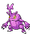
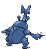
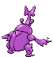
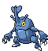
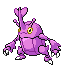
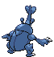
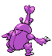

# #214 Heracross (Single Horn Pokémon)

| Official Artwork | Shiny Artwork |
|------------------|---------------|
|  |  |

It loves sweet honey. To keep all the honey to itself, it hurls rivals away with its prized horn.

---

## Media

### Default Sprites

| Front | Shiny | Back | Shiny |
|-------|-------|------|-------|
|  |  |  |  |

### Female Sprites

| Front | Shiny | Back | Shiny |
|-------|-------|------|-------|
|  |  |  |  |

### Cries

Latest (Gen VI+):

<audio controls>
<source src='../../assets/cries/heracross/latest.ogg' type='audio/ogg'>
  Your browser does not support the audio element.
</audio>

Legacy:

<audio controls>
<source src='../../assets/cries/heracross/legacy.ogg' type='audio/ogg'>
  Your browser does not support the audio element.
</audio>

---

## Pokédex Data

| National № | Type(s) | Height | Weight | Abilities | Local № |
|------------|---------|--------|--------|-----------|---------|
| #214 | {: width="48"} {: width="48"} | 1.5 m / 4.9 ft | 54.0 kg / 119.0 lbs | 1. Moxie 2. Guts | #62 |

---

## Base Stats
|   | HP | Attack | Defense | Sp. Atk | Sp. Def | Speed |
|---|----|--------|---------|---------|---------|-------|
| **Base** | 80 | 125 | 75 | 40 | 95 | 85 |
| **Min** | 270 | 229 | 139 | 76 | 175 | 157 |
| **Max** | 364 | 383 | 273 | 196 | 317 | 295 |

The ranges shown above are for a level 100 Pokémon. Maximum values are based on a beneficial nature, 252 EVs, 31 IVs; minimum values are based on a hindering nature, 0 EVs, 0 IVs.

---

## Forms & Evolutions

!!! warning "WARNING"

    Information on evolutions may not be 100% accurate; differences between evolution methods across generations are not accounted for.

### Forms

Heracross has no alternate forms.

### Evolution Line

1. [Heracross](heracross.md/)

---

## Training

| EV Yield | Catch Rate | Base Friendship | Base Exp. | Growth Rate | Held Items |
|----------|------------|-----------------|-----------|-------------|------------|
| 2 Atk | 45 | 50 | 175 | Slow | N/A |

---

## Breeding

| Egg Groups | Egg Cycles | Gender | Dimorphic | Color | Shape |
|------------|------------|--------|-----------|-------|-------|
| 1. Bug | 25 | 50.0% Male 50.0% Female | True | Blue | Humanoid |

---

## Moves

!!! warning "WARNING"

    Specific move information may be incorrect. However, the general movepool should be accurate; this includes changes made in Blaze Black and Volt White.

### Level Up Moves

| Lv. | Move | Type | Cat. | Power | Acc. | PP |
| --- | --- | --- | --- | --- | --- | --- |
| 1 | Endure | {: width="48"} | {: width="36"} | — | — | 10 |
| 1 | Horn Attack | {: width="48"} | {: width="36"} | 65 | 100 | 25 |
| 1 | Leer | {: width="48"} | {: width="36"} | — | 100 | 30 |
| 1 | Night Slash | {: width="48"} | {: width="36"} | 70 | 100 | 15 |
| 1 | Tackle | {: width="48"} | {: width="36"} | 40 | 100 | 35 |
| 3 | Bug Bite | {: width="48"} | {: width="36"} | 60 | 100 | 20 |
| 7 | Fury Attack | {: width="48"} | {: width="36"} | 15 | 85 | 20 |
| 13 | Aerial Ace | {: width="48"} | {: width="36"} | 60 | — | 20 |
| 19 | Brick Break | {: width="48"} | {: width="36"} | 75 | 100 | 15 |
| 25 | Counter | {: width="48"} | {: width="36"} | — | 100 | 20 |
| 31 | Take Down | {: width="48"} | {: width="36"} | 90 | 85 | 20 |
| 37 | Close Combat | {: width="48"} | {: width="36"} | 120 | 100 | 5 |
| 43 | Reversal | {: width="48"} | {: width="36"} | — | 100 | 15 |
| 49 | Feint | {: width="48"} | {: width="36"} | 30 | 100 | 10 |
| 55 | Megahorn | {: width="48"} | {: width="36"} | 120 | 85 | 10 |
| 61 | Horn Leech | {: width="48"} | {: width="36"} | 90 | 100 | 10 |
| 67 | Drill Run | {: width="48"} | {: width="36"} | 80 | 95 | 10 |

### TM Moves

| TM | Move | Type | Cat. | Power | Acc. | PP |
| --- | --- | --- | --- | --- | --- | --- |
| HM01 | Cut | {: width="48"} | {: width="36"} | 60 | 100% | 25 |
| HM04 | Strength | {: width="48"} | {: width="36"} | 100 | 100 | 15 |
| TM06 | Toxic | {: width="48"} | {: width="36"} | — | 90 | 10 |
| TM09 | Venoshock | {: width="48"} | {: width="36"} | 65 | 100 | 10 |
| TM10 | Hidden Power | {: width="48"} | {: width="36"} | 60 | 100 | 15 |
| TM11 | Sunny Day | {: width="48"} | {: width="36"} | — | — | 5 |
| TM15 | Hyper Beam | {: width="48"} | {: width="36"} | 150 | 90 | 5 |
| TM17 | Protect | {: width="48"} | {: width="36"} | — | — | 10 |
| TM18 | Rain Dance | {: width="48"} | {: width="36"} | — | — | 5 |
| TM21 | Frustration | {: width="48"} | {: width="36"} | — | 100 | 20 |
| TM23 | Smack Down | {: width="48"} | {: width="36"} | 50 | 100 | 15 |
| TM26 | Earthquake | {: width="48"} | {: width="36"} | 100 | 100 | 10 |
| TM27 | Return | {: width="48"} | {: width="36"} | — | 100 | 20 |
| TM28 | Dig | {: width="48"} | {: width="36"} | 100 | 100 | 10 |
| TM31 | Brick Break | {: width="48"} | {: width="36"} | 75 | 100 | 15 |
| TM32 | Double Team | {: width="48"} | {: width="36"} | — | — | 15 |
| TM39 | Rock Tomb | {: width="48"} | {: width="36"} | 60 | 95 | 15 |
| TM40 | Aerial Ace | {: width="48"} | {: width="36"} | 60 | — | 20 |
| TM42 | Facade | {: width="48"} | {: width="36"} | 70 | 100 | 20 |
| TM44 | Rest | {: width="48"} | {: width="36"} | — | — | 5 |
| TM45 | Attract | {: width="48"} | {: width="36"} | — | 100 | 15 |
| TM46 | Thief | {: width="48"} | {: width="36"} | 60 | 100 | 25 |
| TM48 | Round | {: width="48"} | {: width="36"} | 60 | 100 | 15 |
| TM52 | Focus Blast | {: width="48"} | {: width="36"} | 120 | 70 | 5 |
| TM54 | False Swipe | {: width="48"} | {: width="36"} | 40 | 100 | 40 |
| TM56 | Fling | {: width="48"} | {: width="36"} | — | 100 | 10 |
| TM65 | Shadow Claw | {: width="48"} | {: width="36"} | 80 | 100 | 15 |
| TM67 | Retaliate | {: width="48"} | {: width="36"} | 70 | 100 | 5 |
| TM68 | Giga Impact | {: width="48"} | {: width="36"} | 150 | 90 | 5 |
| TM71 | Stone Edge | {: width="48"} | {: width="36"} | 100 | 80 | 5 |
| TM75 | Swords Dance | {: width="48"} | {: width="36"} | — | — | 20 |
| TM76 | Struggle Bug | {: width="48"} | {: width="36"} | 50 | 100 | 20 |
| TM78 | Bulldoze | {: width="48"} | {: width="36"} | 80 | 100 | 20 |
| TM80 | Rock Slide | {: width="48"} | {: width="36"} | 75 | 90 | 10 |
| TM83 | Work Up | {: width="48"} | {: width="36"} | — | — | 30 |
| TM87 | Swagger | {: width="48"} | {: width="36"} | — | 85 | 15 |
| TM90 | Substitute | {: width="48"} | {: width="36"} | — | — | 10 |
| TM94 | Rock Smash | {: width="48"} | {: width="36"} | 60 | 100 | 15 |

### Egg Moves

| Move | Type | Cat. | Power | Acc. | PP |
| --- | --- | --- | --- | --- | --- |
| Double Edge | {: width="48"} | {: width="36"} | 120 | 100 | 15 |
| Seismic Toss | {: width="48"} | {: width="36"} | — | 100 | 20 |
| Harden | {: width="48"} | {: width="36"} | — | — | 30 |
| Bide | {: width="48"} | {: width="36"} | — | — | 10 |
| Flail | {: width="48"} | {: width="36"} | — | 100 | 15 |
| Megahorn | {: width="48"} | {: width="36"} | 120 | 85 | 10 |
| Pursuit | {: width="48"} | {: width="36"} | 40 | 100 | 20 |
| Focus Punch | {: width="48"} | {: width="36"} | 150 | 100 | 20 |
| Revenge | {: width="48"} | {: width="36"} | 60 | 100 | 10 |

### Tutor Moves

Heracross cannot learn any moves from tutors.
