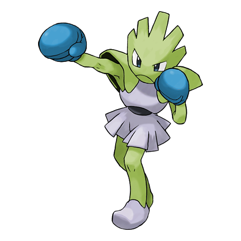
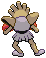
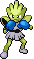
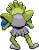

# #107 Hitmonchan (Punching Pokémon)

| Official Artwork | Shiny Artwork |
| --- | --- |
|  |  |

The arm-twisting punches it throws pulverize even concrete. It rests after three minutes of fighting.

---

## Media

### Sprites

| Front | Back | Front Shiny | Back Shiny |
| --- | --- | --- | --- |
|  |  |  |  |

### Cries

Latest (Gen VI+):

<audio controls>
<source src='../../assets/cries/hitmonchan/latest.ogg' type='audio/ogg'>
  Your browser does not support the audio element.
</audio>

Legacy:

<audio controls>
<source src='../../assets/cries/hitmonchan/legacy.ogg' type='audio/ogg'>
  Your browser does not support the audio element.
</audio>

---

## Pokédex Data

| National № | Type(s) | Height | Weight | Abilities | Local № |
|------------|---------|--------|--------|-----------|---------|
| #107 | {: width='48'} | 1.4 m | 50.2 kg | 1. Inner-Focus 2. Iron-Fist | N/A |

---

## Base Stats
|   | HP | Attack | Defense | Sp. Atk | Sp. Def | Speed |
|---|----|--------|---------|---------|---------|-------|
| **Base** | 50 | 105 | 79 | 35 | 110 | 76 |
| **Min** | 210 | 193 | 146 | 67 | 202 | 141 |
| **Max** | 304 | 339 | 282 | 185 | 350 | 276 |

The ranges shown above are for a level 100 Pokémon. Maximum values are based on a beneficial nature, 252 EVs, 31 IVs; minimum values are based on a hindering nature, 0 EVs, 0 IVs.

---

## Forms & Evolutions

!!! warning "WARNING"

    Information on evolutions may not be 100% accurate; differences between evolution methods across generations are not accounted for.

### Forms

Hitmonchan has no alternate forms.

### Evolution Line

1. [Tyrogue](tyrogue.md/)
    1. Level Up: [Hitmonlee](hitmonlee.md/)

    2. Level Up: [Hitmonchan](hitmonchan.md/)

    3. Level Up: [Hitmontop](hitmontop.md/)

### Evolution Changes

---

## Training

| EV Yield | Catch Rate | Base Friendship | Base Exp. | Growth Rate | Held Items |
|----------|------------|-----------------|-----------|-------------|------------|
| 2 Special Defense | 45 | 50 | 159 | Medium | N/A |

---

## Breeding

| Egg Groups | Egg Cycles | Gender | Dimorphic | Color | Shape |
|------------|------------|--------|-----------|-------|-------|
| 1. Humanshape | 25 | 100.0% Male 0.0% Female | False | Brown | Humanoid |

---

## Moves

!!! warning "WARNING"

    Specific move information may be incorrect. However, the general movepool should be accurate; this includes changes made in Blaze Black and Volt White.

### Level Up Moves

| Lv. | Move | Type | Cat. | Power | Acc. | PP |
| --- | --- | --- | --- | --- | --- | --- |
| 1 | Comet Punch | {: width='48'} | {: width='36'} | 25 | 85 | 15 |
| 1 | Revenge | {: width='48'} | {: width='36'} | 60 | 100 | 10 |
| 6 | Agility | {: width='48'} | {: width='36'} | — | — | 30 |
| 11 | Pursuit | {: width='48'} | {: width='36'} | 40 | 100 | 20 |
| 16 | Bullet Punch | {: width='48'} | {: width='36'} | 40 | 100 | 30 |
| 16 | Mach Punch | {: width='48'} | {: width='36'} | 40 | 100 | 30 |
| 21 | Feint | {: width='48'} | {: width='36'} | 30 | 100 | 10 |
| 26 | Vacuum Wave | {: width='48'} | {: width='36'} | 40 | 100 | 30 |
| 31 | Quick Guard | {: width='48'} | {: width='36'} | — | — | 15 |
| 36 | Drain Punch | {: width='48'} | {: width='36'} | 75 | 100 | 10 |
| 36 | Fire Punch | {: width='48'} | {: width='36'} | 80 | 100 | 15 |
| 36 | Ice Punch | {: width='48'} | {: width='36'} | 80 | 100 | 15 |
| 36 | Thunder Punch | {: width='48'} | {: width='36'} | 80 | 100 | 15 |
| 41 | Sky Uppercut | {: width='48'} | {: width='36'} | 85 | 90 | 15 |
| 46 | Mega Punch | {: width='48'} | {: width='36'} | 80 | 85 | 20 |
| 51 | Detect | {: width='48'} | {: width='36'} | — | — | 5 |
| 56 | Focus Punch | {: width='48'} | {: width='36'} | 150 | 100 | 20 |
| 61 | Counter | {: width='48'} | {: width='36'} | — | 100 | 20 |
| 66 | Close Combat | {: width='48'} | {: width='36'} | 120 | 100 | 5 |

### TM Moves

| TM | Move | Type | Cat. | Power | Acc. | PP |
| --- | --- | --- | --- | --- | --- | --- |
| HM04 | Strength | {: width='48'} | {: width='36'} | 85 | 100 | 15 |
| TM06 | Toxic | {: width='48'} | {: width='36'} | — | 90 | 10 |
| TM08 | Bulk Up | {: width='48'} | {: width='36'} | — | — | 20 |
| TM10 | Hidden Power | {: width='48'} | {: width='36'} | 60 | 100 | 15 |
| TM11 | Sunny Day | {: width='48'} | {: width='36'} | — | — | 5 |
| TM17 | Protect | {: width='48'} | {: width='36'} | — | — | 10 |
| TM18 | Rain Dance | {: width='48'} | {: width='36'} | — | — | 5 |
| TM21 | Frustration | {: width='48'} | {: width='36'} | — | 100 | 20 |
| TM26 | Earthquake | {: width='48'} | {: width='36'} | 100 | 100 | 10 |
| TM27 | Return | {: width='48'} | {: width='36'} | — | 100 | 20 |
| TM31 | Brick Break | {: width='48'} | {: width='36'} | 75 | 100 | 15 |
| TM32 | Double Team | {: width='48'} | {: width='36'} | — | — | 15 |
| TM39 | Rock Tomb | {: width='48'} | {: width='36'} | 60 | 95 | 15 |
| TM42 | Facade | {: width='48'} | {: width='36'} | 70 | 100 | 20 |
| TM44 | Rest | {: width='48'} | {: width='36'} | — | — | 5 |
| TM45 | Attract | {: width='48'} | {: width='36'} | — | 100 | 15 |
| TM46 | Thief | {: width='48'} | {: width='36'} | 60 | 100 | 25 |
| TM47 | Low Sweep | {: width='48'} | {: width='36'} | 65 | 100 | 20 |
| TM48 | Round | {: width='48'} | {: width='36'} | 60 | 100 | 15 |
| TM52 | Focus Blast | {: width='48'} | {: width='36'} | 120 | 70 | 5 |
| TM56 | Fling | {: width='48'} | {: width='36'} | — | 100 | 10 |
| TM67 | Retaliate | {: width='48'} | {: width='36'} | 70 | 100 | 5 |
| TM71 | Stone Edge | {: width='48'} | {: width='36'} | 100 | 80 | 5 |
| TM78 | Bulldoze | {: width='48'} | {: width='36'} | 80 | 100 | 20 |
| TM80 | Rock Slide | {: width='48'} | {: width='36'} | 80 | 95 | 10 |
| TM83 | Work Up | {: width='48'} | {: width='36'} | — | — | 30 |
| TM87 | Swagger | {: width='48'} | {: width='36'} | — | 85 | 15 |
| TM90 | Substitute | {: width='48'} | {: width='36'} | — | — | 10 |
| TM94 | Rock Smash | {: width='48'} | {: width='36'} | 40 | 100 | 15 |

### Egg Moves

Hitmonchan cannot learn any moves by breeding.
### Tutor Moves

Hitmonchan cannot learn any moves from tutors.
