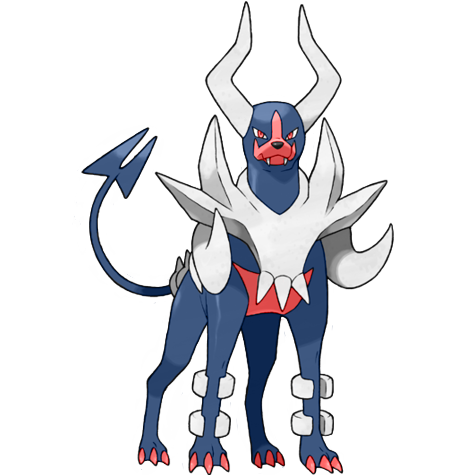
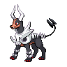
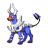

# #10048 Houndoom Mega (Dark Pokémon)

| Official Artwork | Shiny Artwork |
| --- | --- |
|  |  |

The flames it breathes when angry contain toxins. If they cause a burn, it will hurt forever.

---

## Media

### Sprites

| Front | Front Shiny |
| --- | --- |
|  |  |

### Cries

Latest (Gen VI+):

<audio controls>
  <source src='../assets/cries/houndoom-mega/latest.ogg' type='audio/ogg'>
  Your browser does not support the audio element.
</audio>

---

## Pokédex Data

| National № | Type(s) | Height | Weight | Abilities | Local № |
|------------|---------|--------|--------|-----------|---------|
| #10048 | {: width='48'} {: width='48'} | 1.9 m | 49.5 kg | 1. Solar-Power | #N/A |

---

## Base Stats
---

## Base Stats
|   | HP | Attack | Defense | Sp. Atk | Sp. Def | Speed |
|---|----|--------|---------|---------|---------|-------|
| **Base** | 75 | 90 | 90 | 140 | 90 | 115 |
| **Min** | 260 | 166 | 166 | 256 | 166 | 211 |
| **Max** | 354 | 306 | 306 | 416 | 306 | 361 |

The ranges shown above are for a level 100 Pokémon. Maximum values are based on a beneficial nature, 252 EVs, 31 IVs; minimum values are based on a hindering nature, 0 EVs, 0 IVs.

---

## Forms & Evolutions

!!! warning "WARNING"

    Some forms may not be available in Blaze Black/Volt White. Also information on evolutions may not be 100% accurate; it is currently quite complex to track generational evolution data.

### Forms

1. [Houndoom](houndoom.md/)
2. [Houndoom-Mega](houndoom-mega.md/)

### Evolution Line

1. [Houndour](houndour.md/)
1. Level Up: [Houndoom](houndoom.md/)

---

## Training

| EV Yield | Catch Rate | Base Friendship | Base Exp. | Growth Rate | Held Items |
|----------|------------|-----------------|-----------|-------------|------------|
| 2 Special Attack | 45 | 35 | 210 | Slow | N/A |

---

## Breeding

| Egg Groups | Egg Cycles | Gender | Dimorphic | Color | Shape |
|------------|------------|--------|-----------|-------|-------|
| 1. Ground | 20 | 50.0% Male 50.0% Female | True | Black | Quadruped |

---

## Moves

!!! warning "WARNING"

    Specific move information may be incorrect. However, the general movepool should be accurate (including changes to learnset).

### Level Up Moves

Lv. | Move | Type | Cat. | Power | Acc. | PP
--- | --- | --- | --- | --- | --- | ---
| 1 | Ember | {: width='48'} | {: width='36'} | 40 | 100 | 25 |
| 1 | Howl | {: width='48'} | {: width='36'} | — | — | 40 |
| 1 | Inferno | {: width='48'} | {: width='36'} | 100 | 50 | 5 |
| 1 | Leer | {: width='48'} | {: width='36'} | — | 100 | 30 |
| 1 | Nasty Plot | {: width='48'} | {: width='36'} | — | — | 20 |
| 1 | Smog | {: width='48'} | {: width='36'} | 30 | 70 | 20 |
| 1 | Thunder Fang | {: width='48'} | {: width='36'} | 75 | 95 | 15 |
| 4 | Howl | {: width='48'} | {: width='36'} | — | — | 40 |
| 8 | Smog | {: width='48'} | {: width='36'} | 30 | 70 | 20 |
| 13 | Roar | {: width='48'} | {: width='36'} | — | — | 20 |
| 16 | Bite | {: width='48'} | {: width='36'} | 60 | 100 | 25 |
| 20 | Odor Sleuth | {: width='48'} | {: width='36'} | — | — | 40 |
| 26 | Beat Up | {: width='48'} | {: width='36'} | — | 100 | 10 |
| 30 | Fire Fang | {: width='48'} | {: width='36'} | 75 | 95 | 15 |
| 35 | Feint Attack | {: width='48'} | {: width='36'} | 60 | — | 20 |
| 41 | Embargo | {: width='48'} | {: width='36'} | — | 100 | 15 |
| 45 | Foul Play | {: width='48'} | {: width='36'} | 95 | 100 | 15 |
| 50 | Flamethrower | {: width='48'} | {: width='36'} | 90 | 100 | 15 |
| 56 | Crunch | {: width='48'} | {: width='36'} | 80 | 100 | 15 |
| 60 | Nasty Plot | {: width='48'} | {: width='36'} | — | — | 20 |
| 65 | Inferno | {: width='48'} | {: width='36'} | 100 | 50 | 5 |

### TM Moves

TM | Move | Type | Cat. | Power | Acc. | PP
--- | --- | --- | --- | --- | --- | ---
| TM05 | Roar | {: width='48'} | {: width='36'} | — | — | 20 |
| TM06 | Toxic | {: width='48'} | {: width='36'} | — | 90 | 10 |
| TM10 | Hidden Power | {: width='48'} | {: width='36'} | 60 | 100 | 15 |
| TM100 | Confide | {: width='48'} | {: width='36'} | — | — | 20 |
| TM11 | Sunny Day | {: width='48'} | {: width='36'} | — | — | 5 |
| TM12 | Taunt | {: width='48'} | {: width='36'} | — | 100 | 20 |
| TM15 | Hyper Beam | {: width='48'} | {: width='36'} | 150 | 90 | 5 |
| TM17 | Protect | {: width='48'} | {: width='36'} | — | — | 10 |
| TM21 | Frustration | {: width='48'} | {: width='36'} | — | 100 | 20 |
| TM22 | Solar Beam | {: width='48'} | {: width='36'} | 120 | 100 | 10 |
| TM27 | Return | {: width='48'} | {: width='36'} | — | 100 | 20 |
| TM30 | Shadow Ball | {: width='48'} | {: width='36'} | 90 | 100 | 15 |
| TM32 | Double Team | {: width='48'} | {: width='36'} | — | — | 15 |
| TM35 | Flamethrower | {: width='48'} | {: width='36'} | 90 | 100 | 15 |
| TM36 | Sludge Bomb | {: width='48'} | {: width='36'} | 90 | 100 | 10 |
| TM38 | Fire Blast | {: width='48'} | {: width='36'} | 110 | 85 | 5 |
| TM41 | Torment | {: width='48'} | {: width='36'} | — | 100 | 15 |
| TM42 | Facade | {: width='48'} | {: width='36'} | 70 | 100 | 20 |
| TM43 | Flame Charge | {: width='48'} | {: width='36'} | 50 | 100 | 20 |
| TM44 | Rest | {: width='48'} | {: width='36'} | — | — | 5 |
| TM45 | Attract | {: width='48'} | {: width='36'} | — | 100 | 15 |
| TM46 | Thief | {: width='48'} | {: width='36'} | 60 | 100 | 25 |
| TM48 | Round | {: width='48'} | {: width='36'} | 60 | 100 | 15 |
| TM50 | Overheat | {: width='48'} | {: width='36'} | 130 | 90 | 5 |
| TM61 | Will O Wisp | {: width='48'} | {: width='36'} | — | 85 | 15 |
| TM63 | Embargo | {: width='48'} | {: width='36'} | — | 100 | 15 |
| TM66 | Payback | {: width='48'} | {: width='36'} | 50 | 100 | 10 |
| TM68 | Giga Impact | {: width='48'} | {: width='36'} | 150 | 90 | 5 |
| TM85 | Dream Eater | {: width='48'} | {: width='36'} | 100 | 100 | 15 |
| TM87 | Swagger | {: width='48'} | {: width='36'} | — | 85 | 15 |
| TM88 | Sleep Talk | {: width='48'} | {: width='36'} | — | — | 10 |
| TM90 | Substitute | {: width='48'} | {: width='36'} | — | — | 10 |
| TM95 | Snarl | {: width='48'} | {: width='36'} | 60 | 95 | 15 |
| TM97 | Dark Pulse | {: width='48'} | {: width='36'} | 90 | 100 | 15 |

### Egg Moves

Houndoom Mega cannot learn any moves by breeding.
### Tutor Moves

Move | Type | Cat. | Power | Acc. | PP
--- | --- | --- | --- | --- | ---
| Super Fang | {: width='48'} | {: width='36'} | — | 90 | 10 |
| Snore | {: width='48'} | {: width='36'} | 50 | 100 | 15 |
| Spite | {: width='48'} | {: width='36'} | — | 100 | 10 |
| Iron Tail | {: width='48'} | {: width='36'} | 100 | 75 | 15 |
| Uproar | {: width='48'} | {: width='36'} | 90 | 100 | 10 |
| Heat Wave | {: width='48'} | {: width='36'} | 95 | 90 | 10 |
| Role Play | {: width='48'} | {: width='36'} | — | — | 10 |
| Snatch | {: width='48'} | {: width='36'} | — | — | 10 |
| Hyper Voice | {: width='48'} | {: width='36'} | 90 | 100 | 10 |
| Foul Play | {: width='48'} | {: width='36'} | 95 | 100 | 15 |
| Laser Focus | {: width='48'} | {: width='36'} | — | — | 30 |
| Throat Chop | {: width='48'} | {: width='36'} | 80 | 100 | 15 |

