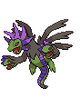
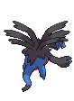
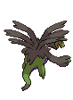

# #635 Hydreigon (Brutal Pokémon)

| Official Artwork | Shiny Artwork |
|------------------|---------------|
|  |  |

**Blaze Black:** This brutal Pokémon travels the skies on its six wings. Anything that moves seems like a foe to it, triggering its attack.

**Volt White:** The heads on their arms do not have brains. They use all three heads to consume and destroy everything.

---

## Media

### Default Sprites

| Front | Shiny | Back | Shiny |
|-------|-------|------|-------|
|  |  |  |  |

### Cries

Latest (Gen VI+):

<audio controls>
<source src='../../assets/cries/hydreigon/latest.ogg' type='audio/ogg'>
  Your browser does not support the audio element.
</audio>

Legacy:

<audio controls>
<source src='../../assets/cries/hydreigon/legacy.ogg' type='audio/ogg'>
  Your browser does not support the audio element.
</audio>

---

## Pokédex Data

| National № | Type(s) | Height | Weight | Abilities | Local № |
|------------|---------|--------|--------|-----------|---------|
| #635 | {: width="48"} {: width="48"} | 1.8 m / 5.9 ft | 160.0 kg / 352.7 lbs | 1. Levitate | N/A |

---

## Base Stats
|   | HP | Attack | Defense | Sp. Atk | Sp. Def | Speed |
|---|----|--------|---------|---------|---------|-------|
| **Base** | 92 | 105 | 90 | 125 | 90 | 98 |
| **Min** | 294 | 193 | 166 | 229 | 166 | 180 |
| **Max** | 388 | 339 | 306 | 383 | 306 | 324 |

The ranges shown above are for a level 100 Pokémon. Maximum values are based on a beneficial nature, 252 EVs, 31 IVs; minimum values are based on a hindering nature, 0 EVs, 0 IVs.

---

## Forms & Evolutions

!!! warning "WARNING"

    Information on evolutions may not be 100% accurate; differences between evolution methods across generations are not accounted for.

### Forms

Hydreigon has no alternate forms.

### Evolution Line

1. [Deino](deino.md/)
    1. Level Up: [Zweilous](zweilous.md/)
        1. Level Up: [Hydreigon](hydreigon.md/)

---

## Training

| EV Yield | Catch Rate | Base Friendship | Base Exp. | Growth Rate | Held Items |
|----------|------------|-----------------|-----------|-------------|------------|
| 3 Sp. Atk | 45 | 35 | 300 | Slow | N/A |

---

## Breeding

| Egg Groups | Egg Cycles | Gender | Dimorphic | Color | Shape |
|------------|------------|--------|-----------|-------|-------|
| 1. Dragon | 40 | 50.0% Male 50.0% Female | False | Blue | Upright |

---

## Moves

!!! warning "WARNING"

    Specific move information may be incorrect. However, the general movepool should be accurate; this includes changes made in Blaze Black and Volt White.

### Level Up Moves

| Lv. | Move | Type | Cat. | Power | Acc. | PP |
| --- | --- | --- | --- | --- | --- | --- |
| 1 | Bite | {: width="48"} | {: width="36"} | 60 | 100 | 25 |
| 1 | Dragon Rage | {: width="48"} | {: width="36"} | — | 100 | 10 |
| 1 | Focus Energy | {: width="48"} | {: width="36"} | — | — | 30 |
| 1 | Tri Attack | {: width="48"} | {: width="36"} | 80 | 100 | 10 |
| 4 | Focus Energy | {: width="48"} | {: width="36"} | — | — | 30 |
| 9 | Bite | {: width="48"} | {: width="36"} | 60 | 100 | 25 |
| 12 | Headbutt | {: width="48"} | {: width="36"} | 70 | 100 | 15 |
| 17 | Dragon Breath | {: width="48"} | {: width="36"} | 60 | 100 | 20 |
| 20 | Roar | {: width="48"} | {: width="36"} | — | — | 20 |
| 25 | Crunch | {: width="48"} | {: width="36"} | 80 | 100 | 15 |
| 28 | Slam | {: width="48"} | {: width="36"} | 80 | 75 | 20 |
| 30 | Fire Fang | {: width="48"} | {: width="36"} | 75 | 95 | 15 |
| 30 | Ice Fang | {: width="48"} | {: width="36"} | 75 | 95 | 15 |
| 30 | Thunder Fang | {: width="48"} | {: width="36"} | 75 | 95 | 15 |
| 33 | Dragon Pulse | {: width="48"} | {: width="36"} | 85 | 100 | 10 |
| 36 | Dark Pulse | {: width="48"} | {: width="36"} | 90 | 100 | 15 |
| 40 | Work Up | {: width="48"} | {: width="36"} | — | — | 30 |
| 44 | Dragon Rush | {: width="48"} | {: width="36"} | 100 | 75 | 10 |
| 47 | Earth Power | {: width="48"} | {: width="36"} | 90 | 100 | 10 |
| 51 | Body Slam | {: width="48"} | {: width="36"} | 85 | 100 | 15 |
| 55 | Scary Face | {: width="48"} | {: width="36"} | — | 100 | 10 |
| 68 | Hyper Voice | {: width="48"} | {: width="36"} | 90 | 100 | 10 |
| 79 | Outrage | {: width="48"} | {: width="36"} | 120 | 100 | 10 |

### TM Moves

| TM | Move | Type | Cat. | Power | Acc. | PP |
| --- | --- | --- | --- | --- | --- | --- |
| HM02 | Fly | {: width="48"} | {: width="36"} | 100 | 100% | 15 |
| HM03 | Surf | {: width="48"} | {: width="36"} | 90 | 100 | 15 |
| HM04 | Strength | {: width="48"} | {: width="36"} | 100 | 100 | 15 |
| TM05 | Roar | {: width="48"} | {: width="36"} | — | — | 20 |
| TM06 | Toxic | {: width="48"} | {: width="36"} | — | 90 | 10 |
| TM10 | Hidden Power | {: width="48"} | {: width="36"} | 60 | 100 | 15 |
| TM11 | Sunny Day | {: width="48"} | {: width="36"} | — | — | 5 |
| TM12 | Taunt | {: width="48"} | {: width="36"} | — | 100 | 20 |
| TM15 | Hyper Beam | {: width="48"} | {: width="36"} | 150 | 90 | 5 |
| TM17 | Protect | {: width="48"} | {: width="36"} | — | — | 10 |
| TM18 | Rain Dance | {: width="48"} | {: width="36"} | — | — | 5 |
| TM21 | Frustration | {: width="48"} | {: width="36"} | — | 100 | 20 |
| TM26 | Earthquake | {: width="48"} | {: width="36"} | 100 | 100 | 10 |
| TM27 | Return | {: width="48"} | {: width="36"} | — | 100 | 20 |
| TM32 | Double Team | {: width="48"} | {: width="36"} | — | — | 15 |
| TM33 | Reflect | {: width="48"} | {: width="36"} | — | — | 20 |
| TM35 | Flamethrower | {: width="48"} | {: width="36"} | 90 | 100 | 15 |
| TM38 | Fire Blast | {: width="48"} | {: width="36"} | 110 | 85 | 5 |
| TM39 | Rock Tomb | {: width="48"} | {: width="36"} | 60 | 95 | 15 |
| TM41 | Torment | {: width="48"} | {: width="36"} | — | 100 | 15 |
| TM42 | Facade | {: width="48"} | {: width="36"} | 70 | 100 | 20 |
| TM44 | Rest | {: width="48"} | {: width="36"} | — | — | 5 |
| TM45 | Attract | {: width="48"} | {: width="36"} | — | 100 | 15 |
| TM46 | Thief | {: width="48"} | {: width="36"} | 60 | 100 | 25 |
| TM48 | Round | {: width="48"} | {: width="36"} | 60 | 100 | 15 |
| TM49 | Echoed Voice | {: width="48"} | {: width="36"} | 40 | 100 | 15 |
| TM52 | Focus Blast | {: width="48"} | {: width="36"} | 120 | 70 | 5 |
| TM57 | Charge Beam | {: width="48"} | {: width="36"} | 50 | 90 | 10 |
| TM59 | Incinerate | {: width="48"} | {: width="36"} | 50 | 100 | 15 |
| TM62 | Acrobatics | {: width="48"} | {: width="36"} | 55 | 100 | 15 |
| TM66 | Payback | {: width="48"} | {: width="36"} | 50 | 100 | 10 |
| TM68 | Giga Impact | {: width="48"} | {: width="36"} | 150 | 90 | 5 |
| TM71 | Stone Edge | {: width="48"} | {: width="36"} | 100 | 80 | 5 |
| TM73 | Thunder Wave | {: width="48"} | {: width="36"} | — | 90 | 20 |
| TM77 | Psych Up | {: width="48"} | {: width="36"} | — | — | 10 |
| TM78 | Bulldoze | {: width="48"} | {: width="36"} | 80 | 100 | 20 |
| TM80 | Rock Slide | {: width="48"} | {: width="36"} | 75 | 90 | 10 |
| TM82 | Dragon Tail | {: width="48"} | {: width="36"} | 60 | 90 | 10 |
| TM83 | Work Up | {: width="48"} | {: width="36"} | — | — | 30 |
| TM87 | Swagger | {: width="48"} | {: width="36"} | — | 85 | 15 |
| TM89 | U Turn | {: width="48"} | {: width="36"} | 70 | 100 | 20 |
| TM90 | Substitute | {: width="48"} | {: width="36"} | — | — | 10 |
| TM91 | Flash Cannon | {: width="48"} | {: width="36"} | 80 | 100 | 10 |
| TM94 | Rock Smash | {: width="48"} | {: width="36"} | 60 | 100 | 15 |

### Egg Moves

Hydreigon cannot learn any moves by breeding.
### Tutor Moves

| Move | Type | Cat. | Power | Acc. | PP |
| --- | --- | --- | --- | --- | --- |
| Draco Meteor | {: width="48"} | {: width="36"} | 130 | 90 | 5 |

