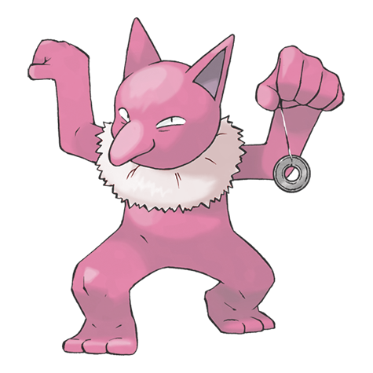
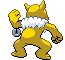
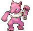
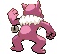
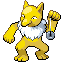
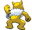
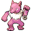
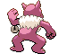

# #097 Hypno (Hypnosis Pokémon)

| Official Artwork | Shiny Artwork |
| --- | --- |
|  |  |

Seeing its swinging pendulum can induce sleep in three seconds, even in someone who just woke up.

---

## Media

### Sprites

| Front | Back | Front Shiny | Back Shiny |
| --- | --- | --- | --- |
|  |  |  |  |

### Female Sprites

| Front | Back | Front Shiny | Back Shiny |
| --- | --- | --- | --- |
|  |  |  |  |

### Cries

Latest (Gen VI+):

<audio controls>
<source src='../../assets/cries/hypno/latest.ogg' type='audio/ogg'>
  Your browser does not support the audio element.
</audio>

Legacy:

<audio controls>
<source src='../../assets/cries/hypno/legacy.ogg' type='audio/ogg'>
  Your browser does not support the audio element.
</audio>

---

## Pokédex Data

| National № | Type(s) | Height | Weight | Abilities | Local № |
|------------|---------|--------|--------|-----------|---------|
| #97 | {: width='48'} | 1.6 m | 75.6 kg | 1. Insomnia 2. Forewarn | N/A |

---

## Base Stats
|   | HP | Attack | Defense | Sp. Atk | Sp. Def | Speed |
|---|----|--------|---------|---------|---------|-------|
| **Base** | 85 | 73 | 70 | 73 | 115 | 67 |
| **Min** | 280 | 135 | 130 | 135 | 211 | 125 |
| **Max** | 374 | 269 | 262 | 269 | 361 | 256 |

The ranges shown above are for a level 100 Pokémon. Maximum values are based on a beneficial nature, 252 EVs, 31 IVs; minimum values are based on a hindering nature, 0 EVs, 0 IVs.

---

## Forms & Evolutions

!!! warning "WARNING"

    Information on evolutions may not be 100% accurate; differences between evolution methods across generations are not accounted for.

### Forms

Hypno has no alternate forms.

### Evolution Line

1. [Drowzee](drowzee.md/)
    1. Level Up: [Hypno](hypno.md/)

---

## Training

| EV Yield | Catch Rate | Base Friendship | Base Exp. | Growth Rate | Held Items |
|----------|------------|-----------------|-----------|-------------|------------|
| 2 Special Defense | 75 | 70 | 169 | Medium | N/A |

---

## Breeding

| Egg Groups | Egg Cycles | Gender | Dimorphic | Color | Shape |
|------------|------------|--------|-----------|-------|-------|
| 1. Humanshape | 20 | 50.0% Male 50.0% Female | True | Yellow | Humanoid |

---

## Moves

!!! warning "WARNING"

    Specific move information may be incorrect. However, the general movepool should be accurate; this includes changes made in Blaze Black and Volt White.

### Level Up Moves

| Lv. | Move | Type | Cat. | Power | Acc. | PP |
| --- | --- | --- | --- | --- | --- | --- |
| 1 | Confusion | {: width='48'} | {: width='36'} | 50 | 100 | 25 |
| 1 | Disable | {: width='48'} | {: width='36'} | — | 100 | 20 |
| 1 | Hypnosis | {: width='48'} | {: width='36'} | — | 60 | 20 |
| 1 | Nightmare | {: width='48'} | {: width='36'} | — | 100 | 15 |
| 1 | Pound | {: width='48'} | {: width='36'} | 40 | 100 | 35 |
| 1 | Switcheroo | {: width='48'} | {: width='36'} | — | 100 | 10 |
| 5 | Disable | {: width='48'} | {: width='36'} | — | 100 | 20 |
| 9 | Confusion | {: width='48'} | {: width='36'} | 50 | 100 | 25 |
| 13 | Headbutt | {: width='48'} | {: width='36'} | 70 | 100 | 15 |
| 17 | Poison Gas | {: width='48'} | {: width='36'} | — | 90 | 40 |
| 19 | Drain Punch | {: width='48'} | {: width='36'} | 75 | 100 | 10 |
| 21 | Meditate | {: width='48'} | {: width='36'} | — | — | 40 |
| 25 | Psybeam | {: width='48'} | {: width='36'} | 65 | 100 | 20 |
| 29 | Headbutt | {: width='48'} | {: width='36'} | 70 | 100 | 15 |
| 33 | Psych Up | {: width='48'} | {: width='36'} | — | — | 10 |
| 37 | Synchronoise | {: width='48'} | {: width='36'} | 120 | 100 | 10 |
| 41 | Psycho Cut | {: width='48'} | {: width='36'} | 70 | 100 | 20 |
| 41 | Zen Headbutt | {: width='48'} | {: width='36'} | 80 | 90 | 15 |
| 45 | Swagger | {: width='48'} | {: width='36'} | — | 85 | 15 |
| 49 | Psychic | {: width='48'} | {: width='36'} | 90 | 100 | 10 |
| 53 | Nasty Plot | {: width='48'} | {: width='36'} | — | — | 20 |
| 57 | Psyshock | {: width='48'} | {: width='36'} | 80 | 100 | 10 |
| 61 | Future Sight | {: width='48'} | {: width='36'} | 120 | 100 | 10 |

### TM Moves

| TM | Move | Type | Cat. | Power | Acc. | PP |
| --- | --- | --- | --- | --- | --- | --- |
| TM03 | Psyshock | {: width='48'} | {: width='36'} | 80 | 100 | 10 |
| TM04 | Calm Mind | {: width='48'} | {: width='36'} | — | — | 20 |
| TM06 | Toxic | {: width='48'} | {: width='36'} | — | 90 | 10 |
| TM10 | Hidden Power | {: width='48'} | {: width='36'} | 60 | 100 | 15 |
| TM11 | Sunny Day | {: width='48'} | {: width='36'} | — | — | 5 |
| TM12 | Taunt | {: width='48'} | {: width='36'} | — | 100 | 20 |
| TM15 | Hyper Beam | {: width='48'} | {: width='36'} | 150 | 90 | 5 |
| TM16 | Light Screen | {: width='48'} | {: width='36'} | — | — | 30 |
| TM17 | Protect | {: width='48'} | {: width='36'} | — | — | 10 |
| TM18 | Rain Dance | {: width='48'} | {: width='36'} | — | — | 5 |
| TM19 | Telekinesis | {: width='48'} | {: width='36'} | — | — | 15 |
| TM20 | Safeguard | {: width='48'} | {: width='36'} | — | — | 25 |
| TM21 | Frustration | {: width='48'} | {: width='36'} | — | 100 | 20 |
| TM27 | Return | {: width='48'} | {: width='36'} | — | 100 | 20 |
| TM29 | Psychic | {: width='48'} | {: width='36'} | 90 | 100 | 10 |
| TM30 | Shadow Ball | {: width='48'} | {: width='36'} | 90 | 100 | 15 |
| TM31 | Brick Break | {: width='48'} | {: width='36'} | 75 | 100 | 15 |
| TM32 | Double Team | {: width='48'} | {: width='36'} | — | — | 15 |
| TM33 | Reflect | {: width='48'} | {: width='36'} | — | — | 20 |
| TM41 | Torment | {: width='48'} | {: width='36'} | — | 100 | 15 |
| TM42 | Facade | {: width='48'} | {: width='36'} | 70 | 100 | 20 |
| TM44 | Rest | {: width='48'} | {: width='36'} | — | — | 5 |
| TM45 | Attract | {: width='48'} | {: width='36'} | — | 100 | 15 |
| TM46 | Thief | {: width='48'} | {: width='36'} | 60 | 100 | 25 |
| TM47 | Low Sweep | {: width='48'} | {: width='36'} | 65 | 100 | 20 |
| TM48 | Round | {: width='48'} | {: width='36'} | 60 | 100 | 15 |
| TM52 | Focus Blast | {: width='48'} | {: width='36'} | 120 | 70 | 5 |
| TM56 | Fling | {: width='48'} | {: width='36'} | — | 100 | 10 |
| TM68 | Giga Impact | {: width='48'} | {: width='36'} | 150 | 90 | 5 |
| TM70 | Flash | {: width='48'} | {: width='36'} | — | 100 | 20 |
| TM73 | Thunder Wave | {: width='48'} | {: width='36'} | — | 90 | 20 |
| TM77 | Psych Up | {: width='48'} | {: width='36'} | — | — | 10 |
| TM85 | Dream Eater | {: width='48'} | {: width='36'} | 100 | 100 | 15 |
| TM86 | Grass Knot | {: width='48'} | {: width='36'} | — | 100 | 20 |
| TM87 | Swagger | {: width='48'} | {: width='36'} | — | 85 | 15 |
| TM90 | Substitute | {: width='48'} | {: width='36'} | — | — | 10 |
| TM92 | Trick Room | {: width='48'} | {: width='36'} | — | — | 5 |

### Egg Moves

Hypno cannot learn any moves by breeding.
### Tutor Moves

Hypno cannot learn any moves from tutors.
