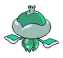
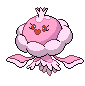
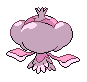
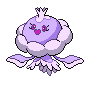
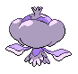

# #593 Jellicent (Floating Pokémon)

| Official Artwork | Shiny Artwork |
| --- | --- |
|  |  |

**Blaze Black:** The fate of the ships and crew that wander into Jellicent’s habitat: all sunken, all lost, all vanished.

**Volt White:** They propel themselves by expelling absorbed seawater from their bodies. Their favorite food is life energy.

---

## Media

### Sprites

| Front | Back | Front Shiny | Back Shiny |
| --- | --- | --- | --- |
|  |  |  |  |

### Female Sprites

| Front | Back | Front Shiny | Back Shiny |
| --- | --- | --- | --- |
|  |  |  |  |

### Cries

Latest (Gen VI+):

<audio controls>
  <source src='../assets/cries/593/latest.ogg' type='audio/ogg'>
  Your browser does not support the audio element.
</audio>

Legacy:

<audio controls>
  <source src='../assets/cries/593/legacy.ogg' type='audio/ogg'>
  Your browser does not support the audio element.
</audio>

---

## Pokédex Data

| National № | Type(s) | Height | Weight | Abilities | Local № |
|------------|---------|--------|--------|-----------|---------|
| #593 | {: width='48'} {: width='48'} | 2.2 m | 135.0 kg | 1. Water-Absorb 2. Cursed-Body | #99 |

---

## Base Stats
---

## Base Stats
|   | HP | Attack | Defense | Sp. Atk | Sp. Def | Speed |
|---|----|--------|---------|---------|---------|-------|
| **Base** | 100 | 60 | 70 | 85 | 105 | 60 |
| **Min** | 310 | 112 | 130 | 157 | 193 | 112 |
| **Max** | 404 | 240 | 262 | 295 | 339 | 240 |

The ranges shown above are for a level 100 Pokémon. Maximum values are based on a beneficial nature, 252 EVs, 31 IVs; minimum values are based on a hindering nature, 0 EVs, 0 IVs.

---

## Forms & Evolutions

!!! warning "WARNING"

    Some forms may not be available in Blaze Black/Volt White. Also information on evolutions may not be 100% accurate; it is currently quite complex to track generational evolution data.

### Forms

Jellicent has no alternate forms.

### Evolution Line

1. [Frillish](frillish.md/)
1. Level Up: [Jellicent](jellicent.md/)

---

## Training

| EV Yield | Catch Rate | Base Friendship | Base Exp. | Growth Rate | Held Items |
|----------|------------|-----------------|-----------|-------------|------------|
| 2 Special Defense | 60 | 50 | 168 | Medium | N/A |

---

## Breeding

| Egg Groups | Egg Cycles | Gender | Dimorphic | Color | Shape |
|------------|------------|--------|-----------|-------|-------|
| 1. Indeterminate | 20 | 50.0% Male 50.0% Female | True | White | Tentacles |

---

## Moves

!!! warning "WARNING"

    Specific move information may be incorrect. However, the general movepool should be accurate (including changes to learnset).

### Level Up Moves

Lv. | Move | Type | Cat. | Power | Acc. | PP
--- | --- | --- | --- | --- | --- | ---
| 1 | Absorb | {: width='48'} | {: width='36'} | 50 | 100 | 25 |
| 1 | Bubble | {: width='48'} | {: width='36'} | 40 | 100 | 30 |
| 1 | Confuse Ray | {: width='48'} | {: width='36'} | — | 100 | 10 |
| 1 | Night Shade | {: width='48'} | {: width='36'} | — | 100 | 15 |
| 1 | Pain Split | {: width='48'} | {: width='36'} | — | — | 20 |
| 1 | Water Sport | {: width='48'} | {: width='36'} | — | — | 15 |
| 5 | Absorb | {: width='48'} | {: width='36'} | 50 | 100 | 25 |
| 9 | Night Shade | {: width='48'} | {: width='36'} | — | 100 | 15 |
| 13 | Bubble Beam | {: width='48'} | {: width='36'} | 65 | 100 | 20 |
| 17 | Recover | {: width='48'} | {: width='36'} | — | — | 5 |
| 22 | Water Pulse | {: width='48'} | {: width='36'} | 60 | 100 | 20 |
| 27 | Ominous Wind | {: width='48'} | {: width='36'} | 60 | 100 | 5 |
| 32 | Brine | {: width='48'} | {: width='36'} | 65 | 100 | 10 |
| 37 | Rain Dance | {: width='48'} | {: width='36'} | — | — | 5 |
| 45 | Hex | {: width='48'} | {: width='36'} | 65 | 100 | 10 |
| 53 | Hydro Pump | {: width='48'} | {: width='36'} | 110 | 80 | 5 |
| 61 | Wring Out | {: width='48'} | {: width='36'} | — | 100 | 5 |
| 69 | Water Spout | {: width='48'} | {: width='36'} | 150 | 100 | 5 |

### TM Moves

TM | Move | Type | Cat. | Power | Acc. | PP
--- | --- | --- | --- | --- | --- | ---
| HM03 | Surf | {: width='48'} | {: width='36'} | 90 | 100 | 15 |
| HM05 | Waterfall | {: width='48'} | {: width='36'} | 85 | 100 | 15 |
| HM06 | Dive | {: width='48'} | {: width='36'} | 100 | 100 | 10 |
| TM06 | Toxic | {: width='48'} | {: width='36'} | — | 90 | 10 |
| TM07 | Hail | {: width='48'} | {: width='36'} | — | — | 10 |
| TM10 | Hidden Power | {: width='48'} | {: width='36'} | 60 | 100 | 15 |
| TM12 | Taunt | {: width='48'} | {: width='36'} | — | 100 | 20 |
| TM13 | Ice Beam | {: width='48'} | {: width='36'} | 90 | 100 | 10 |
| TM14 | Blizzard | {: width='48'} | {: width='36'} | 110 | 70 | 5 |
| TM15 | Hyper Beam | {: width='48'} | {: width='36'} | 150 | 90 | 5 |
| TM17 | Protect | {: width='48'} | {: width='36'} | — | — | 10 |
| TM18 | Rain Dance | {: width='48'} | {: width='36'} | — | — | 5 |
| TM20 | Safeguard | {: width='48'} | {: width='36'} | — | — | 25 |
| TM21 | Frustration | {: width='48'} | {: width='36'} | — | 100 | 20 |
| TM27 | Return | {: width='48'} | {: width='36'} | — | 100 | 20 |
| TM29 | Psychic | {: width='48'} | {: width='36'} | 90 | 100 | 10 |
| TM30 | Shadow Ball | {: width='48'} | {: width='36'} | 90 | 100 | 15 |
| TM32 | Double Team | {: width='48'} | {: width='36'} | — | — | 15 |
| TM34 | Sludge Wave | {: width='48'} | {: width='36'} | 95 | 100 | 10 |
| TM36 | Sludge Bomb | {: width='48'} | {: width='36'} | 90 | 100 | 10 |
| TM42 | Facade | {: width='48'} | {: width='36'} | 70 | 100 | 20 |
| TM44 | Rest | {: width='48'} | {: width='36'} | — | — | 5 |
| TM45 | Attract | {: width='48'} | {: width='36'} | — | 100 | 15 |
| TM48 | Round | {: width='48'} | {: width='36'} | 60 | 100 | 15 |
| TM53 | Energy Ball | {: width='48'} | {: width='36'} | 90 | 100 | 10 |
| TM55 | Scald | {: width='48'} | {: width='36'} | 80 | 100 | 15 |
| TM61 | Will O Wisp | {: width='48'} | {: width='36'} | — | 85 | 15 |
| TM68 | Giga Impact | {: width='48'} | {: width='36'} | 150 | 90 | 5 |
| TM70 | Flash | {: width='48'} | {: width='36'} | — | 100 | 20 |
| TM77 | Psych Up | {: width='48'} | {: width='36'} | — | — | 10 |
| TM85 | Dream Eater | {: width='48'} | {: width='36'} | 100 | 100 | 15 |
| TM87 | Swagger | {: width='48'} | {: width='36'} | — | 85 | 15 |
| TM90 | Substitute | {: width='48'} | {: width='36'} | — | — | 10 |
| TM92 | Trick Room | {: width='48'} | {: width='36'} | — | — | 5 |

### Egg Moves

Jellicent cannot learn any moves by breeding.
### Tutor Moves

Jellicent cannot learn any moves from tutors.
