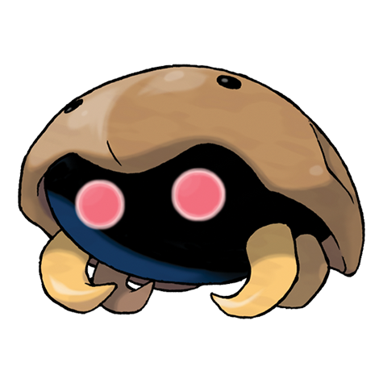
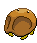

# #140 Kabuto (Shellfish Pokémon)

| Official Artwork | Shiny Artwork |
| --- | --- |
|  |  |

It is thought to have inhabited beaches 300 million years ago. It is protected by a stiff shell.

---

## Media

### Sprites

| Front | Back | Front Shiny | Back Shiny |
| --- | --- | --- | --- |
|  |  |  |  |

### Cries

Latest (Gen VI+):

<audio controls>
<source src='../../assets/cries/kabuto/latest.ogg' type='audio/ogg'>
  Your browser does not support the audio element.
</audio>

Legacy:

<audio controls>
<source src='../../assets/cries/kabuto/legacy.ogg' type='audio/ogg'>
  Your browser does not support the audio element.
</audio>

---

## Pokédex Data

| National № | Type(s) | Height | Weight | Abilities | Local № |
|------------|---------|--------|--------|-----------|---------|
| #140 | {: width='48'} {: width='48'} | 0.5 m | 11.5 kg | 1. Swift-Swim 2. Battle-Armor | N/A |

---

## Base Stats
|   | HP | Attack | Defense | Sp. Atk | Sp. Def | Speed |
|---|----|--------|---------|---------|---------|-------|
| **Base** | 30 | 80 | 90 | 55 | 45 | 55 |
| **Min** | 170 | 148 | 166 | 103 | 85 | 103 |
| **Max** | 264 | 284 | 306 | 229 | 207 | 229 |

The ranges shown above are for a level 100 Pokémon. Maximum values are based on a beneficial nature, 252 EVs, 31 IVs; minimum values are based on a hindering nature, 0 EVs, 0 IVs.

---

## Forms & Evolutions

!!! warning "WARNING"

    Information on evolutions may not be 100% accurate; differences between evolution methods across generations are not accounted for.

### Forms

Kabuto has no alternate forms.

### Evolution Line

1. [Kabuto](kabuto.md/)
    1. Level Up: [Kabutops](kabutops.md/)

---

## Training

| EV Yield | Catch Rate | Base Friendship | Base Exp. | Growth Rate | Held Items |
|----------|------------|-----------------|-----------|-------------|------------|
| 1 Defense | 45 | 50 | 71 | Medium | N/A |

---

## Breeding

| Egg Groups | Egg Cycles | Gender | Dimorphic | Color | Shape |
|------------|------------|--------|-----------|-------|-------|
| 1. Water1 2. Water3 | 30 | 87.5% Male 12.5% Female | False | Brown | Armor |

---

## Moves

!!! warning "WARNING"

    Specific move information may be incorrect. However, the general movepool should be accurate; this includes changes made in Blaze Black and Volt White.

### Level Up Moves

| Lv. | Move | Type | Cat. | Power | Acc. | PP |
| --- | --- | --- | --- | --- | --- | --- |
| 1 | Harden | {: width='48'} | {: width='36'} | — | — | 30 |
| 1 | Scratch | {: width='48'} | {: width='36'} | 40 | 100 | 35 |
| 6 | Absorb | {: width='48'} | {: width='36'} | 50 | 100 | 25 |
| 11 | Leer | {: width='48'} | {: width='36'} | — | 100 | 30 |
| 16 | Mud Shot | {: width='48'} | {: width='36'} | 55 | 95 | 15 |
| 21 | Sand Attack | {: width='48'} | {: width='36'} | — | 100 | 15 |
| 26 | Endure | {: width='48'} | {: width='36'} | — | — | 10 |
| 31 | Aqua Jet | {: width='48'} | {: width='36'} | 40 | 100 | 20 |
| 36 | Mega Drain | {: width='48'} | {: width='36'} | 50 | 100 | 15 |
| 41 | Metal Sound | {: width='48'} | {: width='36'} | — | 85 | 40 |
| 46 | Ancient Power | {: width='48'} | {: width='36'} | 60 | 100 | 5 |
| 51 | Wring Out | {: width='48'} | {: width='36'} | — | 100 | 5 |

### TM Moves

| TM | Move | Type | Cat. | Power | Acc. | PP |
| --- | --- | --- | --- | --- | --- | --- |
| HM03 | Surf | {: width='48'} | {: width='36'} | 90 | 100 | 15 |
| HM05 | Waterfall | {: width='48'} | {: width='36'} | 85 | 100 | 15 |
| TM01 | Hone Claws | {: width='48'} | {: width='36'} | — | — | 15 |
| TM06 | Toxic | {: width='48'} | {: width='36'} | — | 90 | 10 |
| TM07 | Hail | {: width='48'} | {: width='36'} | — | — | 10 |
| TM10 | Hidden Power | {: width='48'} | {: width='36'} | 60 | 100 | 15 |
| TM13 | Ice Beam | {: width='48'} | {: width='36'} | 90 | 100 | 10 |
| TM14 | Blizzard | {: width='48'} | {: width='36'} | 110 | 70 | 5 |
| TM17 | Protect | {: width='48'} | {: width='36'} | — | — | 10 |
| TM18 | Rain Dance | {: width='48'} | {: width='36'} | — | — | 5 |
| TM21 | Frustration | {: width='48'} | {: width='36'} | — | 100 | 20 |
| TM23 | Smack Down | {: width='48'} | {: width='36'} | 50 | 100 | 15 |
| TM27 | Return | {: width='48'} | {: width='36'} | — | 100 | 20 |
| TM28 | Dig | {: width='48'} | {: width='36'} | 100 | 100 | 10 |
| TM32 | Double Team | {: width='48'} | {: width='36'} | — | — | 15 |
| TM37 | Sandstorm | {: width='48'} | {: width='36'} | — | — | 10 |
| TM39 | Rock Tomb | {: width='48'} | {: width='36'} | 60 | 95 | 15 |
| TM42 | Facade | {: width='48'} | {: width='36'} | 70 | 100 | 20 |
| TM44 | Rest | {: width='48'} | {: width='36'} | — | — | 5 |
| TM45 | Attract | {: width='48'} | {: width='36'} | — | 100 | 15 |
| TM46 | Thief | {: width='48'} | {: width='36'} | 60 | 100 | 25 |
| TM48 | Round | {: width='48'} | {: width='36'} | 60 | 100 | 15 |
| TM55 | Scald | {: width='48'} | {: width='36'} | 80 | 100 | 15 |
| TM69 | Rock Polish | {: width='48'} | {: width='36'} | — | — | 20 |
| TM80 | Rock Slide | {: width='48'} | {: width='36'} | 80 | 95 | 10 |
| TM87 | Swagger | {: width='48'} | {: width='36'} | — | 85 | 15 |
| TM90 | Substitute | {: width='48'} | {: width='36'} | — | — | 10 |
| TM94 | Rock Smash | {: width='48'} | {: width='36'} | 40 | 100 | 15 |

### Egg Moves

| Move | Type | Cat. | Power | Acc. | PP |
| --- | --- | --- | --- | --- | --- |
| Bubble Beam | {: width='48'} | {: width='36'} | 65 | 100 | 20 |
| Aurora Beam | {: width='48'} | {: width='36'} | 65 | 100 | 20 |
| Screech | {: width='48'} | {: width='36'} | — | 85 | 40 |
| Confuse Ray | {: width='48'} | {: width='36'} | — | 100 | 10 |
| Flail | {: width='48'} | {: width='36'} | — | 100 | 15 |
| Foresight | {: width='48'} | {: width='36'} | — | — | 40 |
| Icy Wind | {: width='48'} | {: width='36'} | 55 | 95 | 15 |
| Giga Drain | {: width='48'} | {: width='36'} | 75 | 100 | 10 |
| Rapid Spin | {: width='48'} | {: width='36'} | 50 | 100 | 40 |
| Knock Off | {: width='48'} | {: width='36'} | 65 | 100 | 20 |
| Mud Shot | {: width='48'} | {: width='36'} | 55 | 95 | 15 |

### Tutor Moves

Kabuto cannot learn any moves from tutors.
