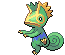
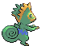

# #352 Kecleon (Color Swap Pokémon)

| Official Artwork | Shiny Artwork |
|------------------|---------------|
|  |  |

It can freely change its body’s color. The zigzag pattern on its belly doesn’t change, however.

---

## Media

### Default Sprites

| Front | Shiny | Back | Shiny |
|-------|-------|------|-------|
|  |  |  |  |

### Cries

Latest (Gen VI+):

<audio controls>
<source src='../../assets/cries/kecleon/latest.ogg' type='audio/ogg'>
  Your browser does not support the audio element.
</audio>

Legacy:

<audio controls>
<source src='../../assets/cries/kecleon/legacy.ogg' type='audio/ogg'>
  Your browser does not support the audio element.
</audio>

---

## Pokédex Data

| National № | Type(s) | Height | Weight | Abilities | Local № |
|------------|---------|--------|--------|-----------|---------|
| #352 | {: width="48"} | 1.0 m / 3.3 ft | 22.0 kg / 48.5 lbs | 1. Color Change | N/A |

---

## Base Stats
|   | HP | Attack | Defense | Sp. Atk | Sp. Def | Speed |
|---|----|--------|---------|---------|---------|-------|
| **Base** | 100 | 90 | 70 | 60 | 120 | 40 |
| **Min** | 310 | 166 | 130 | 112 | 220 | 76 |
| **Max** | 404 | 306 | 262 | 240 | 372 | 196 |

The ranges shown above are for a level 100 Pokémon. Maximum values are based on a beneficial nature, 252 EVs, 31 IVs; minimum values are based on a hindering nature, 0 EVs, 0 IVs.

---

## Forms & Evolutions

!!! warning "WARNING"

    Information on evolutions may not be 100% accurate; differences between evolution methods across generations are not accounted for.

### Forms

Kecleon has no alternate forms.

### Evolution Line

1. [Kecleon](kecleon.md/)

---

## Training

| EV Yield | Catch Rate | Base Friendship | Base Exp. | Growth Rate | Held Items |
|----------|------------|-----------------|-----------|-------------|------------|
| 1 Sp. Def | 200 | 70 | 154 | Medium Slow | Persim Berry (5%) |

---

## Breeding

| Egg Groups | Egg Cycles | Gender | Dimorphic | Color | Shape |
|------------|------------|--------|-----------|-------|-------|
| 1. Ground | 20 | 50.0% Male 50.0% Female | False | Green | Upright |

---

## Moves

!!! warning "WARNING"

    Specific move information may be incorrect. However, the general movepool should be accurate; this includes changes made in Blaze Black and Volt White.

### Level Up Moves

| Lv. | Move | Type | Cat. | Power | Acc. | PP |
| --- | --- | --- | --- | --- | --- | --- |
| 1 | Astonish | {: width="48"} | {: width="36"} | 30 | 100 | 15 |
| 1 | Fake Out | {: width="48"} | {: width="36"} | 40 | 100 | 10 |
| 1 | Lick | {: width="48"} | {: width="36"} | 30 | 100 | 30 |
| 1 | Scratch | {: width="48"} | {: width="36"} | 40 | 100 | 35 |
| 1 | Tail Whip | {: width="48"} | {: width="36"} | — | 100 | 30 |
| 1 | Thief | {: width="48"} | {: width="36"} | 60 | 100 | 25 |
| 4 | Bind | {: width="48"} | {: width="36"} | 15 | 85 | 20 |
| 7 | Feint Attack | {: width="48"} | {: width="36"} | 60 | — | 20 |
| 10 | Fury Swipes | {: width="48"} | {: width="36"} | 18 | 80 | 15 |
| 14 | Feint | {: width="48"} | {: width="36"} | 30 | 100 | 10 |
| 18 | Psybeam | {: width="48"} | {: width="36"} | 65 | 100 | 20 |
| 22 | Shadow Sneak | {: width="48"} | {: width="36"} | 40 | 100 | 30 |
| 27 | Slash | {: width="48"} | {: width="36"} | 70 | 100 | 20 |
| 32 | Screech | {: width="48"} | {: width="36"} | — | 85 | 40 |
| 37 | Substitute | {: width="48"} | {: width="36"} | — | — | 10 |
| 43 | Sucker Punch | {: width="48"} | {: width="36"} | 70 | 100 | 5 |
| 49 | Shadow Claw | {: width="48"} | {: width="36"} | 80 | 100 | 15 |
| 55 | Ancient Power | {: width="48"} | {: width="36"} | 60 | 100 | 5 |
| 58 | Synchronoise | {: width="48"} | {: width="36"} | 120 | 100 | 10 |
| 61 | Recover | {: width="48"} | {: width="36"} | — | — | 5 |

### TM Moves

| TM | Move | Type | Cat. | Power | Acc. | PP |
| --- | --- | --- | --- | --- | --- | --- |
| HM01 | Cut | {: width="48"} | {: width="36"} | 60 | 100% | 25 |
| HM04 | Strength | {: width="48"} | {: width="36"} | 100 | 100 | 15 |
| TM01 | Hone Claws | {: width="48"} | {: width="36"} | — | — | 15 |
| TM06 | Toxic | {: width="48"} | {: width="36"} | — | 90 | 10 |
| TM10 | Hidden Power | {: width="48"} | {: width="36"} | 60 | 100 | 15 |
| TM11 | Sunny Day | {: width="48"} | {: width="36"} | — | — | 5 |
| TM13 | Ice Beam | {: width="48"} | {: width="36"} | 90 | 100 | 10 |
| TM14 | Blizzard | {: width="48"} | {: width="36"} | 110 | 70 | 5 |
| TM17 | Protect | {: width="48"} | {: width="36"} | — | — | 10 |
| TM18 | Rain Dance | {: width="48"} | {: width="36"} | — | — | 5 |
| TM21 | Frustration | {: width="48"} | {: width="36"} | — | 100 | 20 |
| TM22 | Solar Beam | {: width="48"} | {: width="36"} | 120 | 100 | 10 |
| TM24 | Thunderbolt | {: width="48"} | {: width="36"} | 90 | 100 | 15 |
| TM25 | Thunder | {: width="48"} | {: width="36"} | 110 | 70 | 10 |
| TM27 | Return | {: width="48"} | {: width="36"} | — | 100 | 20 |
| TM28 | Dig | {: width="48"} | {: width="36"} | 100 | 100 | 10 |
| TM30 | Shadow Ball | {: width="48"} | {: width="36"} | 90 | 100 | 15 |
| TM31 | Brick Break | {: width="48"} | {: width="36"} | 75 | 100 | 15 |
| TM32 | Double Team | {: width="48"} | {: width="36"} | — | — | 15 |
| TM35 | Flamethrower | {: width="48"} | {: width="36"} | 90 | 100 | 15 |
| TM38 | Fire Blast | {: width="48"} | {: width="36"} | 110 | 85 | 5 |
| TM39 | Rock Tomb | {: width="48"} | {: width="36"} | 60 | 95 | 15 |
| TM40 | Aerial Ace | {: width="48"} | {: width="36"} | 60 | — | 20 |
| TM42 | Facade | {: width="48"} | {: width="36"} | 70 | 100 | 20 |
| TM44 | Rest | {: width="48"} | {: width="36"} | — | — | 5 |
| TM45 | Attract | {: width="48"} | {: width="36"} | — | 100 | 15 |
| TM46 | Thief | {: width="48"} | {: width="36"} | 60 | 100 | 25 |
| TM48 | Round | {: width="48"} | {: width="36"} | 60 | 100 | 15 |
| TM56 | Fling | {: width="48"} | {: width="36"} | — | 100 | 10 |
| TM57 | Charge Beam | {: width="48"} | {: width="36"} | 50 | 90 | 10 |
| TM59 | Incinerate | {: width="48"} | {: width="36"} | 50 | 100 | 15 |
| TM65 | Shadow Claw | {: width="48"} | {: width="36"} | 80 | 100 | 15 |
| TM67 | Retaliate | {: width="48"} | {: width="36"} | 70 | 100 | 5 |
| TM70 | Flash | {: width="48"} | {: width="36"} | — | 100 | 20 |
| TM73 | Thunder Wave | {: width="48"} | {: width="36"} | — | 90 | 20 |
| TM77 | Psych Up | {: width="48"} | {: width="36"} | — | — | 10 |
| TM80 | Rock Slide | {: width="48"} | {: width="36"} | 75 | 90 | 10 |
| TM83 | Work Up | {: width="48"} | {: width="36"} | — | — | 30 |
| TM86 | Grass Knot | {: width="48"} | {: width="36"} | — | 100 | 20 |
| TM87 | Swagger | {: width="48"} | {: width="36"} | — | 85 | 15 |
| TM90 | Substitute | {: width="48"} | {: width="36"} | — | — | 10 |
| TM92 | Trick Room | {: width="48"} | {: width="36"} | — | — | 5 |
| TM94 | Rock Smash | {: width="48"} | {: width="36"} | 60 | 100 | 15 |

### Egg Moves

| Move | Type | Cat. | Power | Acc. | PP |
| --- | --- | --- | --- | --- | --- |
| Disable | {: width="48"} | {: width="36"} | — | 100 | 20 |
| Recover | {: width="48"} | {: width="36"} | — | — | 5 |
| Dizzy Punch | {: width="48"} | {: width="36"} | 70 | 100 | 10 |
| Fake Out | {: width="48"} | {: width="36"} | 40 | 100 | 10 |
| Trick | {: width="48"} | {: width="36"} | — | 100 | 10 |
| Magic Coat | {: width="48"} | {: width="36"} | — | — | 15 |
| Skill Swap | {: width="48"} | {: width="36"} | — | — | 10 |
| Snatch | {: width="48"} | {: width="36"} | — | — | 10 |
| Nasty Plot | {: width="48"} | {: width="36"} | — | — | 20 |
| Foul Play | {: width="48"} | {: width="36"} | 95 | 100 | 15 |

### Tutor Moves

Kecleon cannot learn any moves from tutors.
