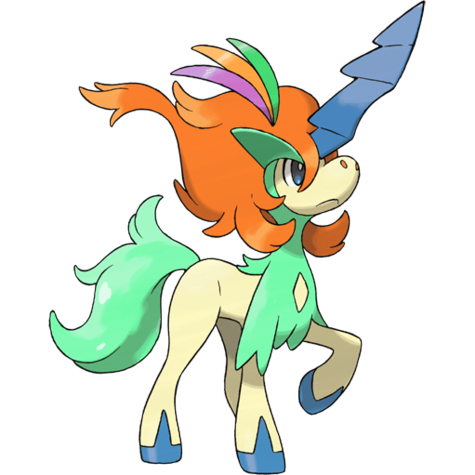
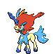
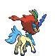
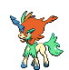
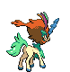

# Keldeo Resolute (Colt Pokémon)

| Official Artwork | Shiny Artwork |
| --- | --- |
|  |  |

**Blaze Black:** By blasting water from its hooves, it can glide across water. It excels at using leg moves while battling.

**Volt White:** It crosses the world, running over the surfaces of oceans and rivers. It appears at scenic waterfronts.

---

## Media

### Default Sprites

| Front | Back | Front Shiny | Back Shiny |
| --- | --- | --- | --- |
|  |  |  |  |

### Cries

Latest (Gen VI+):

<audio controls>
<source src='../../assets/cries/keldeo-resolute/latest.ogg' type='audio/ogg'>
  Your browser does not support the audio element.
</audio>

---

## Pokédex Data

| National № | Type(s) | Height | Weight | Abilities | Local № |
|------------|---------|--------|--------|-----------|---------|
| #10024 | {: width="48"} {: width="48"} | 1.4 m / 4.6 ft | 48.5 kg / 106.9 lbs | Justified | #153 |

---

## Base Stats
|   | HP | Attack | Defense | Sp. Atk | Sp. Def | Speed |
|---|----|--------|---------|---------|---------|-------|
| **Base** | 91 | 72 | 90 | 129 | 90 | 108 |
| **Min** | 292 | 134 | 166 | 236 | 166 | 198 |
| **Max** | 386 | 267 | 306 | 392 | 306 | 346 |

The ranges shown above are for a level 100 Pokémon. Maximum values are based on a beneficial nature, 252 EVs, 31 IVs; minimum values are based on a hindering nature, 0 EVs, 0 IVs.

---

## Forms & Evolutions

!!! warning "WARNING"

    Information on evolutions may not be 100% accurate; differences between evolution methods across generations are not accounted for.

### Forms

1. [Keldeo Ordinary](keldeo-ordinary.md/)

2. [Keldeo Resolute](keldeo-resolute.md/)

### Evolution Line

1. [Keldeo Ordinary](keldeo-ordinary.md/)

1. [Keldeo Resolute](keldeo-resolute.md/)

---

## Training

| EV Yield | Catch Rate | Base Friendship | Base Exp. | Growth Rate | Held Items |
|----------|------------|-----------------|-----------|-------------|------------|
| 3 Special Attack | 3 | 35 | 290 | Slow | N/A |

---

## Breeding

| Egg Groups | Egg Cycles | Gender | Dimorphic | Color | Shape |
|------------|------------|--------|-----------|-------|-------|
| 1. No-Eggs | 80 | Genderless | False | Yellow | Quadruped |

---

## Moves

!!! warning "WARNING"

    Specific move information may be incorrect. However, the general movepool should be accurate; this includes changes made in Blaze Black and Volt White.

### Level Up Moves

| Lv. | Move | Type | Cat. | Power | Acc. | PP |
| --- | --- | --- | --- | --- | --- | --- |
| 1 | Aqua Jet | {: width="48"} | {: width="36"} | 40 | 100 | 20 |
| 1 | Leer | {: width="48"} | {: width="36"} | — | 100 | 30 |
| 7 | Double Kick | {: width="48"} | {: width="36"} | 30 | 100 | 30 |
| 13 | Bubble Beam | {: width="48"} | {: width="36"} | 75 | 100 | 15 |
| 19 | Take Down | {: width="48"} | {: width="36"} | 90 | 85 | 20 |
| 25 | Helping Hand | {: width="48"} | {: width="36"} | — | — | 20 |
| 31 | Retaliate | {: width="48"} | {: width="36"} | 70 | 100 | 5 |
| 37 | Aqua Tail | {: width="48"} | {: width="36"} | 90 | 90 | 10 |
| 43 | Sacred Sword | {: width="48"} | {: width="36"} | 90 | 100 | 15 |
| 49 | Swords Dance | {: width="48"} | {: width="36"} | — | — | 20 |
| 55 | Quick Guard | {: width="48"} | {: width="36"} | — | — | 15 |
| 61 | Work Up | {: width="48"} | {: width="36"} | — | — | 30 |
| 67 | Hydro Pump | {: width="48"} | {: width="36"} | 110 | 80 | 5 |
| 73 | Close Combat | {: width="48"} | {: width="36"} | 120 | 100 | 5 |

### TM Moves

| TM | Move | Type | Cat. | Power | Acc. | PP |
| --- | --- | --- | --- | --- | --- | --- |
| HM01 | Cut | {: width="48"} | {: width="36"} | 60 | 100% | 25 |
| HM03 | Surf | {: width="48"} | {: width="36"} | 90 | 100 | 15 |
| HM04 | Strength | {: width="48"} | {: width="36"} | 100 | 100 | 15 |
| TM04 | Calm Mind | {: width="48"} | {: width="36"} | — | — | 20 |
| TM05 | Roar | {: width="48"} | {: width="36"} | — | — | 20 |
| TM06 | Toxic | {: width="48"} | {: width="36"} | — | 90 | 10 |
| TM07 | Hail | {: width="48"} | {: width="36"} | — | — | 10 |
| TM10 | Hidden Power | {: width="48"} | {: width="36"} | 60 | 100 | 15 |
| TM12 | Taunt | {: width="48"} | {: width="36"} | — | 100 | 20 |
| TM15 | Hyper Beam | {: width="48"} | {: width="36"} | 150 | 90 | 5 |
| TM17 | Protect | {: width="48"} | {: width="36"} | — | — | 10 |
| TM18 | Rain Dance | {: width="48"} | {: width="36"} | — | — | 5 |
| TM20 | Safeguard | {: width="48"} | {: width="36"} | — | — | 25 |
| TM21 | Frustration | {: width="48"} | {: width="36"} | — | 100 | 20 |
| TM27 | Return | {: width="48"} | {: width="36"} | — | 100 | 20 |
| TM32 | Double Team | {: width="48"} | {: width="36"} | — | — | 15 |
| TM33 | Reflect | {: width="48"} | {: width="36"} | — | — | 20 |
| TM40 | Aerial Ace | {: width="48"} | {: width="36"} | 60 | — | 20 |
| TM42 | Facade | {: width="48"} | {: width="36"} | 70 | 100 | 20 |
| TM44 | Rest | {: width="48"} | {: width="36"} | — | — | 5 |
| TM48 | Round | {: width="48"} | {: width="36"} | 60 | 100 | 15 |
| TM52 | Focus Blast | {: width="48"} | {: width="36"} | 120 | 70 | 5 |
| TM54 | False Swipe | {: width="48"} | {: width="36"} | 40 | 100 | 40 |
| TM55 | Scald | {: width="48"} | {: width="36"} | 80 | 100 | 15 |
| TM67 | Retaliate | {: width="48"} | {: width="36"} | 70 | 100 | 5 |
| TM68 | Giga Impact | {: width="48"} | {: width="36"} | 150 | 90 | 5 |
| TM71 | Stone Edge | {: width="48"} | {: width="36"} | 100 | 80 | 5 |
| TM75 | Swords Dance | {: width="48"} | {: width="36"} | — | — | 20 |
| TM77 | Psych Up | {: width="48"} | {: width="36"} | — | — | 10 |
| TM81 | X Scissor | {: width="48"} | {: width="36"} | 80 | 100 | 15 |
| TM83 | Work Up | {: width="48"} | {: width="36"} | — | — | 30 |
| TM84 | Poison Jab | {: width="48"} | {: width="36"} | 80 | 100 | 20 |
| TM87 | Swagger | {: width="48"} | {: width="36"} | — | 85 | 15 |
| TM90 | Substitute | {: width="48"} | {: width="36"} | — | — | 10 |
| TM94 | Rock Smash | {: width="48"} | {: width="36"} | 60 | 100 | 15 |

### Egg Moves

Keldeo Resolute cannot learn any moves by breeding.
### Tutor Moves

| Move | Type | Cat. | Power | Acc. | PP |
| --- | --- | --- | --- | --- | --- |
| Snore | {: width="48"} | {: width="36"} | 50 | 100 | 15 |
| Icy Wind | {: width="48"} | {: width="36"} | 55 | 95 | 15 |
| Sleep Talk | {: width="48"} | {: width="36"} | — | — | 10 |
| Helping Hand | {: width="48"} | {: width="36"} | — | — | 20 |
| Superpower | {: width="48"} | {: width="36"} | 120 | 100 | 5 |
| Endeavor | {: width="48"} | {: width="36"} | — | 100 | 5 |
| Bounce | {: width="48"} | {: width="36"} | 85 | 85 | 5 |
| Covet | {: width="48"} | {: width="36"} | 60 | 100 | 25 |
| Last Resort | {: width="48"} | {: width="36"} | 140 | 100 | 5 |
| Aqua Tail | {: width="48"} | {: width="36"} | 90 | 90 | 10 |
| Secret Sword | {: width="48"} | {: width="36"} | 85 | 100 | 10 |

