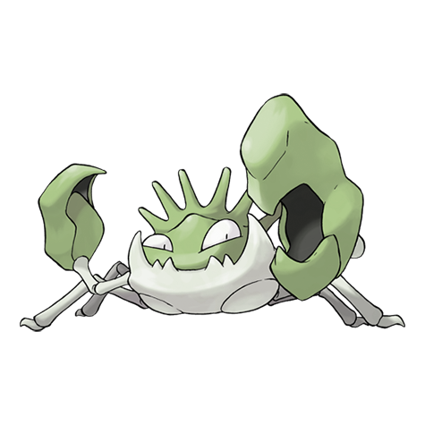
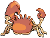

# Kingler (Pincer Pokémon)

| Official Artwork | Shiny Artwork |
| --- | --- |
|  |  |

The larger pincer has 10,000- horsepower strength. However, it is so heavy, it is difficult to aim.

---

## Media

### Default Sprites

| Front | Back | Front Shiny | Back Shiny |
| --- | --- | --- | --- |
|  |  |  |  |

### Cries

Latest (Gen VI+):

<audio controls>
<source src='../../assets/cries/kingler/latest.ogg' type='audio/ogg'>
  Your browser does not support the audio element.
</audio>

Legacy:

<audio controls>
<source src='../../assets/cries/kingler/legacy.ogg' type='audio/ogg'>
  Your browser does not support the audio element.
</audio>

---

## Pokédex Data

| National № | Type(s) | Height | Weight | Abilities | Local № |
|------------|---------|--------|--------|-----------|---------|
| #99 | {: width='48'} | 1.3 m | 60.0 kg | 1. Hyper-Cutter 2. Sheer-Force | N/A |

---

## Base Stats
|   | HP | Attack | Defense | Sp. Atk | Sp. Def | Speed |
|---|----|--------|---------|---------|---------|-------|
| **Base** | 55 | 130 | 115 | 50 | 50 | 75 |
| **Min** | 220 | 238 | 211 | 94 | 94 | 139 |
| **Max** | 314 | 394 | 361 | 218 | 218 | 273 |

The ranges shown above are for a level 100 Pokémon. Maximum values are based on a beneficial nature, 252 EVs, 31 IVs; minimum values are based on a hindering nature, 0 EVs, 0 IVs.

---

## Forms & Evolutions

!!! warning "WARNING"

    Information on evolutions may not be 100% accurate; differences between evolution methods across generations are not accounted for.

### Forms

Kingler has no alternate forms.

### Evolution Line

1. [Krabby](krabby.md/)
    1. Level Up: [Kingler](kingler.md/)

---

## Training

| EV Yield | Catch Rate | Base Friendship | Base Exp. | Growth Rate | Held Items |
|----------|------------|-----------------|-----------|-------------|------------|
| 2 Attack | 60 | 50 | 166 | Medium | N/A |

---

## Breeding

| Egg Groups | Egg Cycles | Gender | Dimorphic | Color | Shape |
|------------|------------|--------|-----------|-------|-------|
| 1. Water3 | 20 | 50.0% Male 50.0% Female | False | Red | Armor |

---

## Moves

!!! warning "WARNING"

    Specific move information may be incorrect. However, the general movepool should be accurate; this includes changes made in Blaze Black and Volt White.

### Level Up Moves

| Lv. | Move | Type | Cat. | Power | Acc. | PP |
| --- | --- | --- | --- | --- | --- | --- |
| 1 | Bubble | {: width='48'} | {: width='36'} | 40 | 100 | 30 |
| 1 | Leer | {: width='48'} | {: width='36'} | — | 100 | 30 |
| 1 | Mud Sport | {: width='48'} | {: width='36'} | — | — | 15 |
| 1 | Vice Grip | {: width='48'} | {: width='36'} | 55 | 100 | 30 |
| 1 | Wide Guard | {: width='48'} | {: width='36'} | — | — | 10 |
| 5 | Vice Grip | {: width='48'} | {: width='36'} | 55 | 100 | 30 |
| 9 | Leer | {: width='48'} | {: width='36'} | — | 100 | 30 |
| 11 | Harden | {: width='48'} | {: width='36'} | — | — | 30 |
| 15 | Bubble Beam | {: width='48'} | {: width='36'} | 75 | 100 | 15 |
| 19 | Mud Shot | {: width='48'} | {: width='36'} | 55 | 95 | 15 |
| 21 | Metal Claw | {: width='48'} | {: width='36'} | 50 | 95 | 35 |
| 25 | Stomp | {: width='48'} | {: width='36'} | 65 | 100 | 20 |
| 32 | Protect | {: width='48'} | {: width='36'} | — | — | 10 |
| 37 | Guillotine | {: width='48'} | {: width='36'} | — | 30 | 5 |
| 44 | Slam | {: width='48'} | {: width='36'} | 80 | 75 | 20 |
| 51 | Scald | {: width='48'} | {: width='36'} | 80 | 100 | 15 |
| 56 | Crabhammer | {: width='48'} | {: width='36'} | 100 | 90 | 10 |
| 63 | Flail | {: width='48'} | {: width='36'} | — | 100 | 15 |
| 70 | Superpower | {: width='48'} | {: width='36'} | 120 | 100 | 5 |

### TM Moves

| TM | Move | Type | Cat. | Power | Acc. | PP |
| --- | --- | --- | --- | --- | --- | --- |
| HM01 | Cut | {: width='48'} | {: width='36'} | 60 | 100% | 25 |
| HM03 | Surf | {: width='48'} | {: width='36'} | 90 | 100 | 15 |
| HM04 | Strength | {: width='48'} | {: width='36'} | 100 | 100 | 15 |
| HM05 | Waterfall | {: width='48'} | {: width='36'} | 85 | 100 | 15 |
| HM06 | Dive | {: width='48'} | {: width='36'} | 80 | 100 | 10 |
| TM01 | Hone Claws | {: width='48'} | {: width='36'} | — | — | 15 |
| TM06 | Toxic | {: width='48'} | {: width='36'} | — | 90 | 10 |
| TM07 | Hail | {: width='48'} | {: width='36'} | — | — | 10 |
| TM10 | Hidden Power | {: width='48'} | {: width='36'} | 60 | 100 | 15 |
| TM13 | Ice Beam | {: width='48'} | {: width='36'} | 90 | 100 | 10 |
| TM14 | Blizzard | {: width='48'} | {: width='36'} | 110 | 70 | 5 |
| TM15 | Hyper Beam | {: width='48'} | {: width='36'} | 150 | 90 | 5 |
| TM17 | Protect | {: width='48'} | {: width='36'} | — | — | 10 |
| TM18 | Rain Dance | {: width='48'} | {: width='36'} | — | — | 5 |
| TM21 | Frustration | {: width='48'} | {: width='36'} | — | 100 | 20 |
| TM27 | Return | {: width='48'} | {: width='36'} | — | 100 | 20 |
| TM28 | Dig | {: width='48'} | {: width='36'} | 100 | 100 | 10 |
| TM31 | Brick Break | {: width='48'} | {: width='36'} | 75 | 100 | 15 |
| TM32 | Double Team | {: width='48'} | {: width='36'} | — | — | 15 |
| TM39 | Rock Tomb | {: width='48'} | {: width='36'} | 60 | 95 | 15 |
| TM42 | Facade | {: width='48'} | {: width='36'} | 70 | 100 | 20 |
| TM44 | Rest | {: width='48'} | {: width='36'} | — | — | 5 |
| TM45 | Attract | {: width='48'} | {: width='36'} | — | 100 | 15 |
| TM46 | Thief | {: width='48'} | {: width='36'} | 60 | 100 | 25 |
| TM48 | Round | {: width='48'} | {: width='36'} | 60 | 100 | 15 |
| TM54 | False Swipe | {: width='48'} | {: width='36'} | 40 | 100 | 40 |
| TM55 | Scald | {: width='48'} | {: width='36'} | 80 | 100 | 15 |
| TM56 | Fling | {: width='48'} | {: width='36'} | — | 100 | 10 |
| TM60 | Quash | {: width='48'} | {: width='36'} | — | 100 | 15 |
| TM68 | Giga Impact | {: width='48'} | {: width='36'} | 150 | 90 | 5 |
| TM75 | Swords Dance | {: width='48'} | {: width='36'} | — | — | 20 |
| TM80 | Rock Slide | {: width='48'} | {: width='36'} | 75 | 90 | 10 |
| TM81 | X Scissor | {: width='48'} | {: width='36'} | 80 | 100 | 15 |
| TM87 | Swagger | {: width='48'} | {: width='36'} | — | 85 | 15 |
| TM90 | Substitute | {: width='48'} | {: width='36'} | — | — | 10 |
| TM94 | Rock Smash | {: width='48'} | {: width='36'} | 60 | 100 | 15 |

### Egg Moves

Kingler cannot learn any moves by breeding.
### Tutor Moves

Kingler cannot learn any moves from tutors.
