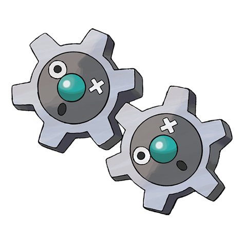
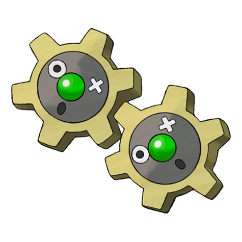
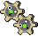
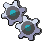
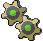

# #599 Klink (Gear Pokémon)

| Official Artwork | Shiny Artwork |
|------------------|---------------|
|  |  |

**Blaze Black:** The two minigears that mesh together are predetermined. Each will rebound from other minigears without meshing.

**Volt White:** Interlocking two bodies and spinning around generates the energy they need to live.

---

## Media

### Default Sprites

| Front | Shiny | Back | Shiny |
|-------|-------|------|-------|
|  |  |  |  |

### Cries

Latest (Gen VI+):

<audio controls>
<source src='../../assets/cries/klink/latest.ogg' type='audio/ogg'>
  Your browser does not support the audio element.
</audio>

Legacy:

<audio controls>
<source src='../../assets/cries/klink/legacy.ogg' type='audio/ogg'>
  Your browser does not support the audio element.
</audio>

---

## Pokédex Data

| National № | Type(s) | Height | Weight | Abilities | Local № |
|------------|---------|--------|--------|-----------|---------|
| #599 | {: width="48"} | 0.3 m / 1.0 ft | 21.0 kg / 46.3 lbs | 1. Motor Drive 2. Clear Body | N/A |

---

## Base Stats
|   | HP | Attack | Defense | Sp. Atk | Sp. Def | Speed |
|---|----|--------|---------|---------|---------|-------|
| **Base** | 40 | 55 | 70 | 45 | 60 | 30 |
| **Min** | 190 | 103 | 130 | 85 | 112 | 58 |
| **Max** | 284 | 229 | 262 | 207 | 240 | 174 |

The ranges shown above are for a level 100 Pokémon. Maximum values are based on a beneficial nature, 252 EVs, 31 IVs; minimum values are based on a hindering nature, 0 EVs, 0 IVs.

---

## Forms & Evolutions

!!! warning "WARNING"

    Information on evolutions may not be 100% accurate; differences between evolution methods across generations are not accounted for.

### Forms

Klink has no alternate forms.

### Evolution Line

1. [Klink](klink.md/)
    1. Level Up: [Klang](klang.md/)
        1. Level Up: [Klinklang](klinklang.md/)

---

## Training

| EV Yield | Catch Rate | Base Friendship | Base Exp. | Growth Rate | Held Items |
|----------|------------|-----------------|-----------|-------------|------------|
| 1 Def | 130 | 50 | 60 | Medium Slow | N/A |

---

## Breeding

| Egg Groups | Egg Cycles | Gender | Dimorphic | Color | Shape |
|------------|------------|--------|-----------|-------|-------|
| 1. Mineral | 20 | Genderless | False | Gray | Heads |

---

## Moves

!!! warning "WARNING"

    Specific move information may be incorrect. However, the general movepool should be accurate; this includes changes made in Blaze Black and Volt White.

### Level Up Moves

| Lv. | Move | Type | Cat. | Power | Acc. | PP |
| --- | --- | --- | --- | --- | --- | --- |
| 1 | Vice Grip | {: width="48"} | {: width="36"} | 55 | 100 | 30 |
| 6 | Charge | {: width="48"} | {: width="36"} | — | — | 20 |
| 11 | Thunder Shock | {: width="48"} | {: width="36"} | 40 | 100 | 30 |
| 16 | Gear Grind | {: width="48"} | {: width="36"} | 50 | 85 | 15 |
| 21 | Bind | {: width="48"} | {: width="36"} | 15 | 85 | 20 |
| 26 | Charge Beam | {: width="48"} | {: width="36"} | 50 | 90 | 10 |
| 31 | Autotomize | {: width="48"} | {: width="36"} | — | — | 15 |
| 33 | Spark | {: width="48"} | {: width="36"} | 65 | 100 | 20 |
| 36 | Mirror Shot | {: width="48"} | {: width="36"} | 65 | 85 | 10 |
| 39 | Screech | {: width="48"} | {: width="36"} | — | 85 | 40 |
| 42 | Discharge | {: width="48"} | {: width="36"} | 80 | 100 | 15 |
| 45 | Metal Sound | {: width="48"} | {: width="36"} | — | 85 | 40 |
| 48 | Shift Gear | {: width="48"} | {: width="36"} | — | — | 10 |
| 51 | Lock On | {: width="48"} | {: width="36"} | — | — | 5 |
| 54 | Zap Cannon | {: width="48"} | {: width="36"} | 120 | 50 | 5 |
| 57 | Hyper Beam | {: width="48"} | {: width="36"} | 150 | 90 | 5 |

### TM Moves

| TM | Move | Type | Cat. | Power | Acc. | PP |
| --- | --- | --- | --- | --- | --- | --- |
| TM06 | Toxic | {: width="48"} | {: width="36"} | — | 90 | 10 |
| TM10 | Hidden Power | {: width="48"} | {: width="36"} | 60 | 100 | 15 |
| TM15 | Hyper Beam | {: width="48"} | {: width="36"} | 150 | 90 | 5 |
| TM17 | Protect | {: width="48"} | {: width="36"} | — | — | 10 |
| TM21 | Frustration | {: width="48"} | {: width="36"} | — | 100 | 20 |
| TM24 | Thunderbolt | {: width="48"} | {: width="36"} | 90 | 100 | 15 |
| TM27 | Return | {: width="48"} | {: width="36"} | — | 100 | 20 |
| TM32 | Double Team | {: width="48"} | {: width="36"} | — | — | 15 |
| TM37 | Sandstorm | {: width="48"} | {: width="36"} | — | — | 10 |
| TM42 | Facade | {: width="48"} | {: width="36"} | 70 | 100 | 20 |
| TM44 | Rest | {: width="48"} | {: width="36"} | — | — | 5 |
| TM48 | Round | {: width="48"} | {: width="36"} | 60 | 100 | 15 |
| TM57 | Charge Beam | {: width="48"} | {: width="36"} | 50 | 90 | 10 |
| TM69 | Rock Polish | {: width="48"} | {: width="36"} | — | — | 20 |
| TM72 | Volt Switch | {: width="48"} | {: width="36"} | 70 | 100 | 20 |
| TM73 | Thunder Wave | {: width="48"} | {: width="36"} | — | 90 | 20 |
| TM80 | Rock Slide | {: width="48"} | {: width="36"} | 75 | 90 | 10 |
| TM87 | Swagger | {: width="48"} | {: width="36"} | — | 85 | 15 |
| TM90 | Substitute | {: width="48"} | {: width="36"} | — | — | 10 |
| TM91 | Flash Cannon | {: width="48"} | {: width="36"} | 80 | 100 | 10 |
| TM93 | Wild Charge | {: width="48"} | {: width="36"} | 90 | 100 | 15 |
| TM94 | Rock Smash | {: width="48"} | {: width="36"} | 60 | 100 | 15 |

### Egg Moves

Klink cannot learn any moves by breeding.
### Tutor Moves

Klink cannot learn any moves from tutors.
