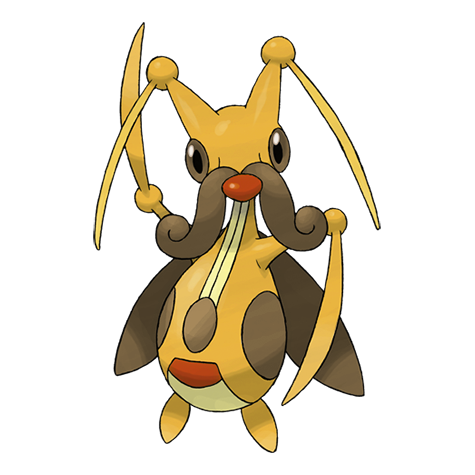
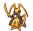
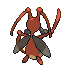
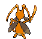
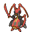
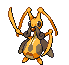

# #402 Kricketune (Cricket Pokémon)

| Official Artwork | Shiny Artwork |
|------------------|---------------|
|  |  |

There is a village that hosts a contest based on the amazingly variable cries of this Pokémon.

---

## Media

### Default Sprites

| Front | Shiny | Back | Shiny |
|-------|-------|------|-------|
|  |  |  |  |

### Female Sprites

| Front | Shiny | Back | Shiny |
|-------|-------|------|-------|
|  |  |  |  |

### Cries

Latest (Gen VI+):

<audio controls>
<source src='../../assets/cries/kricketune/latest.ogg' type='audio/ogg'>
  Your browser does not support the audio element.
</audio>

Legacy:

<audio controls>
<source src='../../assets/cries/kricketune/legacy.ogg' type='audio/ogg'>
  Your browser does not support the audio element.
</audio>

---

## Pokédex Data

| National № | Type(s) | Height | Weight | Abilities | Local № |
|------------|---------|--------|--------|-----------|---------|
| #402 | {: width="48"} | 1.0 m / 3.3 ft | 25.5 kg / 56.2 lbs | 1. Swarm 2. Technician | #16 |

---

## Base Stats
|   | HP | Attack | Defense | Sp. Atk | Sp. Def | Speed |
|---|----|--------|---------|---------|---------|-------|
| **Base** | 77 | 104 | 51 | 55 | 51 | 87 |
| **Min** | 264 | 191 | 96 | 103 | 96 | 161 |
| **Max** | 358 | 337 | 221 | 229 | 221 | 300 |

The ranges shown above are for a level 100 Pokémon. Maximum values are based on a beneficial nature, 252 EVs, 31 IVs; minimum values are based on a hindering nature, 0 EVs, 0 IVs.

---

## Forms & Evolutions

!!! warning "WARNING"

    Information on evolutions may not be 100% accurate; differences between evolution methods across generations are not accounted for.

### Forms

Kricketune has no alternate forms.

### Evolution Line

1. [Kricketot](kricketot.md/)
    1. Level Up: [Kricketune](kricketune.md/)

---

## Training

| EV Yield | Catch Rate | Base Friendship | Base Exp. | Growth Rate | Held Items |
|----------|------------|-----------------|-----------|-------------|------------|
| 2 Atk | 45 | 70 | 134 | Medium Slow | Metronome (5%) |

---

## Breeding

| Egg Groups | Egg Cycles | Gender | Dimorphic | Color | Shape |
|------------|------------|--------|-----------|-------|-------|
| 1. Bug | 15 | 50.0% Male 50.0% Female | True | Red | Bug-Wings |

---

## Moves

!!! warning "WARNING"

    Specific move information may be incorrect. However, the general movepool should be accurate; this includes changes made in Blaze Black and Volt White.

### Level Up Moves

| Lv. | Move | Type | Cat. | Power | Acc. | PP |
| --- | --- | --- | --- | --- | --- | --- |
| 1 | Bide | {: width="48"} | {: width="36"} | — | — | 10 |
| 1 | Growl | {: width="48"} | {: width="36"} | — | 100 | 40 |
| 10 | Fury Cutter | {: width="48"} | {: width="36"} | 40 | 95 | 20 |
| 14 | Leech Life | {: width="48"} | {: width="36"} | 80 | 100 | 10 |
| 18 | Sing | {: width="48"} | {: width="36"} | — | 55 | 15 |
| 22 | Focus Energy | {: width="48"} | {: width="36"} | — | — | 30 |
| 26 | Slash | {: width="48"} | {: width="36"} | 70 | 100 | 20 |
| 30 | X Scissor | {: width="48"} | {: width="36"} | 80 | 100 | 15 |
| 34 | Screech | {: width="48"} | {: width="36"} | — | 85 | 40 |
| 38 | Taunt | {: width="48"} | {: width="36"} | — | 100 | 20 |
| 42 | Night Slash | {: width="48"} | {: width="36"} | 70 | 100 | 15 |
| 46 | Bug Buzz | {: width="48"} | {: width="36"} | 90 | 100 | 10 |
| 50 | Perish Song | {: width="48"} | {: width="36"} | — | — | 5 |

### TM Moves

| TM | Move | Type | Cat. | Power | Acc. | PP |
| --- | --- | --- | --- | --- | --- | --- |
| HM01 | Cut | {: width="48"} | {: width="36"} | 60 | 100% | 25 |
| HM04 | Strength | {: width="48"} | {: width="36"} | 100 | 100 | 15 |
| TM01 | Hone Claws | {: width="48"} | {: width="36"} | — | — | 15 |
| TM06 | Toxic | {: width="48"} | {: width="36"} | — | 90 | 10 |
| TM10 | Hidden Power | {: width="48"} | {: width="36"} | 60 | 100 | 15 |
| TM11 | Sunny Day | {: width="48"} | {: width="36"} | — | — | 5 |
| TM12 | Taunt | {: width="48"} | {: width="36"} | — | 100 | 20 |
| TM15 | Hyper Beam | {: width="48"} | {: width="36"} | 150 | 90 | 5 |
| TM17 | Protect | {: width="48"} | {: width="36"} | — | — | 10 |
| TM18 | Rain Dance | {: width="48"} | {: width="36"} | — | — | 5 |
| TM21 | Frustration | {: width="48"} | {: width="36"} | — | 100 | 20 |
| TM27 | Return | {: width="48"} | {: width="36"} | — | 100 | 20 |
| TM31 | Brick Break | {: width="48"} | {: width="36"} | 75 | 100 | 15 |
| TM32 | Double Team | {: width="48"} | {: width="36"} | — | — | 15 |
| TM40 | Aerial Ace | {: width="48"} | {: width="36"} | 60 | — | 20 |
| TM42 | Facade | {: width="48"} | {: width="36"} | 70 | 100 | 20 |
| TM44 | Rest | {: width="48"} | {: width="36"} | — | — | 5 |
| TM45 | Attract | {: width="48"} | {: width="36"} | — | 100 | 15 |
| TM48 | Round | {: width="48"} | {: width="36"} | 60 | 100 | 15 |
| TM49 | Echoed Voice | {: width="48"} | {: width="36"} | 40 | 100 | 15 |
| TM54 | False Swipe | {: width="48"} | {: width="36"} | 40 | 100 | 40 |
| TM68 | Giga Impact | {: width="48"} | {: width="36"} | 150 | 90 | 5 |
| TM70 | Flash | {: width="48"} | {: width="36"} | — | 100 | 20 |
| TM75 | Swords Dance | {: width="48"} | {: width="36"} | — | — | 20 |
| TM76 | Struggle Bug | {: width="48"} | {: width="36"} | 50 | 100 | 20 |
| TM81 | X Scissor | {: width="48"} | {: width="36"} | 80 | 100 | 15 |
| TM87 | Swagger | {: width="48"} | {: width="36"} | — | 85 | 15 |
| TM90 | Substitute | {: width="48"} | {: width="36"} | — | — | 10 |
| TM94 | Rock Smash | {: width="48"} | {: width="36"} | 60 | 100 | 15 |

### Egg Moves

Kricketune cannot learn any moves by breeding.
### Tutor Moves

Kricketune cannot learn any moves from tutors.
