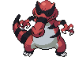

# #553 Krookodile (Intimidation Pokémon)

| Official Artwork | Shiny Artwork |
|------------------|---------------|
|  |  |

**Blaze Black:** They never allow prey to escape. Their jaws are so powerful, they can crush the body of an automobile.

**Volt White:** It can expand the focus of its eyes, enabling it to see objects in the far distance as if it were using binoculars.

---

## Media

### Default Sprites

| Front | Shiny | Back | Shiny |
|-------|-------|------|-------|
|  |  |  |  |

### Cries

Latest (Gen VI+):

<audio controls>
<source src='../../assets/cries/krookodile/latest.ogg' type='audio/ogg'>
  Your browser does not support the audio element.
</audio>

Legacy:

<audio controls>
<source src='../../assets/cries/krookodile/legacy.ogg' type='audio/ogg'>
  Your browser does not support the audio element.
</audio>

---

## Pokédex Data

| National № | Type(s) | Height | Weight | Abilities | Local № |
|------------|---------|--------|--------|-----------|---------|
| #553 | {: width="48"} {: width="48"} | 1.5 m / 4.9 ft | 96.3 kg / 212.3 lbs | 1. Intimidate 2. Moxie | N/A |

---

## Base Stats
|   | HP | Attack | Defense | Sp. Atk | Sp. Def | Speed |
|---|----|--------|---------|---------|---------|-------|
| **Base** | 95 | 117 | 80 | 65 | 70 | 92 |
| **Min** | 300 | 215 | 148 | 121 | 130 | 170 |
| **Max** | 394 | 366 | 284 | 251 | 262 | 311 |

The ranges shown above are for a level 100 Pokémon. Maximum values are based on a beneficial nature, 252 EVs, 31 IVs; minimum values are based on a hindering nature, 0 EVs, 0 IVs.

---

## Forms & Evolutions

!!! warning "WARNING"

    Information on evolutions may not be 100% accurate; differences between evolution methods across generations are not accounted for.

### Forms

Krookodile has no alternate forms.

### Evolution Line

1. [Sandile](sandile.md/)
    1. Level Up: [Krokorok](krokorok.md/)
        1. Level Up: [Krookodile](krookodile.md/)

---

## Training

| EV Yield | Catch Rate | Base Friendship | Base Exp. | Growth Rate | Held Items |
|----------|------------|-----------------|-----------|-------------|------------|
| 3 Atk | 45 | 50 | 260 | Medium Slo |

---

## Breeding

| Egg Groups | Egg Cycles | Gender | Dimorphic | Color | Shape |
|------------|------------|--------|-----------|-------|-------|
| 1. Ground | 20 | 50.0% Male 50.0% Female | False | Red | Upright |

---

## Moves

!!! warning "WARNING"

    Specific move information may be incorrect. However, the general movepool should be accurate; this includes changes made in Blaze Black and Volt White.

### Level Up Moves

| Lv. | Move | Type | Cat. | Power | Acc. | PP |
| --- | --- | --- | --- | --- | --- | --- |
| 1 | Bite | {: width="48"} | {: width="36"} | 60 | 100 | 25 |
| 1 | Fire Fang | {: width="48"} | {: width="36"} | 75 | 95 | 15 |
| 1 | Leer | {: width="48"} | {: width="36"} | — | 100 | 30 |
| 1 | Rage | {: width="48"} | {: width="36"} | 20 | 100 | 20 |
| 1 | Sand Attack | {: width="48"} | {: width="36"} | — | 100 | 15 |
| 1 | Thunder Fang | {: width="48"} | {: width="36"} | 75 | 95 | 15 |
| 4 | Bite | {: width="48"} | {: width="36"} | 60 | 100 | 25 |
| 7 | Sand Attack | {: width="48"} | {: width="36"} | — | 100 | 15 |
| 10 | Torment | {: width="48"} | {: width="36"} | — | 100 | 15 |
| 13 | Bulldoze | {: width="48"} | {: width="36"} | 80 | 100 | 20 |
| 16 | Assurance | {: width="48"} | {: width="36"} | 60 | 100 | 10 |
| 19 | Mud Slap | {: width="48"} | {: width="36"} | 20 | 100 | 10 |
| 22 | Embargo | {: width="48"} | {: width="36"} | — | 100 | 15 |
| 25 | Swagger | {: width="48"} | {: width="36"} | — | 85 | 15 |
| 28 | Crunch | {: width="48"} | {: width="36"} | 80 | 100 | 15 |
| 32 | Dig | {: width="48"} | {: width="36"} | 100 | 100 | 10 |
| 36 | Scary Face | {: width="48"} | {: width="36"} | — | 100 | 10 |
| 42 | Foul Play | {: width="48"} | {: width="36"} | 95 | 100 | 15 |
| 48 | Sandstorm | {: width="48"} | {: width="36"} | — | — | 10 |
| 54 | Earthquake | {: width="48"} | {: width="36"} | 100 | 100 | 10 |
| 60 | Outrage | {: width="48"} | {: width="36"} | 120 | 100 | 10 |
| 66 | Sucker Punch | {: width="48"} | {: width="36"} | 70 | 100 | 5 |

### TM Moves

| TM | Move | Type | Cat. | Power | Acc. | PP |
| --- | --- | --- | --- | --- | --- | --- |
| HM01 | Cut | {: width="48"} | {: width="36"} | 60 | 100% | 25 |
| HM04 | Strength | {: width="48"} | {: width="36"} | 100 | 100 | 15 |
| TM01 | Hone Claws | {: width="48"} | {: width="36"} | — | — | 15 |
| TM02 | Dragon Claw | {: width="48"} | {: width="36"} | 80 | 100 | 15 |
| TM05 | Roar | {: width="48"} | {: width="36"} | — | — | 20 |
| TM06 | Toxic | {: width="48"} | {: width="36"} | — | 90 | 10 |
| TM08 | Bulk Up | {: width="48"} | {: width="36"} | — | — | 20 |
| TM10 | Hidden Power | {: width="48"} | {: width="36"} | 60 | 100 | 15 |
| TM12 | Taunt | {: width="48"} | {: width="36"} | — | 100 | 20 |
| TM15 | Hyper Beam | {: width="48"} | {: width="36"} | 150 | 90 | 5 |
| TM17 | Protect | {: width="48"} | {: width="36"} | — | — | 10 |
| TM21 | Frustration | {: width="48"} | {: width="36"} | — | 100 | 20 |
| TM23 | Smack Down | {: width="48"} | {: width="36"} | 50 | 100 | 15 |
| TM26 | Earthquake | {: width="48"} | {: width="36"} | 100 | 100 | 10 |
| TM27 | Return | {: width="48"} | {: width="36"} | — | 100 | 20 |
| TM28 | Dig | {: width="48"} | {: width="36"} | 100 | 100 | 10 |
| TM31 | Brick Break | {: width="48"} | {: width="36"} | 75 | 100 | 15 |
| TM32 | Double Team | {: width="48"} | {: width="36"} | — | — | 15 |
| TM36 | Sludge Bomb | {: width="48"} | {: width="36"} | 90 | 100 | 10 |
| TM37 | Sandstorm | {: width="48"} | {: width="36"} | — | — | 10 |
| TM39 | Rock Tomb | {: width="48"} | {: width="36"} | 60 | 95 | 15 |
| TM40 | Aerial Ace | {: width="48"} | {: width="36"} | 60 | — | 20 |
| TM41 | Torment | {: width="48"} | {: width="36"} | — | 100 | 15 |
| TM42 | Facade | {: width="48"} | {: width="36"} | 70 | 100 | 20 |
| TM44 | Rest | {: width="48"} | {: width="36"} | — | — | 5 |
| TM45 | Attract | {: width="48"} | {: width="36"} | — | 100 | 15 |
| TM46 | Thief | {: width="48"} | {: width="36"} | 60 | 100 | 25 |
| TM47 | Low Sweep | {: width="48"} | {: width="36"} | 65 | 100 | 20 |
| TM48 | Round | {: width="48"} | {: width="36"} | 60 | 100 | 15 |
| TM52 | Focus Blast | {: width="48"} | {: width="36"} | 120 | 70 | 5 |
| TM56 | Fling | {: width="48"} | {: width="36"} | — | 100 | 10 |
| TM59 | Incinerate | {: width="48"} | {: width="36"} | 50 | 100 | 15 |
| TM63 | Embargo | {: width="48"} | {: width="36"} | — | 100 | 15 |
| TM65 | Shadow Claw | {: width="48"} | {: width="36"} | 80 | 100 | 15 |
| TM66 | Payback | {: width="48"} | {: width="36"} | 50 | 100 | 10 |
| TM67 | Retaliate | {: width="48"} | {: width="36"} | 70 | 100 | 5 |
| TM68 | Giga Impact | {: width="48"} | {: width="36"} | 150 | 90 | 5 |
| TM71 | Stone Edge | {: width="48"} | {: width="36"} | 100 | 80 | 5 |
| TM78 | Bulldoze | {: width="48"} | {: width="36"} | 80 | 100 | 20 |
| TM80 | Rock Slide | {: width="48"} | {: width="36"} | 75 | 90 | 10 |
| TM82 | Dragon Tail | {: width="48"} | {: width="36"} | 60 | 90 | 10 |
| TM86 | Grass Knot | {: width="48"} | {: width="36"} | — | 100 | 20 |
| TM87 | Swagger | {: width="48"} | {: width="36"} | — | 85 | 15 |
| TM90 | Substitute | {: width="48"} | {: width="36"} | — | — | 10 |
| TM94 | Rock Smash | {: width="48"} | {: width="36"} | 60 | 100 | 15 |
| TM95 | Snarl | {: width="48"} | {: width="36"} | 60 | 95 | 15 |

### Egg Moves

Krookodile cannot learn any moves by breeding.
### Tutor Moves

Krookodile cannot learn any moves from tutors.
