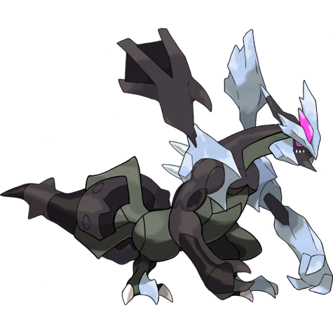
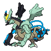
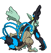
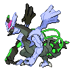
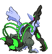

# #10022 Kyurem Black (Boundary Pokémon)

| Official Artwork | Shiny Artwork |
| --- | --- |
|  |  |

**Blaze Black:** It generates a powerful, freezing energy inside itself, but its body became frozen when the energy leaked out.

**Volt White:** It can produce ultracold air. Its body is frozen.

---

## Media

### Sprites

| Front | Back | Front Shiny | Back Shiny |
| --- | --- | --- | --- |
|  |  |  |  |

### Cries

Latest (Gen VI+):

<audio controls>
  <source src='../assets/cries/kyurem-black/latest.ogg' type='audio/ogg'>
  Your browser does not support the audio element.
</audio>

---

## Pokédex Data

| National № | Type(s) | Height | Weight | Abilities | Local № |
|------------|---------|--------|--------|-----------|---------|
| #10022 | {: width='48'} {: width='48'} | 3.3 m | 325.0 kg | 1. Teravolt | #152 |

---

## Base Stats
---

## Base Stats
|   | HP | Attack | Defense | Sp. Atk | Sp. Def | Speed |
|---|----|--------|---------|---------|---------|-------|
| **Base** | 125 | 170 | 100 | 120 | 90 | 95 |
| **Min** | 360 | 310 | 184 | 220 | 166 | 175 |
| **Max** | 454 | 482 | 328 | 372 | 306 | 317 |

The ranges shown above are for a level 100 Pokémon. Maximum values are based on a beneficial nature, 252 EVs, 31 IVs; minimum values are based on a hindering nature, 0 EVs, 0 IVs.

---

## Forms & Evolutions

!!! warning "WARNING"

    Some forms may not be available in Blaze Black/Volt White. Also information on evolutions may not be 100% accurate; it is currently quite complex to track generational evolution data.

### Forms

1. [Kyurem](kyurem.md/)
2. [Kyurem-Black](kyurem-black.md/)
3. [Kyurem-White](kyurem-white.md/)

### Evolution Line

1. [Kyurem](kyurem.md/)

---

## Training

| EV Yield | Catch Rate | Base Friendship | Base Exp. | Growth Rate | Held Items |
|----------|------------|-----------------|-----------|-------------|------------|
| 3 Attack | 3 | 0 | 350 | Slow | N/A |

---

## Breeding

| Egg Groups | Egg Cycles | Gender | Dimorphic | Color | Shape |
|------------|------------|--------|-----------|-------|-------|
| 1. No-Eggs | 120 | Genderless | False | Gray | Upright |

---

## Moves

!!! warning "WARNING"

    Specific move information may be incorrect. However, the general movepool should be accurate (including changes to learnset).

### Level Up Moves

Lv. | Move | Type | Cat. | Power | Acc. | PP
--- | --- | --- | --- | --- | --- | ---
| 1 | Dragon Rage | {: width='48'} | {: width='36'} | — | 100 | 10 |
| 1 | Icy Wind | {: width='48'} | {: width='36'} | 55 | 95 | 15 |
| 8 | Imprison | {: width='48'} | {: width='36'} | — | — | 10 |
| 15 | Ancient Power | {: width='48'} | {: width='36'} | 60 | 100 | 5 |
| 22 | Ice Beam | {: width='48'} | {: width='36'} | 90 | 100 | 10 |
| 29 | Dragon Breath | {: width='48'} | {: width='36'} | 60 | 100 | 20 |
| 36 | Slash | {: width='48'} | {: width='36'} | 70 | 100 | 20 |
| 43 | Fusion Bolt | {: width='48'} | {: width='36'} | 100 | 100 | 5 |
| 50 | Freeze Shock | {: width='48'} | {: width='36'} | 180 | 90 | 5 |
| 57 | Dragon Pulse | {: width='48'} | {: width='36'} | 85 | 100 | 10 |
| 64 | Noble Roar | {: width='48'} | {: width='36'} | — | 100 | 30 |
| 71 | Endeavor | {: width='48'} | {: width='36'} | — | 100 | 5 |
| 78 | Blizzard | {: width='48'} | {: width='36'} | 110 | 70 | 5 |
| 85 | Outrage | {: width='48'} | {: width='36'} | 120 | 100 | 10 |
| 92 | Hyper Voice | {: width='48'} | {: width='36'} | 90 | 100 | 10 |

### TM Moves

TM | Move | Type | Cat. | Power | Acc. | PP
--- | --- | --- | --- | --- | --- | ---
| TM02 | Dragon Claw | {: width='48'} | {: width='36'} | 80 | 100 | 15 |
| TM06 | Toxic | {: width='48'} | {: width='36'} | — | 90 | 10 |
| TM07 | Hail | {: width='48'} | {: width='36'} | — | — | 10 |
| TM10 | Hidden Power | {: width='48'} | {: width='36'} | 60 | 100 | 15 |
| TM100 | Confide | {: width='48'} | {: width='36'} | — | — | 20 |
| TM11 | Sunny Day | {: width='48'} | {: width='36'} | — | — | 5 |
| TM13 | Ice Beam | {: width='48'} | {: width='36'} | 90 | 100 | 10 |
| TM14 | Blizzard | {: width='48'} | {: width='36'} | 110 | 70 | 5 |
| TM15 | Hyper Beam | {: width='48'} | {: width='36'} | 150 | 90 | 5 |
| TM16 | Light Screen | {: width='48'} | {: width='36'} | — | — | 30 |
| TM17 | Protect | {: width='48'} | {: width='36'} | — | — | 10 |
| TM18 | Rain Dance | {: width='48'} | {: width='36'} | — | — | 5 |
| TM19 | Roost | {: width='48'} | {: width='36'} | — | — | 5 |
| TM20 | Safeguard | {: width='48'} | {: width='36'} | — | — | 25 |
| TM21 | Frustration | {: width='48'} | {: width='36'} | — | 100 | 20 |
| TM27 | Return | {: width='48'} | {: width='36'} | — | 100 | 20 |
| TM29 | Psychic | {: width='48'} | {: width='36'} | 90 | 100 | 10 |
| TM30 | Shadow Ball | {: width='48'} | {: width='36'} | 90 | 100 | 15 |
| TM32 | Double Team | {: width='48'} | {: width='36'} | — | — | 15 |
| TM33 | Reflect | {: width='48'} | {: width='36'} | — | — | 20 |
| TM39 | Rock Tomb | {: width='48'} | {: width='36'} | 60 | 95 | 15 |
| TM42 | Facade | {: width='48'} | {: width='36'} | 70 | 100 | 20 |
| TM44 | Rest | {: width='48'} | {: width='36'} | — | — | 5 |
| TM48 | Round | {: width='48'} | {: width='36'} | 60 | 100 | 15 |
| TM49 | Echoed Voice | {: width='48'} | {: width='36'} | 40 | 100 | 15 |
| TM51 | Steel Wing | {: width='48'} | {: width='36'} | 70 | 90 | 25 |
| TM52 | Focus Blast | {: width='48'} | {: width='36'} | 120 | 70 | 5 |
| TM56 | Fling | {: width='48'} | {: width='36'} | — | 100 | 10 |
| TM59 | Brutal Swing | {: width='48'} | {: width='36'} | 60 | 100 | 20 |
| TM65 | Shadow Claw | {: width='48'} | {: width='36'} | 80 | 100 | 15 |
| TM66 | Payback | {: width='48'} | {: width='36'} | 50 | 100 | 10 |
| TM68 | Giga Impact | {: width='48'} | {: width='36'} | 150 | 90 | 5 |
| TM71 | Stone Edge | {: width='48'} | {: width='36'} | 100 | 80 | 5 |
| TM76 | Fly | {: width='48'} | {: width='36'} | 100 | 100 | 15 |
| TM80 | Rock Slide | {: width='48'} | {: width='36'} | 80 | 95 | 10 |
| TM82 | Dragon Tail | {: width='48'} | {: width='36'} | 60 | 90 | 10 |
| TM87 | Swagger | {: width='48'} | {: width='36'} | — | 85 | 15 |
| TM88 | Sleep Talk | {: width='48'} | {: width='36'} | — | — | 10 |
| TM90 | Substitute | {: width='48'} | {: width='36'} | — | — | 10 |
| TM91 | Flash Cannon | {: width='48'} | {: width='36'} | 80 | 100 | 10 |

### Egg Moves

Kyurem Black cannot learn any moves by breeding.
### Tutor Moves

Move | Type | Cat. | Power | Acc. | PP
--- | --- | --- | --- | --- | ---
| Snore | {: width='48'} | {: width='36'} | 50 | 100 | 15 |
| Icy Wind | {: width='48'} | {: width='36'} | 55 | 95 | 15 |
| Outrage | {: width='48'} | {: width='36'} | 120 | 100 | 10 |
| Endeavor | {: width='48'} | {: width='36'} | — | 100 | 5 |
| Hyper Voice | {: width='48'} | {: width='36'} | 90 | 100 | 10 |
| Signal Beam | {: width='48'} | {: width='36'} | 75 | 100 | 15 |
| Dragon Pulse | {: width='48'} | {: width='36'} | 85 | 100 | 10 |
| Earth Power | {: width='48'} | {: width='36'} | 90 | 100 | 10 |
| Zen Headbutt | {: width='48'} | {: width='36'} | 80 | 90 | 15 |
| Draco Meteor | {: width='48'} | {: width='36'} | 130 | 90 | 5 |
| Iron Head | {: width='48'} | {: width='36'} | 80 | 100 | 15 |
| Laser Focus | {: width='48'} | {: width='36'} | — | — | 30 |

